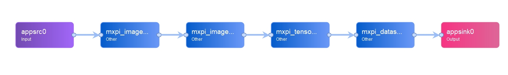

# ADNet图像去噪参考设计

## 1  介绍
   使用 ADNet 模型，在 MindX SDK 环境下实现图像去噪功能。
   由用户设置测试图片，传入到 pipeline 中先后实现前处理，模型推理，后处理等功能，最终输出结果图片实现可视化及模型精度计算。

```
ADNet 是一种包含注意力模块的卷积神经网络，主要包括用于图像去噪的稀疏块（SB）、特征增强块（FEB）、注意力块（AB）和重建块（RB）。

其中，SB 模块通过使用扩张卷积和公共卷积来去除噪声，在性能和效率之间进行权衡。

FEB 模块通过长路径整合全局和局部特征信息，以增强去噪模型的表达能力。 

AB 模块用于精细提取复杂背景中的噪声信息，对于复杂噪声图像，尤其是真实噪声图像非常有效。 

此外，FEB 模块与 AB 模块集成以提高效率并降低训练去噪模型的复杂度。

最后，RB 模块通过获得的噪声映射和给定的噪声图像来构造干净的图像。
```

### 1.1 支持的产品

本项目以昇腾 Atlas310 卡为主要的硬件平台

### 1.2 支持的版本

CANN：5.0.4

SDK：mxVision 2.0.4（可通过cat SDK目录下的 version.info 查看）

### 1.3 软件方案介绍

项目主要由主函数，pipeline 文件，模型及其配置文件，测试数据集组成。
主函数中构建业务流 stream 读取图片，通过 pipeline 在 SDK 环境下先后实现图像解码，图像缩放，模型推理的功能，
最后从流中取出相应的输出数据完成图像保存并测试精度。

表1.1 系统方案中各模块功能：

| 序号 | 模块          | 功能描述                                                     |
| ---- | ------------- | ------------------------------------------------------------ |
| 1    | appsrc        | 向stream中发送数据，appsrc将数据发给下游元件                 |
| 2    | imagedecoder  | 用于图像解码，当前只支持JPG/JPEG/BMP格式                     |
| 3    | imageresize   | 对解码后的YUV格式的图像进行指定宽高的缩放，暂时只支持YUV格式的图像 |
| 4    | tensorinfer   | 对输入的张量进行推理                                         |
| 5    | dataserialize | 将stream结果组装成json字符串输出                             |
| 6    | appsink       | 从stream中获取数据                                           |
| 7    | evaluate      | 模型精度计算，输出图像降噪效果评估值PSNR                        |
| 8    | transform     | 对测试图像进行格式转换,evaluate 运行前需要进行尺寸调整           |


### 1.4 代码目录结构与说明

本工程名称为ADNet，工程目录如下图所示：     

```
├── main.py  //运行工程项目的主函数
├── evaluate.py   //精度计算
├── transform.py   //图像转换
├── t.pipeline      //pipeline
├── model   //存放模型文件
|   ├──aipp_adnet.cfg     //预处理配置文件
├── result.jpg          //输出结果
├── 流程.png          //流程图
├── pipeline.png      //pipeline流程图
└──README.md          
```

### 1.5 技术实现流程图

ADNet图像去噪模型的后处理的输入是 pipeline 中 mxpi_tensorinfer0 推理结束后通过 appsink0 输出的 tensor 数据，尺寸为[1 * 1 * 321 * 481]，将张量数据通过 pred 取出推测的结果值，将像素点组成的图片保存成result.jpg，同时通过提供的 BSD68 数据集完成模型 PSNR 的精度计算。

实现流程图如下图所示：


pipeline流程如下图所示：




### 1.6 特性及适应场景
        
本案例中的 ADNet 模型适用于灰度图像的去噪，并可以返回测试图像的PSNR精度值。

## 2  环境依赖
推荐系统为ubuntu 18.04，环境依赖软件和版本如下表

| 软件名称 | 版本   |
| -------- | ------ |
| MindX SDK | 2.0.4 |
| Ascend-CANN-toolkit | 5.0.4 |
| ubuntu | 18.04.1 LTS |
| python   | 3.9.2  |
| cv2   | 4.5.5  |
| numpy   | 1.22.3 |
| scikit-image| 0.16.2 |


在编译运行项目前，需要设置环境变量
- 环境变量介绍

- MX_SDK_HOME 指向SDK安装包路径
- LD_LIBRARY_PATH  用于指定查找共享库（动态链接库）时除了默认路径之外的其他路径。
- PYTHONPATH   Python中一个重要的环境变量，用于在导入模块的时候搜索路径
- GST_PLUGIN_SCANNER   用于查找plugin相关的依赖和库
- GST_PLUGIN_PATH      用于查找plugin相关的依赖和库
  
具体执行命令

```
   . ${SDK-path}/set_env.sh
	
   . ${ascend-toolkit-path}/set_env.sh
```

## 3  模型转换

本项目使用的模型是ADNet模型。
    
      选用的模型为 pytorch 模型，可从 Ascend modelzoo 获取模型压缩包，在运行项目之前需要将 pytorch 模型转为 onnx 模型，再由 onnx 模型转为 om 模型。
pth 权重文件和 onnx 文件的下载链接
https://www.hiascend.com/zh/software/modelzoo/detail/1/d360c03430f04185a4fe1aa74250bfea
    
模型转换工具（ATC）相关介绍如下
https://support.huaweicloud.com/tg-cannApplicationDev330/atlasatc_16_0005.html
    
具体步骤如下

1. 下载上述模型压缩包，获取 ADNet_bs1.onnx 模型文件放置 ADNet/model 目录下。

2. 进入ADNet/model文件夹下执行命令

   ```
   atc --framework=5 --model=ADNet.onnx --insert_op_conf=./aipp_adnet.cfg --output=ADNet_bs1 --input_format=NCHW -input_shape="image:1,1,321,481" --log=debug --soc_version=Ascend310 --output_type=FP32

   ```

3. 执行该命令会在当前目录下生成项目需要的模型文件ADNet_bs1.om。执行后终端输出为

   ```
   ATC start working now, please wait for a moment.
   ATC run success, welcome to the next use.
   ```

   表示命令执行成功。

## 4  编译与运行

当已有模型的om文件，保存在ADNet/model/下

**步骤 1**  将任意一张jpg格式的图片存到当前目录下(./ADNet），命名为test.jpg。如果 pipeline 文件（或测试图片）不在当前目录下（./ADNet），需要修改 main.py 的pipeline（或测试图片）路径指向到所在目录。

**步骤 2**   按照模型转换获取om模型，放置在 ADNet/model 路径下。若未从 pytorch 模型自行转换模型，使用的是上述链接提供的 onnx 模型或者 om 模型，则无需修改相关文件，否则修改 main.py 中pipeline的相关配置，将 mxpi_tensorinfer0 插件 modelPath 属性值中的 om 模型名改成实际使用的 om 模型名；将 mxpi_imageresize0 插件中的 resizeWidth 和 resizeHeight 属性改成转换模型过程中设置的模型输入尺寸值。

**步骤 3**  在命令行输入 如下命令运行整个工程

```
python3 main.py
```

**步骤 4** 图片检测。运行结束输出result.jpg。


## 5  测试精度

**步骤 1** 安装数据集用以测试精度。数据集 BSD68 需要自行下载（下载链接：obs://mindx.sdk/mindxsdk-referenceapps /contrib/ADNet/）。

将下载的数据集BSD68上传至./ADNet目录下，我们运行 python transform.py 对数据集进行格式与尺寸转换得到 dataset 文件，得到ADNet文件夹的目录结构为如下。

```
├── main.py  //运行工程项目的主函数
├── evaluate.py   //精度计算
├── transform.py   //图像转换
├── t.pipeline      //pipeline
├── model   //存放模型文件
|   ├──aipp_adnet.cfg     //预处理配置文件
├── test.jpg          //测试图像
├── result.jpg          //输出结果
├── 流程.png          //流程图
├── pipeline.png          //pipeline流程图
├── BSD68          //原始数据集
├── dataset          //完成转换后的测试数据集
└──README.md           
```

**步骤 2** 修改 evaluate.py 中的 pipeline 路径与数据集路径与目录结构保持一致。修改完毕后运行如下命令完成精度测试，输出模型平均 PSNR 值。

```
python3 evaluate.py
```

模型在BSD68数据集上的精度达标，最终模型平均PSNR输出值为30.054，满足精度要求（PSNR ≥ 29.27）。


