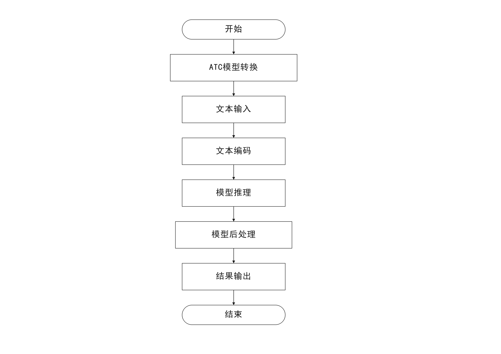

# 文本分类

## 1. 介绍

文本分类插件基于 MindXSDK 开发，在晟腾芯片上进行文本分类，将分类结果保存。输入一段新闻，可以判断该新闻属于哪个类别。
该模型支持5个新闻类别：体育、健康、军事、教育、汽车。

### 1.1 支持的产品

本项目以昇腾Atlas310卡为主要的硬件平台。

### 1.2 支持的版本

支持的SDK版本为2.0.2。
支持的CANN版本为3.3.0。

### 1.3 软件方案介绍

基于MindX SDK的文本分类业务流程为：待分类文本通过预处理，将文本根据字典vocab.txt进行编码，组成numpy形式的向量，将向量通过 appsrc 插件输入，然后由模型推理插件mxpi_tensorinfer得到每种类别的得分，再通过后处理插件mxpi_classpostprocessor将模型输出的结果处理，最后得到该文本的类别。本系统的各模块及功能描述如表1所示：


表1.1 系统方案各子系统功能描述：

| 序号 | 子系统 | 功能描述     |
| ---- | ------ | ------------ |
| 1    | 文本输入    | 读取输入文本 |
| 2    | 文本编码    | 根据字典对输入文本编码 |
| 3    | 模型推理    | 对文本编码后的张量进行推理 |
| 5    | 后处理      | 从模型推理结果中寻找对应的分类标签 |
| 7    | 保存结果    | 将分类结果保存文件|

### 1.4 代码目录结构与说明

本工程名称为文本分类，工程目录如下图所示：  

```
.
│  build.sh
│  README.md
│  tree.txt
│  
├─mxBase
│  │  build.sh
│  │  CMakeLists.txt
│  │  main.cpp
│  │  
│  ├─BertClassification
│  │      BertClassification.cpp
│  │      BertClassification.h
│  │      
│  ├─data
│  │      vocab.txt
│  │      
│  ├─model
│  │      bert_text_classification_labels.names
│  │      
│  ├─out
│  │      prediction_label.txt
│  │      
│  └─test
│          Test.cpp
│          Test.h
│          
└─sdk
    │  build.sh
    │  flowChart.png
    │  main.py
    │  run.sh
    │  tokenizer.py
    │  
    ├─config
    │      bert_text_classification_aipp_tf.cfg
    │      bert_text_classification_labels.names
    │      
    ├─data
    │      vocab.txt
    │      
    ├─model
    │      bert_text_classification_aipp_tf.cfg
    │      bert_text_classification_labels.names
    │      model_conversion.sh
    │      
    ├─out
    │      prediction_label.txt
    │      
    ├─pipeline
    │      BertTextClassification.pipeline
    │      
    └─test
            test.py
            test.sh
            test_input.py
```
### 1.5 技术实现流程图




## 2 环境依赖

推荐系统为ubantu 18.04，环境依赖软件和版本如下表：

| 软件名称 | 版本   |
| -------- | ------ |
| cmake    | 3.10.2   |
| mxVision | 2.0.2  |
| python   | 3.7.5  |

确保环境中正确安装mxVision SDK。

在编译运行项目前，需要设置环境变量：

```
export MX_SDK_HOME=${SDK安装路径}/mxVision
export LD_LIBRARY_PATH=${MX_SDK_HOME}/lib:${MX_SDK_HOME}/opensource/lib:${MX_SDK_HOME}/opensource/lib64:/usr/local/Ascend/ascend-toolkit/latest/acllib/lib64:/usr/local/Ascend/driver/lib64:${LD_LIBRARY_PATH}
export PYTHONPATH=${MX_SDK_HOME}/python:${PYTHONPATH}

export install_path=/usr/local/Ascend/ascend-toolkit/latest
export PATH=/usr/local/python3.7.5/bin:${install_path}/atc/ccec_compiler/bin:${install_path}/atc/bin:$PATH
export LD_LIBRARY_PATH=${install_path}/atc/lib64:$LD_LIBRARY_PATH
export ASCEND_OPP_PATH=${install_path}/opp
```

- 环境变量介绍

```
MX_SDK_HOME：MindX SDK mxVision的根安装路径，用于包含MindX SDK提供的所有库和头文件。
LD_LIBRARY_PATH：提供了MindX SDK已开发的插件和相关的库信息。
install_path：ascend-toolkit的安装路径。
PATH：添加python的执行路径和atc转换工具的执行路径。
LD_LIBRARY_PATH：添加ascend-toolkit和MindX SDK提供的库目录路径。
ASCEND_OPP_PATH：atc转换工具需要的目录。 
```

## 3 模型转换

**步骤1** 请参考https://mindx.sdk.obs.myhuaweicloud.com/mindxsdk-referenceapps%20/contrib/BertTextClassification/bert_text_classification.pb下载模型的pb文件，存放到开发环境普通用户下的任意目录，例如：$HOME/models/bert_text_classification。

**步骤2** 执行以下命令使用atc命令进行模型转换：

cd $HOME/models/bert_text_classification

atc --model=bert_text_classification.pb --framework=3 --input_format="ND" --output=bert_text_classification --input_shape="input_1:1,300;input_2:1,300" --out_nodes=dense_1/Softmax:0 --soc_version=Ascend310 --op_select_implmode="high_precision"

**步骤3** 执行以下命令将转换好的模型复制到项目中model文件夹中：

```
cp ./bert_text_classification.om $HOME/sdk/model/
cp ./bert_text_classification.om $HOME/mxBase/model/
```

**步骤4** 执行成功后终端输出为：

```
ATC start working now, please wait for a moment.
ATC run success, welcome to the next use.
```

## 4 编译与运行

**步骤1** 从https://mindx.sdk.obs.myhuaweicloud.com/mindxsdk-referenceapps%20/contrib/BertTextClassification/data.zip下载测试数据并解压，解压后的sample.txt和test.csv文件放在项目的mxBase/data和sdk/data目录下。

**步骤2** 按照第 2 小节 环境依赖 中的步骤设置环境变量。

**步骤3** 按照第 3 小节 模型转换 中的步骤获得 om 模型文件。

**步骤4** 将本项目代码的文件路径中出现的 ${SDK目录} 替换成自己SDK的存放目录，下面是需要替换的代码。

```
mxBase目录下的CMakeList.txt中的第13行代码：
set(MX_SDK_HOME ${SDK目录})

sdk/pipeline目录下BertTextClassification.pipeline文件中的第26行：
"postProcessLibPath": "${SDK目录}/lib/modelpostprocessors/libresnet50postprocess.so"
```

**步骤5** pipeline项目运行在sdk目录下执行命令：

```
python3.7 main.py
```

命令执行成功后在out目录下生成分类结果文件 prediction_label.txt，查看结果文件验证分类结果。

**步骤6** mxBase项目在mxBase目录中，执行以下代码进行编译。

```
mkdir build
cd build
cmake ..
make
```

编译完成后，将可执行文件 mxBase_text_classification 移动到mxBase目录下，执行下面代码运行

```
./mxBase_text_classification ./data/sample.txt
```

执行成功后在服务器的mxBase/out目录下生成分类结果文件 prediction_label.txt，查看结果文件验证分类结果。

## 5 精度测试

**步骤1** 按照第 4 小节 编译与运行 的步骤将样例运行成功。

**步骤2** 从网址https://mindx.sdk.obs.myhuaweicloud.com/mindxsdk-referenceapps%20/contrib/BertTextClassification/data.zip下载后解压，将解压后的test.csv文件分别放在sdk/data目录和mxBase/data目录。

**步骤3** pipeline项目中的精度测试文件为sdk/test目录下的test.py，将test.py移到sdk目录下，执行下面代码，得到pipeline的精度测试结果。

```
python3.7 test.py
```

**步骤4** mxBase项目中，将mxBase目录下main.cpp中main方法的代码注释，添加下面代码后执行，得到mxBase的精度测试结果。

```
Test::test_accuracy();
```

## 5 其他问题
1.本项目的设计为限制输入样例为txt文件，其他文件如图片、音频输入则会报错。