# 波比跳运动小程序

## 1 介绍

波比跳运动小程序基于 MindX SDK 开发，在 Ascend 310 芯片上进行目标检测，将检测结果保存成视频。项目主要流程：1)视频流程：通过 live555 服务器进行拉流输入视频，然后进行视频解码将 H.264 格式的视频解码为图片，图片缩放后经过模型推理进行波比跳检测，识别结果经过后处理后利用 cv 可视化识别框，以视频的形式输出，同时生成文本文件记录视频中完成的波比跳个数。2)小程序流程：通过微信小程序开发者将摄像头截取的图片数据上传至腾讯云桶中，然后后端将桶中数据下载至本地并将数据输入至流水线内，接着进行图片解码和缩放，最后经过模型推理进行波比跳检测，识别结果经过后处理后上传至腾讯云桶中，为前端小程序使用。

### 1.1 支持的产品

昇腾 310（推理）

### 1.2 支持的版本

本样例配套的 CANN 版本为 [5.0.4](https://gitee.com/link?target=https%3A%2F%2Fwww.hiascend.com%2Fsoftware%2Fcann%2Fcommercial)，MindX SDK 版本为 [2.0.4](https://www.hiascend.com/software/Mindx-sdk)。

MindX SDK 安装前准备可参考《用户指南》，[安装教程](https://gitee.com/ascend/mindxsdk-referenceapps/blob/master/docs/quickStart/1-1安装SDK开发套件.md)

### 1.3 软件方案介绍

基于 MindX SDK 的波比跳运动小程序业务流程为：通过微信小程序开发者将摄像头截取的图片数据上传至腾讯云桶中，然后后端将桶中数据下载至本地并经`mxpi_appsrc`拉流插件输入，然后使用图片解码插件`mxpi_imagedecoder`将图片解码，再通过图像缩放插件`mxpi_imageresize`将图像缩放至满足检测模型要求的输入图像大小要求，缩放后的图像输入模型推理插件`mxpi_modelinfer`得到检测结果，根据检测结果改变波比跳识别的状态机状态，并更新波比跳识别个数，最后上传记录波比跳识别个数的txt文件到腾讯云桶中，以供小程序使用。

### 1.4 代码目录结构与说明

本 Sample 工程名称为 **Burpee_Detection**，工程目录如下图所示：

```
├── envs
│   └── env.sh                   //基础环境变量与atc转换需要的环境变量
├── readme_img                   //ReadMe图片资源
│   ├── dataset.jpg   
│   ├── video.jpg   
│   ├── map.jpg                  
│   ├── fps.jpg  
│   ├── app_flow.jpg  
│   └── video_flow.jpg 
├── model
│   ├── atc.sh                   //atc运行脚本
├── pipeline
│   ├── burpee_detection_p.pipeline          //图片识别使用的pipeline文件
│   └── burpee_detection_v.pipeline          //视频流识别使用的pipeline文件
├── App_burpee_detection
│   ├── App_main.py              //识别，保存结果，并进行性能测试
|   └── run.sh                   //运行脚本
├── Pic_burpee_detection
│   ├── map_calculate.py         //mAP计算(精度计算)
│   ├── Pic_main.py              //识别，保存结果，并进行性能测试
|   └── run.sh                   //运行脚本
├── Video_burpee_detection
│   ├── Video_main.py            //识别，保存结果，并进行性能测试
|   └── run.sh                   //运行脚本
└── README.md
```

###  1.5 技术实现流程图
视频识别：

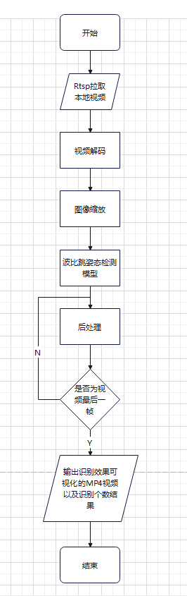

小程序应用后端流程：

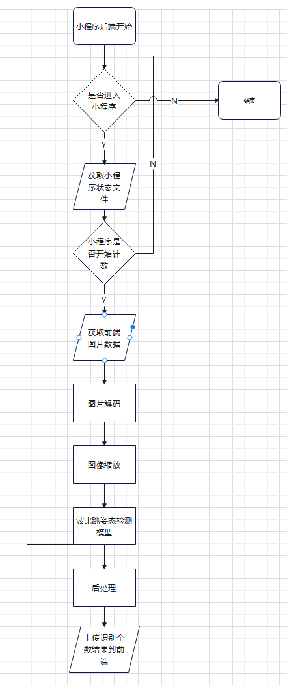

## 2 环境依赖

| 软件名称            | 版本        | 说明                          | 获取方式                                                     |
| ------------------- | ----------- | ----------------------------- | ------------------------------------------------------------ |
| MindX SDK           | 2.0.4       | mxVision软件包                | [链接](https://gitee.com/link?target=https%3A%2F%2Fwww.hiascend.com%2Fsoftware%2Fmindx-sdk%2Fmxvision) |
| ubuntu              | 18.04.1 LTS | 操作系统                      | Ubuntu官网获取                                               |
| Ascend-CANN-toolkit | 5.0.4       | Ascend-cann-toolkit开发套件包 | [链接](https://gitee.com/link?target=https%3A%2F%2Fwww.hiascend.com%2Fsoftware%2Fcann%2Fcommercial) |

在运行项目需要的环境变量如下，运行前不需要特别设置，环境依赖已经写入脚本中，脚本在`Burpee_Detection/envs`目录下：

```bash
export MX_SDK_path=""# mxVision 安装路径
export Ascend_toolkit_path=""#CANN 安装路径

# MindXSDK 环境变量：
./${MX_SDK_path}/set_env.sh

# CANN 环境变量：
./${Ascend_toolkit_path}/set_env.sh
```

注：其中`${MX_SDK_path}`替换为用户的SDK安装路径;`Ascend_toolkit_path`替换为ascend-toolkit开发套件包所在路径。

## 3 模型转换以及依赖安装

本项目使用的模型是波比跳识别的模型。模型文件可以直接下载。

### 3.1 模型转换

使用模型转换工具 ATC 将 onnx 模型转换为 om 模型，模型转换工具相关介绍参考链接：[CANN 社区版]([前言_昇腾CANN社区版(5.0.4.alpha002)(推理)_ATC模型转换_华为云 (huaweicloud.com)](https://support.huaweicloud.com/atctool-cann504alpha2infer/atlasatc_16_0001.html)) 。

步骤如下：

- **步骤1** 下载`onnx`模型，请移动至`Burpee_Detection/model`目录下；若下载`om`模型文件，请跳过模型转换步骤。

- **步骤2** 将`best.onnx`文件移动至`Burpee_Detection/model`目录下，然后运行model目录下的`atc.sh`

  ```bash
  bash /model/atc.sh
  ```

  执行该命令后会在当前文件夹下生成项目需要的模型文件

  ```
  ATC start working now, please wait for a moment.
  ATC run success, welcome to the next use.
  ```

  表示命令执行成功。

###  3.2 准备

按照第3小节**软件依赖**安装 live555 和 ffmpeg，按照 [Live555离线视频转RTSP说明文档](https://gitee.com/ascend/mindxsdk-referenceapps/blob/master/docs/参考资料/Live555离线视频转RTSP说明文档.md)将 mp4 视频转换为 H.264 格式。并将生成的 H.264 格式的视频上传到`live/mediaServer`目录下，然后修改`pipeline`目录下的`burpee_detection_v.pipeline`文件中`mxpi_rtspsrc0`的内容。

```json
"mxpi_rtspsrc0": {
	"props": {
		"rtspUrl":"rtsp://xxx.xxx.xxx.xxx:xxxx/xxx.264",  // 修改为自己所使用的的服务器和文件名
	},
    "factory": "mxpi_rtspsrc",
	"next": "mxpi_videodecoder0"
}
```

##  4 运行与测试

### 4.1 运行

#### 4.1.1 视频

- **步骤1** 按照第 2 小节 **环境依赖** 中的步骤设置环境变量。

- **步骤2** 按照第 3 小节 **模型转换** 中的步骤获得 `om` 模型文件，放置在 `Burpee_Detection/models` 目录下。

- **步骤3** 修改`burpee_detection_v.pipeline`中`mxpi_modelinfer0`中`postProcessLibPath`的值`${MX_SDK_path}`为 MindX SDK 的安装路径

- **步骤4** 按照 3 小节 **准备** 中的步骤创建rtsp流以实现本地视频的rtsp拉流操作。

- **步骤5** 运行。在 `Burpee_Detection/Video_burpee_detection` 目录下执行命令：

```bash
bash run.sh
```

运行可视化结果会以`video_result.mp4`视频形式保存在`Burpee_Detection/Video_burpee_detection`目录下
波比跳识别个数会以`result.txt`文件形式保存在`Burpee_Detection/Video_burpee_detection`目录下

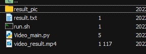

#### 4.1.2 小程序

- **步骤1** 按照第 4 小节 **视频** 中的**步骤1**到**步骤3**搭建小程序后端环境。

- **步骤2** 运行。进入 `Burpee_Detection/` 目录，在 `Burpee_Detection/App_burpee_detection` 目录下执行命令：

```bash
bash run.sh
```
- **步骤3** 下载`微信开发者工具`并登录，在微信公众平台注册小程序并获取AppID


- 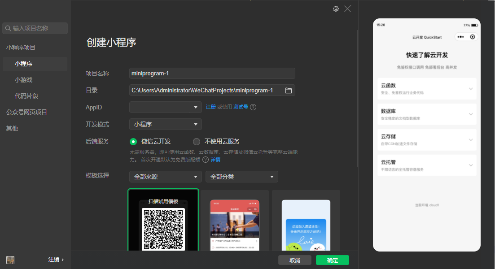


- **步骤4** 点击导入，选择小程序代码文件夹并打开（代码可下载），点击编译模式选中`pages`目录下的子目录`bind`并选择`bind`，点击`详情-本地设置`，选中不效验合法域名后（可在小程序公众平台开发管理-开发设置中，配置合法域名），点击`真机调试`，然后用手机扫描二维码


- 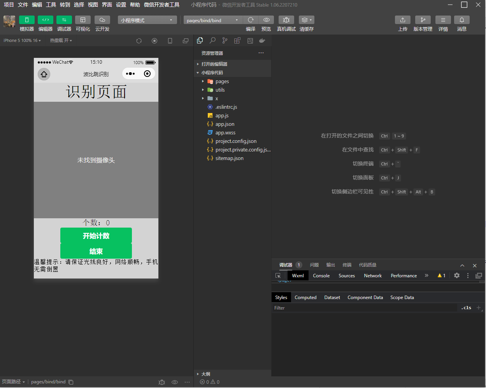  - 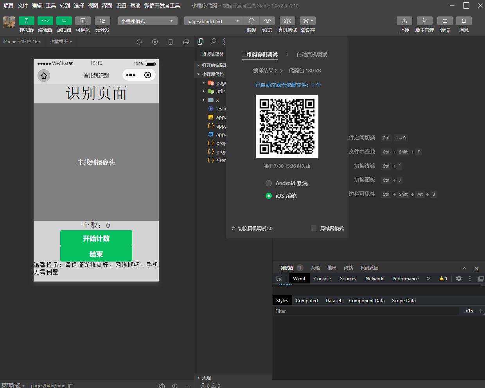 - 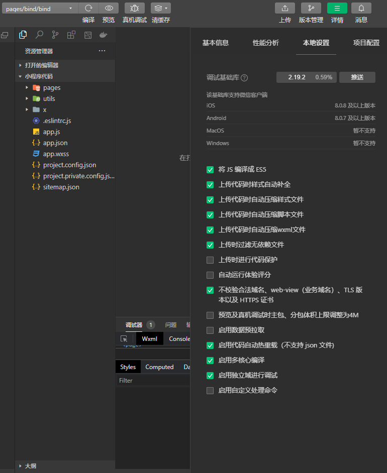


- **步骤5** 进入微信小程序页面，点击`开始计数`，小程序将摄像头以40ms（fps=25）的速率拍摄照片，并上传至腾讯云桶内，后台接收图片并处理
- 
- 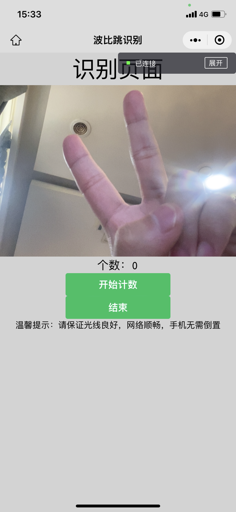
- 
- **步骤6** 人物在摄像头前进行波比跳，后台实时更新波比跳个数并将结果发送至桶内，小程序端以0.1s的速率刷新页面展示的个数

- **步骤7** 点击`结束`，小程序停止发送图像并清理上传至桶内的图片释放内存，后端等待小程序下次开始计数


### 4.2 性能与精度测试

- **步骤1** 准备测试数据集，并将`data`目录放在`Burpee_Detection`目录下

  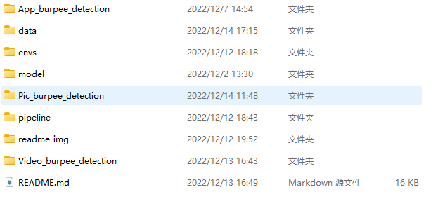

- **步骤2** 打开`Burpee_Detection/Pic_burpee_detection`目录下`pic_burpee_detection.py`文件，将变量 `INPUT_PATH` ,`OUTPUT_PATH` ,`OUTPUT_PIC_PATH`分别初始化为 `["../data/images/test/"]`,`["./result_test/"]`,`["./result_test_pic/"]`


- **步骤3** 在`Burpee_Detection/Pic_burpee_detection`目录下运行`run.sh`脚本，对`data/images/test`目录下的图片进行识别并输出结果

  ```bash
  bash run.sh
  ```

  运行脚本后会生成经过 SDK 后的推理结果结果保留在`result_test`目录下以`.txt`格式保存。
  结果可视化效果保留在`result_test_pic`目录下以`.jpg`格式保存

  运行结果中会有`Spend time：`是识别所有图片所用的时间，`fps：`计算得到的帧数

  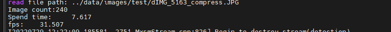

- **步骤4** 在`Burpee_Detection/Pic_burpee_detection`目录下运行`map_calculate.py`脚本，计算精度。

  ```bash
  python3.9.2 map_calculate.py
  ```

  测试结果

  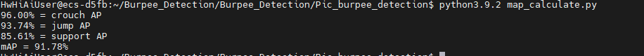

  ##  5 软件依赖以及资源链接

  推理中涉及到第三方软件依赖如下表所示。

  | 依赖软件       | 版本         | 说明                                       | 使用教程                                                     |
  |------------| ---------- | ------------------------------------------ | ------------------------------------------------------------ |
  | live555        | 1.09       | 实现视频转 rtsp 进行推流                   | [链接](https://gitee.com/ascend/mindxsdk-referenceapps/blob/master/docs/参考资料/Live555离线视频转RTSP说明文档.md) |
  | ffmpeg         | 2021-10-14 | 实现 mp4 格式视频转为 H.264 格式视频       | [链接](https://gitee.com/ascend/mindxsdk-referenceapps/blob/master/docs/参考资料/pc端ffmpeg安装教程.md#https://gitee.com/link?target=https%3A%2F%2Fffmpeg.org%2Fdownload.html) |
  | 微信开发者工具 |1.06.2207210| 实现小程序的使用                           | [链接](https://developers.weixin.qq.com/miniprogram/dev/devtools/download.html) |
  | 小程序导入代码 |-           | 微信小程序代码                             | [链接](https://burpee.obs.cn-east-3.myhuaweicloud.com:443/%E5%B0%8F%E7%A8%8B%E5%BA%8F%E4%BB%A3%E7%A0%81.zip?AccessKeyId=3M18UT7HRLKP58NPPFUO&Expires=1690270238&Signature=SHjFgSLUrGMPGbYNYyNgS3VmBMw%3D) |
  | 模型文件       | -          | pt 模型文件，onnx 模型文件，om 模型文件    | [链接](https://burpee.obs.cn-east-3.myhuaweicloud.com:443/models.zip?AccessKeyId=LMDYAAERYH5FWMJIHJOM&Expires=1701063800&Signature=I9qJSuxbvN3VJ66%2B%2BXmO%2B%2BiyLTQ%3D |