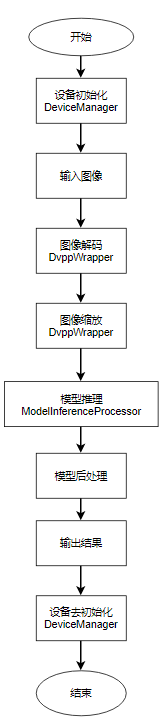

# 卡通图像生成

## 1 介绍
本开发项目基于mxBase，在昇腾平台上，开发端到端的卡通图像生成参考设计，实现图像卡通化功能。
项目的主要处理流程为：Init > ReadImage > Resize > Inference > PostProcess > WriteResult > DeInit

适用场景：本项目支持通用场景下的jpg图片卡通化。为了保证卡通化效果，建议使用图像线条简单，细节较少的图片进行推理。

### 1.1 支持的产品

本项目以Atlas310B卡为主要的硬件平台。

### 1.2 支持的版本

mxVision 5.0.RC1
Ascend-CANN-toolkit （310B使用6.2.RC1）

### 1.3 软件方案介绍

卡通图像生成项目实现：输入图片，通过调用mxBase提供的接口，使用DVPP进行图像解码，解码后获取图像数据，然后经过图像缩放，满足模型的输入要求；将缩放后的图像数据输入cartoonization模型进行推理，模型输出经过后处理后，得到生成的卡通化的图像，将其可视化，得到最后的卡通图像。

表1.1系统方案中各模块功能：

| 序号 | 子系统       | 功能描述                                     |
| ---- | ------------ | -------------------------------------------- |
| 1    | 设备初始化   | 芯片与模型参数初始化                         |
| 2    | 图片输入     | 读取文件夹中的图片路径                       |
| 3    | 图像解码     | 调用DvppJpegDecode()函数完成图像解码         |
| 4    | 图像缩放     | 调用VpcResize()接口完成图像缩放              |
| 5    | 模型推理     | 调用ModelInferenceProcessor 接口完成模型推理 |
| 6    | 后处理       | 获取模型推理输出张量BaseTensor，进行后处理   |
| 7    | 保存结果     | 将处理后得到的卡通化图像可视化保存至文件夹中 |
| 8    | 设备去初始化 | 推理卡设备去初始化。                         |


### 1.4 代码目录结构与说明

本工程名称为CartoonGAN_picture，工程目录如下图所示：

> data文件及目录下的images、model文件夹需要用户在项目运行前手动创建

```
|-----CartoonGANPicture
|     |---CartoonGANPicture.cpp
|     |---CartoonGANPicture.h
|-----data
|     |---images //推理图片存放路径
|     |---model  //模型存放路径
|     |---output //推理结果存放路径，由程序运行生成
|-----build.sh  //编译脚本
|-----CMakeLists.txt
|-----main.cpp
```


### 1.5 技术实现流程图




## 2 环境依赖

推荐系统为ubantu 18.04或centos 7.6，环境依赖软件和版本如下表：

| 软件名称       | 版本   |
| -------------- | ------ |
| cmake          | 3.10.2 |
| mxVision       | 5.0.RC1|
| ascend-toolkit | 6.2.RC1 |

## 3 模型转换

### 3.1 模型下载

[模型及配置文件下载链接](https://mindx.sdk.obs.cn-north-4.myhuaweicloud.com/mindxsdk-referenceapps%20/contrib/CartoonGANPicture/model.zip)

将下载好的模型和配置文件放入data/model目录下

### 3.2 环境变量配置

设置如下环境变量：

```shell
. /usr/local/Ascend/ascend-toolkit/set_env.sh # Ascend-cann-toolkit开发套件包默认安装路径，根据实际安装路径修改
. ${MX_SDK_HOME}/mxVision/set_env.sh # ${MX_SDK_HOME}替换为用户的SDK安装路径
```


### 3.3 模型转换

进入data/model目录，运行如下模型转换命令实现模型转换：

```
atc --output_type=FP32 --input_shape="train_real_A:1,256,256,3"  --input_format=NHWC --output="cartoonization" --soc_version=Ascend310 --insert_op_conf=insert_op.cfg --framework=3 --model="cartoonization.pb" --precision_mode=allow_fp32_to_fp16
```

备注：若推理芯片为310B，需要将atc-env脚本中模型转换atc命令中的soc_version参数设置为Ascend310B1。

## 4 编译与运行

在编译运行项目前，需要设置环境变量：

- 环境变量介绍:
  - MX_SDK_HOME为SDK安装路径
  - LD_LIBRARY_PATH为lib库路径

```
export MX_SDK_HOME=${MX_SDK安装路径}
export LD_LIBRARY_PATH=${MX_SDK_HOME}/lib:${MX_SDK_HOME}/opensource/lib:/usr/local/Ascend/ascend-toolkit/latest/acllib/lib64:/usr/local/Ascend/ascend-toolkit/:${LD_LIBRARY_PATH}
```

**步骤1** 修改CMakeLists.txt文件

```
set(MX_SDK_HOME ${MX_SDK安装路径})
# 将${MX_SDK安装路径}修改为SDK实际安装路径
```

**步骤2** cd至项目主目录，执行如下命令编译程序：

```
bash build.sh
```

**步骤3** 将需要执行推理的图片放置在data/images中，在项目主目录下执行如下命令完成推理：

```
./CartoonGAN_picture ./data/images
```

推理完成后的图片存放在生成的data/output目录下

## 5 常见问题

### 5.1 图片解码失败

**问题描述：**

Dvpp图片解码接口只支持对图片格式为jpg、jpeg；图片片分辨率在[32，8192]范围内的图片的解码，图片格式不支持或分辨率不符合约束的图片无法成功进行推理

**解决方案：**

使用规格内的图片进行推理