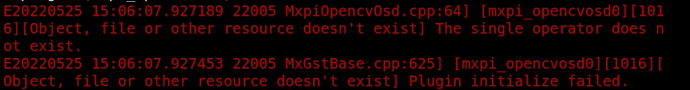

# 人脸和关键点检测

## 1 介绍

本样例基于MindxSDK开发，在昇腾芯片上对输入图片进行人脸和关键点检测，将检测结果可视化并保存，支持多档次的动态分辨率输入。

人脸检测指对输入图片输出人脸检测框，关键点检测则指输出包括双眼，鼻尖和嘴巴两边在内的五个关键点。本方案模型推理采用CenterFace(一个轻量化的人脸检测模型，同时实现了人脸检测+关键点检测)，对模型的输出开发两个后处理插件——人脸检测插件和关键点检测插件，分别对人脸目标框和关键点信息进行了可视化处理。

### 1.1 支持的产品

本项目以昇腾Atlas310卡为主要的硬件平台。

### 1.2 支持的版本

支持的SDK版本为2.0.4。

### 1.3 软件方案介绍

基于MindX SDK的人脸检测和关键点模型(动态分辨率)推理流程为：

待检测图片通过appsrc插件输入，然后使用图像解码mxpi_imagedecoder对图片进行解码，再通过图像缩放插件mxpi_imageresize将图形缩放至合适的分辨率档位，缩放后的图形输入模型推理插件mxpi_tensorinfer得到模型输出。本项目开发的模型后处理插件包括目标检测和关键点检测两部分；模型推理得到的结果分别送入两个后处理插件。人脸检测插件用来得到人脸目标框，关键点检测插件得到五个关键点。人脸检测插件的结果可同图片mxpi_imagedecoder结果送入OSD可视化插件，和关键点检测插件通过appsink完成整个pipeline的流程，最后在外部使用opencv对人脸和关键点进行可视化描绘并保存。本系统的各模块及功能如表1所示：

表1 系统方案各模块功能描述：

| 序号 | 子系统           | 功能描述                               |
| ---- | ---------------- | -------------------------------------- |
| 1    | 图片输入         | 获取jpg格式输入图片                    |
| 2    | 图片解码         | 解码图片为YUV420sp                     |
| 3    | 图片缩放         | 将输入图片缩放到合适的分辨率档位       |
| 4    | 模型推理         | 对输入张量进行推理                     |
| 5    | 人脸检测后处理   | 对模型推理输出计算生成人脸检测框       |
| 6    | 人脸关键点后处理 | 对模型推理输出计算出人脸关键点         |
| 7    | OSD              | 融合图片和人脸检测后处理信息           |
| 8    | 结果可视化       | 将人脸检测和关键点结果可视化保存为图片 |

### 1.4 代码目录结构与说明

项目名称为CenterFace，项目目录如下图所示：

```
│  build.sh
│  README.md
│  run.sh
│
├─C++
│      build.sh
│      CMakeLists.txt
│      main.cpp
│
├─model
│      centerface.cfg
│      CenterFace.pipeline
│      centerface_aipp.cfg
│
├─plugins
│  ├─FaceDetectPostProcessor
│  │      build.sh
│  │      CMakeLists.txt
│  │      MxCenterfacePostProcessor.cpp
│  │      MxCenterfacePostProcessor.h
│  │
│  └─KeyPointPostProcessor
│          build.sh
│          CMakeLists.txt
│          MxCenterfaceKeyPointPostProcessor.cpp
│          MxCenterfaceKeyPointPostProcessor.h
```

## 2 环境依赖

推荐系统为ubuntu 18.04，环境依赖软件和版本如下表：

| 软件名称 | 版本    |
| -------- |-------|
| cmake    | 3.5.+ |
| mxVision | 2.0.4 |
| Python   | 3.7.2 |
| OpenCV   | 3.4.0 |
| gcc      | 7.5.0 |

模型转换所需ATC工具环境搭建参考链接：[https://support.huaweicloud.com/tg-cannApplicationDev330/atlasatc_16_0004.html](https://gitee.com/link?target=https%3A%2F%2Fsupport.huaweicloud.com%2Ftg-cannApplicationDev330%2Fatlasatc_16_0004.html)

在编译运行项目前，需要设置环境变量：

```bash
export MX_SDK_HOME=${SDK安装路径}/mxVision
export LD_LIBRARY_PATH="${MX_SDK_HOME}/lib:${MX_SDK_HOME}/opensource/lib:${LD_LIBRARY_PATH}"
export PYTHONPATH="${MX_SDK_HOME}/python:${PYTHONPATH}"
export GST_PLUGIN_SCANNER="${MX_SDK_HOME}/opensource/libexec/gstreamer-1.0/gst-plugin-scanner"
export GST_PLUGIN_PATH="${MX_SDK_HOME}/opensource/lib/gstreamer-1.0:${MX_SDK_HOME}/lib/plugins"
```

## 3.模型转换

本项目推理模型采用[CenterFace](https://github.com/Star-Clouds/CenterFace)，onnx模型下载[链接](https://mindx.sdk.obs.cn-north-4.myhuaweicloud.com/mindxsdk-referenceapps%20/contrib/CenterFaceWithDynamicResolution/centerface_offical.onnx)，使用之前须使用转化工具ATC将模型转化为om模型，模型转换工具相关介绍参考[链接](https://support.huaweicloud.com/tg-cannApplicationDev330/atlasatc_16_0005.html)。ATC工具参考环境变量配置：

```bash
export install_path=/usr/local/Ascend/ascend-toolkit/latest
export PATH=/usr/local/python3/bin:${install_path}/atc/ccec_compiler/bin:${install_path}/atc/bin:$PATH
export PYTHONPATH=${install_path}/atc/python/site-packages:${install_path}/atc/python/site-packages/auto_tune.egg/auto_tune:${install_path}/atc/python/site-packages/schedule_search.egg
export LD_LIBRARY_PATH=${install_path}/atc/lib64:$LD_LIBRARY_PATH
export ASCEND_OPP_PATH=${install_path}/opp
```

下载onnx模型之后，将onnx文件移至"/model",并在终端执行如下命令：

```bash
atc --model=centerface_offical.onnx --output=centerface_offical --dynamic_image_size="768,1024;800,800;1024,768;864,1120;1120,864;960,1216;1216,960;1056,1312;1312,1056;1152,1408;1408,1152;1248,1504;1504,1248;1344,1600;1600,1344;1440,1696;1696,1440;1536,1792;1792,1536;1632,1888;1888,1632;1728,1984;1984,1728;1824,2080;2080,1824"   --soc_version=Ascend310 --input_shape="input.1:1,3,-1,-1" --input_format=NCHW --framework=5 --insert_op_conf=centerface_aipp.cfg
```

> 以上命令将模型转化为具有多档位的动态分辨率模型，转成单档位可使用如下命令：

```bash
atc --model=centerface_offical.onnx --output=centerface_offical  --soc_version=Ascend310 --input_shape="input.1:1,3,800,800" --input_format=NCHW --framework=5 --insert_op_conf=centerface_aipp.cfg
```

该模型转化使用了aipp，配置如下：

```yaml
aipp_op{
aipp_mode: static
crop: false
input_format : YUV420SP_U8
#非动态分辨率请设置具体的宽高
src_image_size_h : 0
src_image_size_w : 0
csc_switch : true
rbuv_swap_switch : false
matrix_r0c0 : 256
matrix_r0c1 : 0
matrix_r0c2 : 359
matrix_r1c0 : 256
matrix_r1c1 : -88
matrix_r1c2 : -183
matrix_r2c0 : 256
matrix_r2c1 : 454
matrix_r2c2 : 0
input_bias_0 : 0
input_bias_1 : 128
input_bias_2 : 128
mean_chn_0 : 0
mean_chn_1 : 0
mean_chn_2 : 0
min_chn_0 : 0
min_chn_1 : 0
min_chn_2 : 0
var_reci_chn_0: 1.0
var_reci_chn_1: 1.0
var_reci_chn_2: 1.0
}
```

> 如使用单档位命令转化后的模型，resizer插件下游紧接模型推理时缩放宽高可以自动获取，在pipeline中缩放插件mxpi_imageresizer0无需再配置resizeHeight和resizerWidth。而使用多档位命令转换的模型时，未配置resize宽高默认缩放到第一个档位，使用其它档位仍需配置缩放的宽高。

## 4 编译与运行

- 编译

  ```bash
  bash build.sh
  ```
  
- 运行

  ```bash
  bash run.sh "图片路径"  #相对路径为相对C++/Main可执行文件的路径，如果图片放于脚本同级目录，请使用bash run.sh ../picture.jpg
  ```

> 1.先获取onnx模型，并使用命令转化成所需要的om模型，并放置在model目录下。
>
> 2.run.sh脚本中LD_LIBRARY_PATH设置了ACL动态库链接路径为/usr/local/Ascend/ascend-toolkit/latest/acllib/lib64，如果实际环境中路径不一致，需要替换为实际的目录。
>
> 3.如果环境变量中没有MX_SDK_HOME变量，请配置MX_SDK_HOME变量为你实际的MX_SDK安装目录。
>
> 4.运行时请准备图片，按上述命令执行后，结果会生成在C++/result路径下。

## 5.适用场景

本方案从人体方向，人体遮挡程度，人体个数，人体大小，图片清晰程度，灰度图片检测效果几个方面对模型进行了功能测试，在绝大部分情形下可以准确检测，存在以下两种异常情形：

侧面人脸且存在遮挡时会出现无法检测出人脸的情况。

图片尺寸与模型尺寸不匹配时，检测效果难以符合预期，请选择合适的分辨率以获取更好的检测效果。

## 6.常见问题

- 运行时报错opencvosd插件加载失败

  

  本方案使用了osd可视化插件，请参考官方技术文档[mxpi_opencvosd](https://support.huawei.com/enterprise/zh/doc/EDOC1100234263/e25ede48)页面生成所需的模型文件。

  