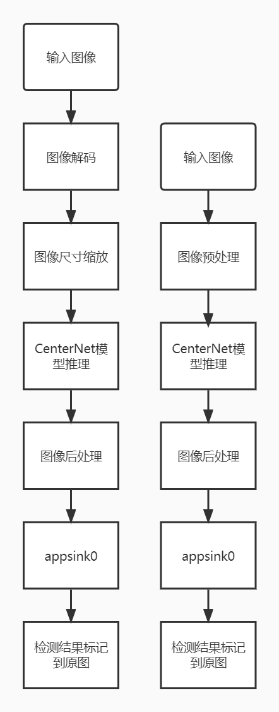
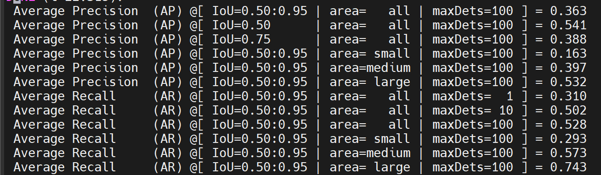
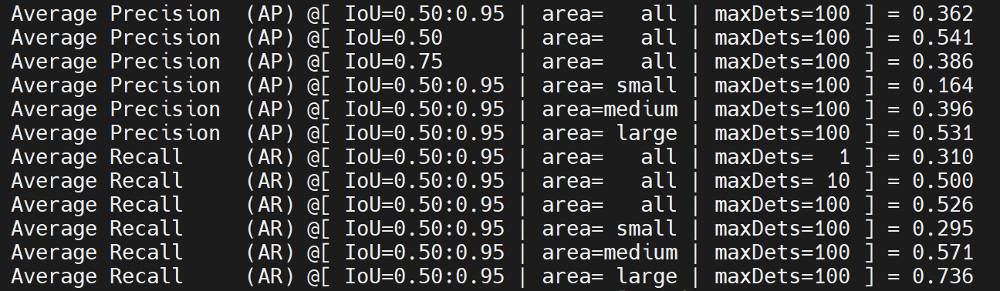

# CenterNet 目标检测
## 1. 介绍

CenterNet 目标检测后处理插件基于 MindX SDK 开发，对图片中的不同类目标进行检测，将检测得到的不同类的目标用矩形框标记。输入一幅图像，可以检测得到图像中大部分类别目标的位置。本方案使用在 COCO2017 数据集上训练得到的 CenterNet 模型进行目标检测，数据集中共包含 80 个目标类，包括行人、自行车、公共汽车、手机、沙发、猫、狗等，可以对不同类别、不同角度、不同密集程度的目标进行检测。

### 1.1 支持的产品

本项目以昇腾Atlas310、Atlas310B卡为主要硬件平台。


### 1.2 支持的版本

支持的SDK版本为 5.0.RC1, CANN 版本310使用6.3.RC1，310B使用6.2.RC1。


### 1.3 软件方案介绍 

本项目设计两种流程，一种为用python代码实现对图像的预处理过程，然后将处理好的图片通过 appsrc 插件输入到业务流程中；另一种是直接将原图片通过 appsrc 输入到业务流程中。

#### 1.3.1 业务流程加图像预处理方案

整体业务流程为：待检测图片通过 appsrc 插件输入，然后使用图像解码插件 mxpi_imagedecoder 对图片进行解码，再通过图像缩放插件 mxpi_imageresize 将图像缩放至满足检测模型要求的输入图像大小要求，缩放后的图像输入模型推理插件 mxpi_tensorinfer 得到推理结果，推理结果输入 mxpi_objectpostprocessor 插件进行后处理，得到输入图片中所有的目标框位置和对应的置信度。最后通过输出插件 appsink 获取检测结果，并在外部进行可视化，将检测结果标记到原图上，本系统的各模块及功能描述如表1所示：

表1 系统方案各模块功能描述：

| 序号 | 子系统         | 功能描述                                                     |
| ---- | -------------- | ------------------------------------------------------------ |
| 1    | 图片输入       | 获取 jpg 格式输入图片                                        |
| 2    | 图片解码       | 解码图片                                                     |
| 3    | 图片缩放       | 将输入图片放缩到模型指定输入的尺寸大小                       |
| 4    | 模型推理       | 对输入张量进行推理                                           |
| 5    | 目标检测后处理 | 从模型推理结果计算检测框的位置和置信度，并保留置信度大于指定阈值的检测框作为检测结果 |
| 6    | 结果输出       | 获取检测结果                                                 |
| 7    | 结果可视化     | 将检测结果标注在输入图片上                                   |


#### 1.3.2 业务流程不加图像预处理方案

整体业务流程为：待检测图片信息经预处理后通过 appsrc 插件输入，然后使用模型推理插件 mxpi_tensorinfer 得到推理结果，推理结果输入 mxpi_objectpostprocessor 插件进行后处理，得到输入图片中所有的目标框位置和对应的置信度。最后通过输出插件 appsink 获取检测结果，并在外部进行可视化，将检测结果标记到原图上，本系统的各模块及功能描述如表2所示：

表2 系统方案各模块功能描述：

| 序号 | 子系统         | 功能描述                                                     |
| ---- | -------------- | ------------------------------------------------------------ |
| 1    | 图片输入       | 获取预处理之后的图像信息                                     |
| 2    | 模型推理       | 对输入张量进行推理                                           |
| 3    | 目标检测后处理 | 从模型推理结果计算检测框的位置和置信度，并保留置信度大于指定阈值的检测框作为检测结果 |
| 4    | 结果输出       | 获取检测结果                                                 |
| 5    | 结果可视化     | 将检测结果标注在输入图片上                                   |
### 1.4 代码目录结构与说明

本工程名称为 CenterNet，工程目录如下所示：
```
.
├── images
│   ├── pre_post.png
│   ├── nopre_post.png
│   ├── pipeline.jpg
├── postprocess
│   ├── build.sh
│   ├── CMakeLists.txt
│   ├── CenterNetPostProcess.cpp
│   └── CenterNetPostProcess.h
├── python
│   ├── Main
│   │   ├── eval_nopre_post.py
│   │   ├── eval_pre_post.py
│   │   ├── nopre_post.py
│   │   ├── pre_post.py
│   │   ├── colorlist.txt
│   │   └── preprocess.py
│   ├── models
│   │   ├── aipp-configs
│   │   │   └── aipp_bgr.config
│   │   ├── centernet.cfg
│   │   └── coco.names                      #需要下载，下载链接在下方 
│   ├── dataset     # 下载的数据集存放在此文件下
│   ├── test_img
│   │   └── test.jpg                        # 需要用户自行添加测试数据
│   └── pipeline
│       ├── nopre_post.pipeline
│       └── pre_post.pipeline
└── README.md

```

注：coco.names文件源于[链接](../Collision/model/coco.names)。

### 1.5 技术实现流程图

CenterNet 的后处理插件接收模型推理插件输出的特征图。本项目方案根据业务流程含不含预处理阶段技术流程图可分为如下两种。

<center>
    
    <br>
</center>

### 1.6 适用场景

经过测试，该项目适用于各类图像。

## 2 环境依赖

推荐系统为ubuntu 18.04，环境依赖软件和版本如下表：

| 软件名称 | 版本  |
| -------- | ----- |
| cmake    | 3.5+  |
| python   | 3.9.2 |

确保环境中正确安装mxVision SDK。

在编译运行项目前，需要设置环境变量：

MindX SDK 环境变量:

```
. ${SDK-path}/set_env.sh
```

CANN 环境变量：

```
. ${ascend-toolkit-path}/set_env.sh
```

- 环境变量介绍

```
SDK-path: SDK mxVision 安装路径
ascend-toolkit-path: CANN 安装路径
```

需要安装的NumCpp库：
```
cd postprocess
git clone https://github.com/dpilger26/NumCpp
mkdir include
cp -r  NumCpp/include/NumCpp ./include/
```

## 3. 模型转换

本项目中采用的模型是 CenterNet 模型，参考实现代码：https://github.com/xingyizhou/CenterNet ，模型下载链接：https://www.hiascend.com/zh/software/modelzoo/models/detail/1/0699d3e48ff1447cafc85c2c9f007130 。 本项目使用模型转换工具 ATC 将 onnx 模型转换为 om 模型，模型转换工具相关介绍参考链接：https://gitee.com/ascend/docs-openmind/blob/master/guide/mindx/sdk/tutorials/%E5%8F%82%E8%80%83%E8%B5%84%E6%96%99.md 。


### 3.1 业务流程加图像预处理的模型转换方法


1. 从上述项目链接中下载 onnx 模型 CenterNet.onnx 至 ``python/models`` 文件夹下。


2. 将该模型转换为om模型，具体操作为： ``python/models`` 文件夹下,执行atc指令：

```
atc --framework=5 --model=CenterNet.onnx  --output=CenterNet_pre_post --input_format=NCHW --input_shape="actual_input:1,3,512,512" --out_nodes="Conv_949:0;Conv_952:0;Conv_955:0" --log=info --soc_version=Ascend310 --insert_op_conf=./aipp-configs/aipp_bgr.config
```
(若用例执行在310B上，则--soc_version=Ascend310需修改为Ascend310B1)

若终端输出：
```
ATC start working now, please wait for a moment.
ATC run success, welcome to the next use.
```

表示命令执行成功。

### 3.2 业务流程不加图像预处理的模型转换方法


1. 从上述项目链接中下载 onnx 模型CenterNet.onnx 至 ``python/models`` 文件夹下。


2. 将该模型转换为om模型，具体操作为： ``python/models`` 文件夹下,执行atc指令：
                                                           

```
atc --framework=5 --model=CenterNet.onnx  --output=CenterNet_nopre_post --input_format=NCHW --input_shape="actual_input:1,3,512,512" --out_nodes="Conv_949:0;Conv_952:0;Conv_955:0" --log=info --soc_version=Ascend310
```


若终端输出：

```
ATC start working now, please wait for a moment.
ATC run success, welcome to the next use.
```

表示命令执行成功。

## 4. 编译与运行

### 4.1 业务流程加图像预处理

**步骤1** 在项目后处理目录执行命令：

```
bash build.sh  
```

**步骤2** 放入待测图片。将一张图片放在路径``python/test_img``下，命名为 test.jpg。

**步骤3** 图片检测。在项目路径``python/Main``下运行命令：

```
python3 pre_post.py
```

命令执行成功后在目录``python/test_img``下生成检测结果文件 pre_post.jpg，查看结果文件验证检测结果。

**步骤4** 精度测试。

1. 下载COCO VAL 2017[验证数据集](http://images.cocodataset.org/zips/val2017.zip )和[标注文件](http://images.cocodataset.org/annotations/stuff_annotations_trainval2017.zip)，并保存在项目目录``python/dataset``下，此文件夹下的组织形式应如下图所示：

```                                    
.                                                               
├── annotations                            
│   └── instances_val2017.json                                                                               
└── val2017                          
                                       
```
其中：val2017文件夹下应存放有5000张待测图片。

2. 修改``python/models``下的文件 centernet.cfg 的参数 SCORE_THRESH=0.0

3. 进入``python/Main``路径，运行 命令：
```
python3 eval_pre_post.py
```
<center>
    
    <br>
</center>


### 4.2 业务流程不加图像预处理

**步骤1** 在项目后处理目录执行命令：                                                                                                                                                             
                                                                                                                                                                                
```                                                                                                                                                                             
bash build.sh                                                                                 
```

**步骤2** 放入待测图片。将一张图片放在路径``python/test_img``下，命名为 test.jpg。                                                                                                                      
                                                                                                                                                                                
**步骤3** 图片检测。在项目路径``python/Main``下运行命令：                                                                                                                                         
                                                                                                                                                                                

```                                                                                                                                                                             
python3 nopre_post.py                                                                                                                                                             
```

命令执行成功后在目录``python/test_img``下生成检测结果文件 nopre_post.jpg，查看结果文件验证检测结果。

                                                                                                           
                                                                                                                                                                                
**步骤4** 精度测试。                                                                                                                                                                   
                                                                                                                                                                                

1. 下载COCO VAL 2017[验证数据集](http://images.cocodataset.org/zips/val2017.zip )和[标注文件](http://images.cocodataset.org/annotations/stuff_annotations_trainval2017.zip)，并保存在项目目录``python/dataset``下，此文件夹下的组织形式应如下图所示：                                                                                                    
                                                                                                                                                                                
```                                                                                                                                                                             
.                                                                                                                                                                               
├── annotations                                                                                                                                                                 
│   └── instances_val2017.json                                                                                                                                                  
└── val2017                                                                                                                                                                     
                                                                                                                                                                                
```
其中：val2017文件夹下应存放有5000张待测图片。                                                                                                                                                    
                                                                                                                                                                                
2. 修改``python/models``下的文件 centernet.cfg 的参数 SCORE_THRESH=0.0                                                                                                                                                                                                                       
3. 进入``python/Main``路径，运行命令：                                                                                                                                                   

```                                                                                                                                                                             
python3 eval_nopre_post.py                                                                                                                               
```                                                                                       
<center>
    
    <br>
</center>

### 4.3 目标精度
目标精度为：0.364   


