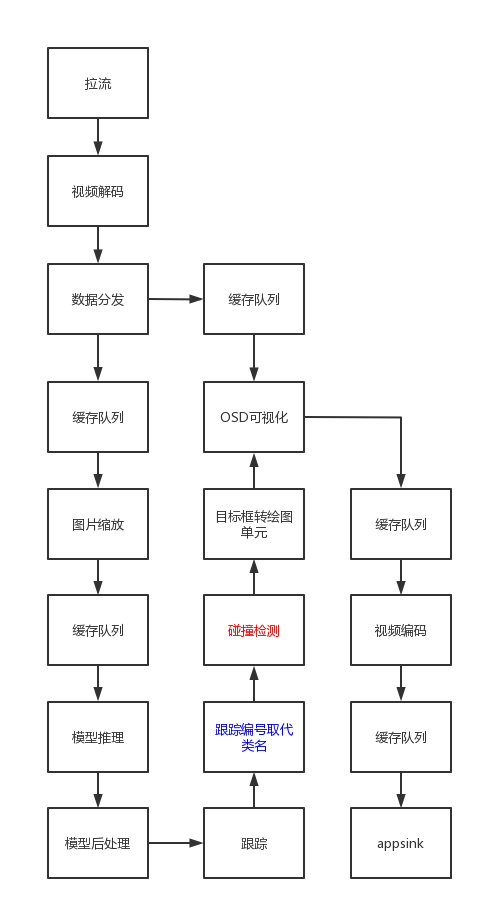

# 车辆碰撞识别

## 1 介绍
此项目的碰撞插件基于MindXSDK开发，在昇腾芯片上进行目标检测和跟踪，可以对车辆进行画框和编号，检测到车辆碰撞后，可将动向编号提示为“Collision”并将检测结果可视化并保存。

项目主要流程为：通过live555服务器进行拉流输入视频，然后进行视频解码将264格式的视频解码为YUV格式的图片，图片缩放后经过模型推理进行车辆识别，识别结果经过yolov3后处理后得到识别框，对识别框进行跟踪并编号，用编号覆盖原有的类别信息，如检测到车辆发生碰撞，碰撞的车辆的编号将会被“Collision”所替换，再将识别框和类别信息分别转绘到图片上，最后将图片编码成视频进行输出。

### 1.1 支持的产品

Ascend 310  
>搭载于Atlas 500
Ascend 310B
>搭载于Atlas 500 A2

### 1.2 支持的版本

| 软件名称 | 版本   |
| -------- | ------ |
| MindX SDK     |    5.0RC1    |
| CANN | 310使用6.3.RC1<br>310B使用6.2.RC1 |

### 1.3 特性及适用场景

本案例可以满足对视频的检测，对检测到的碰撞的车辆在碰撞时刻，输出“Collision”的字样进行提醒。经过测试我们可以知道有以下限制条件：

1.对一个正常清晰的路面，我们可以完成绝大多数正常的一个车辆碰撞检测。

2.当视频清晰度不够，或者车辆速度过快，yolov3并不能很好的识别目标，或者当大车与小车发生碰撞，导致小车被遮挡，或者碰撞事故严重，导致受损车辆无法被检测出来，那么我们对碰撞就会检测失败。

3.当车辆很密集时，障碍物很多时，就会导致物体画框增多，画框不同角度的重叠就可能导致碰撞误判。

### 1.4 软件方案介绍

基于MindX SDK的车辆碰撞识别业务流程为：待检测视频存放在live555服务器上经mxpi_rtspsrc拉流插件输入，然后使用视频解码插件mxpi_videodecoder将视频解码成图片，再通过图像缩放插件mxpi_imageresize将图像缩放至满足检测模型要求的输入图像大小要求，缩放后的图像输入模型推理插件mxpi_tensorinfer得到检测结果，再经yolov3后处理插件处理推理结果，得到识别框。再接入跟踪插件中识别框进行目标跟踪，得到目标的跟踪编号，然后在使用mxpi_trackidreplaceclassname插件将跟踪编号覆盖类名信息，再接入本项目开发的碰撞检测插件mxpi_collisionclassname，使用mxpi_object2osdinstances和mxpi_opencvosd分别将识别框和类名（更替写入跟踪编号或者“Collison”碰撞提醒）绘制到原图片，再通过mxpi_videoencoder将图片合成视频

表1.1 系统方案各子系统功能描述：

| 序号 | 子系统               | 功能描述                                                     |
| ---- | -------------------- | ------------------------------------------------------------ |
| 1    | 视频输入             | 接收外部调用接口的输入视频路径，对视频进行拉流，并将拉取的裸流存储到缓冲区（buffer）中，并发送到下游插件。 |
| 2    | 视频解码             | 用于视频解码，当前只支持H264/H265格式。                      |
| 3    | 数据分发             | 对单个输入数据分发多次。                                     |
| 4    | 数据缓存             | 输出时为后续处理过程另创建一个线程，用于将输入数据与输出数据解耦，并创建缓存队列，存储尚未输出到下流插件的数据。 |
| 5    | 图像处理             | 对解码后的YUV格式的图像进行指定宽高的缩放，暂时只支持YUV格式 的图像。 |
| 6    | 模型推理插件         | 目标分类或检测，目前只支持单tensor输入（图像数据）的推理模型。 |
| 7    | 模型后处理插件       | 采用yolov3后处理插件输出的tensor解析，获取目标检测框以及对应的ReID向量，传输到跟踪模块。 |
| 8    | 跟踪插件             | 实现多目标（包括机非人、目标）路径记录功能。                 |
| 9    | 跟踪编号取代类名插件 | 用跟踪插件产生的编号信息取代后处理插件产生的类名信息，再将数据传入数据流中。 |
| 10   | 碰撞检测插件         | 检测到车辆碰撞后，碰撞车辆的编号将会被“Collision”所替换，再将数据传入数据流中。 |
| 11   | 目标框转绘插件       | 将流中传进的MxpiObjectList数据类型转换可用于OSD插件绘图所使用的的 MxpiOsdInstancesList数据类型。 |
| 12   | OSD可视化插件        | 主要实现对每帧图像标注跟踪结果。                             |
| 13   | 视频编码插件         | 用于将OSD可视化插件输出的图片进行视频编码，输出视频。        |

### 1.5 代码目录结构与说明

```
├── model
│   ├── aipp_yolov3_416_416.aippconfig            # 模型转换aipp配置文件
│   ├── coco.names              # 类名
│   ├── yolov3.cfg              # yolov3配置文件
│   └── yolov3.om               # om模型
│       
├── plugins
│   ├── MxpiCollisionClassName     # 碰撞检测插件
│   │   ├── CMakeLists.txt        
│   │   ├── MxpiCollisionClassName.cpp  
│   │   ├── MxpiCollisionClassName.h
│   │   └── build.sh
│   └── MxpiTrackIdReplaceClassName  # 跟踪编号取代类名插件
│       ├── CMakeLists.txt
│       ├── MxpiTrackIdReplaceClassName.cpp
│       ├── MxpiTrackIdReplaceClassName.h
│       └── build.sh
│
├── build.sh
├── collision.pipeline        # pipeline文件
└── collision.py
```

### 1.6 技术实现流程图



注：红色为本项目开发插件 蓝色为沿用其他项目开发插件 其余为SDK内置插件

## 1 环境依赖

推荐系统为ubantu 18.04，环境依赖软件和版本如下表：

| 依赖软件 | 版本       | 说明                           |                                                     使用教程 |
| -------- | ---------- | ------------------------------ | -----------------------------------------------------------: |
| live555  | 1.09       | 实现视频转rstp进行推流         | [链接]([guide/mindx/sdk/tutorials/reference_material/Live555离线视频转RTSP说明文档.md · Ascend/docs-openmind - Gitee.com](https://gitee.com/ascend/docs-openmind/blob/master/guide/mindx/sdk/tutorials/reference_material/Live555离线视频转RTSP说明文档.md)) |
| ffmpeg   | 2021-07-21 | 实现mp4格式视频转为264格式视频 | [链接]([guide/mindx/sdk/tutorials/reference_material/pc端ffmpeg安装教程.md · Ascend/docs-openmind - Gitee.com](https://gitee.com/ascend/docs-openmind/blob/master/guide/mindx/sdk/tutorials/reference_material/pc端ffmpeg安装教程.md)) |
| python   | 3.9.2      | 与SDK配套                      | [链接]([Linux（Ubuntu）系统安装Python (biancheng.net)](http://c.biancheng.net/view/4162.html)) |

在编译运行项目前，需要设置环境变量：

将${SDK_INSTALL_PATH}替换为自己的SDK安装路径; 
```shell
. /usr/local/Ascend/ascend-toolkit/set_env.sh #toolkit默认安装路径，根据实际安装路径修改
. ${SDK_INSTALL_PATH}/mxVision/set_env.sh
```

## 2 模型转换

本项目中适用的模型是yolov3模型，yolov3模型可以在昇腾官网ModelZoo直接下载：[YOLOv3-昇腾社区 (hiascend.com)]([ATC YOLOv3(FP16)-昇腾社区 (hiascend.com)](https://www.hiascend.com/zh/software/modelzoo/detail/1/ba2a4c054a094ef595da288ecbc7d7b4))。下载后使用模型转换工具 ATC 将 pb 模型转换为 om 模型，模型转换工具相关介绍参考链接：[https://gitee.com/ascend/docs-openmind/blob/master/guide/mindx/sdk/tutorials/%E5%8F%82%E8%80%83%E8%B5%84%E6%96%99.md](https://gitee.com/ascend/docs-openmind/blob/master/guide/mindx/sdk/tutorials/%E5%8F%82%E8%80%83%E8%B5%84%E6%96%99.md) 。

模型转换，步骤如下：

从上述下载链接中下载yolov3模型解压缩文件yolov3_tf.pb至 ./model 文件夹下，进入 `./models` 文件夹下执行命令：

```
atc --model=./yolov3_tf.pb --framework=3 --output=./yolov3 --soc_version=Ascend310B1 --insert_op_conf=./aipp_yolov3_416_416.aippconfig --input_shape="input:1,416,416,3" --out_nodes="yolov3/yolov3_head/Conv_6/BiasAdd:0;yolov3/yolov3_head/Conv_14/BiasAdd:0;yolov3/yolov3_head/Conv_22/BiasAdd:0"
```
此命令适用于310B1硬件，使用310时指定soc_version=Ascend310  
执行该命令后会在当前文件夹下生成项目需要的模型文件 yolov3.om。执行后终端输出为：

```
ATC start working now, please wait for a moment.
ATC run success, welcome to the next use.
```

表示命令执行成功。


## 3 准备

按照第3小结**软件依赖**安装live555和ffmpeg，按照 [Live555离线视频转RTSP说明文档]([guide/mindx/sdk/tutorials/reference_material/Live555离线视频转RTSP说明文档.md · Ascend/docs-openmind - Gitee.com](https://gitee.com/ascend/docs-openmind/blob/master/guide/mindx/sdk/tutorials/reference_material/Live555离线视频转RTSP说明文档.md))将mp4视频转换为h264格式。并将生成的264格式的视频上传到`live/mediaServer`目录下，然后修改collision.pipeline文件中mxpi_rtspsrc0的内容。

```
        "mxpi_rtspsrc0": {
            "factory": "mxpi_rtspsrc",
            "props": {
                "rtspUrl":"rtsp://xxx.xxx.xxx.xxx:xxxx/xxx.264",      // 修改为自己所使用的的服务器和文件名
                "channelId": "0"
            },
            "next": "mxpi_videodecoder0"
        },
```

我们默认ffmpeg转换视频为264格式时，分辨率统一为1280*720，如果自己需要更改分辨率，请同时修改collision.pipeline文件中mxpi_videoencoder0的"imageHeight"和"imageWidth"内容。

     "mxpi_videoencoder0": {
                "props": {
                    "inputFormat": "YUV420SP_NV12",
                    "outputFormat": "H264",
                    "fps": "1",
                    "iFrameInterval": "50",
                    "imageHeight":"720",
                    "imageWidth":"1280"
                },
                "factory": "mxpi_videoencoder",
                "next": "queue7"
            },
## 4 编译与运行

**步骤1** 按照第2小结**环境依赖**中的步骤设置环境变量。

**步骤2** 按照第 4 小节 **模型转换** 中的步骤获得 om 模型文件，放置在 `./model` 目录下。

**步骤3** 修改`Collision/plugins/MxpiCollisionClassName`和`Collision/plugins/MxpiTrackIdReplaceClassName`文件夹下的CMakeLists.txt文件。将其中的"$ENV{MX_SDK_HOME}"修改成自己的SDK目录。

**步骤4** 编译。进入 `Collision` 目录，在 `Collision` 目录下执行命令：

```
bash build.sh
```

命令执行成功后会在`Collision/plugins/MxpiCollisionClassName`和`Collision/plugins/MxpiTrackIdReplaceClassName`目录下分别生成build文件夹。将`Collision/plugins/MxpiTrackIdReplaceClassName/build`目录下生成的的libmxpi_trackidreplaceclassname.so下载后上传到`${SDK安装路径}/mxVision/lib/plugins`目录下，同时将`Collision/plugins/MxpiCollisionClassName/build`目录下生成的libmxpi_collisionclassname.so下载后上传到`${SDK安装路径}/mxVision/lib/plugins`目录下。

**步骤5** 运行。回到主目录下，在主目录下执行命令：

```
python3 collision.py
```

命令执行成功后会在当前目录下生成检测结果视频文件out_collision.h264,查看文件验证目标跟踪结果。


## 5 结果展示（部分截图）

生成的out_collision.h264文件在本地我们可以用适配.h264文件格式的视频播放软件进行播放。也可以使用ffmpeg转换成.mp4格式进行本地播放。

```
ffmpeg -i out_collision.h264 -vcodec h264 out_collision.mp4
```


## 6 常见问题

视频编码参数配置错误

1.**问题描述：**

`Collision/collision.pipeline`中视频编码分辨率参数已经手动指定imageHeight 和 imageWidth 属性，需要和视频输入分配率相同，否则会包如下类型的错：


**解决方案：**

确保`Collision/collision.pipeline`中 mxpi_videoencoder0 插件的 imageHeight 和 imageWidth 属性值是输入.h264视频的高和宽。此时我们可以在用ffmpeg进行视频拉流时找到设置.h264视频的高和宽。

2.**问题描述：**

`Collision/collision.py`中视频帧数参数目前未确定，系统则会对缺省的视频拉流帧数进行识别并输出，所以会造成输出长视频不完整和短视频重复的结果。

**解决方案：**

确保`Collision/collision.py`中第52行`if t > 'xxx'`的属性值是输入.h264视频帧数。此时我们可以在用ffmpeg进行视频拉流时找到设置.h264视频的帧数。

