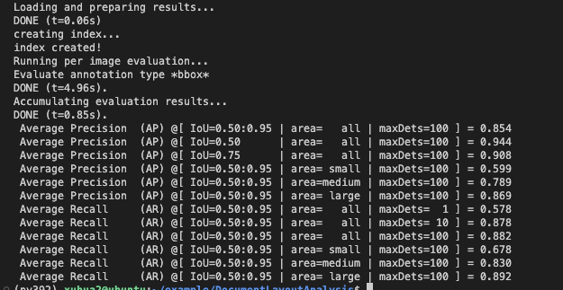

# 文档版面分析

## 1 介绍
在本系统中，目的是基于MindX SDK，在昇腾平台上，开发端到端文档版面分析的参考设计，实现对图像中的文档识别的功能，并把可视化结果保存到本地，达到功能要求和精度要求。

样例输入：包含文档版面的jpg图片或者png图片。

样例输出：框出版面内容并标有版面类型与置信度的jpg或者png图片。

### 1.1 支持的产品

支持昇腾310B1芯片

### 1.2 支持的版本

推荐系统为ubantu 18.04。

| 软件名称 | 版本   |
| -------- | ------ |
| python    | 3.9.2     | 
| MindX SDK     |    5.0RC1    |
| CANN | 310使用6.3.RC1<br>310B使用6.2.RC1 |
|numpy|1.21.5|
|opencv-python|4.5.5|


### 1.3 软件方案介绍

本方案中，通过将paddlepaddle的文档版面分析模型转成华为晟腾的om模型。将传入的图片做解码、resize、色域转换和归一化之后放入模型推理，推理结果再经过后处理和可视化之后，形成框出版面内容并标有版面类型与置信度的图片。


### 1.4 代码目录结构与说明

本工程名称为DocumentLayoutAnalysis，工程目录如下图所示：
```
├── evaluate.py             #精度测试
├── infer.py                #推理文件
├── model
│   ├── layout.aippconfig   #aipp配置文件
│   ├── model.sh            #模型转换脚本
├── postprocess.py          #后处理文件
├── README.md
└── utils.py                #推理用到的一些工具函数
```

### 1.5 技术实现流程图


图1 文档版面分析流程图

### 1.6 适用场景

项目适用轮廓明显，且图片较清晰的文档测试图片

**注**：由于paddle模型限制，仅支持识别['Text', 'Title', 'Figure', 'Figure caption', 'Table','Table caption', 'Header', 'Footer', 'Reference', 'Equation']列表里的 **10** 种版面类型。遇到深色背景色的文档，会识别成图片；遇到没有检测对象的空图会直接输出。

## 2 环境依赖

在编译运行项目前，需要设置环境变量:

```bash
# 执行环境变量脚本使环境变量生效
. ${SDK-path}/set_env.sh
. ${ascent-tookit-path}/set_env.sh
# SDK-path: SDK mxVision安装路径
# ascent-tookit-path: CANN安装路径

#查看环境变量
env
```

## 3 模型获取

### 3.1 paddle模型转换成onnx模型

**步骤1** 在PaddleOCR上下载picodet_lcnet_x1_0_fgd_layout_cdla模型。[下载地址](https://github.com/PaddlePaddle/PaddleOCR/blob/dygraph/ppstructure/docs/models_list.md)

**步骤2** 根据[PaddleOCR的inference模型转onnx模型](https://gitee.com/ascend/mindxsdk-referenceapps/blob/master/contrib/OCR/IDCardRecognition/MODEL.md#paddleocr%E7%9A%84inference%E6%A8%A1%E5%9E%8B%E8%BD%AConnx%E6%A8%A1%E5%9E%8B)将下载的paddle模型转成onnx模型。

转onnx模型用到的环境配置: paddle2onnx-0.9.2 with python>=2.7 , paddlepaddle>=1.8.0

**步骤3** 得到模型后，将转好的onnx模型复制到该工程目录model文件夹下


### 3.2 可用模型获取

此处提供paddlepaddle的模型源文件和经过3.1之后转换好的paddlepaddle模型的onnx文件：[**下载地址**](https://mindx.sdk.obs.cn-north-4.myhuaweicloud.com/mindxsdk-referenceapps%20/contrib/DocumentLayoutAnalysis/%E6%96%87%E6%A1%A3%E7%89%88%E9%9D%A2%E5%88%86%E6%9E%90%E6%A8%A1%E5%9E%8B%E5%A4%87%E4%BB%BD.zip)


注：**下载后请将模型请放置于model的对应目录下**


### 3.3 onnx模型转换成om模型

**步骤1** AIPP配置
由于该模型的输入为rgb格式，图像解码后的图像为bgr格式，且图片需要做归一化处理步骤，需要在atc转换模型时使用aipp预处理，aipp配置文件命名为layout.aippconfig，aipp配置内容如下：

```bash
aipp_op {
aipp_mode : static
crop : false
input_format : RGB888_U8
csc_switch : false
rbuv_swap_switch : true
min_chn_0 : 123.675
min_chn_1 : 116.28
min_chn_2 : 103.53
var_reci_chn_0 : 0.0171247538
var_reci_chn_1 : 0.0175070028
var_reci_chn_2 : 0.0174291938
}

```

**步骤2** cd 到工程目录model目录下
执行脚本
```bash
. model.sh
```

**步骤3** 模型转换结果

执行完模型转换脚本后，会生成相应的.om模型文件。 执行后终端输出为：
```bash
ATC start working now, please wait for a moment.
ATC run success, welcome to the next use.
```
转成的模型命名为layout.om可以在推理中使用了

模型转换使用了ATC工具，如需更多信息请参考:

https://support.huawei.com/enterprise/zh/doc/EDOC1100234054/ede80b10


## 4 编译与运行

示例步骤如下：

**步骤1** 自行选择一张或多张图片文件，放入工程目录`./input`下。

参考测试图片[**下载地址**](https://github.com/PaddlePaddle/PaddleDetection/blob/release/2.5/docs/images/layout.jpg)

注：**如果工程目录下没有input目录，需要自行建立**


**步骤2** cd 到该项目目录DocumentLayoutAnalysis下，然后执行
```bash
python infer.py
```

执行后会在终端按顺序输出文档的版面类别和置信度，并在`./output`目录下生成结果图片，可查看文档检测结果。

注：**如果工程目录下没有output目录，需要自行建立**


## 5 精度测试

**步骤1**获取数据集

数据集CDLA dataset:[**下载地址**](https://github.com/buptlihang/CDLA)

由于精度测试只需要用到验证集val，所以只需要保留数据集里的val文件。精度测试使用的标注json文件需要转成[coco格式](https://zhuanlan.zhihu.com/p/101984674)。
转换过程参考[转coco格式](https://github.com/buptlihang/CDLA#%E8%BD%ACcoco%E6%A0%BC%E5%BC%8F)。将转换后的val_save_path目录下的JEPGimages目录和annotations.json文件复制到工程目录val下。

注：**如果工程目录下没有val目录，需要自行建立**


**步骤2**运行精度测试python文件

cd 到该项目目录DocumentLayoutAnalysis下，然后执行
```bash
python evaluate.py
```
之后就得到精度测试的结果了,例如下图3所示

测试结果与原模型的精度0.856相差0.002，满足精度要求。



图2 文档版面识别精度测试结果
