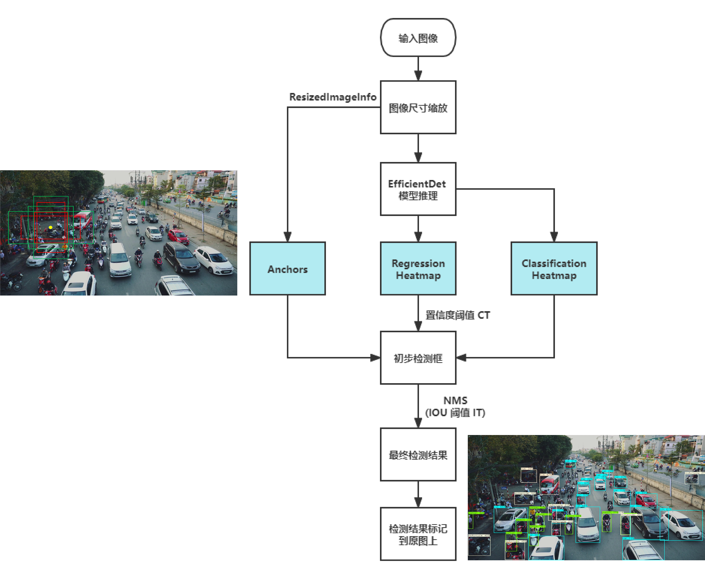
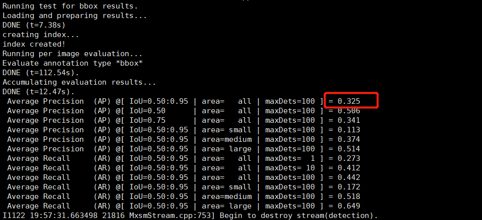
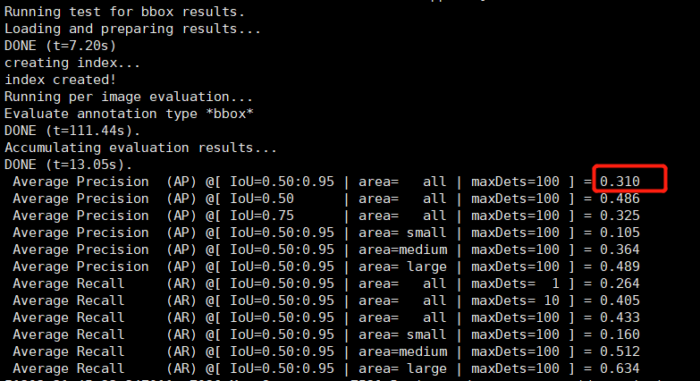
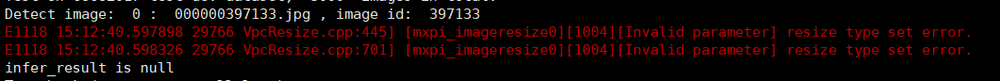
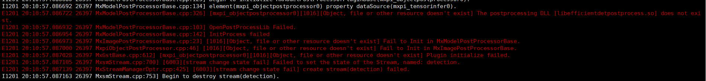

# EfficientDet 目标检测
## 1. 介绍
EfficientDet 目标检测后处理插件基于 MindXSDK 开发，对图片中的不同类目标进行检测，将检测得到的不同类的目标用不同颜色的矩形框标记。输入一幅图像，可以检测得到图像中大部分类别目标的位置。本方案使用在 COCO2017 数据集上训练得到的 EfficientDet 模型进行目标检测，数据集中共包含 90 个目标类，包括行人、自行车、公共汽车、手机、沙发、猫、狗等，可以对不同类别、不同角度、不同密集程度的目标进行检测。

### 1.1 支持的产品

本项目以昇腾Atlas310卡为主要的硬件平台。


### 1.2 支持的版本

支持的SDK版本为 2.0.4, CANN 版本为 5.0.4。


### 1.3 软件方案介绍

基于MindX SDK的目标检测业务流程为：待检测图片通过 appsrc 插件输入，然后使用图像解码插件 mxpi_imagedecoder 对图片进行解码，再通过图像缩放插件 mxpi_imageresize 将图像缩放至满足检测模型要求的输入图像大小要求，缩放后的图像输入模型推理插件 mxpi_tensorinfer 得到推理结果，推理结果输入 mxpi_objectpostprocessor 插件进行后处理，得到输入图片中所有的目标框位置和对应的置信度。最后通过输出插件 appsink 获取检测结果，并在外部进行可视化，将检测结果标记到原图上，本系统的各模块及功能描述如表1所示：

表1 系统方案各模块功能描述：

| 序号 | 子系统 | 功能描述     |
| ---- | ------ | ------------ |
| 1    | 图片输入    | 获取 jpg 格式输入图片 |
| 2    | 图片解码    | 解码图片 |
| 3    | 图片缩放    | 将输入图片放缩到模型指定输入的尺寸大小 |
| 4    | 模型推理    | 对输入张量进行推理 |
| 5    | 目标检测后处理    | 从模型推理结果计算检测框的位置和置信度，并保留置信度大于指定阈值的检测框作为检测结果 |
| 6    | 结果输出    | 获取检测结果|
| 7    | 结果可视化    | 将检测结果标注在输入图片上|


### 1.4 代码目录结构与说明

本工程名称为 EfficientDet，工程目录如下所示：
```
.
├── build.sh
├── images
│   ├── DetectionPipeline.png
│   ├── EvaluateInfo.png
│   ├── EvaluateInfoPrevious.png
│   └── VersionError.png
├── postprocess
│   ├── build.sh
│   ├── CMakeLists.txt
│   ├── EfficientdetPostProcess.cpp
│   └── EfficientdetPostProcess.h
├── python
│   ├── evaluate.py
│   ├── main.py
│   ├── models
│   │   ├── aipp-configs
│   │   │   ├── insert_op_d0.cfg
│   │   │   ├── insert_op_d0_previous_version.cfg
│   │   │   ├── insert_op_d1.cfg
│   │   │   ├── insert_op_d2.cfg
│   │   │   ├── insert_op_d3.cfg
│   │   │   ├── insert_op_d4.cfg
│   │   │   ├── insert_op_d5.cfg
│   │   │   └── insert_op_d6.cfg
│   │   ├── coco.names
│   │   ├── conversion-scripts
│   │   │   ├── model_conversion_d0_previous_version.sh
│   │   │   ├── model_conversion_d0.sh
│   │   │   ├── model_conversion_d1.sh
│   │   │   ├── model_conversion_d2.sh
│   │   │   ├── model_conversion_d3.sh
│   │   │   ├── model_conversion_d4.sh
│   │   │   ├── model_conversion_d5.sh
│   │   │   └── model_conversion_d6.sh
│   │   ├── efficient-det.cfg
│   │   ├── efficient-det-eval.cfg
│   │   └── onnx-models
│   └── pipeline
│       ├── EfficientDet-d0.pipeline
│       ├── EfficientDet-d0-previous-version.pipeline
│       ├── EfficientDet-d1.pipeline
│       ├── EfficientDet-d2.pipeline
│       ├── EfficientDet-d3.pipeline
│       ├── EfficientDet-d4.pipeline
│       ├── EfficientDet-d5.pipeline
│       └── EfficientDet-d6.pipeline
└── README.md

```


### 1.5 技术实现流程图

EfficientDet 的后处理插件接收模型推理插件输出的两个特征图，位置回归特征图 R 和分类特征图 C，其中 R 的形状大小为 1 x n x 4, n 表示模型在输入图片上预设的 anchors 个数，4 分别表示检测结果矩形框左上角点坐标 x, y 相对预设 anchor 的位移，以及检测框的宽、高相对预设 anchor 的比例，C 的形状大小为 1 x n x 90，90 表示每个检测框属于每个类的置信度值，该值位于 0-1 之间。后处理插件继承自 MindXSDK 的目标检测后处理插件基类，后处理插件中可以获得图片缩放插件传递的图像尺寸缩放信息 ResizedImageInfo，包括缩放前图片宽、高和缩放后图片宽、高。
后处理插件从模型推理输出 R、C 和图像尺寸缩放信息 ResizedImageInfo 计算检测结果的整体流程如下图所示：
<center>
    
    <br>
</center>

1. **计算预设 anchors。** 根据 ResizedImageInfo 计算不同宽高比、不同大小、在原图上不同位置的预设 anchors，anchors 的形状为 n x 4, 4 表示每个 anchor 的左上角坐标和宽、高。

2. **根据 R、anchors、ResizedImageInfo、C 计算每个检测框的位置、宽高、类别以及类别置信度。** R 中的每个 4 元向量和 anchors 中每个 4 元向量是对应的，根据坐标位移和宽高比例计算得到真实的检测框位置和宽、高，同时去除置信度小于指定阈值 CT 的检测跨框。

3. **NMS 去除冗余检测框。** 对步骤 2 中剩余的检测框进行筛选，首先按照置信度对保留的检测框排序，从置信度高的检测框开始，去除于其 IOU 值超过指定阈值 IT 的检测框，得到最终的检测结果。


## 2 环境依赖

推荐系统为ubantu 18.04，环境依赖软件和版本如下表：

| 软件名称 | 版本   |
| -------- | ------ |
| cmake    | 3.5+   |
| mxVision | 2.0.4  |
| python   | 3.9.2  |

确保环境中正确安装mxVision SDK。

在编译运行项目前，需要设置环境变量：
```
export MX_SDK_HOME=${SDK安装路径}/mxVision
export LD_LIBRARY_PATH="${MX_SDK_HOME}/lib:${MX_SDK_HOME}/opensource/lib:${LD_LIBRARY_PATH}"
export PYTHONPATH="${MX_SDK_HOME}/python:${PYTHONPATH}"
export GST_PLUGIN_SCANNER="${MX_SDK_HOME}/opensource/libexec/gstreamer-1.0/gst-plugin-scanner"
export GST_PLUGIN_PATH="${MX_SDK_HOME}/opensource/lib/gstreamer-1.0:${MX_SDK_HOME}/lib/plugins"
```


- 环境变量介绍

```
MX_SDK_HOME: mxVision SDK 安装路径
LD_LIBRARY_PATH: lib库路径
PYTHONPATH: python环境路径
```


## 3. 模型转换

本项目中采用的模型是 EfficientDet 模型，参考实现代码：https://github.com/zylo117/Yet-Another-EfficientDet-Pytorch， 选用的模型是该 pytorch 项目中提供的模型 efficientdet-d0.pth，本项目运行前需要将 pytorch 模型转换为 onnx 模型，然后使用模型转换工具 ATC 将 onnx 模型转换为 om 模型，模型转换工具相关介绍参考链接：https://support.huaweicloud.com/tg-cannApplicationDev330/atlasatc_16_0005.html 。本项目中使用的 onnx 模型和 om 模型链接：https://mindx.sdk.obs.cn-north-4.myhuaweicloud.com/mindxsdk-referenceapps%20/contrib/EfficientDet/models.zip。

自行转换模型步骤如下：
1. 从上述 onnx 模型下载链接中下载 onnx 模型 simplified-efficient-det-d0-mindxsdk-order.onnx 和 simplified-efficient-det-d6-mindxsdk-order.onnx 至 ``python/models/onnx-models`` 文件夹下。
2. 进入 ``python/models/conversion-scripts`` 文件夹下依次执行命令：
```
bash model_convertion_d0.sh
bash model_convertion_d6.sh
```
执行后会在当前文件夹下生成项目需要的模型文件 efficient-det-d0-mindxsdk-order.om 和 efficient-det-d6-mindxsdk-order.om，转换成功的终端输出为：
```
ATC start working now, please wait for a moment.
ATC run success, welcome to the next use.

```
表示命令执行成功。

上述方法使用提供的 onnx 模型转换得到 om 模型，该模型的输入尺寸是 (512, 512)，若想转换得到其他输入尺寸的模型，或者想从 pytorch 模型转 onnx 模型，相关操作步骤如下：
1. 从上述参考实现代码链接下载 pytorch 项目文件，执行：
```
git clone https://github.com/zylo117/Yet-Another-EfficientDet-Pytorch.git
```
或者下载 ZIP 压缩包再解压，在当前目录下得到 ``Yet-Another-EfficientDet-Pytorch-master`` 代码文件夹。

2. 按照参考实现代码链接中的说明配置 pytorch 环境。

3. 将**本项目目录下**的 ``python/models/convert_to_onnx.py`` 文件复制到 ``Yet-Another-EfficientDet-Pytorch-master`` 目录下。

4. 因为源项目中的代码不支持直接从 pth 模型转换成 onnx 模型，参考链接 https://github.com/zylo117/Yet-Another-EfficientDet-Pytorch/issues/111 中的步骤修改相关代码文件。

5. 从上述 github 项目页面给出的模型权重表格中下载 pytorch 模型文件，如 EfficientDet-d0 模型对应 efficientdet-d0.pth, EfficientDet-d1 模型对应 efficientdet-d1.pth，下载好的权重文件放置在 ``Yet-Another-EfficientDet-Pytorch-master/weights`` 目录下。

6. 在``Yet-Another-EfficientDet-Pytorch-master`` 目录下创建 ```onnx-models``` 目录，运行命令：
```
python3 convert_to_onnx.py --compound_coef={compound_coef} --load_weights=weights/efficientdet-d{compound_coef}.pth --output-name=efficient-det-d{compound_coef}-mindxsdk-order.onnx
```
将命令中 {compound_coef} 替换成具体值，取值范围为 [0, 6]，例如想要转换 efficientdet-d0.pth 为 onnx 模型时，执行命令：
```
python3 convert_to_onnx.py --compound_coef=0 --load_weights=weights/efficientdet-d0.pth --output-name=efficient-det-d0-mindxsdk-order.onnx
```
执行成功后会 ```onnx-models``` 目录下生成从 pytorch 模型转化得到的 onnx 模型，simplified-efficient-det-d{compound_coef}-mindxsdk-order.onnx 

7. 成功转换得到 onnx 文件后，将 onnx 文件拷贝到**本项目目录下** 的``python/models/onnx-models`` 目录下，然后将其转换为 om 模型，转换步骤如下：
- 进入 ``python/models/conversion-scripts`` 目录；
- 执行命令：
```
bash model_convertion_d{compound_coef}.sh
```
该命令执行成功后会在 ``python/models`` 文件夹下生成对应名称为 efficient-det-d{compound_coef}-mindxsdk-order的 om 模型文件。

## 4. 编译与运行

**步骤1** 按照第 2 小节 **环境依赖** 中的步骤设置环境变量。

**步骤2** 如果使用的是上述链接提供的 onnx 模型或者 om 模型，按照第 3 小节 **模型转换** 中的步骤获得 om 模型文件，放置在 ``python/models`` 目录下。

**步骤3** 编译。在项目目录下执行命令：
```
bash build.sh
cp postprocess/build/libefficientdetpostprocess.so ${MX_SDK_HOME}/lib/modelpostprocessors/
```

**步骤4** 图片检测。将一张图片放在项目目录下，命名为 img.jpg，在该图片上进行检测，**从 ```main.py``` 中找到使用的 pipeline 文件路径，将其中 mxpi_objectpostprocessor0 插件的 postProcessLibPath 属性值中的 ${MX_SDK_HOME} 值改为具体路径值**，然后执行命令：
```
cd python
python3 main.py
```
命令执行成功后在当前目录下生成检测结果文件 img_detect_result.jpg，查看结果文件验证检测结果。

**步骤5** 精度测试。

1. 安装 python COCO 评测工具。执行命令：
```
pip3.7 install pycocotools
```

2. 下载 COCO VAL 2017 数据集和标注文件，下载链接：https://mindx.sdk.obs.cn-north-4.myhuaweicloud.com/mindxsdk-referenceapps%20/contrib/EfficientDet/data.zip，  在 ``python`` 目录下创建 ``dataset`` 目录，将数据集压缩文件和标注数据压缩文件都解压至 ``python/dataset`` 目录下。确保解压后的 python 目录结构为：
```
.
├── dataset
│   ├── annotations
│   │   └── instances_val2017.json
│   └── val2017
│       ├── 000000581615.jpg
│       ├── 000000581781.jpg
│       └── other-images
├── evaluate.py
├── main.py
├── models
│   ├── aipp-configs
│   │   ├── insert_op_d0.cfg
│   │   ├── insert_op_d0_previous_version.cfg
│   │   ├── insert_op_d1.cfg
│   │   ├── insert_op_d2.cfg
│   │   ├── insert_op_d3.cfg
│   │   ├── insert_op_d4.cfg
│   │   ├── insert_op_d5.cfg
│   │   └── insert_op_d6.cfg
│   ├── coco.names
│   ├── conversion-scripts
│   │   ├── model_conversion_d0_previous_version.sh
│   │   ├── model_conversion_d0.sh
│   │   ├── model_conversion_d1.sh
│   │   ├── model_conversion_d2.sh
│   │   ├── model_conversion_d3.sh
│   │   ├── model_conversion_d4.sh
│   │   ├── model_conversion_d5.sh
│   │   └── model_conversion_d6.sh
│   ├── efficient-det.cfg
│   ├── efficient-det-eval.cfg
│   └── onnx-models
└── pipeline
    ├── EfficientDet-d0.pipeline
    ├── EfficientDet-d0-previous-version.pipeline
    ├── EfficientDet-d1.pipeline
    ├── EfficientDet-d2.pipeline
    ├── EfficientDet-d3.pipeline
    ├── EfficientDet-d4.pipeline
    ├── EfficientDet-d5.pipeline
    └── EfficientDet-d6.pipeline

```

3. **从 ```evaluate.py``` 中找到使用的 pipeline 文件路径，将其中 mxpi_objectpostprocessor0 插件的 postProcessLibPath 属性值中的 ${MX_SDK_HOME} 值改为具体路径值，** 然后执行命令：
```
cd python
python3 evaluate.py --pipeline=pipeline/EfficientDet-d0.pipeline --output=val2017_detection_result_d0.json
```
命令执行结束后输出 COCO 格式的评测结果，并生成 val2017_detection_result_d0.json 检测结果文件。输出结果如下图所示：
<center>
    
    <br>
</center>
其中圈出来的部分为模型在 COCO VAL 2017 数据集上，IOU 阈值为 0.50:0.05:0.95 时的精度值为 0.325。

该指标是基于 MindXSDK 2.0.2.1 版本的评测结果，此时 pipeline 的流程为将 ImageDecoder 插件的输出格式类型设置为 RGB，进入 ImageResize 插件，该插件要想接收 RGB 格式输入必须将 "cvProcessor" 属性设置为 "opencv"，该版本支持同时将 "resizeType" 属性设置为 "Resizer_KeepAspectRatio_Fit"，这样该插件可以实现接收 RGB 格式输入同时按照宽高比例缩放的功能，转换 om 模型时的 aippconfig 配置中 "input_format" 属性值设置为 "RGB888_U8" 即可。

如果项目环境是基于 MindXSDK 2.0.2 版本时，该版本下将 ImageResize 插件的 "cvProcessor" 属性设置为 "opencv" 时，无法实现将 "resizeType" 属性设置为 "Resizer_KeepAspectRatio_Fit", 报错信息参考第 5 节常见问题中的 5.1，这种情形下无法在 pipeline 中配置模型输入为 RGB 格式同时按照宽高比例缩放，只能在转换 om 模型时设置色域转换模式为 YUV420SP_U8 to RGB，使得模型输入为 RGB 格式，同时在 pipeline 中不设置 ImageResize 插件的 "cvProcessor" 属性值，只设置 "resizeType" 属性为 "Resizer_KeepAspectRatio_Fit"，这样可以实现模型输入为 RGB 格式同时按照宽高比例缩放。这种情形下的模型转换和评测步骤为：
1. 转换模型。进入 ``python/models/conversion-scripts`` 文件夹下执行命令：
```
bash model_convertion_d0_previous_version.sh
```
执行成功后在 ``python/models`` 文件夹下生成 efficient-det-d0-mindxsdk-order-previous-version.om 模型文件。
2. 评测。将 ```python/pipeline/EfficientDet-d0-previous-version.pipeline``` 中 mxpi_objectpostprocessor0 插件的 postProcessLibPath 属性值中的 ${MX_SDK_HOME} 值改为具体路径值，然后执行命令：
```
python3 evaluate.py --pipeline=pipeline/EfficientDet-d0-previous-version.pipeline --output=val2017_detection_result_d0_previous_version.json
```
命令执行结束后输出 COCO 格式的评测结果，并生成 val2017_detection_result_d0_previous_version.json 检测结果文件。输出结果如下图所示：
<center>
    
    <br>
</center>
其中圈出来的部分为模型在 COCO VAL 2017 数据集上，IOU 阈值为 0.50:0.05:0.95 时的精度值为 0.310。采用这种 pipeline 配置和模型转换方式得到的 om 模型评测指标会稍有下降，但相应的模型性能会有所提升。

## 5 常见问题


### 5.1 MindXSDK 版本问题

**问题描述：**

要求 MindXSDK 的版本至少为 2.0.2.1，否则出现 ImageResize 插件不能设置 "cvProcessor": "opencv" 属性问题，如下图所示：
<center>
    
    <br>
</center>

**解决方案：**

确保 MindXSDK 版本至少为 2.0.2.1。

### 5.2 未修改 pipeline 文件中的 ${MX_SDK_HOME} 值为具体值
运行检测 demo 和评测时都需要将对应 pipeline 文件中 mxpi_objectpostprocessor0 插件的 postProcessLibPath 属性值中的 ${MX_SDK_HOME} 值改为具体路径值，否则会报错，如下图所示：
<center>
    
    <br>
</center>

**解决方案：**

检测 main.py 和 evaluate.py 里所用的 pipeline 文件, 将文件中 mxpi_objectpostprocessor0 插件的 postProcessLibPath 属性值中的 ${MX_SDK_HOME} 值改为具体路径值。
