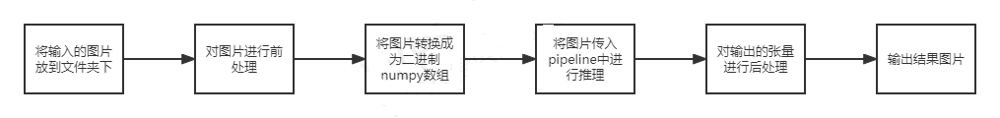
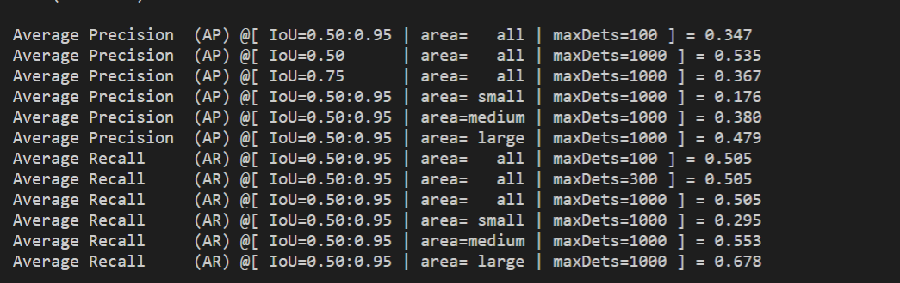

# FCOS

## 1 介绍

本开发项目演示FCOS模型实现目标检测。本系统基于mxVision SDK进行开发，以昇腾Atlas310、Atlas310B卡为主要的硬件平台，主要实现目标检测。待检测的图片中物体不能被遮挡太严重，并且物体要完全出现在图片中。图片亮度不能过低。输入一张图片，最后会输出图片中能检测到的物体。项目主要流程：

1.环境搭建；
2.模型转换；
3.生成后处理插件；
4.进行精度、性能对比。

### 1.1支持的产品

本产品以昇腾310（推理）、310B（推理）卡为硬件平台。

### 1.2支持的版本

该项目支持的SDK版本为5.0.RC1，CANN版本昇腾Atlas310卡使用6.3.RC1，Atlas310B卡使用6.2.RC1。。。

### 1.3软件方案介绍

基于MindXSDK的FCOS目标检测的业务流程为：

1. 将待检测的图片放到相应的文件夹下。
2. 首先使用mmcv库对图片进行前处理（改变图片大小、归一化、补边操作）。‘
3. 将图片转换成为二进制的numpy数组，传入pipeline中。
4. 放缩后的图片输入模型推理插件mxpi_tensorinfer进行处理；
5. 将经过模型推理输出时候的张量数据流输入到mxpi_objectpostprocessor中，对FCOS目标检测模型推理输出的张量进行后处理；
6. 处理完毕之后将数据传入mxpi_dataserialize0插件中，将stream结果组装成json字符串输出。

下表为系统方案各个子系统功能的描述：

| 序号 | 子系统     | 功能描述                                                                                                               |
| ---- | ---------- | ---------------------------------------------------------------------------------------------------------------------- |
| 1    | 图片输入   | 传入图片，修改图片的大小和格式为符合模型要求的格式                                                                     |
| 2    | 图像前处理 | 对图片进行改变大小、补边、归一化等操作。                                                                               |
| 3    | 模型推理   | 将已经处理好的图片传入到mxpi_tensorinfer中，使用目标检测模型FCOS进行推理，得到推理的张量数据流                         |
| 4    | 模型后处理 | 将模型推理得到的张量数据流传入mxpi_objectpostprocessor中进行张量后处理。对模型输出的目标框进行去重，排序和筛选等工作。 |
| 5    | 组装字符串 | stream结果组装成json字符串输出。                                                                                       |

### 1.4代码目录结构与说明

本项目名为FCOS目标检测，项目的目录如下所示：

```
|- models
|	|- fcos.onnx				//onnx模型
|	|_ Fcos_tf_bs.cfg
|- pipeline
|	|_ FCOSdetection.pipeline
|- plugin
|	|_FCOSPostprocess
|		|- CMakeLists.txt
|		|- FCOSDetectionPostProcess.cpp
|		|- FCOSDetectionPostProcess.h
|		|_ build.sh
|- image
|   |- image1.png
|   |_ image2.png
|- build.sh
|- evaluate.py
|- colorlist.txt
|_ main.py
```

### 1.5技术实现流程图

本项目实现对输入的图片进行目标检测，整体流程如下：



### 1.6特性以及适用场景
本项目是根据COCO数据集进行训练，仅仅适合COCO官方数据集中的80类物体进行识别。在此这八十类物体不一一列出。
## 2环境依赖

推荐系统为ubuntu 18.04,环境软件和版本如下：

| 软件名称            | 版本   | 说明                          | 获取方式                                                          |
| ------------------- | ------ | ----------------------------- | ----------------------------------------------------------------- |
| MindX SDK           | 5.0.RC1  | mxVision软件包                | [点击打开链接](https://www.hiascend.com/software/Mindx-sdk)       |
| ubuntu              | 18.04  | 操作系统                      | 请上ubuntu官网获取                                                |
| Ascend-CANN-toolkit | 310使用6.3.RC1，310B使用6.2.RC1  | Ascend-cann-toolkit开发套件包 | [点击打开链接](https://www.hiascend.com/software/cann/commercial) |
| mmdetection         | 2.25.0 | 用于评估准确度                | 请上mmdetection官网                                               |

在项目开始运行前需要设置环境变量：

```
. /usr/local/Ascend/ascend-toolkit/set_env.sh
. ${SDK安装路径}/mxVision/set_env.sh
```

## 3 软件依赖

项目运行过程中涉及到的第三方软件依赖如下表所示：

| 软件名称    | 版本   | 说明                 | 使用教程                                                  |
| ----------- | ------ | -------------------- | --------------------------------------------------------- |
| pycocotools | 2.0.0  | 用于实现代码测评     | [点击打开链接](https://cocodataset.org/)                  |
| mmdetection | 2.25.0 | 用于实现模型精度评估 | [点击打开链接](https://github.com/open-mmlab/mmdetection) |
| mmcv        | 1.3.17 | 用于实现图片前处理   | [点击打开链接](https://github.com/open-mmlab/mmcv)        |

.安装python COCO测评工具,mmcv和mmdetection。执行命令：

```
pip3 install pycocotools
pip3 install mmcv-full
pip3 install mmdet
```

## 4 模型转换

本项目使用的模型是FCOS目标检测模型这个模型是一个无anchor检测器。FCOS直接把预测特征图上的每个位置$(x,y)$当作训练样本，若这个位置在某个ground truth box的内部，则视为正样本，该位置的类别标签$c$对应这个box的类别，反之则视为负样本。这个网络的输出为目标框的左上角坐标、右下角坐标、类别和置信度。本项目的onnx模型可以直接[下载](https://mindx.sdk.obs.cn-north-4.myhuaweicloud.com/mindxsdk-referenceapps%20/contrib/Fcos/ATC%20Fcos.zip)。下载后，里面自带的om模型是可以直接使用的，或者自行使用ATC工具将onnx模型转换成为om模型，模型转换工具的使用说明参考[链接](https://gitee.com/ascend/docs-openmind/blob/master/guide/mindx/sdk/tutorials/%E5%8F%82%E8%80%83%E8%B5%84%E6%96%99.md)。

模型转换步骤如下：

1.从下载链接处下载onnx模型至FCOS/models文件夹下。

2.进入models文件夹目录下，设置环境变量如下：

```
. /usr/local/Ascend/ascend-toolkit/set_env.sh   # Ascend-cann-toolkit开发套件包默认安装路径，根据实际安装路径修改
```

设置完环境变量之后，就进行模型的转换：

模型转换语句如下，注意若推理芯片为310B，需将atc-env脚本中模型转换atc命令中的soc_version参数设置为Ascend310B1。

```
atc --model=fcos.onnx --framework=5 --soc_version=Ascend310 --input_format=NCHW --input_shape="input:1,3,800,1333" --output=fcos_bs1 --precision_mode=allow_fp32_to_fp16
```

执行完该命令之后，会在models文件夹下生成.om模型，并且转换成功之后会在终端输出：

```
ATC start working now, please wait for a moment.
ATC run success, welcome to the next use.
```


## 5准备

### 步骤1

准备一张待检测图片，并上传到FCOS文件夹下。然后修改main.py文件里面的图片路径为待检测的图片路径。并且从https://github.com/pjreddie/darknet/blob/master/data/coco.names   里面下载coco.names文件，并且将这个文件存放到models文件夹下。并且修改main.py里IMAGENAME为图片的路径：
```python
IMAGENAME = '{image path}'
```
### 步骤2

进入FCOS/plugin/FCOSPostprocess目录，在该目录下运行下列命令：

```
bash build.sh
```
这个后处理插件即可以使用。

## 6编译与运行

在FCOS目录下执行命令：

```
python3 main.py
```

最后生成的结果会在FCOS文件夹目录下result.jpg图片中。

## 7精度测试

1.下载COCO VAL 2017[数据集](http://images.cocodataset.org/zips/val2017.zip
)和[标注文件](http://images.cocodataset.org/annotations/annotations_trainval2017.zip
)。在FCOS目录下创建dataset目录，将数据集压缩文件和标注数据压缩文件都解压至 `FCOS/dataset` 目录下。再次创建一个文件夹名为binresult，在FCOS目录下。确保解压后的FCOS目录结构为：

```
|- models
|	|- fcos.onnx				//onnx模型
|	|_ Fcos_tf_bs.cfg
|- pipeline
|	|_ FCOSdetection.pipeline
|- plugin
|	|_FCOSPostprocess
|		|- CMakeLists.txt
|		|- FCOSDetectionPostProcess.cpp
|		|- FCOSDetectionPostProcess.h
|		|_ build.sh
|- binresult
|- dataset
|	|- annotations
|	|	|_ instances_val2017.json
|	|_ val2017
|		|-000000581615.jpg
|		|-000000581781.jpg
|		|_other-images
|- image
|   |- image1.png
|   |_ image2.png
|- build.sh
|- colorlist.txt
|- evaluate.py
|_ main.py
```

2.再修改后处理插件cpp文件中的：
```cpp
    //107行
    if (*(beginRes + CENTERPOINT) < THRESHOLD_) {
      continue;
    }
    //123行
    MxBase::NmsSort(objectInfo, RATE);
```
将上面的代码全部注释掉，再重新生成一次插件。

3.执行命令：

```
python3 evaluate.py
```

命令执行完毕之后，会在binresult文件夹，生成模型输出的目标框、置信度等信息。

4.最后在终端输出COCO格式的测评结果，输出结果如下：



上图中第一行可以看到，这个模型在COCO VAL 2017数据集上，IOU阈值为0.50:0.05:0.95时的精确度为0.347。原模型的推理精度也为0.347这个数据与原模型的推理精度误差范围在0.01内。

## 8常见问题
### 8.1 模型路径配置问题：
问题描述：
检测过程中用到的模型以及模型后处理插件需配置路径属性。

后处理插件以及模型推理插件配置例子：

```json
// 模型推理插件
            "mxpi_tensorinfer0": {
                "props": {
                    "dataSource": "mxpi_imageresize0",
                    "modelPath": "./models/fcos_bs1.om"
                },
                "factory": "mxpi_tensorinfer",
                "next": "mxpi_objectpostprocessor0"
            },
// 模型后处理插件
            "mxpi_objectpostprocessor0":{
                "props": {
                    "dataSource" : "mxpi_tensorinfer0",
                    "postProcessConfigPath": "./models/Fcos_tf_bs.cfg",
                    "postProcessLibPath": "libFCOSDetectionPostProcess.so"
                },
                "factory": "mxpi_objectpostprocessor",
                "next": "mxpi_dataserialize0"
            },
```
