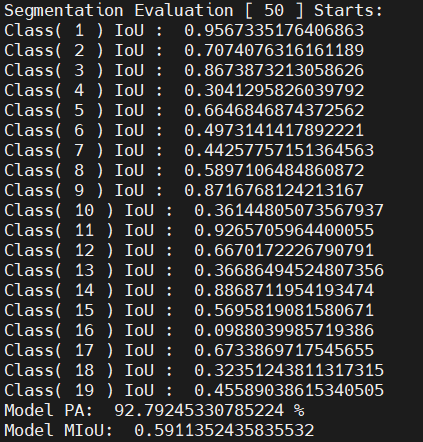
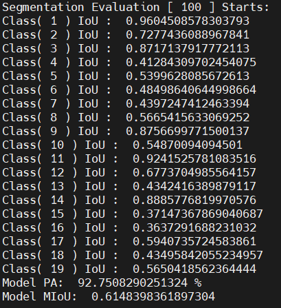
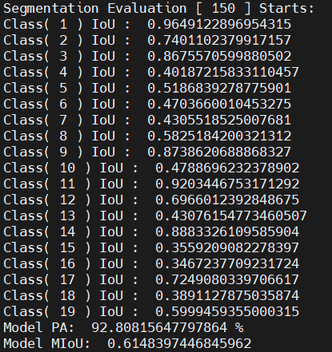

# FastSCNN语义分割参考设计

## 1 介绍
   使用fastscnn模型，在MindxSDK环境下实现语义分割功能
   由用户设置测试图片，传入到pipeline中先后实现前处理，模型推理，后处理等功能，最终输出结果图片实现可视化

    Fast-SCNN 是一个面向实时的语义分割网络。 在双分支的结构基础上，大量使用了深度可分离卷积和逆残差模块，并且使用特征融合构造金字塔池化模块来融合上下文信息。

### 1.1 支持的产品

本项目以昇腾Atlas310卡为主要的硬件平台

### 1.2 支持的版本


CANN：5.0.2
SDK：mxVision 2.02（可通过cat SDK目录下的version.info查看）


### 1.3 软件方案介绍

项目主要由主函数，测试集，模型，测试图片组成。
主函数中构建业务流steam读取图片，通过pipeline在sdk环境下先后实现图像解码，图像缩放，模型推理的功能，
最后从流中取出相应的输出数据进行涂色保存结果并测试精度。

表1.1 系统方案中各模块功能：

| 序号 | 模块          | 功能描述                                                     |
| ---- | ------------- | ------------------------------------------------------------ |
| 1    | appsrc        | 向Stream中发送数据，appsrc将数据发给下游元件                 |
| 2    | imagedecoder  | 用于图像解码，当前只支持JPG/JPEG/BMP格式                     |
| 3    | imageresize   | 对解码后的YUV格式的图像进行指定宽高的缩放，暂时只支持YUV格式的图像 |
| 4    | tensorinfer   | 对输入的张量进行推理                                         |
| 5    | dataserialize | 将stream结果组装成json字符串输出                             |
| 6    | appsink       | 从stream中获取数据                                           |
| 7    | color         | 通过分辨出的不同类别进行上色                                 |
| 8    | evaluation    | 模型精度评估，输出Model MIoU和 Model MPA                     |


### 1.4 代码目录结构与说明

本工程名称为FastSCNN，工程目录如下图所示：     

```
├── main.py  //运行工程项目的主函数
├── evaluate.py   //评测精度函数
├── label.py      //分类label函数
├── text.pipeline      //pipeline
├── model   //存放模型文件
|   ├──aipp_FastSCnn.aippconfig     //预处理配置文件
├── evaluation_50.png          //50
├── evaluation_100.png        // 100
├── evaluation_150.png        // 150
├── 流程.png          //流程图
├── pipeline.png          //pipeline流程图
└──README.md          
```

##    1.5 技术实现流程图

            FastSCNN语义分割模型的后处理的输入是mxpi_tensor0推理结束后通过appsink0输出的tensor数据，尺寸为[1*19*1024*2048]，将张量数据通过pred取出推测的结果值，argmax函数确定每个像素点概率最大的类型。每一类的rgb数值存在于cityscapepallete数组中，查找每个像素点的类型进行上色，最后将像素点组成的图片保存成result.jpg。

实现流程图如下图所示：


​            

## 2 环境依赖


推荐系统为ubantu 18.04，环境依赖软件和版本如下表：

| 软件名称 | 版本   |
| -------- | ------ |
| python   | 3.7.5  |
| cv2      | 4.5.3  |
| numpy    | 1.21.1 |


在编译运行项目前，需要设置环境变量：
- 环境变量介绍


- MX_SDK_HOME 指向SDK安装包路径
- LD_LIBRARY_PATH  用于指定查找共享库（动态链接库）时除了默认路径之外的其他路径。
- PYTHONPATH   Python中一个重要的环境变量，用于在导入模块的时候搜索路径
- GST_PLUGIN_SCANNER   用于查找plugin相关的依赖和库
- GST_PLUGIN_PATH      用于查找plugin相关的依赖和库
  

  
  

具体执行命令

```
export MX_SDK_HOME=${自己的SDK安装包路径}  

export LD_LIBRARY_PATH=${MX_SDK_HOME}/python:${MX_SDK_HOME}/lib:${MX_SDK_HOME}/opensource/lib:${MX_SDK_HOME}/opensource/lib64:${CANN包安装路径}/acllib/lib64:/usr/local/Ascend/driver/lib64

export PYTHONPATH=/usr/local/Ascend/ascend-toolkit/latest/pyACL/python/site-packages/acl:${MX_SDK_HOME}/python:/usr/local/Ascend/ascend-toolkit/latest/pyACL/python/site-packages/acl:${MX_SDK_HOME}/python/usr/local/Ascend/ascend-toolkit/latest/pyACL/python/site-packages/acl

export GST_PLUGIN_SCANNER=${MX_SDK_HOME}/opensource/libexec/gstreamer-1.0/gst-plugin-scanner
export GST_PLUGIN_PATH=${MX_SDK_HOME}/opensource/lib/gstreamer-1.0:${MX_SDK_HOME}/lib/plugins

```


注：latest是软连接，这里指向CANN5.0.2版本

## 3.模型转换

      本项目使用的模型是FastSCNN模型。
    
      选用的模型为pytorch模型，获取权重文件方法：可从Ascend modelzoo FastSCNN_ACL_Pytorch 模型压缩包获取
    
      在运行项目之前需要姜pytorch模型转为onnx模型，参考实现代码
[转模型](https://gitee.com/ascend/modelzoo/tree/master/contrib/ACL_PyTorch/Research/cv/segmentation/FastSCNN#31-pth%E8%BD%ACom%E6%A8%A1%E5%9E%8B)
pth权重文件和onnx文件的下载链接如下：
[models](https://mindx.sdk.obs.cn-north-4.myhuaweicloud.com/mindxsdk-referenceapps%20/contrib/FastScnn/models.zip)

      再由onnx模型转为om模型，模型转换工具（ATC）相关介绍如下：https://support.huaweicloud.com/tg-cannApplicationDev330/atlasatc_16_0005.html 。
    
    步骤如下：

1. 下载上述models压缩包，获取best_model.pth和fast_scnn_bs1.onnx模型文件放置FastSCNN/model目录下。

2. 设置环境变量用以使用atc工具：

   ```
   export install_path=/usr/local/Ascend/ascend-toolkit/latest
   export PATH=/usr/local/python3.7.5/bin:${install_path}/atc/ccec_compiler/bin:${install_path}/atc/bin:$PATH
   export PYTHONPATH=${install_path}/atc/python/site-packages:$PYTHONPATH
   export LD_LIBRARY_PATH=${install_path}/atc/lib64:${install_path}/acllib/lib64:$LD_LIBRARY_PATH:$LD_LIBRARY_PATH
   export ASCEND_OPP_PATH=${install_path}/opp
   ```

   

3. 进入FastSCNN/model文件夹下执行命令：

   ```
   atc --framework=5 --model=fast_scnn_bs1.onnx --output=fast_scnn_bs1  --output_type=FP16 --input_format=NCHW --insert_op_conf=./aipp_FastSCnn.aippconfig.aippconfig --input_shape="image:1,3,1024,2048" --log=debug --soc_version=Ascend310 
   ```

4. 执行该命令会在当前目录下生成项目需要的模型文件fast_scnn_bs1.om。执行后终端输出为：

   ```
   ATC start working now, please wait for a moment.
   ATC run success, welcome to the next use.
   ```

   表示命令执行成功。

   

## 4.编译与运行

当已有模型的om文件，存在./model/下

**步骤 1**  将任意一张jpg格式的图片存到当前目录下(/FastSCNN)，命名为test.jpg。如果pipeline文件（或测试图片）不在当前目录下（/FastSCNN），需要修改main.py的pipeline（或测试图片）路径指向到所在目录。

**步骤 2**  设置环境变量，如第2小节**环境依赖**所述，设置MX_SDK_HOME，LD_LIBRARY_PATH，PYTHONPATH，GST_PLUGIN_SCANNER，GST_PLUGIN_PATH五个环境变量。

**步骤 3**   按照模型转换获取om模型，放置在FastSCNN/models路径下。若未从 pytorch 模型自行转换模型，使用的是上述链接提供的 onnx 模型或者 om 模型，则无需修改相关文件，否则修改 main.py 中pipeline的相关配置，将 mxpi_tensorinfer0 插件 modelPath 属性值中的 om 模型名改成实际使用的 om 模型名；将 mxpi_imageresize0 插件中的 resizeWidth 和 resizeHeight 属性改成转换模型过程中设置的模型输入尺寸值(原尺寸为2048*1024)。

**步骤 4**  在命令行输入 如下代码运行整个工程：

```
python3.7.5 main.py
```

**步骤 5** 图片检测。运行结束输出result.jpg实现语义分割功能（通过不同颜色区分不同事物）。


##### 测试精度：

**步骤 1** 安装数据集用以测试精度。数据集cityscapes需要下载到当前目录，下载路径为：https://mindx.sdk.obs.cn-north-4.myhuaweicloud.com/mindxsdk-referenceapps%20/contrib/FastScnn/dataset.zip
将标注文件压缩文件解压至FastSCNN/目录下。确保下载完数据集和标注文件后的目录结构为如下：

```
├── main.py  //运行工程项目的主函数
├── evaluate.py   //评测精度函数
├── label.py      //分类label函数
├── text.pipeline      //pipeline
├── model   //存放模型文件
|   ├──best_model.pth     //权重文件
|   ├──aipp_FastSCnn.aippconfig     //预处理配置文件
|   └──fast_scnn_bs1.om         //生成的om文件
├── evaluation_50.png          //50
├── evaluation_100.png        // 100
├── evaluation_150.png        // 150
├── 流程.png          //流程图
├── pipeline.png          //pipeline流程图
├──cityscapes             //数据集
|  ├── gtFine
|   |   ├──test
|   |   ├──train
|   |   └──val
|   |
|   └── leftImg8bit
|       ├──test
|       ├──train
|       └──val
└──README.md    
```

**步骤 2** 进入数据集的某个文件夹作为测试集（此处以cityscapes/leftImg8bit/val/frankfurt/为例），进入frankfurt文件夹，需要用户将png格式转成jpg格式保存在当前目录下。

```
cd cityscapes/leftImg8bit/val/frankfurt/
```

**步骤 3** 进入标签集gtFine相应的文件夹下。

```
cd ${用户路径}/FastSCNN/cityscapes/gtFine/val/frankfurt/
```

           在当前目录上传label.py用以挑选后缀为labelIds的文件。
    
            运行label.py。

```
python3.7.5 label.py
```

**步骤 4** 运行结束会在当前目录下新生成四个文件夹，将labelIds.png命名的文件夹重命名为label。这里可以重新点击一下文件排序，确保leftImg8bit的frankfurt中的文件和gtFine下frankfurt/label中的文件排序一致，一一对应。

**步骤 5** 回到工程目录下

```
cd ${用户路径}/FastSCNN
```

           点进evaluate.py，修改路径如下：

```
for filename in os.listdir("./cityscapes/leftImg8bit/val/frankfurt"):
        with open("./cityscapes/leftImg8bit/val/frankfurt/" + filename, 'rb') as f:
            imgpath = "./cityscapes/gtFine/val/frankfurt/label/" + filename.split('_')[0] + '_' + filename.split('_')[1] + '_' +filename.split('_')[2] + "_gtFine_labelIds.png"
```

**步骤 6**  测试精度（mIoU，PA）运行结束在显示屏输出精度，如下图所示：



                       测试50张



                       测试100张



                       测试150张