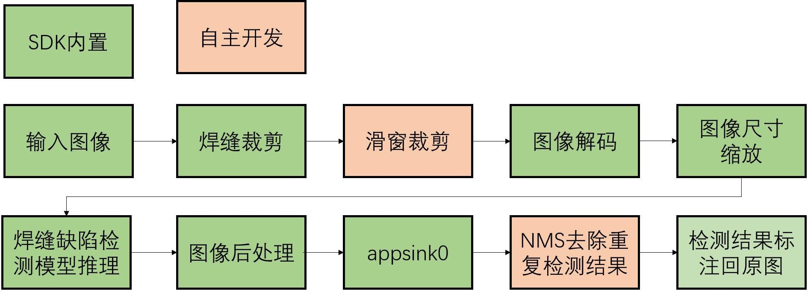
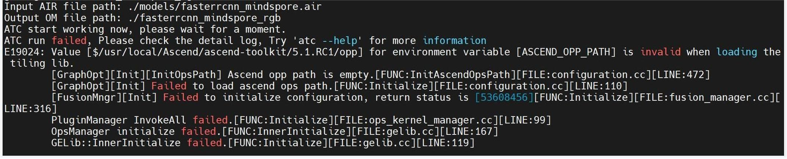

# X射线图像焊缝缺陷检测

## 1. 介绍
在本系统中，目的是基于MindX SDK，在昇腾平台上，开发端到端X射线图象焊缝缺陷检测的参考设计，实现对图像中的焊缝缺陷进行缺陷类别识别的功能，并把可视化结果保存到本地，达到功能要求。

样例输入：带有已裁剪出焊缝的jpg图片。

样例输出：框出并标有缺陷类型与置信度的jpg图片。

### 1.1 支持的产品

本项目以昇腾Atlas310卡为主要的硬件平台。

### 1.2 支持的版本

支持的SDK版本为 2.0.4, CANN 版本为 5.1.1。

版本号查询方法，在Atlas产品环境下，运行命令：

```
npu-smi info
```

可以查询支持SDK的版本号

### 1.3 软件方案介绍

本方案中，会先根据已有的焊缝图片和焊缝xml标注文件，将焊缝裁剪出来，之后在进行滑窗裁剪处理，然后将处理好的图片通过 appsrc 插件输入到业务流程中，最终根据Faster—RCNN模型识别得到缺陷类别和置信度生成框输出标有缺陷类别与置信度的jpg图片。

表1.1 系统方案各子系统功能描述：

| 序号 | 子系统         | 功能描述                                                     |
| ---- | -------------- | ------------------------------------------------------------ |
| 1    | 图片输入       | 获取 jpg 格式输入图片                                        |
| 2    | 图片解码       | 解码图片                                                     |
| 3    | 图片缩放       | 将输入图片放缩到模型指定输入的尺寸大小                       |
| 4    | 模型推理       | 对输入张量进行推理                                           |
| 5    | 目标检测后处理 | 从模型推理结果计算检测框的位置和置信度，并保留置信度大于指定阈值的检测框作为检测结果 |
| 6    | 结果输出       | 获取检测结果                                                 |
| 7    | 结果可视化     | 将检测结果标注在输入图片上                                   |

### 1.4 代码目录结构与说明

本工程名称为 Faster_R-CNN，工程目录如下所示：

```
.
├── images                               # README文件内的图片
│   ├── DetectionPipeline.png
│   ├── EvaluateInfo.png
│   ├── EvaluateInfoPrevious.png
│   ├── warning.png
│   └── VersionError.png
├── postprocess                          # 后处理插件
│   ├── build.sh                         # 后处理编译所需环境变量可参考该文件
│   ├── CMakeLists.txt
│   ├── FasterRcnnMindsporePost.cpp
│   └── FasterRcnnMindsporePost.h
├── python
│   ├── Main
│   │   ├── main.py
│   │   ├── eval.py
│   │   ├── infer.py
│   │   ├── eval_by_sdk.py
│   │   ├── config.py
│   │   ├── util.py
│   │   ├── draw_predict.py
│   │   ├── cut_and_crop.py
│   │   └── postprocess.py
│   ├── models
│   │   ├── aipp-configs
│   │   │   ├── aipp.cfg               # sdk做图像预处理aipp配置文件
│   │   │   └── aipp_rgb.cfg           # opencv做图像预处理aipp配置文件
│   │   ├── conversion-scripts         # 转换前后模型所放的位置   
│   │   ├── convert_om.sh              # 模型转换相关环境变量配置可参考该文件
│   │   ├── coco2017.names             # 支持的缺陷类别
│   │   ├── fasterrcnn_coco2017.cfg    # 高性能要求配置
│   │   └── fasterrcnn_coco2017_acc_test.cfg         # 高精度要求配置             
│   ├── data    
│   │   ├── test                       # 用于测试该系统功能的数据集目录
│   │   │   ├── origin_img             # 原始焊缝图像存放目录
│   │   │   ├── origin_xml             # 原始焊缝图像中焊缝标注框位置信息xml文件存放目录
│   │   │   ├── infer_result           # 小图(滑窗裁剪后的图片)推理结果所在目录
│   │   │   ├── draw_result            # 最终推理结果的可视化
│   │   │   ├── cut                    # 裁剪出的焊缝图片所在目录
│   │   │   ├── crop                   # 滑窗裁剪后的小图片所在目录
│   │   │   ├── img_txt                # 小图推理结果txt格式
│   │   │   ├── img_huizong_txt        # 还原到焊缝图片上的未经过nmx去重的标注框信息
│   │   │   └── img_huizong_txt_nms    # 最终推理结果标注框信息(txt格式)
│   │   ├── eval                       # 用于精度测试的数据集
│   │   │   ├── cocodataset
│   │   │   ├── VOCdevkit
│   └── pipeline
│       ├── fasterrcnn_ms_dvpp.pipeline           # sdk做图像预处理
│       └── fasterrcnn_ms_acc_test.pipeline       # opencv做图像预处理
└── README.md
```

### 1.5 技术实现流程图

<center>
    
    <br>
</center>

### 1.6 特性及适用场景

经过测试，在现有数据集的基础上，该项目检测算法可以检测八种焊缝缺陷：气孔、裂纹、夹渣、未熔合、未焊透、咬边、内凹、成形不良，关于缺陷召回率和MAP分数在后续内容中将会提到。本项目属于工业缺陷中焊缝缺陷检测领域，主要针对DR成像设备（数字化X射线成像设备）拍摄金属焊接处成像形成的焊接X射线图像进行缺陷检测。

## 2. 环境依赖

推荐系统为ubuntu 18.04，环境依赖软件和版本如下表：

|   软件名称    |   版本   |
| :-----------: | :------: |
|    ubantu     |  18.04   |
|   MindX SDK   |  2.0.4   |
|    Python     |  3.9.2   |
|     CANN      | 5.1.RC1  |
|     numpy     |  1.23.3  |
| opencv-python | 4.6.0.66 |
|  pycocotools  |  2.0.5   |

确保环境中正确安装mxVision SDK。

在编译运行项目前，需要设置环境变量：

MindSDK 环境变量:

```
. ${SDK-path}/set_env.sh
```

CANN 环境变量：

```
. ${ascend-toolkit-path}/set_env.sh
```

- 环境变量介绍

```
SDK-path: mxVision SDK 安装路径
ascend-toolkit-path: CANN 安装路径。
```

## 3. 模型转换

本项目中采用的模型是 Faster—RCNN模型，参考实现代码：https://www.hiascend.com/zh/software/modelzoo/models/detail/C/8d8b656fe2404616a1f0f491410a224c/1


1. 将训练好的模型 fasterrcnn_mindspore.air 移至 ``python/models/conversion-scripts`` 文件夹下。


2. 将该模型转换为om模型，具体操作为： ``python/models`` 文件夹下,执行指令：

```
bash convert_om.sh conversion-scripts/fasterrcnn_mindspore.air aipp-configs/aipp.cfg conversion-scripts/fasterrcnn_mindspore_dvpp
或：
bash convert_om.sh conversion-scripts/fasterrcnn_mindspore.air aipp-configs/aipp_rgb.cfg conversion-scripts/fasterrcnn_mindspore_rgb
```

**注：**转换后的rgb模型会用OpenCV方式进行推理，拥有的更高的精度。

## 4. 编译与运行
**步骤1** 编译后处理插件

切换到``postprocess``目录下，执行命令：

```
bash build.sh
chmod 640 ./build/libfasterrcnn_mindspore_post.so
```

**步骤2** 准备测试图片

分别在``python/data/test/origin_img/``和``python/data/test/origin_xml/``目录下放好待检测的焊缝图片和带有焊缝标注框信息的xml文件。

**步骤3** 图片检测

切换到``python/Main``目录下，执行命令：

```
# 进行焊缝裁剪和滑窗裁剪处理
python3 cut_and_crop.py

# 进行推理
python3 main.py --img_path ../data/test/crop/ --pipeline_path ../pipeline/fasterrcnn_ms_dvpp.pipeline --model_type dvpp

# 进行nms去重并还原到原图
python3 postprocess.py
```

命令执行成功后在目录``python/data/test/draw_result``下生成检测结果文件 。

**步骤4** 精度测试

1. 使用rgb模型对图片进行推理，切换到``python/Main``目录下，执行命令：

   ```
   python3 main.py --img_path ../data/eval/cocodataset/val2017/ --pipeline_path ../pipeline/fasterrcnn_ms_acc_test.pipeline --model_type rgb --infer_mode eval --ann_file ../data/eval/cocodataset/annotations/instances_val2017.json
   ```

2. 因为涉及到去重处理，每种缺陷需要分开评估精度，切换到``python/Main``目录下，执行命令：

   ```
   python3 eval.py --cat_id 1 --object_name "qikong"
   ```

   **注：**cat_id为缺陷标签，object_name为对应缺陷名称，在 ``python/models/coco2017.names``可查看缺陷类别。

   | 缺陷种类 |   AP   | Recall |
   | :------: | :----: | :----: |
   |   气孔   | 0.8480 | 1.0000 |
   |   夹渣   | 0.6865 | 1.0000 |
   |   裂纹   | 0.8638 | 1.0000 |
   |   咬边   | 0.7698 | 1.0000 |
   |  未熔合  | 0.7086 | 1.0000 |
   |  未焊透  | 0.9347 | 1.0000 |
   | 成形不良 | 0.5000 | 1.0000 |
   |   内凹   | 1.0000 | 1.0000 |

## 5. 常见问题

### 5.1 后处理插件权限问题

运行检测 demo 和评测时都需要将生成的Faster_R-CNN后处理动态链接库的权限修改，否则将会报权限错误，如下图所示：

<center>
    
    <br>
</center>

**解决方案：**

切换到``postprocess``目录下，执行命令：

```
chmod 640 ./build/libfasterrcnn_mindspore_post.so
```

### 5.2 模型转换问题

运行模型转换命名后报错：

<center>
    
    <br>
</center>

环境变量设置时加了“$”符号。

**解决方案：**

参考build.sh中环境变量设置，并去掉“$”符号。
