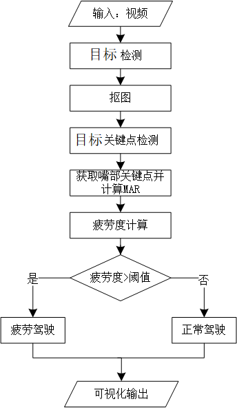

# 疲劳驾驶识别（Fatigue driving recognition）

## 1 介绍
本开发样例演示驾驶人员疲劳状态识别系统（Fatigue driving recognition），供用户参考。本系统基于mxVision SDK进行开发，以昇腾Atlas300卡为主要的硬件平台，实现在驾驶环境下驾驶人员疲劳状态识别与预警。

项目的整体流程如下：

1. 利用人脸检测模型采集视频中的人脸图像
2. 利用PFLD模型进行人脸关键点检测，获取眼部位置信息
3. 通过计算度量疲劳/瞌睡的物理量识别驾驶人员的疲劳状态

### 1.1 支持的产品

本项目以昇腾Atlas310卡为主要的硬件平台。

### 1.2 支持的版本

支持的SDK版本为2.0.2，版本号查询方法：在Atlas产品环境下，运行命令：

```
npu-smi info
```

### 1.3 软件方案介绍

请先总体介绍项目的方案架构。如果项目设计方案中涉及子系统，请详细描述各子系统功能。如果设计了不同的功能模块，则请详细描述各模块功能。

表1.1 系统方案中各模块功能描述：

| 序号 |      子系统      | 功能描述                                                     |
| :--: | :--------------: | :----------------------------------------------------------- |
|  1   |     视频输入     | 调用MindX SDK的mxpi_rtspsrc插件对视频数据进行拉流            |
|  2   |     视频解码     | 调用MindX SDK的mxpi_videodecoder进行视频解码                 |
|  3   |     图像放缩     | 调用MindX SDK的mxpi_imageresize进行图像缩放                  |
|  4   |     人脸检测     | 利用yolov4的检测模型检测出图片中的人脸                       |
|  5   |  人脸检测后处理  | 调用yolov4模型后处理插件对检测结果进行后处理                 |
|  6   |     裁剪图片     | 调用MindX SDK的mxpi_imagecrop进行图像裁剪                    |
|  7   |  人脸关键点检测  | 利用PFLD检测模型检测出图片中人脸的106个关键点                |
|  8   | 人脸关键点后处理 | 根据PFLD模型的检测结果进行后处理，获取嘴部相关关键点以及嘴部纵横比信息 |
|  9   |     结果输出     | 输出驾驶人员的疲劳状态并进行可视化输出                       |

### 1.4 代码目录结构与说明

本sample工程名称为 **FatigueDrivingRecognition**，工程目录如下图所示：

```

```


### 1.5 技术实现流程图

本项目实现在驾驶环境下驾驶人员疲劳状态识别与预警，首先利用人脸检测模型采集视频中的人脸图像，然后利用PFLD模型进行人脸关键点检测，获取嘴部位置信息，并通过计算度量疲劳/瞌睡的物理量识别驾驶人员的疲劳状态，从而实现有效的疲劳驾驶预警。整体流程如下图所示。



## 2 环境依赖

推荐系统为ubantu 18.04，环境依赖软件和版本如下表：

| 软件名称 | 版本  |
| -------- | ----- |
| cmake    | 3.5+  |
| mxVision | 2.0.2 |
| python   | 3.7.5 |

确保环境中正确安装mxVision SDK。

在编译运行项目前，需要设置环境变量：

```
export MX_SDK_HOME=${SDK安装路径}/mxVision
export LD_LIBRARY_PATH="${MX_SDK_HOME}/lib:${MX_SDK_HOME}/opensource/lib:${LD_LIBRARY_PATH}"
export PYTHONPATH="${MX_SDK_HOME}/python:${PYTHONPATH}"
export GST_PLUGIN_SCANNER="${MX_SDK_HOME}/opensource/libexec/gstreamer-1.0/gst-plugin-scanner"
export GST_PLUGIN_PATH="${MX_SDK_HOME}/opensource/lib/gstreamer-1.0:${MX_SDK_HOME}/lib/plugins"
```

- 环境变量介绍

```
MX_SDK_HOME: mxVision SDK 安装路径
LD_LIBRARY_PATH: lib库路径
PYTHONPATH: python环境路径
```

## 3 模型转换

##### 2.1 模型与软件依赖

所用模型为yolov4模型与PFLD模型：

* yolov4为已经转换好的om模型，可通过[百度云链接](https://pan.baidu.com/s/1NDDNqANNjFwqeacCHN2_9w)（提取码：36d9）获取，解压后的yolov4文件夹中包含yolov4模型及其相应的coco.names和cfg文件。
* PFLD模型为[github项目](https://github.com/Hsintao/pfld_106_face_landmarks)中提供的模型

转换PFLD模型所需软件依赖如下表所示。

| 软件名称 | 版本  | 获取方式                                                     |
| -------- | ----- | ------------------------------------------------------------ |
| pytorch  | 1.2.0 | [pytorch官网](https://pytorch.org/get-started/previous-versions/) |
| ONNX     | 1.7.0 | pip install onnx==1.7.0                                      |

##### 2.2 pth文件转换为onnx文件

1. 若尝试pth文件转换为onnx文件，可获取[原项目](https://github.com/Hsintao/pfld_106_face_landmarks)代码，下载至本地。安装环境依赖**requirements.txt**在原项目中已给出。
2. 将原项目中的pytorch2onnx.py文件替换成本项目中的ModelTransformation/pytorch2onnx.py文件。运行：

```
python pytorch2onnx.py
```

转换完成后权重文件pfld_106.onnx上传至服务器任意目录下。

##### 2.3 onnx文件转换为om文件

将atc_env.sh中的HOME修改为onnx模型所在目录，运行atc_env.sh将onnx转为om模型，脚本中包含atc命令：

```
atc --framework=5 --model="${Home}"/pfld_106.onnx --output="${Home}"/pfld_106 --input_format=NCHW --insert_op_conf=./aipp_pfld_112_112.aippconfig  --input_shape="input_1:1,3,112,112" --log=debug --soc_version=Ascend310
```

运行命令如下：

```
bash atc-env.sh
```

提示 **ATC run success** 说明转换成功

## 4 编译与运行
**步骤1** 按照第 2 小节 **环境依赖** 中的步骤设置环境变量。

**步骤2** 按照第 3 小节 **模型转换** 中的步骤获得 om 模型文件，放置在本项目的 `model` 目录下。（model目录下有已经转换好的om文件，如果要直接利用，则跳过此步骤）

**步骤3** 编译。在项目目录下执行命令：

```
bash build.sh
```

**步骤4** 单个视频疲劳驾驶识别。

1. 按照第5小节 **软件依赖说明** 中的步骤安装live555并运行，将准备测试的264文件放到 `${Home_live555}/live/mediaServer/` 目录下，其中`Home_live555`为live555安装路径。
2. 根据[live555使用教程](https://gitee.com/ascend/mindxsdk-referenceapps/blob/master/docs/%E5%8F%82%E8%80%83%E8%B5%84%E6%96%99/Live555%E7%A6%BB%E7%BA%BF%E8%A7%86%E9%A2%91%E8%BD%ACRTSP%E8%AF%B4%E6%98%8E%E6%96%87%E6%A1%A3.md)确定264文件的rtsp_Url，将`pipeline/test_video.pipeline` 中`mxpi_rtspsrc0`中的`rtspUrl`属性中的264file_path修改为rtsp_Url。
3. 将`pipeline/test_video.pipeline` 中`mxpi_objectpostprocessor0`中的`postProcessLibPath`属性里的MX_SDK_HOME替换为mxVision SDK 安装路径。
4. 将下面命令中frame_num替换为测试的视频的帧数，并执行命令：

```
python3.7 test_video.py ${frame_num}
```

执行成功后终端会输出视频中是否存在疲劳驾驶，输出`Normal`为正常驾驶，输出`Fatigue!!!`为疲劳驾驶。可视化结果保存在`fatigue`文件夹中。

**步骤5** 性能测试。

1. 按照第5小节 **软件依赖说明** 中的步骤安装live555并运行，将准备测试的2个264文件放到 `${Home_live555}/live/mediaServer/` 目录下，其中`Home_live555`为live555安装路径。
2. 根据[live555使用教程](https://gitee.com/ascend/mindxsdk-referenceapps/blob/master/docs/%E5%8F%82%E8%80%83%E8%B5%84%E6%96%99/Live555%E7%A6%BB%E7%BA%BF%E8%A7%86%E9%A2%91%E8%BD%ACRTSP%E8%AF%B4%E6%98%8E%E6%96%87%E6%A1%A3.md)确定264文件的rtsp_Url，将`pipeline/test_video.pipeline` 中`mxpi_rtspsrc0`和`mxpi_rtspsrc1`中的`rtspUrl`属性中的264file_path1和264file_path2分别修改为两个264文件的rtsp_Url。
3. 将`pipeline/parallel_pipeline.pipeline` 中`mxpi_objectpostprocessor0`中的`postProcessLibPath`属性里的MX_SDK_HOME替换为mxVision SDK 安装路径。
4. parallel_update.py测试的是一定时间内每秒处理视频的平均帧数，根据需要修改parallel_update.py中的时间参数。
5. 将下面命令中的time替换为自己限制的测试时间，将frame_num1，frame_num2分别替换为两个测试的视频的帧数，并执行命令：

```
python3.7 parallel_update.py ${time} ${frame_num1} ${frame_num2}
```

命令执行成功后在当前目录下生成检测结果文件 performance.txt，查看结果文件查看处理速度信息。

**步骤6** 精度测试。

1. 下载测试数据集，可通过[百度云链接](https://pan.baidu.com/s/1NDDNqANNjFwqeacCHN2_9w)（提取码：36d9）获取，解压后包含一个yolov4文件夹，一个txt文件，和一个video文件夹。将解压出的label.txt文件上传到项目的当前目录。
2. 按照第5小节 **软件依赖说明** 中的步骤安装live555并运行，并新建一个文件夹`${Home_live555}/live/mediaServer/dataset` ，将上一步解压出的video文件夹中的264文件上传到 dataset文件夹下。其中`Home_live555`为live555安装路径。
3. 将`pipeline/test.pipeline` 中`mxpi_objectpostprocessor0`中的`postProcessLibPath`属性里的MX_SDK_HOME替换为mxVision SDK 安装路径。
4. 修改`run.sh`中的RTSP_URL修改为`rtsp://${host}:${port}/dataset`，其中`host`为服务器ip地址，`port`根据运行live555后终端显示的最后一行的提示进行确定。
5. 执行命令：

```
bash run.sh
```

命令执行成功后在当前目录下生成测试结果result.txt，终端显示precision和recall。

## 5 软件依赖说明

推理中涉及到第三方软件依赖如下表所示。

| 依赖软件 | 版本                      | 说明                                   |
| -------- | ------------------------- | -------------------------------------- |
| live555  | 1.09                      | 实现视频转rstp进行推流                 |
| ffmpeg   | 2021-08-08-git-ac0408522a | 实现mp4格式/avi格式视频转为264格式视频 |

注：1.[live555使用教程](https://gitee.com/ascend/mindxsdk-referenceapps/blob/master/docs/%E5%8F%82%E8%80%83%E8%B5%84%E6%96%99/Live555%E7%A6%BB%E7%BA%BF%E8%A7%86%E9%A2%91%E8%BD%ACRTSP%E8%AF%B4%E6%98%8E%E6%96%87%E6%A1%A3.md)

 2.[ffmpeg使用教程](https://gitee.com/ascend/mindxsdk-referenceapps/blob/master/docs/%E5%8F%82%E8%80%83%E8%B5%84%E6%96%99/pc%E7%AB%AFffmpeg%E5%AE%89%E8%A3%85%E6%95%99%E7%A8%8B.md)

## 6 常见问题

### 6.1 第一帧解码失败问题

**问题描述：**

运行测试代码后，会出现如下图所示的警告信息：


**解决方案：**

live555推流工具导致，不影响测试。

### 6.2 数据集问题

**问题描述：**

运行测试代码测试部分视频文件时，会出现如下图所示的警告信息：


**解决方案：**

部分视频文件中有不止一个人，人脸检测模型能检测出不止一个人脸，而除了驾驶人员之外的人脸较小，受mxpi_imagecrop插件对裁剪尺寸的限制，无法将小人脸裁剪出来，因此在测试时要注意测试视频中只包含驾驶人员一个人。

### 6.3 性能测试问题

**问题描述：**

性能测试时，修改测试时间运行python代码后，无输出结果。

**解决方案：**

测试代码测试的是一定时间内每秒平均可以处理的视频帧数，因此视频的长度要大于设置的时间。

### 6.4 每一帧解码失败问题

**问题描述：**

运行测试代码测试自己的视频时，出现每一帧都解码失败的警告。


**解决方案：**

测试的视频需要是yuv420编码的264文件，需要对测试的文件进行修改。

