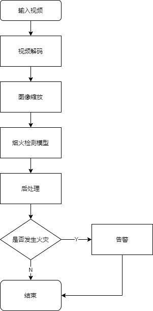

# 高速公路车辆火灾识别

## 1 介绍

高速公路车辆火灾识别基于 MindX SDK 开发，在 Ascend 310 芯片上进行目标检测，将检测结果保存成图片。项目主要流程为：通过 live555 服务器进行拉流输入视频，然后进行视频解码将 H.264 格式的视频解码为图片，图片缩放后经过模型推理进行火焰和烟雾检测，识别结果经过后处理后利用 cv 可视化识别框，如果检测到烟雾和火灾进行告警。

### 1.1 支持的产品

昇腾 310（推理）

### 1.2 支持的版本

本样例配套的 CANN 版本为 [3.3.0](https://gitee.com/link?target=https%3A%2F%2Fwww.hiascend.com%2Fsoftware%2Fcann%2Fcommercial)，MindX SDK 版本为 [2.0.2](https://gitee.com/link?target=https%3A%2F%2Fwww.hiascend.com%2Fsoftware%2Fmindx-sdk%2Fmxvision)。

MindX SDK 安装前准备可参考《用户指南》，[安装教程](https://gitee.com/ascend/mindxsdk-referenceapps/blob/master/docs/quickStart/1-1安装SDK开发套件.md)

### 1.3 软件方案介绍

基于 MindX SDK 的高速公路车辆火灾识别业务流程为：将待检测的视频放在 live555 服务器上经`mxpi_rtspsrc`拉流插件输入，然后使用视频解码插件`mxpi_videodecoder`将视频解码成图片，再通过图像缩放插件`mxpi_imageresize`将图像缩放至满足检测模型要求的输入图像大小要求，缩放后的图像输入模型推理插件`mxpi_modelinfer`得到检测结果，如果发生检测到火焰或者烟雾报警并保存该帧图片便于查看。

### 1.4 代码目录结构与说明

本 Sample 工程名称为 **FireDetection**，工程目录如下图所示：

```
├── envs
│   ├── atc_env.sh               //atc转换需要的环境变量
│   └── env.sh                   //基础环境变量
├── images                       //ReadMe图片资源
│   └── image-flow.png
├── model
│   ├── aipp_yolov5.cfg          //atc转换时需要的aipp配置文件
│   ├── atc.sh                   //atc运行脚本
│   ├── export.py                //pt2onnx脚本
│   ├── modify_yolov5s_slice.py  //slice算子处理脚本
│   ├── yolov5.cfg               //om模型后处理配置文件
│   └── yolov5.names             //om模型识别类别文件
├── pipeline
│   ├── fire_p.pipeline          //test使用的pipeline文件
│   └── fire_v.pipeline          //视频流使用的pipeline文件
├── test
│   └── testmain.py              //精度测试，性能测试识别主函数
├── result                       //运行结果图片保存位置
├── main.py                      //streams脚本
├── run.sh                       //运行脚本
└── README.md
```

###  1.5 技术实现流程图



## 2 环境依赖

| 软件名称            | 版本        | 说明                          | 获取方式                                                     |
| ------------------- | ----------- | ----------------------------- | ------------------------------------------------------------ |
| MindX SDK           | 2.0.2       | mxVision软件包                | [链接](https://gitee.com/link?target=https%3A%2F%2Fwww.hiascend.com%2Fsoftware%2Fmindx-sdk%2Fmxvision) |
| ubuntu              | 18.04.1 LTS | 操作系统                      | Ubuntu官网获取                                               |
| Ascend-CANN-toolkit | 3.3.0       | Ascend-cann-toolkit开发套件包 | [链接](https://gitee.com/link?target=https%3A%2F%2Fwww.hiascend.com%2Fsoftware%2Fcann%2Fcommercial) |

在运行项目需要的环境变量如下，运行前不需要特别设置，环境依赖已经写入脚本中，脚本在`FireDetection/envs`目录下：

```bash
# 基础环境变量——env.sh
export MX_SDK_HOME="${SDK安装路径}/mxVision"
export LD_LIBRARY_PATH="${MX_SDK_HOME}/lib:${MX_SDK_HOME}/opensource/lib:${LD_LIBRARY_PATH}"
export PYTHONPATH="${MX_SDK_HOME}/python:${PYTHONPATH}"

# ATC工具环境变量——atc_env.sh
export install_path=/usr/local/Ascend/ascend-toolkit/latest
export PATH=/usr/local/python3.7.5/bin:${install_path}/arm64-linux/atc/ccec_compiler/bin:${install_path}/arm64-linux/atc/bin:$PATH
export PYTHONPATH=${install_path}/arm64-linux/atc/python/site-packages:${install_path}/arm64-linux/atc/python/site-packages/auto_tune.egg/auto_tune:${install_path}/arm64-linux/atc/python/site-packages/schedule_search.egg
export LD_LIBRARY_PATH=${install_path}/arm64-linux/atc/lib64:$LD_LIBRARY_PATH
export ASCEND_OPP_PATH=${install_path}/opp
```

注：其中`${SDK安装路径}`替换为用户的SDK安装路径;`install_path`替换为ascend-toolkit开发套件包所在路径。`LD_LIBRARY_PATH`用以加载开发套件包中lib库。

##  3 软件依赖以及资源链接

推理中涉及到第三方软件依赖如下表所示。

| 依赖软件       | 版本       | 说明                                       | 使用教程                                                     |
| -------------- | ---------- | ------------------------------------------ | ------------------------------------------------------------ |
| live555        | 1.09       | 实现视频转rstp进行推流                     | [链接](https://gitee.com/ascend/mindxsdk-referenceapps/blob/master/docs/参考资料/Live555离线视频转RTSP说明文档.md) |
| ffmpeg         | 2021-10-14 | 实现mp4格式视频转为264格式视频             | [链接](https://gitee.com/ascend/mindxsdk-referenceapps/blob/master/docs/参考资料/pc端ffmpeg安装教程.md#https://gitee.com/link?target=https%3A%2F%2Fffmpeg.org%2Fdownload.html) |
| pytorch        | 1.7.1      | conda install pytorch                      | python 3.7.5                                                 |
| torchvision    | 0.8.2      | conda install torchvision                  | python 3.7.5                                                 |
| onnx           | 1.60       | conda install onnx                         | python 3.7.5                                                 |
| onnx-simplifer | 0.3.6      | python3.7.5 -m pip install onnx-simplifier | [链接](https://github.com/daquexian/onnx-simplifier)         |
| 模型文件       | -          | pt 模型文件，onnx模型文件，om模型文件      | [链接](https://mindx.sdk.obs.cn-north-4.myhuaweicloud.com/mindxsdk-referenceapps%20/contrib/FireDetection/models.zip) |
| 原项目链接     | -          | -                                          | [链接](https://github.com/gengyanlei/fire-smoke-detect-yolov4) |

## 4 模型转换

本项目使用的模型是火灾识别的模型。模型文件可以直接下载。使用模型转换工具 ATC 将 onnx 模型转换为 om 模型，模型转换工具相关介绍参考链接：[CANN 社区版]([前言_昇腾CANN社区版(5.0.4.alpha002)(推理)_ATC模型转换_华为云 (huaweicloud.com)](https://support.huaweicloud.com/atctool-cann504alpha2infer/atlasatc_16_0001.html)) 。

模型转换，请在`FireDetection`目录下完成，步骤如下：

- **步骤1** 将`pt`文件移动至`FireDetection/model`目录下；也可以下载`onnx`模型，请移动至`FireDetection/model`目录下，并跳至**步骤5**；若下载`om`模型文件，请跳过模型转换步骤。

- **步骤2** 将`pt`文件转换为`onnx`文件

  ```bash
  python3.7.5 /model/export.py --weights /model/best.pt
  ```

  运行结果：生成`best.onnx`文件。

-  **步骤3** `onnx`文件简化

  对导出的`onnx`图使用`onnx-simplifer`工具进行简化。运行如下命令：

  ```bash
  python3.7.5 -m onnxsim --skip-optimization best.onnx best_s.onnx
  ```

  运行结果：生成`best_s.onnx`文件。

- **步骤4** 算子处理

  附件脚本modify_yolov5s_slice.py修改模型Slice算子

  ```bash
  python3.7.5 /model/modify_yolov5s_slice.py best_s.onnx
  ```

  运行结果：生成`best_s_t.onnx`文件。

- **步骤5** 将`best_s_t.onnx`文件移动至`FireDetection/model`目录下，然后运行model目录下的`atc.sh`

  ```bash
  bash /model/atc.sh
  ```

  执行该命令后会在当前文件夹下生成项目需要的模型文件

  ```
  ATC start working now, please wait for a moment.
  ATC run success, welcome to the next use.
  ```

  表示命令执行成功。

##  5 准备

按照第3小节**软件依赖**安装 live555 和 ffmpeg，按照 [Live555离线视频转RTSP说明文档](https://gitee.com/ascend/mindxsdk-referenceapps/blob/master/docs/参考资料/Live555离线视频转RTSP说明文档.md)将 mp4 视频转换为 H.264 格式。并将生成的 H.264 格式的视频上传到`live/mediaServer`目录下，然后修改`pipeline`目录下的`fire_v.pipeline`文件中`mxpi_rtspsrc0`的内容。

```json
"mxpi_rtspsrc0": {
	"props": {
		"rtspUrl":"rtsp://xxx.xxx.xxx.xxx:xxxx/xxx.264",  // 修改为自己所使用的的服务器和文件名
	},
    "factory": "mxpi_rtspsrc",
	"next": "mxpi_videodecoder0"
}
```

##  6 编译与运行

- **步骤1** 按照第 2 小节 **环境依赖** 中的步骤设置环境变量。

- **步骤2** 按照第 4 小节 **模型转换** 中的步骤获得 `om` 模型文件，放置在 `FireDetection/models` 目录下。
- **步骤3** 修改`fire_v.pipline`中`mxpi_modelinfer0`中`postProcessLibPath`的值`${SDK安装路径}`为 MindX SDK 的安装路径

- **步骤4** 运行。进入 `FireDetection` 目录，在 `FireDetection` 目录下执行命令：

```
bash run.sh
```

运行结果会保存在`FireDetection/result`目录下