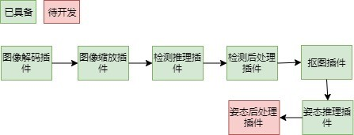

# 头部姿态识别

## 1 介绍
在本系统中，目的是基于MindX SDK，在昇腾平台上，开发端到端头部姿态识别的参考设计，实现对图像中的头部进行姿态识别的功能，并把可视化结果保存到本地，达到功能要求。

样例输入：带有头部的jpg图片。

样例输出：头部上带有三位坐标轴确定头部姿态的jpg图片。

### 1.1 支持的产品

支持昇腾310芯片

### 1.2 支持的版本

支持的SDK版本，列出版本号查询方式。

版本号查询方法，在Atlas产品环境下，运行命令：

```
npu-smi info
```
可以查询支持SDK的版本号


### 1.3 软件方案介绍

本方案中，采用yolov4预训练模型对输入图片进行头部识别，头部识别后对识别出的头部图像进行抠图，然后使用WHENet模型进行头部姿态识别，最终根据WHENet模型识别得到的yaw，pitch，roll信息生成头部上带有三位坐标轴确定头部姿态的jpg图片。

### 1.4 代码目录结构与说明

本sample工程名称为HeadPoseEstimation，工程目录如下图所示：
```
├── models
│   ├── coco.names
│   ├── insert_op.cfg
│   ├── yolov4.cfg
│   ├── WHENet_b2_a1_modified.om    # 头部转换模型WHENet
│   └── yolov4_detection.om         # 头部识别模型YOLO
├── pipeline
│   └── recognition.pipeline        # pipeline文件
├── plugins
│   ├── MxpiHeadPoseEstimationPostProcess   # 姿态后处理插件
│   │   ├── CMakeLists.txt
│   │   ├── build.sh
│   │   ├── MxpiHeadPoseEstimationPostProcess.cpp
│   │   └── MxpiHeadPoseEstimationPostProcess.h
├── main.py
└── test.jpg
```

### 1.5 技术实现流程图


图1 头部姿态识别流程图



图2 头部姿态识别pipeline示意图

## 2 环境依赖

| 软件名称 | 版本   |
| :--------: | :------: |
|ubantu|18.04.1 LTS   |
|MindX SDK|2.0.2|
|Python|3.7.5|

在编译运行项目前，需要设置环境变量：

- 环境变量介绍

```
# 执行如下命令，打开.bashrc文件
vi .bashrc
# 在.bashrc文件中添加以下环境变量
MX_SDK_HOME=${SDK安装路径}

LD_LIBRARY_PATH=${MX_SDK_HOME}/lib:${MX_SDK_HOME}/opensource/lib:${MX_SDK_HOME}/opensource/lib64:/usr/local/Ascend/ascend-toolkit/latest/acllib/lib64:/usr/local/Ascend/driver/lib64/

GST_PLUGIN_SCANNER=${MX_SDK_HOME}/opensource/libexec/gstreamer-1.0/gst-plugin-scanner

GST_PLUGIN_PATH=${MX_SDK_HOME}/opensource/lib/gstreamer-1.0:${MX_SDK_HOME}/lib/plugins

# 保存退出.bashrc文件
# 执行如下命令使环境变量生效
source ~/.bashrc

#查看环境变量
env
```

## 3 模型获取

提供转换好的YOLOV4模型以及WHENet模型的om文件：[下载地址](https://pan.baidu.com/s/1yZtjIZf8FdMwb1cyJVv4hA)，提取码：je7y

注：**下载后请放置于models目录下**


## 4 编译与运行
（描述项目安装运行的全部步骤，，如果不涉及个人路径，请直接列出具体执行命令）

示例步骤如下：

**步骤1** 

cd至plugins/    执行
```
bash build.sh
```
**步骤2** 

cd至plugins/MxpiHeadPosePlugin/build/   修改下面代码中的SDK目录并执行
```
cp libmxpi_headposeplugin.so {自己的MindX_SDK目录}/mxVision-2.0.2/lib/plugins/
```

**步骤3** 

修改pipeline/recognition.pipeline文件中: **mxpi_objectpostprocessor0**插件的postProcessLibPath属性，修改为{MindX_SDK实际安装目录}/lib/modelpostprocessors/libyolov3postprocess.so

**步骤4** 

自行在网络找一张包含头部的jpg图像，重命名为test.jpg，放入项目根目录中，再执行
```
python3.7 main.py
```

## 5 常见问题

请按照问题重要程度，详细列出可能要到的问题，和解决方法。

### 5.1 XXX问题

**问题描述：**

截图或报错信息

**解决方案：**

详细描述解决方法。