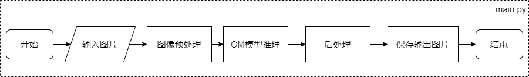
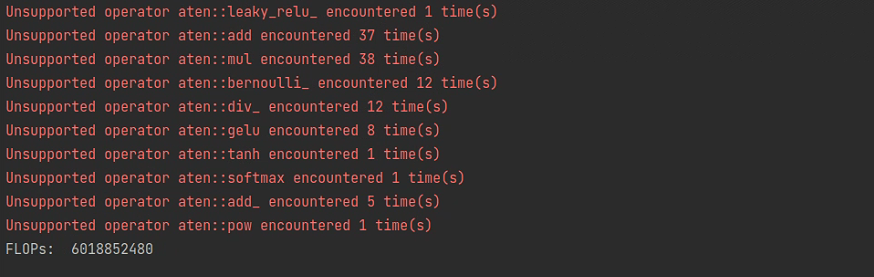
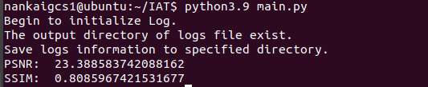

# MindX SDK -- RGB图像的夜间增强参考设计

## 1 介绍
基于 MindX SDK 实现 IAT 模型的推理，在 LOL 数据集上达到 $PSNR\ge$23, $SSIM\ge 0.8$, 并把可视化结果保存到本地，达到预期的功能和精度要求。

### 1.1 支持的产品

本项目以昇腾Atlas310、Atlas310B卡为主要硬件平台。

### 1.2 支持的版本

支持的SDK版本，列出版本号查询方式。

eg：版本号查询方法，在Atlas产品环境下，运行命令：

```
npu-smi info
```


### 1.3 软件方案介绍

本方案中，将 PyTorch 版本的低光图像增强模型 [IAT](https://github.com/cuiziteng/illumination-adaptive-transformer)，转化为昇腾的om模型。对于输入的夜间低照度图像，通过调用昇腾om模型进行处理，最终生成经过低光增强后的图像。


### 1.4 代码目录结构与说明

eg：本sample工程名称为XXX，工程目录如下图所示：

```
├── images			# README图片文件夹
├── data		    # 推理图片文件夹
	├──.keepme  	
├── models			# 模型文件夹
	├──.keepme  	
├── main.py		  	# 推理文件
├── pth2onnx.py		# 模型转换文件
└── README.md

```

### 1.5 技术实现流程图



### 1.6 特性及适用场景

对于夜间图像、低照度图像的增强均使用


## 2 环境依赖

请列出环境依赖软件和版本。

eg：推荐系统为ubuntu 22.04或centos 7.6，环境依赖软件和版本如下表：

| 软件名称      | 版本             |
| ------------- | ---------------- |
| ubuntu        | 18.04.1 LTS      |
| Python        | 3.9.2            |
| numpy         | 1.22.3           |
| opencv-python | 4.5.5            |
| onnxsim       | 0.4.10           |
支持的SDK版本为 5.0.RC1, CANN 版本310使用6.3.RC1，310B使用6.2.RC1。

在编译运行项目前，需要设置环境变量：

- 环境变量介绍

```
列出具体执行命令（简化）
. ${sdk_path}/set_env.sh
. ${ascend_toolkit_path}/set_env.sh
```


## 3 编译与运行
### 3.1 推理示例代码

**步骤1** （下载原模型代码)

- 下载 PyTorch 版本 [IAT代码](https://github.com/cuiziteng/illumination-adaptive-transformer)

- 根据原模型目录下的README.md文件配置原模型环境，具体代码如下：

  ```
  $ conda create -n IAT python==3.7.0
  $ conda activate IAT
  $ conda install --yes -c pytorch pytorch=1.7.1 torchvision cudatoolkit=11.0
  $ pip install timm matplotlib IQA_pytorch tqdm
  ```


**步骤2** （配置项目环境）

退出原模型环境，根据第2节环境依赖所述安装相应的项目环境，并设置环境变量。

```
source ${sdk_path}/set_env.sh
source ${ascend_toolkit_path}/set_env.sh
```

**步骤3** （执行编译的步骤）

​    1.pytorch 模型转换 onnx 文件

​	将 `pth2onnx.py` 放到 Illumination-Adaptive_Transformer/IAT_enhance/项目目录下，并切换到原模型环境，运行：

```
python pth2onnx.py
```

​    	在该目录下会生成名为IAT_lol.onnx的onnx模型文件 

​    2.简化 onnx 文件	

​	 在上述目录下继续运行:

```
onnxsim IAT_lol.onnx IAT_lol-sim.onnx
```

​    	会在路径下生成简化后的IAT_lol-sim.onnx模型文件

​	已经简化好的onnx模型可供参考：[IAT_lol-sim.onnx](https://mindx.sdk.obs.cn-north-4.myhuaweicloud.com/mindxsdk-referenceapps%20/contrib/IAT/IAT_lol-sim.onnx)

​     3.onnx 文件转换 om 文件

 若使用A200I DK A2运行，推荐使用PC转换模型，具体方法可参考A200I DK A2资料。

​	将环境从原模型环境切换到当前项目环境，然后运行：

```
atc --framework=5 --model=./IAT_lol-sim.onnx --input_shape="input_1:1,3,400,600" --output=IAT_lol-sim --soc_version=Ascend310
```
(若用例执行在310B上，则--soc_version=Ascend310需修改为Ascend310B1)

**步骤4** （运行及输出结果）

将要推理的图片放到本项目./data/文件夹下, 并将其改为test.png, 将.om模型放到./models/文件夹下, 命名为iatsim.om。运行:

```
python main.py
```

即可在./data/目录下得到推理后的结果.


## * 4 指标验证

### 4.1 模型规模测试

模型计算量测试需要利用python相关的模型测试工具 fvcore, 在原模型环境中可以使用以下命令进行安装：

```
pip install fvcore
```

利用fvcore的相关工具即可测得IAT模型的计算量，测试方法代码如下：

```python
def evaluate_net():
    from model.IAT_main import IAT
    from fvcore.nn import FlopCountAnalysis
    
    # 创建IAT网络
    model = IAT()
    model = model.cuda()
    # 创建输入网络的tensor
    tensor = torch.rand(1, 3, 400, 600).cuda()

    # 分析FLOPs
    flops = FlopCountAnalysis(model, tensor)
    print("FLOPs: ", flops.total())
```

测试结果如下：



根据[IAT论文](https://github.com/cuiziteng/illumination-adaptive-transformer)所述，该模型参数量约为90K，通过测试得到计算量约为6.019GFLOPs。


### 4.2 精度测试

**步骤1-3**  与3.1节一致

**步骤4** （获取LOL数据集）

- 下载[LOLv1数据集](https://daooshee.github.io/BMVC2018website/)

- 将数据集解压后将测试集目录(eval15)放到本项目./data/文件夹下,如下图所示:

  ```
  ├── data		  
  	├──eval15  	# 精度测试数据集
  		├──high
  		├──low
  ```

**步骤5** （修改主函数并运行）

切换到项目环境下，将main.py中的主函数改为调用test_precision()，运行:

```
python main.py
```

即可得到精度测试结果,测试结果如下：




## 5 参考文献

@misc{https://doi.org/10.48550/arxiv.2205.14871,
  doi = {10.48550/ARXIV.2205.14871},

  url = {https://arxiv.org/abs/2205.14871},

  author = {Cui, Ziteng and Li, Kunchang and Gu, Lin and Su, Shenghan and Gao, Peng and Jiang, Zhengkai and Qiao, Yu and Harada, Tatsuya},

  keywords = {Computer Vision and Pattern Recognition (cs.CV), FOS: Computer and information sciences, FOS: Computer and information sciences},

  title = {You Only Need 90K Parameters to Adapt Light: A Light Weight Transformer for Image Enhancement and Exposure Correction},

  publisher = {arXiv},

  year = {2022},

  copyright = {Creative Commons Attribution 4.0 International}
}