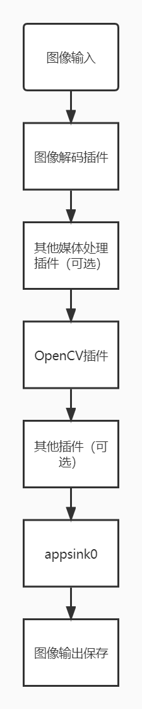

# OpenCV 插件

## 1. 介绍

本代码仓插件实现了opencv的抠图和缩放功能。   
抠图：
支持根据目标检测的（x,y）坐标和（width,height）宽高进行图像裁剪（抠图）。   
缩放：
对解码后的YUV格式以及BGR格式的图像进行指定宽高的缩放。

### 1.1 支持的产品

本项目以昇腾Atlas310卡为主要的硬件平台。


### 1.2 支持的版本

支持的SDK版本为 2.0.4, CANN 版本为 5.0.4。


### 1.3 软件方案介绍 

本项目包含两个功能，即抠图与缩放。

#### 1.3.1 抠图

整体业务流程为：待检测图片通过 appsrc 插件输入，然后使用图像解码插件 mxpi_imagedecoder 对图片进行解码，再通过图像抠图插件 mxpi_plugin进行将图片缩放到指定大小（其前后可接其他插件）。最后通过输出插件 appsink 获取结果，并在外部进行可视化，将结果标记到原图上，本系统的各模块及功能描述如表1所示：

表1 系统方案各模块功能描述：

| 序号 | 子系统     | 功能描述              |
| ---- | ---------- | --------------------- |
| 1    | 图片输入   | 获取 jpg 格式输入图片 |
| 2    | 图片解码   | 解码图片              |
| 3    | 其他插件   | 其他插件的功能        |
| 4    | 抠图       | 对输入图片进行抠图    |
| 5    | 其他插件   | 其他插件的功能        |
| 6    | 结果输出   | 获取检测结果          |
| 7    | 结果可视化 | 将结果保存            |


#### 1.3.2 缩放

整体业务流程为：待检测图片信息经预处理后通过 appsrc 插件输入，然后使用图像解码插件 mxpi_imagedecoder 对图片进行解码，再通过图像缩放插件 mxpi_plugin进行对图片进行抠图（其前后可接其他插件）。最后通过输出插件 appsink 获取检测结果，并在外部进行可视化，将结果标记到原图上，本系统的各模块及功能描述如表2所示：

表2 系统方案各模块功能描述：

| 序号 | 子系统     | 功能描述              |
| ---- | ---------- | --------------------- |
| 1    | 图片输入   | 获取 jpg 格式输入图片 |
| 2    | 图片解码   | 解码图片              |
| 3    | 其他插件   | 其他插件的功能        |
| 4    | 抠图       | 对输入图片进行缩放    |
| 5    | 其他插件   | 其他插件的功能        |
| 6    | 结果输出   | 获取检测结果          |
| 7    | 结果可视化 | 将结果保存            |

### 1.4 代码目录结构与说明

本工程名称为OpenCVPlugin，工程目录如下所示：

```
.
├── image
│   ├── pipeline.jpg
├── OpenCVPlugin
│   ├── build.sh
│   ├── CMakeLists.txt
│   ├── mxpisampleplugin.cpp
│   └── mxpisampleplugin.h
├── python
│   ├── main.py
│   └── test.pipeline
└── README.md

```

### 1.5 技术实现流程图

OpenCVPlugin 插件流程图。

<center>
    
    <br>
</center>


### 1.6 适用场景

输入：metadata（数据类型“MxpiVisionList”）   
输出：metadata（数据类型“MxpiVisionList”）

静态输入：{"image/yuv","image/rgb"}   
静态输出：{"image/rgb"}

## 2 环境依赖

推荐系统为ubuntu 18.04，环境依赖软件和版本如下表：

| 软件名称 | 版本  |
| -------- | ----- |
| cmake    | 3.5+  |
| mxVision | 2.0.4 |
| python   | 3.9.2 |

确保环境中正确安装mxVision SDK。

在编译运行项目前，需要设置环境变量：

MindX SDK 环境变量:

```
. ${SDK-path}/set_env.sh
```

CANN 环境变量：

```
. ${ascend-toolkit-path}/set_env.sh
```

- 环境变量介绍

```
SDK-path: SDK mxVision 安装路径
ascend-toolkit-path: CANN 安装路径
```

## 3 属性介绍

### 3.1 抠图属性

| 序号 | 属性             | 描述                                                  | 是否为必选项 | 是否可修改 |
| ---- | ---------------- | ----------------------------------------------------- | ------------ | ---------- |
| 1    | option           | 插件功能选择，此处使用"crop"                          | 是           | 是         |
| 2    | startRow         | 抠图选定区域的开始纵坐标， 默认为"0"，，取值为0~8192  | 否           | 是         |
| 3    | startCol         | 抠图选定区域的开始横坐标， 默认为"0" ，取值为0~8192   | 否           | 是         |
| 4    | endRow           | 抠图选定区域的结束纵坐标，默认为"256"  ，取值为0~8192 | 否           | 是         |
| 5    | endCol           | 抠图选定区域的结束横坐标，默认为"256" ，取值为0~8192  | 否           | 是         |
| 6    | outputDataFormat | 插件输出的数据格式，可选值为"RGB" "BGR" "YUV"         | 否           | 是         |
| 7    | datatype         | 插件输出的数据类型，可选值为"uint8"和"float32"        | 否           | 是         |

### 3.2 缩放属性

| 序号 | 属性             | 描述                                                 | 是否为必选项 | 是否可修改 |
| ---- | ---------------- | ---------------------------------------------------- | ------------ | ---------- |
| 1    | option           | 插件功能选择，此处使用"resize"                       | 是           | 是         |
| 2    | height           | 缩放后的高度， 默认为"256"，取值为0~8192             | 否           | 是         |
| 3    | width            | 抠图选定区域的开始横坐标， 默认为"256"，取值为0~8192 | 否           | 是         |
| 4    | fx               | 抠图选定区域的结束纵坐标，默认为"0"，取值为0~1       | 否           | 是         |
| 4    | fy               | 抠图选定区域的结束纵坐标，默认为"0"，取值为0~1       | 否           | 是         |
| 5    | interpolation    | 图片插值方式，默认为"1"，取值为0~4                   | 否           | 是         |
| 6    | outputDataFormat | 插件输出的数据格式，可选值为"RGB" "BGR" "YUV"        | 否           | 是         |
| 7    | datatype         | 插件输出的数据类型，可选值为"uint8"和"float32"       | 否           | 是         |

插值方式的取值具体描述：   

| interpolation选项 | 插值方式                   | int值 |
| ----------------- | -------------------------- | ----- |
| INTER_NEAREST     | 最近邻插值                 | 0     |
| INTER_LINEAR      | 双线性插值（默认）         | 1     |
| INTER_CUBIC       | 基于4*4像素领域的3次插值法 | 2     |
| INTER_AREA        | 使用像素区域关系进行重采样 | 3     |
| INTER_LANCZOS4    | 8x8像素邻域的Lanczos插值   | 4     |

## 4. 编译与运行

**步骤1** **修改CMakeLists.txt文件** 

第**15**行 将“/usr/local/Ascend/ascend-toolkit/latest/runtime/include”替换为实际include路径。

**步骤2** **编译**  

进入到src/mxpi_sampleplugin路径：

```
mkdir build
cd build
cmake ..
make -j4
cp ../lib/plugins/xxx.so ${MX_SDK_HOME}/lib/plugins
```

**步骤3** **运行**

在main.py所在目录上传图片命名为"person.jpg"，可通过修改pipeline文件选择相应的功能。

```
python3 main.py
```

注：由于dvpp的resize功能有约束，如使用resize插件，输入宽高分别需要16、2对齐。

