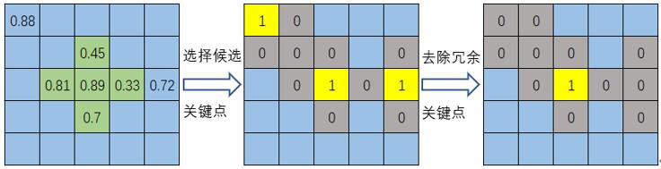
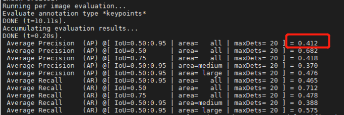
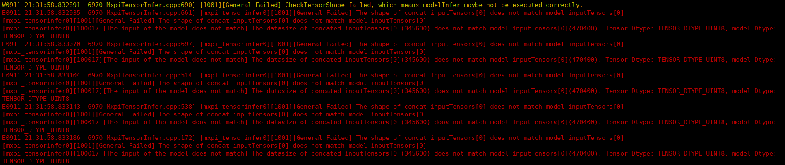
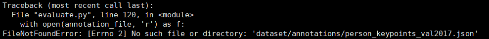

# 人体关键点检测
## 1. 介绍
人体关键点检测插件基于 MindXSDK 开发，在晟腾芯片上进行人体关键点和骨架检测，将检测结果可视化并保存。输入一幅图像，可以检测得到图像中所有行人的关键点并连接成人体骨架。

人体关键点检测是指在输入图像上对指定的 18 类人体骨骼关键点位置进行检测，包括包括鼻子、左眼、右眼、左耳、右耳、左肩、右肩、左肘、右肘、左手腕、右手腕、左髋、右髋、左膝、右膝、左踝、右踝。然后将关键点正确配对组成相应的人体骨架，展示人体姿态，共 19 类人体骨架，如左肩和左肘两个关键点连接组成左上臂，右膝和右踝两个关键点连接组成右小腿等。
本方案采取OpenPose模型，将待检测图片输入模型进行推理，推理得到包含人体关键点信息和关键点之间关联度信息的两个特征图，首先从关键点特征图中提取得到所有候选人体关键点，然后结合关联度信息特征图将不同的关键点组合连接成为人体骨架，再将所有人体骨架连接组成不同的人体，最后将关键点和骨架信息标注在输入图像上，描绘人体姿态。本方案可以对遮挡人体、小人体、密集分布人体等进行检测，还适用于不同姿态（蹲坐、俯卧等）、不同方向（正面、侧面、背面等）以及模糊人体关键点检测等多种复杂场景。


### 1.1 支持的产品

本项目以昇腾Atlas 500 A2为主要的硬件平台。


### 1.2 支持的版本

mxVision 5.0.RC1
Ascend-CANN-toolkit 6.2.RC1


### 1.3 软件方案介绍

基于MindX SDK的人体关键点检测业务流程为：待检测图片通过 appsrc 插件输入，然后使用图像解码插件mxpi_imagedecoder对图片进行解码，再通过图像缩放插件mxpi_imageresize将图像缩放至满足检测模型要求的输入图像大小要求，缩放后的图像输入模型推理插件mxpi_tensorinfer得到检测结果，本项目开发的 OpenPose 人体关键点检测插件处理推理结果，从中提取关键点，确定关键点和关键点之间的连接关系，输出关键点连接形成的人体，最后通过序列化插件mxpi_dataserialize 和输出插件 appsink 获取人体关键点检测插件输出结果，并在外部进行人体姿态可视化描绘。本系统的各模块及功能描述如表1所示：

表1 系统方案各模块功能描述：

| 序号 | 子系统 | 功能描述     |
| ---- | ------ | ------------ |
| 1    | 图片输入    | 获取 jpg 格式输入图片 |
| 2    | 图片解码    | 解码图片 |
| 3    | 图片缩放    | 将输入图片放缩到模型指定输入的尺寸大小 |
| 4    | 模型推理    | 对输入张量进行推理 |
| 5    | 人体关键点检测    | 从模型推理结果检测人体关键点，并连接成人体骨架 |
| 6    | 序列化    | 将检测结果组装成json字符串 |
| 7    | 结果输出    | 将序列化结果输出|
| 8    | 结果可视化    | 将检测得到的关键点和人体骨架标注在输入图片上|


### 1.4 代码目录结构与说明

本工程名称为 OpenposeKeypointDetection，工程目录如下所示：
```
.
├── build.sh
├── images
│   ├── ATCSuccess.png
│   ├── COCOAnnotations.png
│   ├── KeypointNms.jpg
│   ├── OverallProcess.jpg
│   ├── PathError.png
│   └── PipelineError.png
├── plugins
│   ├── build.sh
│   ├── CMakeLists.txt
│   ├── MxpiOpenposePostProcess.cpp
│   └── MxpiOpenposePostProcess.h
├── proto
│   ├── build.sh
│   ├── CMakeLists.txt
│   └── mxpiOpenposeProto.proto
├── python
│   ├── evaluate.py
│   ├── main.py
│   ├── models
│   │   ├── convert_to_onnx.py
│   │   ├── insert_op.cfg
│   │   └── model_conversion.sh
│   └── pipeline
│       └── Openpose.pipeline
└── README.md
```


### 1.5 技术实现流程图

人体关键点检测插件的输入是模型推理插件输出的特征图，对于 OpenPose 模型，输出两个特征图，分别是关键点特征图 K 和关联度特征图 P，其中 K 的形状大小为 19 × w × h，P 的形状大小为 38 × w × h（w, h 表示特征图宽、高）， K中每个通道的二维特征图上每个位置的值表示该类关键点在该位置的置信度，共计 18 类关键点，关键点特征图的最后一个通道即第 19 个通道为背景点类。P 中每两个通道组成的三维特征图上的每个位置的值表示对应类别关键点在该位置处的向量坐标（x, y），通过计算两个不同类关键点组成的连接置信度将关键点连接成骨架，关键点之间组成的骨架共 19 类。


关键点插件从输出特征图检测得到人体关键点和骨架的整体流程为：
1. **将推理输出特征图缩放至原图尺寸大小。** 先将 K 和 P 放大 8 倍，因为 OpenPose 模型推理过程中会将输入缩小 8 倍得到特征图，然后去除 mxpi_imageresize 插件在缩放原图到指定尺寸时在图片右侧和下方添加的补边值，最后将特征图缩放到原图的尺寸大小。
2. **从关键点特征图检测得到每一类的候选关键点。** 首先将置信度小于一定阈值 T 的点的置信度设为 0，这些位置不会成为候选关键点；如果该点的置信度值大于其上、下、左、右四个相邻点的置信度值，则该点是该类关键点的一个候选关键点；对于每个候选关键点，去除其周围与其欧式距离小于一定阈值 TD 的其他候选关键点。上述过程如图1 所示。


<center>
    
    <br>
    <div style="color:orange;
    display: inline-block;
    color: #999;
    padding: 2px;">图1. 候选关键点选择示意图 </div>
</center>


3. **结合关联度特征图 P 将候选关键点配对形成候选骨架。** 对于每个骨架（kp1, kp2), 得到 kp1 的所有候选关键点集 S1={kp1_0, kp1_1, ……} 和 kp2 的所有候选关键点集 S2={kp2_0, kp2_1, ……}，将 S1 中的每个点 kp1_i和 S2 中的每个点 kp2_j 组合，计算每个点对是该骨架的置信度。计算方式为：在 kp1_i 和 kp2_j 两点连成的线段上等间距的生成 10 个点，每两个相邻点确定一个子段，通过这些子段计算该骨架的置信度并筛选得到候选骨架, 最后去除冲突的候选骨架，即两个骨架有相同的端点时，保留置信度高的骨架。

4. **将候选骨架组成人体。** 将有相同端点的骨架依次连接，最终组成一个或多个人体。


## 2 环境依赖

推荐系统为ubantu 18.04，环境依赖软件和版本如下表：

| 软件名称 | 版本   |
| -------- | ------ |
| cmake    | 3.5+   |
| python   | 3.9.2  |

确保环境中正确安装mxVision SDK。

在编译运行项目前，需要设置环境变量：
```
. /usr/local/Ascend/ascend-toolkit/set_env.sh #toolkit默认安装路径，根据实际安装路径修改
. ${SDK_INSTALL_PATH}/mxVision/set_env.sh
```


## 3. 模型转换

本项目中适用的模型是 OpenPose 模型，参考实现代码：https://github.com/Daniil-Osokin/lightweight-human-pose-estimation.pytorch， 选用的模型是该 pytorch 项目中提供的模型，本项目运行前需要将 pytorch 模型转换为 onnx 模型，pytorch 模型和onnx 模型下载链接：https://mindx.sdk.obs.cn-north-4.myhuaweicloud.com/mindxsdk-referenceapps%20/contrib/OpenposeKeypointDetection/model.zip。

然后使用模型转换工具 ATC 将 onnx 模型转换为 om 模型，模型转换工具相关介绍参考链接：https://gitee.com/ascend/docs-openmind/blob/master/guide/mindx/sdk/tutorials/%E5%8F%82%E8%80%83%E8%B5%84%E6%96%99.md 。

自行转换模型，步骤如下：
1. 从上述 onnx 模型下载链接中下载 onnx 模型至 ``python/models`` 文件夹下，文件名为：simplified_560_openpose_pytorch.onnx 。
2. 进入 ``python/models`` 文件夹下执行命令：
```
bash model_convertion.sh
```
执行该命令后会在当前文件夹下生成项目需要的模型文件 openpose_pytorch_560.om。执行后终端输出为：
```
ATC start working now, please wait for a moment.
ATC run success, welcome to the next use.
```
表示命令执行成功。


上述方法使用提供的 onnx 模型转换得到 om 模型，该模型的输入尺寸是 (560, 560)，若想转换得到其他输入尺寸的模型，或者想从 pytorch 模型转 onnx 模型，相关操作步骤如下：
1. 从上述参考实现代码链接下载 pytorch 项目文件，执行：
```
git clone https://github.com/Daniil-Osokin/lightweight-human-pose-estimation.pytorch.git
```
或者下载 ZIP 压缩包再解压，在当前目录下得到 ``lightweight-human-pose-estimation.pytorch-master`` 代码文件夹。

2. 按照参考实现代码链接中的说明配置 pytorch 环境。

3. 将**本项目目录下**的 ``python/models/convert_to_onnx.py`` 文件复制到 ``lightweight-human-pose-estimation.pytorch-master/scripts`` 目录下，替换原有的``convert_to_onnx.py`` 文件。

4. 从上述 pytorch 模型下载链接中下载 pytorch 模型文件 checkpoint_iter_370000.pth, 放置在 ``lightweight-human-pose-estimation.pytorch-master/checkpoints`` 目录下。

5. 编辑 ``lightweight-human-pose-estimation.pytorch-master/checkpoints/scripts/convert_to_onnx.py`` 中的 ``net_input = Variable(torch.randn(1, 3, 560, 560))`` 行，设置模型输入尺寸，如想要设置模型输入尺寸为（480，480）则将该行改为 ``net_input = Variable(torch.randn(1, 3, 480, 480))`` 。

6. 在``lightweight-human-pose-estimation.pytorch-master`` 目录下运行命令
```
python scripts/convert_to_onnx.onnx --checkpoint-path=checkpoints/checkpoint_iter_370000.pth
```
执行成功后会在当前文件夹下生成从 pytorch 模型转化得到的 onnx 模型，上述命令还可以设置 ``--output-name`` 参数，指定输出的 onnx 模型文件名，不指定时的默认文件名为 human-pose-estimation.onnx 。

7. 成功转换得到 onnx 文件后，将 onnx 文件拷贝或移动到**本项目目录下**的 ``python/models`` 目录下，将其转换为 om 模型，转换步骤如下：
- 进入 ``python/models`` 目录；
- 编辑 ``insert_op.cfg`` 文件，将 ``src_image_size_w`` 和 ``src_image_size_h`` 分别设置为上述转换 onnx 模型时指定的模型输入宽度和高度；
- 编辑 ``model_conversion.sh`` 文件，将

命令中的 ``--model`` 属性改为上述转换得到的 onnx 模型文件名，将 ``--output`` 属性设置为输出 om 模型的名称，将 ``--input_shape`` 属性设置为指定的模型输入宽、高；

- 执行命令：
```
bash model_convertion.sh
```
该命令执行成功后会在当前文件夹下生成指定名称的 om 模型文件。

```
atc --model=./simplified_560_openpose_pytorch.onnx --framework=5 --output=openpose_pytorch_560 --soc_version=Ascend310B1 --input_shape="data:1, 3, 560, 560" --input_format=NCHW --insert_op_conf=./insert_op.cfg
```

## 4. 编译与运行

**步骤1** 按照第 2 小节 **环境依赖** 中的步骤设置环境变量。

**步骤2** 按照第 3 小节 **模型转换** 中的步骤获得 om 模型文件，放置在 ``python/models`` 目录下。若未从 pytorch 模型自行转换模型，使用的是上述链接提供的 onnx 模型或者 om 模型，则无需修改相关文件，否则修改 ``python/pipeline/Openpose.pipeline`` 中的相关配置，将 mxpi_tensorinfer0 插件 modelPath 属性值中的 om 模型名改成实际使用的 om 模型名；将 mxpi_imageresize0 插件中的 resizeWidth 和 resizeHeight 属性改成转换模型过程中设置的模型输入尺寸值；将 mxpi_openposepostprocess0 插件中的 inputWidth 和 inputHeight 属性改成转换模型过程中设置的模型输入尺寸值。

**步骤3** 编译。在项目目录下执行命令：运行前修改插件权限为640
```
bash build.sh
cp plugins/build/libmxpi_openposepostprocess.so ~/MindX_SDK/mxVision/lib/plugins/
```

**步骤4** 图片检测。将一张包含人体的图片放在项目目录下，命名为 test.jpg。在该图片上进行检测，执行命令：
```
cd python
python3 main.py
```
命令执行成功后在当前目录下生成检测结果文件 test_detect_result.jpg，查看结果文件验证检测结果。

**步骤5** 精度测试。

1. 安装 python COCO 评测工具。执行命令：
```
pip3.9 install pycocotools
```

2. 下载 COCO VAL 2017 数据集，下载链接：https://mindx.sdk.obs.cn-north-4.myhuaweicloud.com/mindxsdk-referenceapps%20/contrib/OpenposeKeypointDetection/data.zip，在 ``python`` 目录下创建 ``dataset`` 目录，将数据集压缩文件解压至 ``python/dataset`` 目录下。下载 COCO VAL 2017 标注文件，下载链接：https://mindx.sdk.obs.cn-north-4.myhuaweicloud.com/mindxsdk-referenceapps%20/contrib/OpenposeKeypointDetection/data.zip ，将标注文件压缩文件解压至 ``python/dataset`` 目录下。确保下载完数据集和标注文件后的 python 目录结构为：
```
.
├── dataset
│   ├── annotations
│   │   └── person_keypoints_val2017.json
│   └── val2017
│       ├── 000000581615.jpg
│       ├── 000000581781.jpg
│       └── other-images
├── evaluate.py
├── main.py
├── models
│   ├── convert_to_onnx.py
│   ├── insert_op.cfg
│   └── model_conversion.sh
└── pipeline
    └── Openpose.pipeline
```

3. 执行命令：
```
cd python
python3 evaluate.py
```
命令执行结束后输出 COCO 格式的评测结果，并生成 val2017_keypoint_detect_result.json 检测结果文件。输出结果如下图所示：
<center>
    
    <br>
    <div style="color:orange;
    display: inline-block;
    color: #999;
    padding: 2px;">图2. 模型精度测试输出结果 </div>
</center>
其中圈出来的部分为模型在 COCO VAL 2017 数据集上，IOU 阈值为 0.50:0.05:0.95 时的精度值。

## 5 常见问题


### 5.1 模型参数配置问题

**问题描述：**

``python/pipeline/Openpose.pipeline`` 中模型输入尺寸相关参数需要和使用的 om 模型相对应，否则会报如下类型的错：

<center>
    
    <br>
    <div style="color:orange;
    display: inline-block;
    color: #999;
    padding: 2px;">图3. 模型输入尺寸和 pipeline 中参数设置不匹配报错 </div>
</center>

**解决方案：**

确保 ``python/pipeline/Openpose.pipeline`` 中 mxpi_imageresize0 插件的 resizeWidth 和 resizeHeight 属性值是转换模型过程中设置的模型输入尺寸值；mxpi_openposepostprocess0 插件中的 inputWidth 和 inputHeight 属性值是转换模型过程中设置的模型输入尺寸值。


### 5.1 评测过程中的文件路径问题

**问题描述：**

精度评测过程中，将 COCO VAL 2017 数据集文件夹和标注文件夹放在正确位置，否则执行评测程序时找不到文件，报如下类型的错：

<center>
    
    <br>
    <div style="color:orange;
    display: inline-block;
    color: #999;
    padding: 2px;">图4. 文件路径报错 </div>
</center>

**解决方案：**
下载完数据集和标注文件后，确保 ``python/dataset`` 目录结构为：
```
.
├── annotations
│   └── person_keypoints_val2017.json
└── val2017
    ├── 000000581615.jpg
    ├── 000000581781.jpg
    └── other-images
```