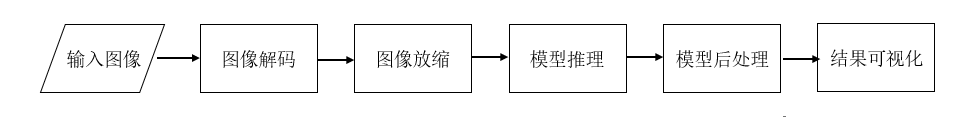
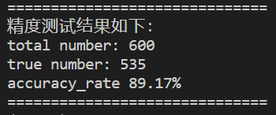

# Overlap-CRNN重叠文本识别参考设计

## 1 介绍

本开发样例使用CRNN完成重叠文本的识别任务，供用户参考。 本系统基于昇腾Ascend310卡。本仓库是重叠文本任务的下游任务，即在完成对重叠文本还原后针对mask识别出文本。

### 1.1 支持的产品

本系统采用Atlas300-3010作为实验验证的硬件平台，并支持Atlas200RC以及Atlas500的硬件平台.具体产品实物图和硬件参数请参见《Atlas 300 AI加速卡 用户指南（型号 3010）》。由于采用的硬件平台为含有Atlas 300的Atlas 800 AI服务器 （型号3010），而服务器一般需要通过网络访问，因此需要通过笔记本或PC等客户端访问服务器，而且展示界面一般在客户端。

### 1.2 支持的版本

版本号查询方法，在Ascend产品环境下，运行命令：

```
npu-smi info
```


### 1.3 软件方案介绍

软件方案主要为还原文本的识别系统，子系统功能具体描述请参考 表1.1 系统方案各子系统功能描述。重叠文本识别子系统可以实现识别还原后图像的mask的输入，然后通过等比例放缩等操作最后对图像进行识别，本方案选择使用crnn作为重叠文本识别模型。系统方案中各模块功能如表1.2 所示。

表1.1 系统方案各子系统功能描述：

| 序号 |       子系统       |                           功能描述                           |
| :--: | :----------------: | :----------------------------------------------------------: |
|  1   | 重叠文本识别子系统 | 重叠文本识别子系统将上一个子系统得到的结果，进行等比例放缩操作，放缩的大小与模型的输入大小有关，之后将结果送入到文字识别模型进行文字识别，并将识别结果进行输出。 |

表1.2 系统方案中各模块功能：

| 序号 |   子系统   |                           功能描述                           |
| :--: | :--------: | :----------------------------------------------------------: |
|  1   |  输入图像  |             将图像（JPG格式）通过pillow库读入。              |
|  2   |  输入字典  |       将字典（txt格式）通过本地代码输入到pipeline中。        |
|  3   |  图像解码  |                通过PILLOW第三方库对图像解码。                |
|  4   |  图像放缩  | 文字识别模型的输入为固定维度，所以需要放射变换的结果进行等比例放缩。 |
|  5   |  文字识别  | 在图像放缩后，将缓存区数据送入文字识别模型。本方案选用crnn进行文本识别 |
|  6   | 结果可视化 |              通过pillow库可视化单张图像的识别。              |


### 1.4 代码目录结构与说明

eg：本sample工程名称为Overlap-CRNN，工程目录如下图所示：

```pytnon
├── crnn_single_infer.py #单张图片推理
├── crnn_infer.py #精度测试
├── README.md
├── ch_sim_en_digit_symble.txt #字典
├── models #不同类型的模型文件
│   ├── air_model
│   │   ├── crnn.air
│   └── ckpt_model
│   │   ├── crnn.ckpt
│   └── om_model
│   │   ├── crnn.om
├── dataset #测试数据集
│   ├── img
│   └── mask_annotation.txt
```

### 1.5 技术实现流程图

实现流程图如下图所示：




### 1.6 特性及适用场景

本案例中的 CRNN模型适用于英文的灰度图像的识别，并可以返回测试图像的word-based的精度值。

本模型在以下几种情况去噪效果良好：图像中文字清晰可见、排版工整、字符大小适中等。

在以下几种情况去噪效果不太好：图像中文字模糊、排版随意、字符较小等。


## 2 环境依赖

请列出环境依赖软件和版本。

推荐系统为ubuntu 18.04或centos 7.6，环境依赖软件和版本如下表：

| 软件名称            | 版本        |
| ------------------- | ----------- |
| mindspore           | 1.8.1       |
| MindX SDK           | 3.0RC2      |
| Ascend-CANN-toolkit | 5.1.RC2     |
| ubuntu              | 18.04.1 LTS |
| python              | 3.9.2       |
| cv2                 | 4.5.5.64    |
| numpy               | 1.23.1      |
| pillow              | 9.1.0       |

在编译运行项目前，需要设置环境变量：

- 环境变量介绍

```
. ${sdk_path}/set_env.sh
. ${ascend_toolkit_path}/set_env.sh
```


## 3 模型训练

**步骤1** 从昇腾社区的modelzoo中下载官方CRNN模型代码：https://www.hiascend.com/zh/software/modelzoo/models/detail/C/c4945b2fc8aa47f6af9b4f2870e41062/1

**步骤2** 为适配我们的任务要求，做如下修改：

1. **./default_config.yaml**

   ```yaml
   model_version: "V2" # V2可以在GPU和Ascend上训练
   label_dict: "PATH/TO/ch_sim_en_digit_symble.txt" # 使用自己的字典的路径
   max_text_length: 12
   image_width: 112
   class_num: 6703 
   blank: 6702
   train_dataset_path: "" # 训练数据集路径
   train_eval_dataset: "synth" # 名称使用synth
   train_eval_dataset_path: "" # 测试数据路径
   ```

2. **./src/dataset.py**

   将第41行的：

   ```python
   letters = [letter for letter in config1.label_dict]
   ```

   修改为：

   ```python
   letters = []
   with open(config1.label_dict, 'r') as f:
       for line in f:
           letter = line.strip('\n')
           letters.append(letter)
       f.close()
   ```

   

   将CaptchaDataset函数更换为：

   ```python
   class CaptchaDataset:
    """
    create train or evaluation dataset for crnn

    Args:
        img_root_dir(str): root path of images
        max_text_length(int): max number of digits in images.
        device_target(str): platform of training, support Ascend and GPU.
    """

    def __init__(self, img_root_dir, is_training=True, config=config1):
        if not os.path.exists(img_root_dir):
            raise RuntimeError(
                "the input image dir {} is invalid!".format(img_root_dir))
        self.img_root_dir = img_root_dir
        if is_training:
            self.imgslist = os.path.join(self.img_root_dir,
                                         'annotation_train.txt')
        else:
            self.imgslist = os.path.join(self.img_root_dir,
                                         'annotation_test.txt')
        self.img_names = {}
        self.img_list = []
        with open(self.imgslist, 'r') as f:
            for line in f:
                img_name, img_label = line.strip('\n').split('\t')
                self.img_list.append(img_name)
                self.img_names[img_name] = str(img_label)
        f.close()
        self.max_text_length = config.max_text_length
        self.blank = config.blank
        self.class_num = config.class_num
        self.sample_num = len(self.img_list)
        self.batch_size = config.batch_size
        print("There are totally {} samples".format(self.sample_num))

    def __len__(self):
        return self.sample_num

    def __getitem__(self, item):
        img_name = self.img_list[item]
        try:
            im = Image.open(os.path.join(self.img_root_dir, img_name))
        except IOError:
            print("%s is a corrupted image" % img_name)
            return self[item + 1]
        im = im.convert("RGB")
        r, g, b = im.split()
        im = Image.merge("RGB", (b, g, r))
        image = np.array(im)
        if not check_image_is_valid(image):
            print("%s is a corrupted image" % img_name)
            return self[item + 1]

        text = self.img_names[img_name]

        label_unexpanded = text_to_labels(text)
        label = np.full(self.max_text_length, self.blank)
        if self.max_text_length < len(label_unexpanded):
            label_len = self.max_text_length
        else:
            label_len = len(label_unexpanded)
        for j in range(label_len):
            label[j] = label_unexpanded[j]
        return image, label
   ```

   

3. **./src/metric.py**

   将第18行的字典

   ```python
   label_dict = "abcdefghijklmnopqrstuvwxyz0123456789"
   ```

   修改为（ `dict_path `为自行准备的字典 `ch_sim_en_digit_symble.txt `，可在本仓库下找到）：

   ```
   label_dict = []
   with open("[dict_path]", 'r') as f:
       for line in f:
           letter = line.strip('\n')
           label_dict.append(letter)
       f.close()
   ```

**步骤3** 训练步骤参考官方代码: https://www.hiascend.com/zh/software/modelzoo/models/detail/C/c4945b2fc8aa47f6af9b4f2870e41062/1


## 4 模型转换

本项目使用的模型是CRNN模型。

通过第三节的训练后得到ckpt模型文件，在项目运行前需要将ckpt文件通过 `export.py `转换成AIR模型文件，然后在本代码仓下通过ATC转换成om模型。

模型转换工具（ATC）相关介绍如下：https://support.huawei.com/enterprise/zh/doc/EDOC1100234054

具体步骤如下：

1. 准备好训练得到的ckpt模型文件，放至在训练服务器Ascend910上。

2. 进入CRNN_for_MindSpore_1.2_code文件夹下执行命令（修改`ckpt_file`和`air_file_name`参数为自己的路径）：

   ```
   python export.py --ckpt_file [ckpt_file] --file_name [air_file_name] --file_format AIR
   ```

3. 将生成的AIR模型转移到推理服务器，放至在Overlap-CRNN/air_model路径下。

4. 进入推理服务器执行命令（修改`air_model_path`和`output_model_path`参数为自己的路径）：

   ```
   atc --model=[air_model_path] --framework=1 --output=[output_model_path] --soc_version=Ascend310 --output_type=FP32 --op_select_implmode=high_precision --input_shape="input:1,3,32,112"
   ```

5. 执行该命令会在当前目录下生成项目需要的模型文件`[output_model].om`。执行后终端输出为：

   ```
   ATC start working now, please wait for a moment.
   ATC run success, welcome to the next use.
   ```

表示命令执行成功。

相关模型的下载链接如下：https://mindx.sdk.obs.cn-north-4.myhuaweicloud.com/mindxsdk-referenceapps%20/contrib/Overlao-CRNN/models.zip

模型均在GPU下训练得到，如果需要使用本仓库提供的模型进行推理或模型转换，请务必参照GPU所需的参数设置，然后将模型按照提供的文件夹目录放至即可。

## 5 编译与运行

当已有模型的om文件，保存在Overlap-CRNN/models/om_model/下

示例步骤如下：
**步骤1** 将任意一张jpg格式的图片存到当前目录下(./Overlap-CRNN），命名为test.jpg。

**步骤2** 按照模型转换获取om模型，放置在Overlap-CRNN/models/om_model/ 路径下。若未自行转换模型，使用的是仓库提供的模型，则无需修改相关文件，否则修改`crnn_single_infer.py`中相关配置，将`MODEL_PATH`对象的路径改成实际的om模型的路径；`IMAGE_PATH`对象的路径改成实际的测试图片的路径；`SAVE_PATH`对象设置成需要保存可视化图像的路径。

**步骤3** 在命令行输入 如下命令运行整个工程：

```
python crnn_single_infer.py
```

**步骤4** 运行结束输出show.jpg


## 6 测试精度

**步骤1** 在Overlap-CRNN/dataset/路径下准备相同格式的数据集（已提供测试用的数据集，按照文件目录放至即可：https://mindx.sdk.obs.cn-north-4.myhuaweicloud.com/mindxsdk-referenceapps%20/contrib/Overlao-CRNN/dataset.zip）

**步骤2** 在命令行输入 如下命令运行整个工程：

```
python crnn_infer.py
```

模型在测试集上的精度达标，最终模型的的acc为83.58%，满足精度要求（acc≥80%）。

