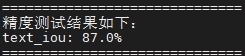

# Overlap-Recovery重叠文本还原参考设计

## 1 介绍

本开发样例使用自研算法完成重叠文本的还原任务，供用户参考。 本系统基于昇腾Ascend310卡。本仓库是重叠文本识别任务([Overlap-CRNN](https://gitee.com/ascend/mindxsdk-referenceapps/tree/master/contrib/Overlap-CRNN))的上游任务，即完成对重叠文本还原并输出文本实例的mask。

### 1.1 支持的产品

本系统采用Ascend 310作为实验验证的推理硬件平台，训练硬件平台支持Ascend和GPU。

### 1.2 支持的版本

推理代码支持的版本为MindX SDK 3.0RC3，Ascend-CANN-toolkit 6.0.RC1。


### 1.3 软件方案介绍

软件方案主要为文本还原的系统，子系统功能具体描述请参考 表1.1 系统方案各子系统功能描述。重叠文本还原子系统可以实现还原重叠文本并得到各个文本实例的mask，本方案选择使用基于分割的算法并提出一种重叠区域感知的模块来恢复出重叠文本实例。系统方案中各模块功能如表1.2 所示。

表1.1 系统方案各子系统功能描述：

| 序号 |       子系统       |                           功能描述                           |
| :--: | :----------------: | :----------------------------------------------------------: |
|  1   | 重叠文本还原子系统 | 重叠文本还原子系统将得到重叠文本实例的mask的结果，之后将结果送入到下游的文字识别模型进行文字识别。 |

表1.2 系统方案中各模块功能：

| 序号 |   子系统   |                           功能描述                           |
| :--: | :--------: | :----------------------------------------------------------: |
|  1   |  输入图像  |             将图像（JPG/PNG格式）通过Pillow库读入。              |
|  2   |  图像解码  |                通过Pillow第三方库对图像解码。                |
|  3   |  图像放缩  | 模型的输入为固定尺寸，所以需要对输入图片进行等比例放缩。 |
|  4   |  文字还原  | 在图像放缩后，将缓存区数据送入文字还原模型。本方案选用自研算法进行文本还原 |
|  5   | 结果可视化 |              通过Pillow库可视化单张图像的预测的文本实例mask。              |


### 1.4 代码目录结构与说明

eg：本sample工程名称为`Overlap-Recovery`，工程根目录如下图所示：

```pytnon
├── train #训练代码的文件夹
├── inference #推理代码的文件夹
```

其中，`Overlap-Recovery/train`工程目录如下图所示，训练部分代码[下载链接](https://gitee.com/WillHaw/overlap-recovery-train)。

```pytnon
├── eval.py #精度测试
├── train.py #模型训练主函数
├── export.py #将ckpt模型导出为onnx格式的模型
├── __init__.py
├── src #模型源码及相关辅助函数
│   ├── __init__.py
│   ├── dataset #数据集加载、预处理等相关函数
│   │   ├── __init__.py
│   │   ├── base_dataset.py #dataset类的基类
│   │   ├── build_dataset.py #提供接口构造dataset对象
│   │   ├── data_process.py #数据预处理相关函数
│   │   ├── real_dataset.py #用于测试数据的dataset类
│   │   ├── synth_dataset.py #用于训练数据的dataset类
│   │   ├── utils.py #dataset构造所需的辅助函数
│   ├── deoccluder #去重叠算法相关代码
│   │   ├── __init__.py
│   │   ├── deoccluder_r50.py #模型主结构代码
│   │   ├── fpn_neck.py # FPN模块代码
│   │   ├── resnet.py # resnet-50 backbone代码
│   │   ├── utils.py # 辅助函数
│   │   ├── rpn # kernel初始化相关
│   │   │   ├── __init__.py
│   │   │   ├── kernel_head.py # kernel初始化相关函数
│   │   │   ├── positional_encoding.py # 位置编码函数
│   │   │   ├── semantic_fpn_warpper.py # 语义fpn编码
│   │   ├── roi # kernel更新相关
│   │   │   ├── __init__.py
│   │   │   ├── custom_kernel_iter_head.py # kernel迭代函数
│   │   │   ├── custom_kernel_update_head.py # kernel更新函数
│   │   │   ├── kernel_update_head.py # kernel更新函数基类
│   │   │   ├── kernel_updator.py # kernel更新辅助函数
│   │   ├── custom_cells # 算法组件
│   │   │   ├── __init__.py
│   │   │   ├── custom_assigner.py # 标签分配函数
│   │   │   ├── custom_blocks.py # 自定义模块
│   │   │   ├── custom_losses.py # 自定义损失函数
│   │   │   ├── custom_match_cost.py # 自定义匹配代价评估函数
│   │   │   ├── custom_operations.py # 自定义算子
│   │   │   ├── custom_samplers.py # 自定义采样函数
│   ├── model_utils # 模型训练相关代码
│   │   ├── __init__.py
│   │   ├── device_adapter.py
│   │   ├── local_adapter.py
│   │   ├── moxing_adapter.py
│   │   ├── configs # 配置文件函数
│   │   │   ├── __init__.py
│   │   │   ├── config_base.py
│   │   │   ├── config_model.py
│   ├── utils # 将pytorch权重转为mindspore权重
│   │   └── pth2ckpt.py
├── scripts # scripts文件
│   ├── convert_resnet.sh # 将pytorch的resnet权重转为mindspore权重
│   └── train.sh # 训练指令
├── resource_utils # 转换pytorch权重所需的相关材料
│   └──resnet50_dict.json
```


其中，`Overlap-Recovery/inference`工程目录如下图所示：

```pytnon
├── eval.py #精度测试
├── eval_utils.py #指标计算的辅助函数
├── load_ann.py #加载测试集
├── load_img_data.py #加载图片数据
├── ominfer.py #单张图片推理
├── preprocess_utils.py #加载图片做预处理的辅助函数
├── README.md
├── models #不同类型的模型文件
│   ├── best_iou.onnx
│   └── best_iou.ckpt
│   └── best_iou.om
├── dataset #测试数据集
│   ├── img
│   └── annotation.json
```

### 1.5 技术实现流程图

实现流程图如下图所示：


### 1.6 特性及适用场景

本案例中的还原模型适用于常规图像的文本，并可以返回测试图像的文本区域的IOU指标。

本模型在以下几种情况还原效果良好：图像中文字清晰可见、排版工整、字符大小适中等。

在以下几种情况去噪效果不太好：图像中文字模糊、排版随意、字符较小等。


## 2 环境依赖

下面列出环境依赖软件和版本。

推荐系统为ubuntu 18.04或centos 7.6。


### 2.1 训练环境

训练支持Ascend和GPU硬件。

其中GPU环境下依赖的软件和版本如下表：

| 软件名称            | 版本        |
| ------------------- | ----------- |
| CUDA                | 11.1     |
| ubuntu              | 18.04.1 LTS |
| python              | 3.9.2       |
| MindSpore           | 1.9.0      |
| opencv-python       | 4.6.0.66    |
| numpy               | 1.23.1      |
| pillow              | 9.1.0       |
| mmcv                | 0.2.14      |
| loguru              | 0.2.14      |
| tqdm                | 4.64.1      |
| imagesize           | 1.4.1       |
| terminaltables      | 3.1.10      |


其中Ascend环境下依赖的软件和版本如下表：

| 软件名称            | 版本        |
| ------------------- | ----------- |
| Ascend-CANN-toolkit | 6.0.RC1     |
| ubuntu              | 18.04.1 LTS |
| python              | 3.9.2       |
| MindSpore           | 1.9.0      |
| opencv-python       | 4.6.0.66    |
| numpy               | 1.23.1      |
| pillow              | 9.1.0       |
| mmcv                | 0.2.14      |
| loguru              | 0.2.14      |
| tqdm                | 4.64.1      |
| imagesize           | 1.4.1       |
| terminaltables      | 3.1.10      |


### 2.2 推理环境
推理环境依赖软件和版本如下表：

| 软件名称            | 版本        |
| ------------------- | ----------- |
| MindX SDK           | 3.0RC3      |
| Ascend-CANN-toolkit | 6.0.RC1     |
| ubuntu              | 18.04.1 LTS |
| python              | 3.9.2       |
| cv2                 | 4.5.5.64    |
| numpy               | 1.23.1      |
| pillow              | 9.1.0       |
| mmcv-full           | 1.7.0       |

在运行推理项目前，需要设置环境变量：

- 环境变量介绍

```
. ${sdk_path}/set_env.sh
. ${ascend_toolkit_path}/set_env.sh
```


## 3 模型训练
**步骤0** 下载[训练部分的源码](https://gitee.com/WillHaw/overlap-recovery-train)放置到`Overlap-Recovery/train`文件夹下。

**步骤1** 从pytorch官方下载[resnet-50预训练权重](https://download.pytorch.org/models/resnet50-19c8e357.pth)
，并利用脚本转换成mindspore支持的格式

```
# 准备好logs保存路径
mkdir train/logs
# 运行转换脚本
sh train/scripts/convert_resnet.sh PATH-TO-PYTORCH-WEIGHT PATH-TO-MINDSPORE-WEIGHT
```

**步骤2** 修改训练相关的配置参数

在```train/src/model_utils/config_base.py```中，完成下述参数的修改：
   

a) 设置训练设备类型：设置103行的``device_target``选择在GPU或者Ascend设备上训练。

b) 修改105行```mindrecord_dir```为预期的log输出和模型保存路径。

c) 修改预训练backbone路径：将107行的```pretrained_r50```改为步骤1中转换后的backbone权重路径。


```
# 用于训练的设备 ['GPU', 'Ascend']
device_target='GPU',
# 训练时的log文件和权重的保存路径
mindrecord_dir='path-for-saving-logs-and-files',
# 预训练backbone的权重路径
pretrained_r50='path-to-pretrained-model',
```

d) 修改数据集路径：参考[测试数据](https://mindx.sdk.obs.cn-north-4.myhuaweicloud.com/mindxsdk-referenceapps%20/contrib/Overlap-Recovery/overlap_qualified_data_1212.zip)的格式准备好训练数据，修改```synth_data_root```和```real_data_root```参数为训练集、测试集的根目录。

```
# 39行的训练集的根目录
SYNTH_DATA_ROOT = "root-directory-to-train-data"
# 41行的测试集的根目录
REAL_DATA_ROOT = "root-directory-to-test-data"
```


e) 修改训练的`epoch`数量: 将94行的`total_epoch`根据训练集数据量调整为合适的数值。在本案例中`total_epoch`设置为了60，但训练数据量较大，所以在训练到第2个epoch时性能就满足要求，也可以提前终止训练。

**步骤3** 按照2.1节环境依赖要求配置好训练所需运行环境后，执行如下命令启动模型训练。

```
python train/train.py
```
注：在Ascend上如需指定特定设备序号，可在训练命令前加上``DEVICE_ID=X``。在GPU上如需指定特定设备序号，可在训练命令前加上```CUDA_VISIBLE_DEVICES=X```。

**步骤4** 使用训练好的mindspore模型直接推理

   修改```train/src/model_utils/config_base.py```中112行```checkpoint_path```参数为要测评的checkpoint的路径，执行如下命令推理。
   
```
python train/eval.py
```


## 4 模型转换


通过第三节的训练后得到ckpt模型文件，在项目运行前需要先将ckpt文件通过 `export.py `转换成ONNX模型文件，然后在本代码仓下通过ATC将ONNX转换成om模型，其中`ckpt->onnx`的转换在训练环境下进行(参考第2.1节所述)，`onnx->om`的转换在推理环境下进行(参考第2.2节所述)。

模型转换工具（ATC）相关介绍如下：[ATC介绍](https://support.huawei.com/enterprise/zh/doc/EDOC1100234054)

具体步骤如下：

1. 准备好训练得到的ckpt模型文件，放至服务器上`Overlap-Recovery/train/models`文件夹下，环境同训练环境相同(硬件包含CPU，参考第2.1节所述)。

2. 进入`Overlap-Recovery/train`文件夹下，修改`export.py`文件中`ckpt_file_path`和`file_name`参数为自己的路径，执行如下命令完成`ckpt->onnx`的模型转换：

   ```
   cd train
   python export.py
   ```

3. 将生成的ONNX模型转移到推理服务器，放至在`Overlap-Recovery/inference/models`路径下，环境同推理环境相同(硬件为Ascend 310，参考第2.2节述所)。

4. 进入推理服务器执行如下命令（修改`onnx_model_path`和`output_model_path`参数为自己的路径）完成`onnx->om`的模型转换：

   ```
   cd inference/models
   atc --model=[onnx_model_path] --framework=5 --output=[output_model_path] --soc_version=Ascend310 --input_shape="img:1,3,768,768" --precision_mode=force_fp32
   ```

5. 执行该命令会在当前目录下生成项目需要的模型文件`[output_model].om`。执行后终端输出为：

   ```
   ATC start working now, please wait for a moment.
   ATC run success, welcome to the next use.
   ```

表示命令执行成功。

相关模型的下载链接如下：[models.zip](https://mindx.sdk.obs.cn-north-4.myhuaweicloud.com/mindxsdk-referenceapps%20/contrib/Overlap-Recovery/models.zip)。 
将模型按照提供的文件夹目录放至即可。

## 5 模型推理

当已有模型的om文件，保存在`Overlap-Recovery/inference/models/`下，推理所需环境如第2.2节所述。

示例步骤如下：

**步骤1** 将任意一张待预测的图片存到当前目录下(`./Overlap-Recovery/inference`），文件名修改为`test`。

**步骤2** 按照第4节模型转换获取om模型，放置在`Overlap-Recovery/inference/models/`路径下。若未自行转换模型，使用的是仓库提供的模型，则无需修改相关文件，否则修改`ominfer.py`中相关配置，将`model_path`对象的路径改成实际的om模型的路径；`img_prefix`和`img_name`对象的路径改成实际的测试图片的路径；`save_path`对象设置成需要保存可视化图像的路径。

**步骤3** 在命令行输入 如下命令运行单张图片模型推理：

```
cd inference
python ominfer.py
```

**步骤4** 运行结束输出`test`文件夹，预测的mask可视化结果保存在`test`文件夹下。


## 6 测试精度

**步骤1** 在`Overlap-Recovery/inference/dataset/`路径下准备相同格式的数据集（已提供测试用的数据集，按照文件目录放至即可：[dataset.zip](https://mindx.sdk.obs.cn-north-4.myhuaweicloud.com/mindxsdk-referenceapps%20/contrib/Overlap-Recovery/overlap_qualified_data_1212.zip)）

**步骤2** 在命令行输入 如下命令运行精度测试：

```
cd inference
python eval.py
```

模型在测试集上的精度达标，最终模型的的精度为87.0%，满足精度要求（≥80%）。

