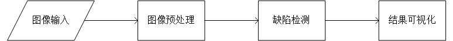

# 基于概率模型和高阶异常度量的零负样本缺陷检测

## 1 介绍
在本系统中，目的是基于MindX SDK，在华为云昇腾平台上，开发端到端**缺陷检测**的参考设计，我们采用的模型是PatchCore模型：[Towards Total Recall in Industrial Anomaly Detection](https://arxiv.org/abs/2106.08265)，在MvTec数据集上进行了实验，实现**基于图像Patch的无监督异常检测算法**。模型的主要参考代码：[https://github.com/amazon-science/patchcore-inspection](https://github.com/amazon-science/patchcore-inspection)

### 1.1 支持的产品

支持昇腾310芯片

### 1.2 支持的版本

支持21.0.4版本

eg：版本号查询方法，在Atlas产品环境下，运行命令：

```
npu-smi info
```
本样例配套的CANN版本为[5.0.4](https://www.hiascend.com/software/cann/commercial)。支持的SDK版本为[2.0.4](https://www.hiascend.com/software/Mindx-sdk)。

MindX SDK安装前准备可参考《用户指南》，[安装教程](https://gitee.com/ascend/mindxsdk-referenceapps/blob/master/docs/quickStart/1-1安装SDK开发套件.md)

### 1.3 软件方案介绍

本系统设计了不同的功能模块。主要流程为：图片传入流中，通过numpy对图像按要求缩放，利用PatchCore的检测模型检测缺陷，最后输出识别结果。各模块功能描述如表1所示：

表1 系统方案中各模块功能：

| 序号 | 子系统   | 功能描述                                                |
| :--- | :------- | :------------------------------------------------------ |
| 1    | 图像输入 | 调用MindX SDK的appsrc输入图片                           |
| 2    | 图像放缩 | 根据config.yaml文件，通过代码将不同数据集缩放到对应尺寸 |
| 3    | 缺陷检测 | 利用PatchCore检测模型，检测出图片中缺陷位置             |
| 4    | 结果输出 | 输出instance_auroc评分                                  |

### 1.4 代码目录结构与说明

本工程名称为PatchCoreAnomalyDetection，工程目录如下图所示：

```
├── models             
│   ├── wideresnet101_224_layer2.om     # 尺寸为224，特征图为layer2层的缺陷检测模型
│   ├── wideresnet101_280_layer2.om     # 尺寸为280，特征图为layer2层的缺陷检测模型
│   ├── wideresnet101_320_layer2.om     # 尺寸为320，特征图为layer2层的缺陷检测模型
│   ├── wideresnet101_320_layer3.om     # 尺寸为320，特征图为layer3层的缺陷检测模型
├── faiss-index-performance             # 该目录性能测试所需用到的faiss
├── images                              # 该目录 readme文件中的图片
├── mvtec                               # 数据集存放文件夹
├── calculate_txt_avg.py                # 计算平均值	
├── config.yaml                         #子数据集配置文件
├── eval_performance.py					# 测试性能	
├── eval_performance.sh					# 测试性能命令行
├── eval_precision.py					# 测试精度	
├── eval_precision.sh				    # 测试精度命令行
├── README.md                           # 数据集存放文件夹
├── main.py								
└── utils.py                            # 工具类
```

### 1.5 技术实现流程图



图1 基于概率模型和高阶异常度量的零负样本缺陷检测流程图


图2 基于概率模型和高阶异常度量的零负样本缺陷检测pipeline示意图

### 1.6 特性及适用场景

项目适用于光照条件较好，背景简单，且图片较清晰的测试图片。

## 2 环境依赖

eg：推荐系统为ubuntu 18.04或centos 7.6，环境依赖软件和版本如下表：

|   软件名称    |    版本     |
| :-----------: | :---------: |
|    ubantu     | 18.04.1 LTS |
|   MindX SDK   |    2.0.4    |
|    Python     |    3.9.2    |
|     CANN      |    5.0.4    |
|     numpy     |   1.22.3    |
| opencv-python |    4.5.5    |
|   faiss-cpu   |    1.7.2    |

在编译运行项目前，需要设置环境变量：

- 环境变量介绍

```bash
# 执行如下命令，打开.bashrc文件
vim ~/.bashrc
# 在.bashrc文件中添加以下环境变量
. ${MX_SDK_HOME}/set_env.sh
. ${HOME}/Ascend/ascend-toolkit/set_env.sh
# 其中${MX_SDK_HOME}为MindX SDK安装目录，${HOME}为用户目录（如果CANN 开发包装在用户目录，否则为/usr/local/），配置的时候请自行替换成相应目录
# 保存退出.bashrc文件
# 执行如下命令使环境变量生效
source ~/.bashrc

#查看环境变量
env
```

## 3 模型转换

本项目使用的模型是 WideResnet101 模型。

从 pytorch官网获取pth模型，在运行项目之前需要将 pth 模型转为mindspore可以加载的ckpt模型，mindspore训练过程中将ckpt模型转化为 air 模型，再由ATC命令将 air 模型转为 om 模型。

模型转换工具（ATC）相关介绍如下 [https://support.huaweicloud.com/tg-cannApplicationDev330/atlasatc_16_0005.html](https://gitee.com/link?target=https%3A%2F%2Fsupport.huaweicloud.com%2Ftg-cannApplicationDev330%2Fatlasatc_16_0005.html)

具体步骤如下

Ascend910(PatchCoreAnomalyDetection_mindspore目录)：

 	1. 下载pth文件，PatchCore使用预训练模型提取图像特征，训练过程采用wideresnet101作为backbone，并提取layer2，layer3进行特征聚合。wideresnet101的pth下载链接：[wide_resnet101_2](https://download.pytorch.org/models/wide_resnet101_2-32ee1156.pth)，将下载好的pth文件放在mindspore训练代码目录下
 	2. 将pth文件转为mindspore可以加载的ckpt文件

```bash
python pthtockpt.py --pth_path wide_resnet101_2-32ee1156.pth
```

3. 训练所有子数据集

```bash
python train_all.py --dataset_path path/to/mvtec/ --results /path/to/results/ --gpu 0
```

​	训练结束之后会在./results(默认为results)目录下保存训练出的faiss文件(./results/exp_n/models/})，训练结束之后保存的faiss文件需要移动到Ascend310(即PatchCoreAnomalyDetection目录下的faiss-index-precision目录)。同时会保存**air文件**，用于转换om模型，完成MindX SDK推理。所有子数据集训练完成，会生成wideresnet101_layer2.air和wideresnet_layer3.air文件，通过拆分特征层，提升最终推理的性能。将文件上传至310推理环境。

Ascend310(PatchCoreAnomalyDetection目录):

1. 将mindspore训练转化好的air模型放置 ./models 目录下。
2. 创建faiss-index-precision目录

```bash
mkdir faiss-index-precision
```

3. 将mindspore训练得到的faiss文件保存在./faiss-index-precision

```bash
.
├── faiss-index-precision
│   ├── bottle
│   ├── cable
│   ├── capsule
│   ├── carpet
│   ├── grid
│   ├── hazelnut
│   ├── leather
│   ├── metal_nut
│   ├── pill
│   ├── screw
│   ├── tile
│   ├── toothbrush
│   ├── transistor
│   ├── wood
│   └── zipper
```

1. 进入./model文件夹下执行命令

```
atc --check_report=${modelzoo路径}/test/Ascend310/network_analysis.report --input_format=NCHW --output="./models/wideresnet101_224_layer2" --soc_version=Ascend310 --framework=1 --model="./models/wideresnet101_layer2.air" --input_shape="x:1,3,224,224"
atc --check_report=${modelzoo路径}/test/Ascend310/network_analysis.report --input_format=NCHW --output="./models/wideresnet101_280_layer2" --soc_version=Ascend310 --framework=1 --model="./models/wideresnet101_layer2.air" --input_shape="x:1,3,280,280"
atc --check_report=${modelzoo路径}/test/Ascend310/network_analysis.report --input_format=NCHW --output="./models/wideresnet101_320_layer2" --soc_version=Ascend310 --framework=1 --model="./models/wideresnet101_layer2.air" --input_shape="x:1,3,320,320"
atc --check_report=${modelzoo路径}/test/Ascend310/network_analysis.report --input_format=NCHW --output="./models/wideresnet101_320_layer2" --soc_version=Ascend310 --framework=1 --model="./models/wideresnet101_layer3.air" --input_shape="x:1,3,320,320"
```

   4.执行该命令会在当前目录下生成项目需要的om模型文件。执行后终端输出为

```
ATC start working now, please wait for a moment.
ATC run success, welcome to the next use.
```

表示命令执行成功模型成功转换。

## 4 编译与运行

当已有模型的om文件，保存在./models/下

**步骤 1** 将数据集存到当前目录下(./PatchCoreAnomalyDetection）。如果数据集不在当前目录下（./PatchCoreAnomalyDetection），需要修改 main.py 的数据集路径指向到所在目录。

**步骤 2** 按照模型转换获取om模型，放置在 ./models 路径下。

**步骤 3** 在命令行输入 如下命令运行整个工程。

```
python3 main.py
```

**步骤 4** 图片检测。运行结束输出训练精度。

## 5 测试精度

运行如下命令完成精度测试，输出模型instance_auroc_topk10。

```
. eval_precision.sh
```

模型在MvTec数据集上的精度达标，最终模型平均instance_auroc_topk10输出值为99.68%，满足精度要求（imagelevel_auroc≥ 99.5%）。

## 6 测试性能

运行如下命令完成精度测试，输出模型平均性能。

```
. eval_performance.sh
```

模型在MvTec数据集上的性能达标，最终模型平均推理时间为0.027729319ms，性能36FPS，满足性能要求（FPS≥ 20）。
