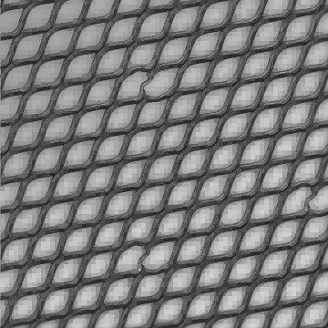
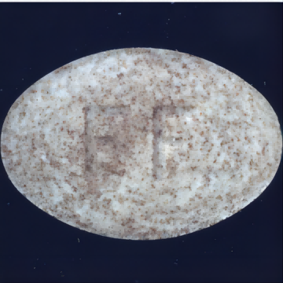

# 基于概率模型和高阶异常度量的零负样本缺陷检测

## 1. 项目概述

该项目基于MindSpore实现算法训练与优化，并在MindX SDK实现推理部署；

项目选取的算法是Patchcore，并在此基础上进行精度和性能的优化和提升。PatchCore是2021年提出的基于预训练神经网络的工业异常检测模型，截至2021年末在MVTex-AD数据集上精度排名第一。PatchCore训练时仅使用正常样本，训练过程中不对网络参数进行更新(无反向传播)，将每张图片的网络输出(图片对应区域的特征表示)保存作为“Memory Bank”的一部分，最后进行采样操作得到最终“Memory Bank”。推理时加载“Memory Bank”，得到某张图片的网络输出后，通过论文定义的计算得到该图片score，以输出异常图。

该项目通过对数据增强，异常度量以及特征后处理进行优化，针对每一个子数据集进行性能和精度的提升。

## 2. 数据集

使用的数据集：[MVTec AD](https://www.mvtec.com/company/research/datasets/mvtec-ad/)

- 数据集大小：4.9G，共15个类、5354张图片
  - 训练集：共3629张
  - 测试集：共1725张
- 目录结构

```
mvtec
|-- bottle
|-----|----- ground_truth
|-----|----- test
|-----|--------|------ good
|-----|--------|------ broken_large
|-----|--------|------ ...
|-----|----- train
|-----|--------|------ good
|-- cable
|-- ...
```

## 3. 环境依赖

| 软件名称  |    版本     |
| :-------: | :---------: |
|  ubantu   | 18.04.1 LTS |
|  Python   |   3.9.13    |
| mindspore |    1.8.1    |
|   numpy   |   1.22.3    |
| faiss-cpu |    1.7.2    |

## 4. pthtockpt

1. 下载pth文件，PatchCore使用预训练模型对提取特征，训练过程采用wideresnet101作为backbone，并提取layer2，layer3进行特征聚合。wideresnet101的pth下载链接：[wide_resnet101_2](https://download.pytorch.org/models/wide_resnet101_2-32ee1156.pth)，将下载好的pth文件放在项目目录下
2. 将pth文件转为mindspore可以加载的ckpt文件

```bash
python pthtockpt.py --pth_path wide_resnet101_2-32ee1156.pth
```

## 5. 训练

- 训练所有子数据集

```bash
python train_all.py --dataset_path path/to/mvtec/ --results /path/to/results/ --gpu 0
```

​ 训练结束之后会在./results(默认为results)目录下保存训练出的faiss文件(./results/exp_n/models/})，训练结束之后保存的faiss文件需要移动到Ascend310(即PatchCoreAnomalyDetection目录下的faiss-index-precision目录)。同时会保存air文件，用于转换om模型，完成MindX SDK推理。所有子数据集训练完成，会生成wideresnet101_layer2.air和wideresnet_layer3.air文件，通过拆分特征层，提升最终推理的性能。将文件上传至310推理环境。件，通过拆分特征层，提升最终推理的性能。

- 训练某一个子数据集

```bash
python train.py -d bottle --resize 256 --imagesize 224 --gpu 0 -le layer2 -p 0.01 --patchsize 3
```

 ## 6. 优化方式

### 6.1 数据增强

在15个子数据集中，PatchCore方法统一采用resize为256X256（或320X320，366X366大小）大小，然后对其进行中心裁剪，裁剪的规格为224X224（280X280,320X320规格），即resize大小约为imagesize的1.14倍，但是对于多数子数据集，以此方式进行数据增强会丢失边缘信息，每个子数据集的目标占整张图片的大小并不是固定的。例如grid、pill、carpet、metal_nut等等，该数据增强方式严重影响精度。




通过实验对每个子数据集选取合适的resize和imagesize,使得目标能完整的呈现在图像中。resize和imagesize的值如下表所示：

|     dataset      | resize | imagesize |
| :--------------: | :----: | :-------: |
|   mvtec_bottle   |  256   |    224    |
|   mvtec_cable    |  336   |    320    |
|  mvtec_capsule   |  328   |    320    |
|   mvtec_carpet   |  336   |    320    |
|    mvtec_grid    |  320   |    320    |
|  mvtec_hazelnut  |  256   |    224    |
|  mvtec_leather   |  256   |    224    |
| mvtec_metal_nut  |  256   |    224    |
|    mvtec_pill    |  284   |    280    |
|   mvtec_screw    |  368   |    320    |
|    mvtec_tile    |  332   |    320    |
| mvtec_toothbrush |  256   |    224    |
| mvtec_transistor |  336   |    320    |
|    mvtec_wood    |  256   |    224    |
|   mvtec_zipper   |  256   |    224    |

### 6.2 表征能力与性能增强

​	由于wideresnet_101是在ImageNet数据集上进行预训练，ImageNet图像为自然图像，其分布可能偏离Mvtec数据集，尤其是深层特征，wideresnet作用在Mvtec数据集上，得到的深层特征不会很好的表征输入图像，所以该项目通过分离浅层特征与深层特征，提升模型在Mvtec上的表征能力，同时提升推理性能。针对不同子数据集，layer大小与coreset比例大小如下所示：

|     dataset      | layer  | coreset percentage |
| :--------------: | :----: | :----------------: |
|   mvtec_bottle   | layer2 |        0.01        |
|   mvtec_cable    | layer3 |        0.01        |
|  mvtec_capsule   | layer3 |        0.04        |
|   mvtec_carpet   | layer3 |        0.04        |
|    mvtec_grid    | layer2 |        0.01        |
|  mvtec_hazelnut  | layer2 |       0.009        |
|  mvtec_leather   | layer2 |        0.01        |
| mvtec_metal_nut  | layer2 |        0.02        |
|    mvtec_pill    | layer2 |        0.01        |
|   mvtec_screw    | layer2 |        0.01        |
|    mvtec_tile    | layer2 |        0.01        |
| mvtec_toothbrush | layer2 |        0.01        |
| mvtec_transistor | layer3 |        0.01        |
|    mvtec_wood    | layer2 |        0.01        |
|   mvtec_zipper   | layer2 |        0.01        |


### 6.3 优化异常度量方式

​	PatchCore采用距离度量方式，通过比较测试图像中每一个patch的特征与Memory Bank存储的特征，计算距离得分，得分越高，图像为异常图像的可能性更高，以此作为图像级异常检测的指标。每一个patch都会得到一个具体的得分，利用每一个patch的得分进行图像分割，得出图像中的异常区域。对于异常图像的图像级分类，PatchCore以每张图像距离得分的最大值作为整张图像的异常得分。仅用一个patch的距离度量得分对于图像级分类来说在效果上来说还有提升的空间，往往图像中的异常特征是一个区域，或需要考虑异常特征与全局特征的关系，仅用峰值判断图像异常与否存在着一定的偶然性。因此，为子数据集选择合适的度量方式对图像级异常检测有很大意义。训练过程中通过采用多种异常度量方式来对图像级异常检测进行优化。

| dataset    | instance_auroc_max | instance_auroc_dx | instance_auroc_px | instance_auroc_topK5 | instance_auroc_topk8 | instance_auroc_topk10 | instance_auroc_topk15 | instance_auroc_topk20 | instance_auroc_topk40 | instance_auroc_topk60 | instance_auroc_topk100 | instance_auroc_best |
| ---------- | ------------------ | ----------------- | ----------------- | -------------------- | -------------------- | --------------------- | --------------------- | --------------------- | --------------------- | --------------------- | ---------------------- | ------------------- |
| bottle     | 1                  | 1                 | 0.994444444       | **1**                | 1                    | 1                     | 1                     | 1                     | 1                     | 1                     | 1                      | 1                   |
| cable      | 0.997001499        | 0.989505247       | 0.973013493       | 0.998125937          | 0.998125937          | 0.998313343           | **0.99850075**        | 0.998125937           | 0.997001499           | 0.996064468           | 0.991941529            | 0.99850075          |
| capsule    | **0.992421221**    | 0.984443558       | 0.969285999       | 0.992022337          | 0.990426805          | 0.989629039           | 0.987634623           | 0.986836857           | 0.985640207           | 0.983645792           | 0.984044675            | 0.992421221         |
| carpet     | **1**              | 1                 | 0.886035313       | 0.999598716          | 0.999598716          | 0.999598716           | 0.999598716           | 0.998394864           | 0.995585875           | 0.985955056           | 0.967897271            | 1                   |
| grid       | 1                  | 0.98663325        | 0.73015873        | **1**                | 1                    | 0.998329156           | 0.997493734           | 0.996658312           | 0.995822891           | 0.993316625           | 0.98663325             | 1                   |
| hazelnut   | 1                  | 0.995357143       | 0.97              | **1**                | 1                    | 1                     | 1                     | 1                     | 1                     | 0.999285714           | 0.9975                 | 1                   |
| leather    | 0.999660326        | 0.995584239       | 0.720108696       | **1**                | 0.999660326          | 0.999660326           | 0.999320652           | 0.997282609           | 0.988451087           | 0.979619565           | 0.960258152            | 1                   |
| metal_nut  | 0.998044966        | 0.975562072       | 0.920821114       | 0.999022483          | 0.998044966          | 0.998044966           | 0.998533724           | 0.998044966           | 0.99315738            | 0.987781036           | 0.972140762            | 0.999022483         |
| pill       | 0.984451718        | 0.945444626       | 0.86933988        | **0.987179487**      | 0.986633933          | 0.98608838            | 0.986633933           | 0.985542826           | 0.983633388           | 0.981451173           | 0.973540644            | 0.987179487         |
| screw      | 0.982168477        | 0.984423038       | 0.271981964       | 0.988317278          | 0.990161918          | 0.990571838           | 0.990776799           | 0.991801599           | 0.990161918           | 0.986882558           | 0.979094077            | 0.990571838         |
| tile       | 0.994588745        | 0.997835498       | 0.962842713       | **1**                | 1                    | 1                     | 1                     | 1                     | 0.99963925            | 0.999278499           | 0.998556999            | 1                   |
| toothbrush | 1                  | 1                 | 0.986111111       | **1**                | 1                    | 1                     | 1                     | 1                     | 1                     | 1                     | 1                      | 1                   |
| transistor | 1                  | 0.992916667       | 0.975833333       | **1**                | 1                    | 1                     | 0.999583333           | 0.997916667           | 0.99625               | 0.994583333           | 0.992916667            | 1                   |
| wood       | 0.993859649        | **0.996491228**   | 0.974561404       | 0.994736842          | 0.994736842          | 0.994736842           | 0.994736842           | 0.994736842           | 0.996491228           | 0.996491228           | 0.998245614            | 0.996491228         |
| zipper     | 0.993697479        | 0.995535714       | **0.998686975**   | 0.995535714          | 0.996323529          | 0.997111345           | 0.99789916            | 0.998686975           | 0.998686975           | 0.99894958            | 0.99894958             | 0.998686975         |
| Mean       | 0.995726272        | 0.989315485       | 0.880215011       | 0.996969253          | 0.996914198          | 0.996805597           | 0.996714151           | 0.996268564           | 0.994701447           | 0.992220309           | 0.986781281            | 0.9974999           |

instance_auroc_max为PatchCore的异常度量方式，instance_auroc_dx为方差度量方式，即测算每个patch与所有patch均值的差的平方。instance_auroc_px为均值度量方式，即以全局距离度量的均值作为图像的异常得分，instance_auroc_topkn即选取距离度量得分的前n个峰值的平均值作为异常度量的得分，其中instance_auroc_topKn取得最佳值，约比PatchCore采用的度量方式提升0.12%。取每组数据的最优度量方式的最终精度为0.9974999，相比PatchCore采用的度量方式提升0.17%。

## 7 Ascend310上推理结果


| dataset    | instance_auroc_max | instance_auroc_topk10 |
| ---------- | ------------------ | --------------------- |
| bottle     | 1                  | 1                     |
| cable      | 0.997001499        | 0.998313343           |
| capsule    | 0.992421221        | 0.989629039           |
| carpet     | 1                  | 0.999598716           |
| grid       | 1                  | 0.998329156           |
| hazelnut   | 1                  | 1                     |
| leather    | 0.999660326        | 0.999660326           |
| metal_nut  | 0.998044966        | 0.998044966           |
| pill       | 0.984178942        | 0.98608838            |
| screw      | 0.982168477        | 0.990571838           |
| tile       | 0.994949495        | 1                     |
| toothbrush | 1                  | 1                     |
| transistor | 1                  | 1                     |
| wood       | 0.993859649        | 0.994736842           |
| zipper     | 0.993434874        | 0.997111345           |
| Mean       | 0.9957             | 0.9968                |

## 8 参考

[MindSpore1.8](https://www.mindspore.cn/docs/zh-CN/r1.8/index.html)

[kqzhang/PatchCore - PatchCore - OpenI - 启智AI开源社区提供普惠算力！ (pcl.ac.cn)](https://openi.pcl.ac.cn/kqzhang/PatchCore)

[GitHub - amazon-science/patchcore-inspection](https://github.com/amazon-science/patchcore-inspection)

[[2106.08265\] Towards Total Recall in Industrial Anomaly Detection (arxiv.org)](https://arxiv.org/abs/2106.08265)

[GitHub - hcw-00/PatchCore_anomaly_detection: Unofficial implementation of PatchCore anomaly detection](https://github.com/hcw-00/PatchCore_anomaly_detection)
