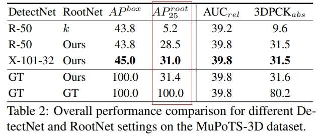

# 人体关键点检测

## 1. 介绍

人体关键点检测插件基于 MindX SDK 开发，在昇腾芯片上进行人体检测以及人体势关键点检测，将检测结果可视化并保存。输入一幅图像，可以检测得到图像中所有检测到的人以及人体势关键点连接成人体骨架。

人体识别是在输入图像上对人体进行检测，采取YOLOv3模型，将待检测图片输入模型进行推理，推理得到所有人体的位置坐标，之后根据人体的数量，使用方框在原来的图片上分别进行剪裁。

人体关键点检测是指在输入图像上对指定的 17 类人体骨骼关键点位置进行检测，包括左腿、右腿、脑袋等。然后将关键点正确配对组成相应的人体骨架，展示人体姿态，共 19 类人体骨架，如左肩和左肘两个关键点连接组成左上臂，右膝和右踝两个关键点连接组成右小腿等。本方案采取YOLOv3与3DMPPE-ROOTNET模型，将待检测图片输入模型进行推理，推理得到包含人体关键点的根节点信息，以及预先提供的其他16类关键点，然后结合人体信息特征将不同的关键点组合连接成为人体骨架，再将所有人体骨架连接组成不同的人体，最后将关键点和骨架信息标注在输入图像上，描绘人体姿态。本方案可以对遮挡人体、小人体、密集分布人体等进行检测，还适用于不同姿态（蹲坐、俯卧等）、不同方向（正面、侧面、背面等）以及模糊人体关键点检测等多种复杂场景。


### 1.1 支持的产品

本项目以昇腾Atlas 500 A2为主要的硬件平台。

### 1.2 支持的版本

本系统支持的版本如表1所示：

表1 支持的SDK版本：

| 软件名称  | 版本  |
| :-------: | :---: |
| MindX SDK | 5.0.RC1 |
| Ascend-CANN-toolkit    | 6.2.RC1 |


### 1.3 软件方案介绍

基于MindX SDK的人体关键点检测业务流程为：待检测图片通过 appsrc 插件输入，然后使用图像解码插件mxpi_imagedecoder对图片进行解码，再通过图像缩放插件mxpi_imageresize将图像缩放至满足检测模型要求的输入图像大小要求，缩放后的图像输入模型推理插件mxpi_tensorinfer得到检测人体坐标结果，经过mxpi_objectpostprocessor后处理后把发送给mxpi_imagecrop插件作resize处理，然后再计算一个参数，将mxpi_imagecrop插件的结果和参数一起发送给下一个mxpi_tensorinfer作关键点检测，从中提取关键点，最后通过输出插件 appsink 获取人体关键根节点。在python上实现关键点和关键点之间的连接关系，输出关键点连接形成的人体关键点，并保存图片。本系统的各模块及功能描述如表1所示：

表2 系统方案各模块功能描述：

| 序号 | 子系统             | 功能描述                                     |
| ---- | ------------------ | -------------------------------------------- |
| 1    | 图片输入           | 获取 jpg 格式输入图片                        |
| 2    | 图片解码           | 解码图片                                     |
| 3    | 图片缩放           | 将输入图片放缩到下一个模型指定输入的尺寸大小 |
| 4    | 模型推理           | 对输入张量进行推理，检测人体坐标             |
| 5    | 目标检测后处理推理 | 从模型推理结果进行后处理                     |
| 6    | 图片缩放           | 将输入图片放缩到下一个模型指定输入的尺寸大小 |
| 7    | 模型推理           | 对输入张量进行推理，检测人体关键点           |
| 8    | 结果输出           | 将人体关键点结果输出                         |


### 1.4 代码目录结构与说明

本工程名称为 PeopleKeypointDetection，工程目录如下所示：

```
.
├── main.py
├── main.sh
├── eval_pic.py
├── eval_pic.sh
├── img
│   ├── 1.1.png
│   ├── 2.1.png
│   └── 3.1.png
├── pipeline
│   ├── detection_3d.pipeline
│   ├── detection_yolov3_crop.pipeline
│   └── detection_yolov3.pipeline
├── pic
│   └── MuPoTS-3D.json
├── model
│   ├── people
│   │   ├── yolov3_tf_aipp.cfg
│   │   └── people.cfg
│   └── keypoint
│       
├── evals
│   └── eval.py
├── untils
│   └── ini.py
└── README.md
```

### 1.5 技术实现流程图

系统实现流程参见下图：

### 1.6 特性及使用场景

本方案采取YOLOv3与3DMPPE-ROOTNET模型，将待检测图片输入模型进行推理，推理得到包含人体关键点的根节点信息，以及预先提供的其他16类关键点，然后结合人体信息特征将不同的关键点组合连接成为人体骨架，再将所有人体骨架连接组成不同的人体，最后将关键点和骨架信息标注在输入图像上，描绘人体姿态。本方案可以对遮挡人体、小人体、密集分布人体等进行检测，还适用于不同姿态（蹲坐、俯卧等）、不同方向（正面、侧面、背面等）以及模糊人体关键点检测等多种复杂场景。可以在不同背景，不同数量的人体下进行测试，测试结果表明，模型在二维的结果中可以的检测十分准确，在三维的结果中误差稍微较大。

## 2 环境依赖

### 2.1 环境依赖说明

环境依赖软件和版本如下表：

|   软件名称    |    版本     |
| :-----------: | :---------: |
|    ubuntu     | 18.04.1 LTS |
|   MindX SDK   |    5.0.RC1    |
|    Python     |    3.9.2    |
|     CANN      |    6.2.RC1   |
|     numpy     |   1.22.3    |
| opencv-python |    4.5.5    |
|     cmake     |    3.5+     |
|   mxVision    |    5.0.RC1    |
|    natsort    |    8.2.0    |

### 2.2 环境搭建

```bash
#在CANN以及MindX SDK的安装目录找到set_env.sh,并运行脚本：
bash ${SDK安装路径}/set_env.sh
bash ${CANN安装路径}/set_env.sh
#查看环境变量：
env
```

### 2.3 模型转换

#### 2.3.1 YOLOv3模型转换

YOLOv3 模型参考[实现代码](https://www.hiascend.com/zh/software/modelzoo/detail/1/ba2a4c054a094ef595da288ecbc7d7b4)。使用模型转换工具 ATC 将pb模型转换为 om 模型，模型转换工具相关介绍[参考链接](https://gitee.com/ascend/docs-openmind/blob/master/guide/mindx/sdk/tutorials/%E5%8F%82%E8%80%83%E8%B5%84%E6%96%99.md)。

**步骤1** 在ModelZoo上下载[YOLOv3模型](https://ascend-repo-modelzoo.obs.cn-east-2.myhuaweicloud.com/model/2021-12-30_tf/ATC%20YOLOv3%28FP16%29%20from%20TensorFlow%20-%20Ascend310/zh/1.1/ATC%20YOLOv3%28FP16%29%20from%20TensorFlow%20-%20Ascend310.zip)。

**步骤2** 将获取到的YOLOv3模型pb文件存放至`./model/people/`文件夹下，文件名为：yolov3_tf.pb 。

**步骤3** 模型转换。

在`./model/people/`目录下执行以下命令：

```bash
atc --model=yolov3_tf.pb --framework=3 --output=yolov3_tf_aipp  --input_format=NHWC --output_type=FP32 --soc_version=Ascend310B1 --input_shape="input:1,416,416,3" --out_nodes="yolov3/yolov3_head/Conv_6/BiasAdd:0;yolov3/yolov3_head/Conv_14/BiasAdd:0;yolov3/yolov3_head/Conv_22/BiasAdd:0" --insert_op_conf=yolov3_tf_aipp.cfg
```

执行该命令后会在当前文件夹下生成项目需要的模型文件 yolov3_tf_aipp.om。执行后终端输出为：

```
ATC start working now, please wait for a moment.
ATC run success, welcome to the next use.
```

表示命令执行成功。

#### 2.3.2 3DMPPE-ROOTNET模型转换

3DMPPE-ROOTNET 模型参考[实现代码](https://www.hiascend.com/zh/software/modelzoo/detail/1/c7f19abfe57146bd8ec494c0b377517c)。

**步骤1** 在ModelZoo上下载格式为onnx的[3DMPPE-ROOTNET模型](https://ascend-repo-modelzoo.obs.cn-east-2.myhuaweicloud.com/model/22.1.12/ATC%203DMPPE%28FP16%29%20from%20Pytorch%20-%20Ascend310.zip)，使用模型转换工具 ATC 将 onnx 模型转换为 om 模型 。

**步骤2** 将获取到的 onnx 文件存放至`./model/keypoint/`文件夹下，文件名为：3DMPPE-ROOTNET.onnx。

**步骤3** 模型转换。

在`./model/keypoint/`目录下，执行以下命令：

```bash
atc --framework=5 --model=3DMPPE-ROOTNET.onnx --output=3DMPPE-ROOTNET_bs1 --input_format=NCHW --input_shape="image:1,3,256,256;cam_param:1,1" --soc_version=Ascend310B1
```

执行该命令后会在当前文件夹下生成项目需要的模型文件 3DMPPE-ROOTNET_bs1.om。执行后终端输出为：

```
ATC start working now, please wait for a moment.
ATC run success, welcome to the next use.
```

表示命令执行成功。

## 3 人体关键点检测实现

### 3.1 pipeline编排

```
    appsrc0						# 输入
    mxpi_imagedecoder0			# 图像解码
    mxpi_imageresize0			# 图像缩放
    mxpi_tensorinfer0			# 模型推理（YOLOv3）
    mxpi_objectpostprocessor0	# 模型后处理
    mxpi_imagecrop0 			# 图像裁剪
    mxpi_tensorinfer1			# 模型推理（3DMPPE-ROOTNET）
    appsink0					# 输出
```

### 3.2 主程序开发

1、初始化流管理。 

2、加载图像，进行推理。

3、获取pipeline各插件输出结果，解析输出结果。

4、根据识别结果在图上标出人体人体关键点信息和置信度。

5、销毁流。

## 4 编译与运行

**步骤1** 按照第 2.2 小节 **环境依赖** 中的步骤设置环境变量。

**步骤2** 按照第 2.3 小节 **模型转换** 中的步骤获得 om 模型文件，分别放置在 ``./model/people/`` 和 ``./model/keypoint/`` 目录下。

**步骤3** 下载[coco.names]([yolo_objectDetection_imagesCPU/coco.names at master · misbah4064/yolo_objectDetection_imagesCPU · GitHub](https://github.com/misbah4064/yolo_objectDetection_imagesCPU/blob/master/coco.names))，重命名为coco_people.names并放置在 ``./model/people/``  目录下。

**步骤4** 下载[MuPoTS数据集](http://gvv.mpi-inf.mpg.de/projects/SingleShotMultiPerson/MultiPersonTestSet.zip)MultiPersonTestSet，并将数据集解压在pic文件夹下。

**步骤5** 生成ini配置文件。在untils文件夹中，执行命令：

```
python ini.py
```

生成的ini配置文件将存放在数据集文件夹内。

**步骤6** 图片检测。在pic文件夹内新建test文件夹，将MuPoTS数据集内任意一张xxx.png及其对应的xxx.ini拷贝到test文件夹下，其分别对应IMG_PATHC 和Config_FileC路径。对图片进行检测，执行命令：

```
pip install natsort
bash main.sh
```

命令执行成功后，在test目录下会生成检测结果文件，即 img_xxxxxxoutput_root_2d_n.jpg（n为0，1，2...n，即人体的序列号）、img_xxxxxxoutput_root_2d_pose.jpg、img_xxxxxxoutput_root_3d_pose.png。在主目录下会生成此组测试数据的bbox_root_mupots_output.json结果文件。

## 5 精度验证

**步骤1** 执行以下命令：

```
bash eval_pic.sh
```

运行完成后，在主目录下会生成的bbox_root_mupots_output.json，在数据集文件夹内会生成结果图，注意记录控制台最后显示的测试数据数量。

**步骤2** 将bbox_root_mupots_output.json和MuPoTS-3D.json放在项目的evals目录下，进行精度验证，执行命令：

```
python3 eval.py
```

命令执行成功后，在控制台查看精度结果为32.26%，要求精度为31.87%，符合要求。



## 6 常见问题

### 6.1 环境变量配置错误

**问题描述：**

在执行样例时报错“No module named 'StreamManagerApi'”。

**解决方案：**

重新配置环境变量后问题解决。

### 6.2 图片格式问题

**问题描述：**

提示Get picture description(width, height) failed. DVPP only support jpg. Device Soc: 310。

**解决方案：**

输入图片不是真正的jpg格式，由png等文件强制转后缀而来，ACL不支持，需要转存为原生jpg格式。

### 6.3 缺失依赖包问题

**问题描述：**

执行main.py时，cv2包引入失败，显示文件不存在。类似的问题还有报错“No module named 'google'”。

**解决方案：**

cv2包引入失败是由于缺少opencv依赖包，执行`pip install opencv-python-headless`后安装成功。然后安装google依赖包。

### 6.4 C++环境问题

**问题描述：**

尝试在服务器运行eval.py时，显示“No module named 'pycocotools'”，尝试安装pycocotools包仍报错。

**解决方案：**

安装pycocotools包需要服务器端的C++编译环境，而服务器gcc版本不适应。故尝试在本地安装C++环境后问题解决，eval.py成功执行。

### 6.5 ini文件已存在问题

**问题描述：**

运行ini.py时报错：“with os.fdopen(os.open(save_path, FLAG_NUM, MODE_NUM), 'w', encoding='utf-8') as f: FileExistsError: [Errno 17] File exists: '../pic/MultiPersonTestSet/TS17/img_000000.ini'”

**解决方案：**

删除所有生成的ini文件后，重新运行
