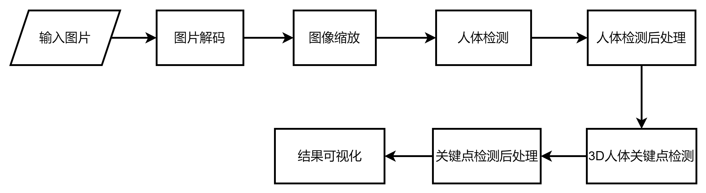

# 人体关键点检测

## 1. 介绍

人体关键点检测插件基于 MindX SDK 开发，在昇腾芯片上进行人体检测以及人体势关键点检测，将检测结果可视化并保存。输入一幅图像，可以检测得到图像中所有检测到的人以及人体势关键点连接成人体骨架。

人体识别是在输入图像上对人体进行检测，采取YOLOv3模型，将待检测图片输入模型进行推理，推理得到所有人体的位置坐标，之后根据人体的数量，使用方框在原来的图片上分别进行剪裁。

人体关键点检测是指在输入图像上对指定的 17 类人体骨骼关键点位置进行检测，包括左腿、右腿、脑袋等。然后将关键点正确配对组成相应的人体骨架，展示人体姿态，共 19 类人体骨架，如左肩和左肘两个关键点连接组成左上臂，右膝和右踝两个关键点连接组成右小腿等。本方案采取YOLOv3与3DMPPE-ROOTNET模型，将待检测图片输入模型进行推理，推理得到包含人体关键点的根节点信息，以及预先提供的其他16类关键点，然后结合人体信息特征将不同的关键点组合连接成为人体骨架，再将所有人体骨架连接组成不同的人体，最后将关键点和骨架信息标注在输入图像上，描绘人体姿态。本方案可以对遮挡人体、小人体、密集分布人体等进行检测，还适用于不同姿态（蹲坐、俯卧等）、不同方向（正面、侧面、背面等）以及模糊人体关键点检测等多种复杂场景。


### 1.1 支持的产品

本项目以昇腾Atlas310卡为主要的硬件平台。

### 1.2 支持的版本

本系统支持的版本如表1所示：

表1 支持的SDK版本：

| 软件名称  | 版本  |
| :-------: | :---: |
| MindX SDK | 2.0.4 |
|   CANN    | 5.0.4 |


### 1.3 软件方案介绍

基于MindX SDK的人体关键点检测业务流程为：待检测图片通过 appsrc 插件输入，然后使用图像解码插件mxpi_imagedecoder对图片进行解码，再通过图像缩放插件mxpi_imageresize将图像缩放至满足检测模型要求的输入图像大小要求，缩放后的图像输入模型推理插件mxpi_tensorinfer得到检测人体坐标结果，经过mxpi_objectpostprocessor后处理后把发送给mxpi_imagecrop插件作resize处理，然后再计算一个参数，将mxpi_imagecrop插件的结果和参数一起发送给下一个mxpi_tensorinfer作关键点检测，从中提取关键点，最后通过输出插件 appsink 获取人体关键根节点。在python上实现关键点和关键点之间的连接关系，输出关键点连接形成的人体关键点，并保存图片。本系统的各模块及功能描述如表1所示：

表2 系统方案各模块功能描述：

| 序号 | 子系统             | 功能描述                                     |
| ---- | ------------------ | -------------------------------------------- |
| 1    | 图片输入           | 获取 jpg 格式输入图片                        |
| 2    | 图片解码           | 解码图片                                     |
| 3    | 图片缩放           | 将输入图片放缩到下一个模型指定输入的尺寸大小 |
| 4    | 模型推理           | 对输入张量进行推理，检测人体坐标             |
| 5    | 目标检测后处理推理 | 从模型推理结果进行后处理                     |
| 6    | 图片缩放           | 将输入图片放缩到下一个模型指定输入的尺寸大小 |
| 7    | 模型推理           | 对输入张量进行推理，检测人体关键点           |
| 8    | 结果输出           | 将人体关键点结果输出                         |


### 1.4 代码目录结构与说明

本工程名称为 PeopleKeypointDetection，工程目录如下所示：

```
.
├── main.py
├── img
│   ├── 1.1.png
│   └── 2.1.png
├── pipeline
│   ├── detection_3d.pipeline
│   ├── detection_yolov3_crop.pipeline
│   └── detection_yolov3.pipeline
├── pic
│   └── MuPoTS-3D.json
├── model
│   ├── people
│   │   ├── model_conversion.sh
│   │   ├── coco.names
│   │   ├── yolov3_tf_aipp.cfg
│   │   └── people.cfg
│   └── keypoint
│       └── model_conversion.sh
├── evals
│   ├── eval_pic.py
│   └── eval.py
├── untils
│   └── ini.py
├── set_env.sh
└── README.md
```

### 1.5 技术实现流程图

系统实现流程参见图1.1：


<center>图1.1 技术流程图</center>

## 2 环境依赖

### 2.1 环境依赖说明

环境依赖软件和版本如下表：

|   软件名称    |    版本     |
| :-----------: | :---------: |
|    ubuntu     | 18.04.1 LTS |
|   MindX SDK   |    2.0.4    |
|    Python     |    3.9.2    |
|     CANN      |    5.0.4    |
|     numpy     |   1.22.3    |
| opencv-python |    4.5.5    |
|     cmake     |    3.5+     |
|   mxVision    |    2.0.4    |

### 2.2 环境搭建

#### 2.2.1 环境变量设置

```bash
# 打开set_env.sh文件，修改install_path和MX_SDK_HOME路径。
# 执行bash set_env.sh命令。
#查看环境变量。
env
```

- 环境变量介绍

```
# MX_SDK_HOME: mxVision SDK 安装路径
# LD_LIBRARY_PATH: lib库路径
# PYTHONPATH: python环境路径
```

### 2.3 模型转换

#### 2.3.1 YOLOv3模型转换

YOLOv3 模型参考实现代码：https://www.hiascend.com/zh/software/modelzoo/detail/1/ba2a4c054a094ef595da288ecbc7d7b4

使用模型转换工具 ATC 将pb模型转换为 om 模型，模型转换工具相关介绍参考链接：https://support.huaweicloud.com/tg-cannApplicationDev330/atlasatc_16_0005.html

**步骤1** 在ModelZoo上下载YOLOv3模型。下载地址：https://ascend-repo-modelzoo.obs.cn-east-2.myhuaweicloud.com/model/2021-12-30_tf/ATC%20YOLOv3%28FP16%29%20from%20TensorFlow%20-%20Ascend310/zh/1.1/ATC%20YOLOv3%28FP16%29%20from%20TensorFlow%20-%20Ascend310.zip

**步骤2** 将获取到的YOLOv3模型pb文件存放至`./model/people/`文件夹下，文件名为：yolov3_tf.pb 。

**步骤3** 模型转换。

在`./model/people/`目录下执行以下命令：

```bash
bash model_convertion.sh
```

执行该命令后会在当前文件夹下生成项目需要的模型文件 yolov3_tf_aipp.om。执行后终端输出为：

```
ATC start working now, please wait for a moment.
ATC run success, welcome to the next use.
```

表示命令执行成功。

#### 2.3.2 3DMPPE-ROOTNET模型转换

3DMPPE-ROOTNET 模型参考实现代码：https://www.hiascend.com/zh/software/modelzoo/detail/1/c7f19abfe57146bd8ec494c0b377517c。

**步骤1** 在ModelZoo上下载格式为onnx的3DMPPE-ROOTNET模型。下载地址：https://ascend-repo-modelzoo.obs.cn-east-2.myhuaweicloud.com/model/22.1.12/ATC%203DMPPE%28FP16%29%20from%20Pytorch%20-%20Ascend310.zip ，使用模型转换工具 ATC 将 onnx 模型转换为 om 模型 。

**步骤2** 将获取到的 onnx 文件存放至`./model/keypoint/`文件夹下，文件名为：3DMPPE-ROOTNET.onnx。

**步骤3** 模型转换。

在`./model/keypoint/`目录下执行以下命令：

```bash
bash model_convertion.sh
```

执行该命令后会在当前文件夹下生成项目需要的模型文件 3DMPPE-ROOTNET_bs1.om。执行后终端输出为：

```
ATC start working now, please wait for a moment.
ATC run success, welcome to the next use.
```

表示命令执行成功。

## 3 人体关键点检测实现

### 3.1 pipeline编排

```
    appsrc0						# 输入
    mxpi_imagedecoder0			# 图像解码
    mxpi_imageresize0			# 图像缩放
    mxpi_tensorinfer0			# 模型推理（YOLOv3）
    mxpi_objectpostprocessor0	# 模型后处理
    mxpi_imagecrop0 			# 图像裁剪
    mxpi_tensorinfer1			# 模型推理（3DMPPE-ROOTNET）
    appsink0					# 输出
```

### 3.2 主程序开发

1、初始化流管理。 

2、加载图像，进行推理。

3、获取pipeline各插件输出结果，解析输出结果。

4、根据识别结果在图上标出人体人体关键点信息和置信度。

5、销毁流。

## 4 编译与运行

**步骤1** 根据环境SDK的安装路径配置detection_yolov3.pipeline和detection_yolov3_crop.pipeline中的{$MX_SDK_HOME}。

**步骤2** 按照第 3.2 小节 **环境依赖** 中的步骤设置环境变量。

**步骤3** 按照第 3.3 小节 **模型转换** 中的步骤获得 om 模型文件，放置在 ``./model/people/`` 和 ``./model/keypoint/`` 目录下。

**步骤4** 在[https://mindx.sdk.obs.cn-north-4.myhuaweicloud.com/mindxsdk-referenceapps%20/contrib/3DMPPE-ROOTNET/mupots-3d-eval.zip](https://vcai.mpi-inf.mpg.de/projects/SingleShotMultiPerson/)下载使用的MuPoTS数据集，包括MultiPersonTestSet以及MuPoTS-3D.json（标注），将整个MultiPersonTestSet数据集和MuPoTS-3D.json放在pic文件夹下。然后在untils中找到ini.py运行生成需要的ini文件数据。在pic文件夹内新建test文件夹，将其中任意一组xxx.png和xxx.ini数据拷贝到test文件夹下。

**步骤5** 图片检测。对图片上进行检测，执行命令：

```
python3 main.py
```

命令执行成功后在当前目录下生成检测结果文件 output_root_2d_x.jpg（x为0，1，2...n，n为人体的数量）、output_root_2d_pose.jpg、output_root_3d_pose.png以及bbox_root_mupots_output.json查看结果文件验证检测结果。

**步骤6** 精度验证。删除test文件夹和主目录下的bbox_root_mupots_output.json。将evals文件夹中的eval_pic.py移至主目录下（不移动需要修改其中的图片和pipeline的路径）。运行eval_pic.py来生成bbox_root_mupots_output.json。然后将bbox_root_mupots_output.json和MuPoTS-3D.json放在项目的evals目录下，进行精度验证，注意修改eval.py中测试数据的数量，执行命令：

```
python3 eval.py
```

命令执行成功后在控制台查看精度结果。

## 5 常见问题

### 5.1 环境变量配置错误

**问题描述：**

在执行样例时报错“No module named 'StreamManagerApi'”。

**解决方案：**

重新配置环境变量后问题解决。

### 5.2 图片格式问题

**问题描述：**

提示Get picture description(width, height) failed. DVPP only support jpg. Device Soc: 310。

**解决方案：**

输入图片不是真正的jpg格式，由png等文件强制转后缀而来，ACL不支持，需要转存为原生jpg格式。

### 5.3 未修改pipeline中后处理插件的postProcessLibPath属性

**问题描述：**

提示 The postProcessing DLL does not exist。

**解决方案：**

修改pipeline文件中**mxpi_objectpostprocessor0**插件的`postProcessLibPath`属性，修改为`{SDK安装路径}/lib/modelpostprocessors/libYOLOv3postprocess.so`。

### 5.4 缺失依赖包问题

**问题描述：**

执行main.py时，cv2包引入失败，显示文件不存在。类似的问题还有报错“No module named 'google'”。

**解决方案：**

cv2包引入失败是由于缺少opencv依赖包，执行`pip install opencv-python-headless`后安装成功。然后安装google依赖包。

### 5.5 C++环境问题

**问题描述：**

尝试在服务器运行eval.py时，显示“No module named 'pycocotools'”，尝试安装pycocotools包仍报错。

**解决方案：**

安装pycocotools包需要服务器端的C++编译环境，而服务器gcc版本不适应。故尝试在本地安装C++环境后问题解决，eval.py成功执行。