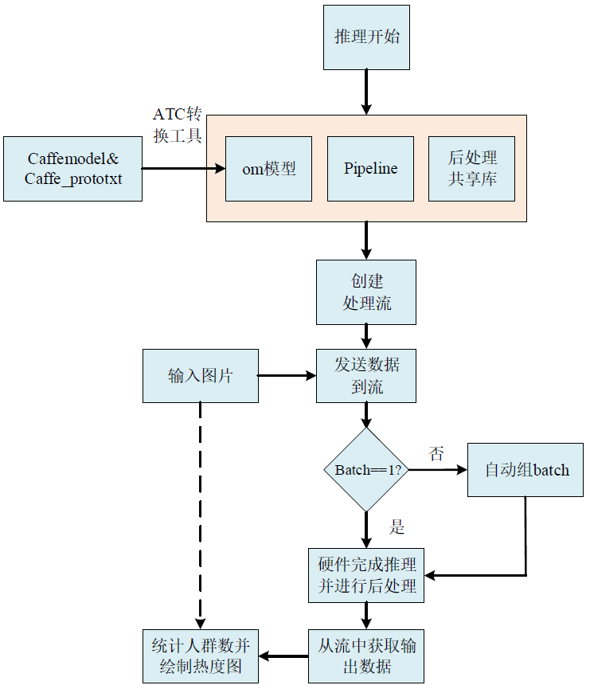

人群密度计数

## 1 介绍
项目的概述：基于MindX SDK，在昇腾平台上，开发端到端人群计数-人群密度估计，输入一幅人群图像，输出图像当中人的计数（估计）的结果。  
  
项目的主要流程：  
（1）输入类型是图片数据（jpg图片序列）,本项目使用的数据集图片来源是https://mindx.sdk.obs.cn-north-4.myhuaweicloud.com/mindxsdk-referenceapps%20/contrib/PersonCount/data.zip   
（2）通过调用MindX SDK提供的图像解码接口mxpi_imagedecoder，解码后获取图像数据。  
（3）然后进行图像尺寸大小变换，调用MindX SDK提供的图像尺寸大小变换接口mxpi_imageresize插件，检测模式的输入图像大小要求高800，宽1408。  
（4）将尺寸变换后的图像数据输入人群计数模型进行推理,推理使用的caffemodel模型和om模型来源是https://mindx.sdk.obs.cn-north-4.myhuaweicloud.com/mindxsdk-referenceapps%20/contrib/PersonCount/model.zip。  
（5）模型后处理，调用MindX SDK提供的模型推理插件mxpi_modelinfer，后处理配置文件存放的地址是"models/insert_op.cfg"。然后调用MindX SDK提供的插件mxpi_dataserialize，将stream结果组装成json字符串输出。  
（6）模型输出经过后处理后，得到人群密度估计图和人群计数估计值。  
场景限制：  
  输入的图像应为人群图像，图像中含有多个人，能取得较好的推理效果。  
### 1.1 支持的产品

可列出项目所用的硬件平台、支持的硬件平台、访问方式等  
人群计数项目使用的硬件平台为华为海思Ascend310B。  
  
### 1.2 支持的版本  
  
推荐系统为ubantu 18.04。

| 软件名称 | 版本   |
| -------- | ------ |
| python    | 3.9.2     | 
| MindX SDK     |    5.0RC1    |
| CANN | 310使用6.3.RC1<br>310B使用6.2.RC1 |
  

### 1.3 软件方案介绍

请先总体介绍项目的方案架构。如果项目设计方案中涉及子系统，请详细描述各子系统功能。如果设计了不同的功能模块，则请详细描述各模块功能。
项目的方案架构：  

我们将人群计数任务划分为多个子任务，并针对每个子任务设计相应的子系统来实现相应的功能。  
表1.1 系统方案各子系统功能描述：  

| 序号 | 子系统 | 功能描述     |  
| ---- | ------ | ------------ |  
| 1    | 模型转换    | 利用昇腾SDK提供的ATC转换工具将caffemodel转换成om模型|  
| 2    | 后处理插件 | 获取推理结果，并计算人数，图片数据归一化，ObjectInfo中的mask用来存归一化后的图片数据，ObjectInfo中的classId用来存估计的人数 |  

### 1.4 代码目录结构与说明

```
│  build.sh  //用于生成后处理共享库的编译命令使用sh build.sh完成编译  
│  main.py   //对待检测图片进行人群计数的主体程序，包含读入图片数据、模型推理、写热度图等功能特性  
│  run.sh    //人群计数的运行脚本，运行main.py文件  
├─accuracy and performance //存放精度与性能测试的代码   
│  └─test.py  //精度与性能测试的代码   
│
├─config     //配置文件夹  
│  |--insert_op.cfg //生成om模型的config文件  
│  └─person.names  //label文件  
│      
├─img  //存放readme使用到的png图片  
│  |--tech_arch.png  //1.5节使用的技术实现流程图  
|  └─err1.png       //章节6使用到的错误报告截图  
│        
├─model //转换后的om模型  
│  |--insert_op.cfg  //模型转换需要的配置文件
│  └─count_person_8.caffe.om  
│  
├─pipeline 
│  └─test.pipeline 
├─Plugin1  //编译后处理插件所需的源文件，生成的共享库文件存放于build文件夹  
│  |--CMakeLists.txt  
│  |--Plugin1.cpp  
└─ └─Plugin1.h  
```

### 1.5 技术实现流程图



## 2 环境依赖

在编译运行项目前，需要设置环境变量：


```
. /usr/local/Ascend/ascend-toolkit/set_env.sh #toolkit默认安装路径，根据实际安装路径修改
. ${SDK_INSTALL_PATH}/mxVision/set_env.sh
```

## 编译与运行

**步骤1** 修改相应文件

修改main.py中的DATASET_PATH变量，该变量指向待检测的图片路径。修改main.py中gt_path变量，改变了指向待检测图片的groundtruth.

此外，如果想要得到pipeline中各个插件的具体运行时间，
可以修改SDK的sdk.conf文件，使得enable_ps变量为true.

**步骤2** 设置环境变量

按照第二章节设置环境变量所需的具体执行指令执行即可。

**步骤3** 编译

首先通过运行build.sh脚本文件生成后处理使用的共享库
```
sh build.sh
```
然后使用模型转换命令将caffe模型转化为om模型待使用
```
atc --input_shape="blob1:8,3,800,1408" --weight="model/count_person.caffe.caffemodel" --input_format=NCHW --output="model/count_person_8.caffe" --soc_version=Ascend310B1 --insert_op_conf=model/insert_op.cfg --framework=0 --model="model/count_person.caffe.prototxt"。
```

**步骤4** 运行

直接运行run.sh。

生成的热度图保存在当前目录的heat_map文件夹下，并且每张热度图的命名以原图片名称为前缀以heatmap为后缀。此外，我们还在文件夹accuracy and performance code提供了精度与性能测试代码，将test.py和test.sh拷贝到主目录中然后执行sh test.sh即可运行精度与性能测试代码。

