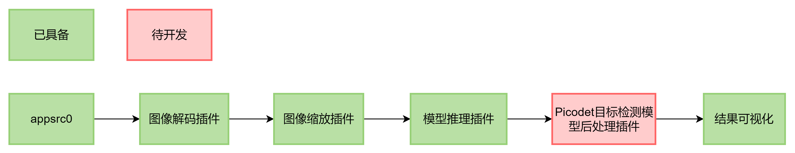
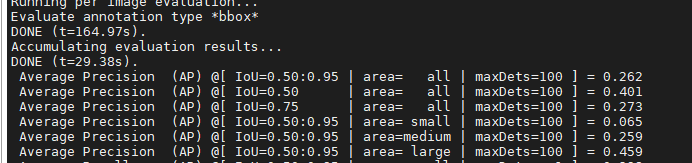

# PP-PicoDet目标检测

## 1 介绍
在案例基于MindX SDK，在昇腾平台上，使用PicoDet模型开发端到端目标检测的参考设计，并把可视化结果保存到本地，达到功能要求。

### 1.1 支持的产品

支持昇腾310芯片

### 1.2 支持的版本

支持的SDK版本为2.0.4。

eg：版本号查询方法，在Atlas产品环境下，运行命令：

```
npu-smi info
```

### 1.3 软件方案介绍

基于MindX SDK的目标检测业务流程为：待检测图片通过 appsrc 插件输入，然后使用图像解码插件 mxpi_imagedecoder 对图片进行解码，再通过图像缩放插件 mxpi_imageresize 将图像缩放至满足检测模型要求的输入图像大小要求，缩放后的图像输入模型推理插件 mxpi_tensorinfer 得到推理结果，推理结果输入 mxpi_objectpostprocessor 插件进行后处理，得到输入图片中所有的目标框位置和对应的置信度。最后通过输出插件 appsink 获取检测结果，并在外部进行可视化，将检测结果标记到原图上，本系统的各模块及功能描述如表1所示：

表1 系统方案各模块功能描述：

| 序号 | 子系统         | 功能描述                                                     |
| ---- | -------------- | ------------------------------------------------------------ |
| 1    | 图片输入       | 获取 jpg 格式输入图片                                        |
| 2    | 图片解码       | 解码图片                                                     |
| 3    | 图片缩放       | 将输入图片放缩到模型指定输入的尺寸大小                       |
| 4    | 模型推理       | 对输入张量进行推理                                           |
| 5    | 目标检测后处理 | 从模型推理结果计算检测框的位置和置信度，并保留置信度大于指定阈值的检测框作为检测结果 |
| 6    | 结果输出       | 获取检测结果                                                 |
| 7    | 结果可视化     | 将检测结果标注在输入图片上                                   |

### 1.4 代码目录结构与说明

本工程名称为 PicoDet，工程目录如下所示：

```
├── build.sh
├── dataset  //用户自行创建
│   ├── annotations
│   │   ├── instances_val2017.json
│   └── val2017
│       └── images
├── PicodetPostProcess
│   ├── build.sh
│   ├── CMakeLists.txt
│   ├── PicodetPostProcess.cpp
│   └── PicodetPostProcess.h
├── models
│   ├── coco.names //用户自行下载
│   ├── picodet.aippconfig
│   └── picodet.cfg
├── picodet.pipeline
├── evaluate.py
├── main.py
└── README.md
```

### 1.5 技术实现流程图



## 2 环境依赖

推荐系统为ubuntu 18.04，环境依赖软件和版本如下表：

| 软件名称       | 版本  |
| -------------- | ----- |
| ascend-toolkit | 5.0.4 |
| mxVision       | 2.0.4 |
| python         | 3.9.2 |

在编译运行项目前，需要设置环境变量：

```
. ${sdk_path}/set_env.sh
. ${ascend_toolkit_path}/set_env.sh
```

## 3 模型转换

### 3.1 模型获取

本项目中采用的模型是PP- PicoDet 模型，参考实现代码：[PaddleDetection/configs/picodet at release/2.3 · PaddlePaddle/PaddleDetection · GitHub](https://github.com/PaddlePaddle/PaddleDetection/tree/release/2.3/configs/picodet)，选用的模型是该项目中提供的模型 PicoDet-S（320*320），可以直接从链接获取可用的onnx模型：[下载链接](https://paddledet.bj.bcebos.com/deploy/third_engine/picodet_s_320_coco.onnx)。[备用链接](https://mindx.sdk.obs.cn-north-4.myhuaweicloud.com/mindxsdk-referenceapps%20/contrib/Picodet/picodet_s_320_coco.onnx)

### 3.2 模型转换

将下载好的onnx模型放入models目录下，执行转换命令：

```
atc --model=picodet_s_320_coco.onnx --output=picodet --output_type=FP32 --soc_version=Ascend310 --input_shape="image:1,3,320,320"  --insert_op_conf=picodet.aippconfig --input_format=NCHW --framework=5
```

## 4 编译与运行
**步骤1**  编译后处理插件，在主目录下执行如下命令

```
bash build.sh
```

**步骤2**  下载标签文件coco.names

下载文件[coco2014.names](https://gitee.com/ascend/ModelZoo-PyTorch/blob/master/ACL_PyTorch/built-in/cv/Yolov3_for_Pytorch/coco2014.names)，将下载的标签文件放入models目录中并修改文件名为**coco.names**

**步骤3**  执行推理

```
python3.9 main.py ${推理图片文件夹} ${结果保存文件夹}
```

### 精度测试

**步骤1**  下载cocoval2017[数据集](http://images.cocodataset.org/zips/val2017.zip)与[标注文件](http://images.cocodataset.org/annotations/stuff_annotations_trainval2017.zip)，放入主目录下的dataset文件夹中，确保目录结构如1.4章节所示

**步骤2**  修改 models/picodet.cfg中参数

```
SCORE_THRESH=0.025
NMS_THRESH=0.6
```

**步骤3**  执行测试脚本

```
python3.9 evaluate.py
```

得到精度结果



精度值达到 0.262，与源模型精度0.271相差0.009，满足精度要求