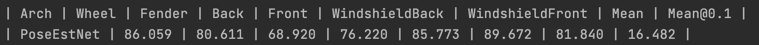

# MindXSDK 车辆姿态识别

## 1 简介
本开发样例基于MindX SDK实现了姿态估计网络(PoseEstNet)，用于检测并预测车辆36个关键点坐标，包括4个wheel，16个Fender，4个Back，4个Front，4个WindshieldBack以及4个WindshieldFront。

## 2 目录结构
本工程名称为PoseEstNet，工程目录如下图所示：

```
PoseEstNet
|---- models
|   |   |---- aipp_nv12.cfg
|   |   |---- coco.names
|   |   |---- PoseEstNet.om
|   |   |---- yolov3.cfg
|   |   |---- yolov3.om
|   |   |---- aipp_hrnet_256_256.aippconfig
|---- pipeline                          // 流水线配置文件夹
|   |   |---- eval_PoseEstNet.pipeline
|   |   |---- PoseEstNet.pipeline
|---- plugins                           // 插件文件夹
|   |   |---- postprocess
|   |   |   |   |---- CMakeLists.txt
|   |   |   |   |---- MxpiPNetPostprocess.cpp
|   |   |   |   |---- MxpiPNetPostprocess.h
|   |   |   |   |---- build.sh
|   |   |---- preprocess
|   |   |   |   |---- CMakeLists.txt
|   |   |   |   |---- MxpiPNetPreprocess.cpp
|   |   |   |   |---- MxpiPNetPreprocess.h
|   |   |   |   |---- build.sh
|   |   |---- build.sh
|---- data                              
|---- data_eval 
|   |   |---- images
|   |   |---- labels
|---- output                            // 结果保存文件夹                              
|---- output_eval       
|---- main.py
|---- eval.py
|---- pth2onnx.py
|---- README.md   
```

## 3 依赖

推荐系统为ubuntu 18.04，环境依赖软件和版本如下表：

| 软件名称 | 版本   |
| :--------: | :------:    |
|cmake       | 3.5+        | 
|mxVision    | 2.0.4       |
|CANN        | 5.0.4       |
|Python      | 3.9.12      |

注：MindX SDK使用python版本为3.9.12，如出现无法找到python对应lib库请在root下安装python3.9开发库  
```
apt-get install libpython3.9
```

## 4 特性及适应场景
车辆姿态过程主要存在两个阶段的模型检测：①yolov3车辆检测②PoseEstNet车辆姿态识别检测，因此检测效果也与这两个模型精度、检测结果密不可分。在经过不断测试与验证之后，模型在大部分情形下可以准确检测，但针对输入有以下限定：

1、针对MindX SDK固有插件的输入限制，输入图片应为JPEG编码格式，后缀为(.jpg)且宽高均在[32, 8192]区间内。当输入图片为空、输入图片格式不正确、图片尺寸不符合要求时，系统能够输出相应的错误信息。

2、由于输入图片可能存在特征表现不明显，例如非标准规格的卡车或车辆俯视图等情况导致yolov3模型检测不到车辆从而无法进行车辆姿态识别；

3、由于Dvpp的crop插件对图片尺寸有限制，所以图片中的车辆不应过小；

## 5 模型转换
车辆姿态识别先采用了yolov3模型将图片中的车辆检测出来，然后利用PoseEstNet模型预测车辆36个关键点坐标。

设置环境变量：
```
. /usr/local/Ascend/ascend-toolkit/set_env.sh
```

### 5.1 yolov3的模型转换  

**步骤1** 获取yolov3的原始模型(.pb文件)和相应的配置文件(.cfg文件)  
&ensp;&ensp;&ensp;&ensp;&ensp; [原始模型下载链接](https://mindx.sdk.obs.cn-north-4.myhuaweicloud.com/mindxsdk-referenceapps%20/contrib/PoseEstNet/yolov3_tensorflow_1.5.pb)
&ensp;&ensp;&ensp;&ensp;&ensp; [配置文件下载链接](https://mindx.sdk.obs.cn-north-4.myhuaweicloud.com/mindxsdk-referenceapps%20/contrib/PoseEstNet/aipp_nv12.cfg)  

**步骤2** 将获取到的yolov3模型.pb文件和.cfg文件存放至：“项目所在目录/models”  

**步骤3** .om模型转换  
以下操作均在“项目所在目录/models”路径下进行：  

***1*** 使用ATC将.pb文件转成为.om文件
```
atc --model=yolov3_tensorflow_1.5.pb --framework=3 --output=yolov3 --output_type=FP32 --soc_version=Ascend310 --input_shape="input:1,416,416,3" --out_nodes="yolov3/yolov3_head/Conv_6/BiasAdd:0;yolov3/yolov3_head/Conv_14/BiasAdd:0;yolov3/yolov3_head/Conv_22/BiasAdd:0" --log=info --insert_op_conf=aipp_nv12.cfg
```
***2*** 执行完模型转换脚本后，若提示如下信息说明模型转换成功，可以在该路径下找到名为yolov3.om模型文件。
（可以通过修改output参数来重命名这个.om文件）
```
ATC run success, welcome to the next use.
```  

### 5.2 PoseEstNet的模型转换

#### 5.2.1 模型概述  
&ensp;&ensp;&ensp;&ensp;&ensp; [PoseEstNet论文地址](https://arxiv.org/pdf/2005.00673.pdf)
&ensp;&ensp;&ensp;&ensp;&ensp; [PoseEstNet代码地址](https://github.com/NVlabs/PAMTRI/tree/master/PoseEstNet)

#### 5.2.2 模型转换步骤

**步骤1** .pth模型转.onnx模型

***1*** 获取.pth权重文件
```
wget --no-check-certificate -r 'https://docs.google.com/uc?export=download&id=1vD08fh-za3mgTJ9UkK1ASCTJAqypW0RL' -O models.zip
unzip models.zip
rm models.zip
```
[Huawei Cloud下载链接](https://mindx.sdk.obs.cn-north-4.myhuaweicloud.com/mindxsdk-referenceapps%20/contrib/PoseEstNet/models.rar)

***2*** 下载PoseEstNet源码并创建项目（源码地址详见5.2.1），将根目录切换为PAMTRI-master/PoseEstNet目录，将步骤1下载的models文件夹放进根目录

***3*** 获取pth2onnx.py （该文件已上传在本项目工程里），将本项目工程里的pth2onnx.py下载下来放在tools目录下，执行下列命令，生成.onnx模型文件
```
python3 tools/pth2onnx.py --cfg experiments/veri/hrnet/w32_256x256_adam_lr1e-3.yaml TEST.MODEL_FILE models/veri/pose_hrnet/w32_256x256_adam_lr1e-3/model_best.pth
```
> 注意目前ATC支持的onnx算子版本为11  

此时会得到PoseEstNet.onnx模型，到此步骤1已完成  
如果在线环境中无法安装pytorch，你可以在本地环境中进行上述.pth模型转.onnx模型操作，然后将得到的.onnx模型放在“项目所在目录/models”即可

本项目提供onnx模型：[Huawei Cloud下载链接](https://mindx.sdk.obs.cn-north-4.myhuaweicloud.com/mindxsdk-referenceapps%20/contrib/PoseEstNet/PoseEstNet.onnx)

**步骤2** .onnx模型转.om模型

***1*** 进入.onnx文件所在目录，使用ATC将.onnx文件转成为.om文件(aipp_hrnet_256_256.aippconfig在本项目models目录下，需要自行复制到转模型环境的目录，注意文件路径）
```
atc --framework=5 --model=PoseEstNet.onnx --output=PoseEstNet --input_format=NCHW --input_shape="image:1,3,256,256" --insert_op_conf=aipp_hrnet_256_256.aippconfig --log=debug --soc_version=Ascend310
```
***2*** 执行完模型转换脚本后，若提示如下信息说明模型转换成功（同样的，可以通过修改output参数来重命名这个.om文件）
```
ATC run success, welcome to the next use.
```  

经过上述操作，可以在“项目所在目录/models”找到yolov3.om模型和PoseEstNet.om模型，模型转换操作已全部完成

### 5.3 参考链接
> 模型转换使用了ATC工具，如需更多信息请参考：[ATC工具使用指南-快速入门](https://support.huawei.com/enterprise/zh/doc/EDOC1100191944/1afd5b7d)


## 6 数据集  
### 6.1 原始VeRi数据集  

&ensp;&ensp;&ensp;&ensp;&ensp; [Github官网链接](https://vehiclereid.github.io/VeRi/)
&ensp;&ensp;&ensp;&ensp;&ensp; [Huawei Cloud下载链接](https://mindx.sdk.obs.cn-north-4.myhuaweicloud.com/mindxsdk-referenceapps%20/contrib/PoseEstNet/images.zip)

原数据集images文件夹下面分为images_train和images_test，需要自己将这两个文件夹里的图片复制到data_eval/images文件夹下面，目录结构如下：
```
├── data_eval
    ├── images
    |   ├── 0010_c014_00034990_0.jpg
    |   ├── 0010_c017_00034050_1.jpg
    ├── labels
    |   ├── label_test.csv
```
### 6.2 data_eval/labels中的csv文件：[Github下载链接](https://github.com/NVlabs/PAMTRI/tree/master/PoseEstNet/data/veri/annot)

### 6.3 创建data文件夹，里面放入自己准备的测试图片，目录结构如下：
```
├── data
    ├── test_01.jpg
    ├── test_02.jpg
    ├── ...
```

----------------------------------------------------
## 7 测试

### 7.1 配置环境变量  

运行cann和sdk的set_env.sh脚本

### 7.2 获取om模型
```
步骤详见4： 模型转换
```
### 7.3 准备数据集
```
步骤详见5： 数据集
```
### 7.4 安装插件编译所需要的NumCpp库
```
cd plugins
git clone https://github.com/dpilger26/NumCpp
mkdir include
cp -r  NumCpp/include/NumCpp ./include/
```
### 7.5 编译插件
```
bash build.sh
```

### 7.6 配置pipeline  
根据所需场景，配置pipeline文件，调整路径参数等。

PoseEstNet.pipeline:
```
    # 配置mxpi_tensorinfer插件的yolov3.om模型加载路径（lines 26-33）
    lines 26-33:
        "mxpi_tensorinfer0": {
            "props": {
                "dataSource": "mxpi_imageresize0",
                "modelPath": "models/yolov3.om(这里根据你的命名或路径进行更改)"
            },
            "factory": "mxpi_tensorinfer",
            "next": "mxpi_objectpostprocessor0"
        },
    # 配置mxpi_objectpostprocessor插件的yolov3.cfg配置文件加载路径以及SDN的安装路径（lines 34-43）
    lines 34-43:
        "mxpi_objectpostprocessor0": {
           "props": {
                    "dataSource": "mxpi_tensorinfer0",
                    "postProcessConfigPath": "models/yolov3.cfg(这里根据你的命名或路径进行更改)",
                    "labelPath": "models/coco.names",
                    "postProcessLibPath": "libyolov3postprocess.so"
                },
                "factory": "mxpi_objectpostprocessor",
                "next": "mxpi_imagecrop0"
        },
    # 配置mxpi_tensorinfer插件的PoseEstNet.om模型加载路径（lines 68-75 以及 92-99）
    lines 68-75：
        "mxpi_tensorinfer2":{
            "props": {
                "dataSource": "mxpi_preprocess1",
                "modelPath": "models/PoseEstNet.om(这里根据你的命名或路径进行更改)"
            },
            "factory":"mxpi_tensorinfer",
            "next":"mxpi_postprocess1"
        },

```
eval_PoseEstNet.pipeline:
```
 # 配置mxpi_tensorinfer插件的PoseEstNet.om模型加载路径（lines 28-35）
    lines 28-35：
        "mxpi_tensorinfer2":{
            "props": {
                "dataSource": "mxpi_preprocess1",
                "modelPath": "models/PoseEstNet.om(这里根据你的命名或路径进行更改)"
            },
            "factory":"mxpi_tensorinfer",
            "next":"mxpi_postprocess1"
        },
```

### 7.7 执行

业务代码main.py结果在output文件夹，保证在执行前已创建好data文件夹并放入待检测图片
```
python3 main.py --inputPath data
```
评估代码的具体结果在output_eval文件夹，保证在执行前已创建好data_eval文件夹并放入veri数据集图片
```
python3 eval.py --inputPath data_eval/images/ --labelPath data_eval/labels/label_test.csv 
```


## 8 精度对比

由下面两个图表可以看出，本项目的精度与源码精度相差在1%以内

项目精度：


目标精度：

| Train set | VeRi   |
| :--------: | :------: |
|Wheel|85.10   |
|Fender|81.14|
|Back SDK|69.20|
|Front| 77.44|
|WindshieldBack | 85.67 |
|WindshieldFront|89.92|  
|Mean|82.15| 
