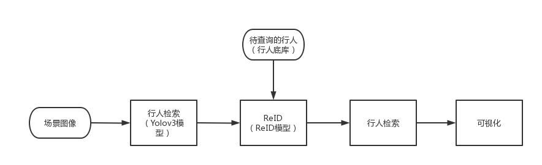

# MindXSDK 行人重识别v2

## 1 简介
### 1.1 方案介绍
本开发样例基于MxBase V2接口实现了端到端的行人重识别（Person Re-identification, ReID），支持检索给定照片中的行人ID。其主要流程为：    
- 程序入口分别接收查询图片和行人底库所在的文件路径。    
- 对于查询图片：利用目标检测模型YOLOv3推理，检测图片中的行人，检测结果经过抠图与调整大小，再利用ReID模型提取图片中每个行人的特征向量。    
- 对于行人底库：将底库图片调整大小，利用ReID模型提取相应的特征向量。    
- 行人检索：将查询图片中行人的特征向量与底库中的特征向量，为每个查询图片中的行人检索最有可能的ID，通过识别框和文字信息进行可视化标记。

V1版本链接：

https://gitee.com/ascend/mindxsdk-referenceapps/tree/master/contrib/ReID

ReID论文地址：

https://arxiv.org/pdf/1903.07071.pdf

ReID代码地址：

https://github.com/michuanhaohao/reid-strong-baseline

### 1.2 方案实现流程图
本方案采用Yolov3+ReID模型，按照行人检索+行人检索的方式实现行人重识别功能。首先，给定需要查询的行人图像（即行人底库，记为Query），利用ReID模型推理得到其特征矩阵；然后对于给定的图像库，利用Yolov3模型推理检测出每个图像中的所有行人（记为Gallery），再利用ReID模型推理得到的所有行人的特征矩阵；进一步，计算两个特征矩阵的距离，将每个Gallery特征距离最近的Query作为去识别结果；最后，将用一张场景图像中所有Gallery的识别结果去重，并在图像上可视化，流程图如下图所示：



### 1.3 适用场景
```
1) 与人脸识别结合
ReID 技术和人脸的技术可以做一个补充，当能看到人脸的时候用人脸的技术去识别，当看不到人脸的时候用 ReID 技术去识别，可以延长行人在摄像头连续跟踪的时空延续性.
2) 智能安防
假如我已经知道某个嫌疑犯的照片ReID 根据嫌疑犯照片，去监控视频库里去收集嫌疑犯出现的视频段.
3) 智能商业-无人超市
无人超市也有类似的需求，无人超市不只是体验优化，它还要了解用户的购物行为，因为如果只基于人脸来做，很多时候是拍不到客户的正面，ReID 这个技术在无人超市的场景下有非常大的应用帮助。
4) 相册聚类
现在拍照时，可以把相同人的照片聚在一起，方便大家去管理，这也是一个具象的应用场景。
...
```
## 2 目录结构
本工程名称为ReIDv2，工程目录如下图所示：
```
ReID
|---- data
|       |---- gallerySet                  // 查询场景图片文件夹
|       |---- querySet                    // 行人底库图片文件夹
|---- image                        
|       |---- result_v1.jpg               // V1识别结果例图
|       |---- V1_running_time.jpg         // V1运行时间图片
|       |---- result_v1.jpg               // V2识别结果例图
|       |---- V2_running_time.jpg         // V2运行时间图片
|---- models                              // 目标检测、ReID模型与配置文件夹
|       |---- yolov3.cfg
|       |---- coco.names
|       |---- ReID_pth2onnx.cfg
|---- result                              // 结果保存文件夹                             
|---- mainv2.py
|---- README.md   
```
> 由于无法在Gitee上创建空文件夹，请按照该工程目录，自行创建result文件夹、data文件夹与其内部的文件夹  
> 如果没有创建result文件夹，将无法产生输出  

## 3 依赖
| 软件名称 |    版本    |
| :--------: |:--------:|
|ubantu 18.04| 18.04.5  |
|CANN| 5.1 RC1  |
|MindX SDK|  3.0RC3  |
|Python|  3.9.12  |
|numpy |  1.23.4  |
|opencv_python| 4.6.0.66 |
```
apt-get install libpython3.9
```
## 4 模型转换
行人重识别先采用了yolov3模型将图片中的行人检测出来，然后利用ReID模型获取行人的特征向量。由于yolov3模型和ReID模型分别是基于Pytorch和Tensorflow的深度模型，我们需要借助ATC工具分别将其转换成对应的.om模型。

4.1 yolov3的模型转换：  

**步骤1** 获取yolov3的原始模型(.pb文件)和相应的配置文件(.cfg文件)  
&ensp;&ensp;&ensp;&ensp;&ensp; [原始模型下载链接](https://c7xcode.obs.myhuaweicloud.com/models/YOLOV3_coco_detection_picture_with_postprocess_op/yolov3_tensorflow_1.5.pb)
&ensp;&ensp;&ensp;&ensp;&ensp; [配置文件下载链接](https://c7xcode.obs.myhuaweicloud.com/models/YOLOV3_coco_detection_picture_with_postprocess_op/aipp_nv12.cfg)  

**步骤2** 将获取到的yolov3模型.pb文件和.cfg文件存放至：“项目所在目录/models”  

**步骤3** .om模型转换  
在编译运行前，需要设置环境变量：

```
#在CANN以及MindX SDK的安装目录找到set_env.sh,并运行脚本：
bash ${SDK安装路径}/set_env.sh
bash ${CANN安装路径}/set_env.sh

# 查看环境
env
```
- 使用ATC将.pb文件转成为.om文件
```
atc --model=yolov3_tensorflow_1.5.pb --framework=3 --output=yolov3 --output_type=FP32 --soc_version=Ascend310 --input_shape="input:1,416,416,3" --out_nodes="yolov3/yolov3_head/Conv_6/BiasAdd:0;yolov3/yolov3_head/Conv_14/BiasAdd:0;yolov3/yolov3_head/Conv_22/BiasAdd:0" --log=info --insert_op_conf=aipp_nv12.cfg
```
- 执行完模型转换脚本后，若提示如下信息说明模型转换成功，可以在该路径下找到名为yolov3.om模型文件。
（可以通过修改output参数来重命名这个.om文件）
```
ATC run success, welcome to the next use.
```  

4.2 ReID的模型转换

**步骤1** .pth模型转.onnx模型  

***1*** 从GitHub上拉取ReID模型源代码,在“项目所在目录/models”路径下输入：  
```
git clone https://github.com/michuanhaohao/reid-strong-baseline
```
此时会出现“项目所在目录/models/reid-strong-baseline”路径，路径内是ReID模型的源代码  

***2*** 获取.pth权重文件，将该.pth权重文件放在“项目所在目录/models”路径下  
文件名：market_resnet50_model_120_rank1_945.pth

&ensp;&ensp;&ensp;&ensp;&ensp; [Huawei Cloud](https://mindx.sdk.obs.cn-north-4.myhuaweicloud.com/mindxsdk-referenceapps%20/contrib/ReID/ReID%E7%9B%B8%E5%85%B3%E6%96%87%E4%BB%B6.rar)

***3*** 获取ReID_pth2onnx.py：[获取链接](https://gitee.com/ascend/ModelZoo-PyTorch/tree/master/ACL_PyTorch/contrib/cv/classfication/ReID_for_Pytorch)  
&ensp; 将该脚本放在“项目所在目录/models”路径下，执行下列命令，生成.onnx模型文件
```
python3 ReID_pth2onnx.py --config_file='reid-strong-baseline/configs/softmax_triplet_with_center.yml' MODEL.PRETRAIN_CHOICE "('self')" TEST.WEIGHT "('market_resnet50_model_120_rank1_945.pth')"
```
> 注意目前ATC支持的onnx算子版本为11  

此时在“项目所在目录/models”路径下会出现ReID.onnx模型，到此步骤1已完成  
如果在线环境中无法安装pytorch，你可以在本地环境中进行上述.pth模型转.onnx模型操作，然后将得到的.onnx模型放在“项目所在目录/models”即可


**步骤2** .onnx模型转.om模型

***1*** 设置环境变量
> 请重复一次4.1中步骤3的“设置环境变量（请确认install_path路径是否正确）”操作

***2*** 使用ATC将.onnx文件转成为.om文件
```
atc --framework=5 --model=ReID.onnx --output=ReID --input_format=NCHW --input_shape="image:1,3,256,128" --insert_op_conf=ReID_onnx2om.cfg --log=debug --soc_version=Ascend310
```
- 执行完模型转换脚本后，若提示如下信息说明模型转换成功，可以在“项目所在目录/models”路径下找到名为ReID.om模型文件。（同样的，可以通过修改output参数来重命名这个.om文件）
```
ATC run success, welcome to the next use.
```  

经过上述操作，可以在“项目所在目录/models”找到yolov3.om模型和ReID.om模型，模型转换操作已全部完成

4.3 参考链接
> 模型转换使用了ATC工具，如需更多信息请参考：[ATC模型转换-快速入门](https://www.hiascend.com/document/detail/zh/CANNCommunityEdition/600alpha001/infacldevg/atctool/atlasatc_16_0005.html)  
> Yolov3模型转换的参考链接：[ATC yolov3-tiny(FP16)](https://www.hiascend.com/zh/software/modelzoo/models/detail/1/0076a4a68336225660af59153e46c5e1/1)  
> ReID模型转换的参考链接：[ATC ReID (FP16)](https://www.hiascend.com/zh/software/modelzoo/models/detail/1/1a115206edca47e39a712e912c9c0eca/1)  

## 5 编译与运行 
5.1 Market1501数据集  

文件名：[Market-1501-v15.09.15.zip](https://mindx.sdk.obs.cn-north-4.myhuaweicloud.com/mindxsdk-referenceapps%20/contrib/ReID/ReID%E7%9B%B8%E5%85%B3%E6%96%87%E4%BB%B6.rar)  


5.1.1 行人底库  
请解压“Market-1501-v15.09.15.zip”文件，在“Market-1501-v15.09.15\Market1501\gt_bbox”中选择想要查询的行人图片，将图片放在“项目所在目录/data/querySet”中  
> 推荐每次查询1人，使用2-6张图片作为底库，效果较好  
> 如需要查询多人，请保证待查询行人之间的着装风格差异较大，否则会较容易出现误报  
> 该项目需要为每张图片提取行人ID，行人图片的命名格式为  
>> '0001(行人ID)_c1(相机ID)s1(录像序列ID)_000151(视频帧ID)_00(检测框ID).jpg'

5.1.2 场景图片数据集  
这里使用的是market1501中的部分场景图片数据，来源于
[Person Search Demo](https://github.com/songwsx/person_search_demo/tree/master/data/samples)
，也可以通过[Huawei Cloud](https://mindx.sdk.obs.cn-north-4.myhuaweicloud.com/mindxsdk-referenceapps%20/contrib/ReID/ReID%E7%9B%B8%E5%85%B3%E6%96%87%E4%BB%B6.rar)
获取，然后将获取的图片放在“项目所在目录/data/gallerySet”中 （gallery下的图片必须是1920*1080大小的jpg）

```
python3 makeYourOwnDataset.py --imageFilePath='data/ownDataset' --outputFilePath='data/cropOwnDataset'
```
**步骤3** 根据“项目所在目录/data/cropOwnDataset”中的结果，选择自己想要查询的行人，按照market1501的命名方式命名（请务必按照这种命名方式命名，否则行人的标识会出现问题）  
> 将同一个行人的不同照片重命名成“xxxx_xx”，其中前4位是行人ID，后2位是该照片ID，例：第1个行人的第2张照片：0001_02  
> 将制作好的行人底库图片放在“项目所在目录/data/querySet”中


5.2 运行
```
python3 mainv2.py --queryFilePath='data/querySet' --galleryFilePath='data/gallerySet' --matchThreshold=0.3
(matchThreshold为设定阈值，可以根据需求更改）
```
> matchThreshold是行人重定位的阈值，默认值是0.3，可根据行人底库的数量进行调整  
> 请注意这个阈值单位是距离单位，并不是比例阈值  
> 对market1501数据集，建议的范围是0.2~0.4之间

5.3 查看结果  
```
执行`mainv2.py`文件后，可在“项目所在目录/result”路径下查看结果。
```
## 6 性能测试
```
操作：V1接口与V2接口各跑五次，统计平均接口运行时间：（此处分别附一张结果图供参考）
```


```
V1平均用时：3.334594
V2平均用时：2.3213328
结论：没有误测少测，功能通过，性能相对V1有所提升
```
## 7 精度测试
```
分别对V1与V2使用多组相同行人底库与场景图片测试：
1、输入1张图片
输入1张目标行人正面图片，16张场景检测图片：V2得到的识别框和文字信息与V1一致
输入1张目标行人侧面图片，16张场景检测图片：V2得到的识别框和文字信息与V1一致
输入1张目标行人背面图片，16张场景检测图片：V2得到的识别框和文字信息与V1一致
输入1张目标行人背面图片，更改不同阈值进行测试：V2得到的识别框和文字信息与V1一致
输入1张未出现人物的图片，16张场景检测图片：V2得到的识别框和文字信息与V1一致
2、输入2张图片
输入目标行人正背2张图片，16张场景检测图片：V2得到的识别框和文字信息与V1一致
3、输入三张图片
输入目标人物正侧背三张图片，16张场景检测图片：V2得到的识别框和文字信息与V1一致
（可以根据自己需求输入合适的图片进行测试）
结论：V2接口与V1接口精度对齐
```


## 8 常见问题
· 在运行mainv2.py时出现"Vpc cropping failed"，或者"The image height zoom ratio is out of range [1/32, 16]"  
> 这里的错误是因为yolov3模型检测到的目标过小，抠图后放大的比例超过系统给定的阈值[1/32, 16]，更新“项目所在目录/models/yolov3.cfg”文件，将OBJECTNESS_THRESH适度调大可解决该问题