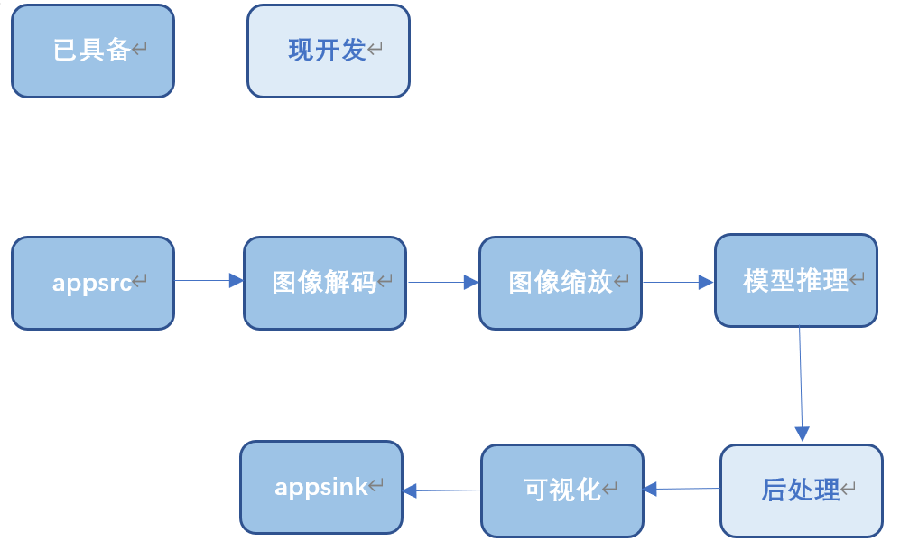

## Retinaface目标检测

## 1介绍

Retinaface基于MindX_SDK开发，在昇腾芯片上进行目标检测，并实现可视化呈现。输入单张图片，对其进行推理，输出推理结果。

### 1.1 支持的产品

本项目以昇腾Atlas310、Atlas310B卡为主要硬件平台。

### 1.2 支持的版本

支持的SDK版本为 5.0.RC1, CANN 版本310使用6.3.RC1，310B使用6.2.RC1。

### 1.3 软件方案介绍

表1.1 系统方案各子系统功能描述：

| 序号 | 子系统         | 功能描述                                                     |
| ---- | -------------- | ------------------------------------------------------------ |
| 1    | 图片输入       | 接收外部调用接口的输入视频路径，对视频进行拉流，并将拉去的裸流存储到缓冲区（buffer）中，并发送到下游插件。 |
| 2    | 模型推理插件   | 目标检测。                                                   |
| 3    | 模型后处理插件 | 对模型输出的张量进行后处理，得到物体类型数据。               |


### 1.4 代码目录结构与说明

本项目名为Retinaface目标检测，项目目录如下所示：

````
.
├── build.sh
├── run.sh
├── config
│   └── aipp.cfg
│   ├── face_Retina.cfg
├── images
├── main.py
├── test.py
├── utils.py
├── model
│   └── run.sh
├── plugin
│   └── build.sh
│   ├── CMakeLists.txt
│   ├── TotalYunetPostProcess.cpp
│   └── TotalYunetPostProcess.h
├── README.md
````


### 1.5 技术实现流程图




### 1.6 特性及适用场景

本项目根据widerface数据集训练得到，适用于目标检测，并且将目标位置与五官位置标出。

本项目在绝大多数情况下准确，但是存在以下检测异常的情况：

1.正常检测中，由于模型本身的限制，会出现部分物体检测不到/检测错误；

2.图片中无检测目标时，会出现可视化异常，输出结果无图片信息；

3.对于图片中一些侧脸和与目标相似的动物脸的情况，模型可能会出现漏检测或者误检测；


## 2 环境依赖

推荐系统为ubuntu  18.04,环境软件和版本如下：

| 软件名称            | 版本  | 说明                          | 获取方式                                                  |
| ------------------- | ----- | ----------------------------- | :-------------------------------------------------------- |
| MindX SDK           | 5.0.RC1 | mxVision软件包                | [链接](https://www.hiascend.com/software/Mindx-sdk)       |
| ubuntu              | 18.04 | 操作系统                      | 请上ubuntu官网获取                                        |
| Ascend-CANN-toolkit | 6.0.RC1 | Ascend-cann-toolkit开发套件包 | [链接](https://www.hiascend.com/software/cann/commercial) |


在编译运行项目前，需要设置环境变量：

MindSDK 环境变量：

```
. ${SDK-path}/set_env.sh
```

CANN 环境变量：

```
. ${ascend-toolkit-path}/set_env.sh
```

- 环境变量介绍

```
SDK-path: mxVision SDK * 安装路径
ascend-toolkit-path: CANN 安装路径。
```

## 3 软件依赖说明

* Cpython
    
    可通过pip指令直接安装：
    ```
    pip3 install cpython
    ```

* Ipython

    可通过pip指令直接安装：
    ```
    pip3 install ipython
    ```

## 4.推理文件准备
进入项目根目录，执行以下命令，创建所需文件夹：
```
mkdir include
mkdir -p evaluate/widerface_txt/
```
下载本模型论文官方源码，可通过git clone下载：
```
git clone https://github.com/biubug6/Pytorch_Retinaface.git
```
或者直接下载[论文代码仓库](https://github.com/biubug6/Pytorch_Retinaface)中的zip代码包解压。

1、准备include目录中的文件

* 将Pytorch_Retinaface项目中的
    * Pytorch_Retinaface/layers/functions/prior_box.py
    * Pytorch_Retinaface/utils/box_utils.py
    * Pytorch_Retinaface/utils/nms/py_cpu_nms.py
    
    放入本项目include文件夹下。

2、准备evaluate目录中的文件
* 将Pytorch_Retinaface项目中的
    * Pytorch_Retinaface/widerface_evaluate

    文件夹放入本项目evaluate文件夹下。

3、编译测试依赖代码
进入evaluate/widerface_evaluate路径下：
```
    python3 setup.py build_ext --inplace
```

4、准备模型及标签文件
在ModelZoo社区[下载](https://www.hiascend.com/zh/software/modelzoo/models/detail/1/7270b02a457d4c4ab262277a646517f9)“ATC Retinaface(FP16) from Pytorch.zip”模型代码包并上传至服务器解压。
* 将模型代码包中的"retinaface.onnx"模型拷贝至项目根目录的"model"目录下
* 将模型代码包中的"Retinaface/data/widerface/val/wider_val.txt"标签文件拷贝至"evaluate"目录下；

## 4 模型转化

若使用A200I DK A2运行，推荐使用PC转换模型，具体方法可参考A200I DK A2资料。

下载后解包，得到`Retinaface.onnx`，使用模型转换工具ATC将onnx模型转换为om模型，模型转换工具相关介绍参考[链接](https://gitee.com/ascend/docs-openmind/blob/master/guide/mindx/sdk/tutorials/%E5%8F%82%E8%80%83%E8%B5%84%E6%96%99.md)

模型转换步骤如下：

1、`cd`到`model`文件夹，运行
若用例执行在310B上，则--soc_version=Ascend310需修改为Ascend310B1
````
bash run.sh
````

2、执行该命令后会在指定输出.om模型路径生成项目指定模型文件newRetinaface.om。若模型转换成功则输出：

```
ATC start working now, please wait for a moment.
ATC run success, welcome to the next use.
```

aipp文件配置如下：

```
aipp_op {
aipp_mode: static

input_format :RGB888_U8
src_image_size_w :1000
src_image_size_h :1000

mean_chn_0 :104
mean_chn_1 :117
mean_chn_2 :123

var_reci_chn_0 :1
var_reci_chn_1 :1
var_reci_chn_2 :1
}

```

## 5 编译运行

`main.py`：用来生成单张图片推理的可视化结果，以提供推理模型的应用实例。

1、在项目根目录下，cd到plugin目录，并执行以下命令进行编译：

```
mkdir build
cd build
cmake ..
make -j
make install
```

将build文件夹下`libtotalyunetpostprocess.so`修改权限为`640`
并且复制到MindSDK安装路径的`lib/modelpostprocessors`目录。


2、查看项目根目录下的config/aipp.cfg权限是否为640，若不是请修改。


3、准备好测试图片`test.jpg`，放置在项目根目录。

4、运行`main.py`程序

确认并修改“main.py”中下列所示的代码：
```
pipeline = {
        "Retinaface": {
            "stream_config": {
                "deviceId": "0"   # 运行NPU卡ID
            },
            "appsrc0": {
                "props": {
                    "blocksize": "409600"
                },
                "factory": "appsrc",
                "next": "mxpi_tensorinfer0"
            },
            "mxpi_tensorinfer0": {
                "props": {
                    "singleBatchInfer": "1",
                    "dataSource": "appsrc0",
                    "modelPath": "./model/newRetinaface.om" # 推理所需模型
                },
                "factory": "mxpi_tensorinfer",
                "next": "mxpi_objectpostprocessor0"
            },
            "mxpi_objectpostprocessor0": {
            "props": {
                "dataSource": "mxpi_tensorinfer0",
                "postProcessConfigPath": "./config/face_Retina.cfg", # 推理所需的配置文件
                "postProcessLibPath": "libtotalyunetpostprocess.so"
            },
            "factory": "mxpi_objectpostprocessor",
            "next": "appsink0"
            },
            "appsink0": {
                "props": {
                    "blocksize": "409600"
                },
                "factory": "appsink"
            }
        }
    }
```
在代码根目录下，执行以下命令进行推理：
```
bash run.sh
```
最后会得到`result.jpg`即为输出结果


## 6 精度验证

本模型使用widerface数据集进行精度评估。

1.[下载](https://share.weiyun.com/5ot9Qv1)数据集放到Retinaface目录下

2.打开test.py文件,在开头修改路径参数：
* RNDB修改为widerface验证集的位置。
* RNDY修改为保存结果txt文件的文件夹位置。 
如例：
    ```
    RNDB = "./widerface/val/images/"
    RNDY = "./evaluate/widerface_txt"
    ```

3.确认并修改“test.py”中下列所示的代码：
```
pipeline = {
    "Retinaface": {
        "stream_config": {
            "deviceId": "0" # 运行NPU卡ID
        },
        "appsrc0": {
            "props": {
                "blocksize": "409600"
            },
            "factory": "appsrc",
            "next": "mxpi_tensorinfer0"
        },
        "mxpi_tensorinfer0": {
            "props": {
                "singleBatchInfer": "1",
                "dataSource": "appsrc0",
                "modelPath": "./model/newRetinaface.om" # 推理所需模型
            },
            "factory": "mxpi_tensorinfer",
            "next": "appsink0"
        },
        "appsink0": {
            "props": {
                "blocksize": "409600"
            },
            "factory": "appsink"
        }
    }
}
```
在Retinaface目录运行
```
python3 test.py
```
该程序会逐一推理widerface官方验证集之中的样本，并将结果保存在RNDY文件当中。

4、进入`evaluate/widerface_evaluate`目录下，运行`python3 evaluation.py -p <your prediction dir> -g <groud truth dir>`, 其中：

* `<your prediction dir>`即RNDY是模型推理的结果。

* `<groud truth dir>`是widerface_evaluate中的groun_truth文件夹。

比如：
```
python3 evaluation.py -p ../widerface_txt/ -g ground_truth/
```
最终得到的精度如下图所示：


原模型精度如下图所示：


符合精度偏差要求，精度达标。