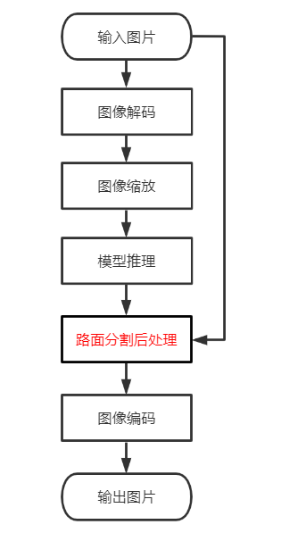
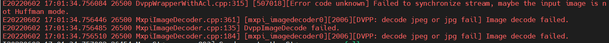


# 路面分割

## 1 介绍
本样例基于MindX SDK实现了端到端的路面分割功能，主要采用了Unet模型对输入的路面图片进行语义分割，输出mask掩膜，然后与原图结合，生成路面语义分割后的可视化结果。<br>
项目主要流程：将输入图片解码成YUV格式，经图片缩放后输入至模型中，得到结果mask，并将其与原图融合，最后编码输出可视化结果。

### 1.1 支持的产品
本项目以昇腾Atlas 500 A2为主要的硬件平台。


### 1.2 支持的版本
推荐系统为ubuntu 18.04。

| 软件名称 | 版本   |
| -------- | ------ |
| python    | 3.9.2     | 
| MindX SDK     |    5.0RC1    |
| CANN | 310使用6.3.RC1<br>310B使用6.2.RC1 |

### 1.3 软件方案介绍
基于MindX SDK的路面分割业务流程：待检测图片通过 appsrc 插件输入，然后使用图像解码插件mxpi_imagedecoder对图片进行解码，再通过图像缩放插件mxpi_imageresize将图像缩放至满足检测模型要求的输入图像大小要求，缩放后的图像输入模型推理插件mxpi_tensorinfer得到检测结果，本项目开发的路面分割后处理插件处理推理结果，从中获取掩膜mask，然后与原始图片进行融合，之后通过图像编码插件mxpi_imageencoder将后处理插件的融合后的数据进行编码，最后使用输出插件appsink输出可视化的结果

表1 系统方案各子系统功能描述：

| 序号 |  子系统  | 功能描述     |
| ---- | ------   | ------------ |
| 1    | 图片输入  | 	Gstreamer原生插件。配合SendData接口与SendDataWithUniqueId接口使用，向Stream中发送数据，appsrc将数据发给下游元件，当且仅当Stream中存在appsrc插件时以上两个接口有效。 |
| 2    | 图像解码    | 用于图像解码，只支持JPG/JPEG/BMP格式。说明：JPG/JPEG输入图片格式约束：只支持Huffman编码，码流的subsample为444/422/420/400/440。不支持算术编码。不支持渐进JPEG格式。不支持JPEG2000格式。 |
| 3   | 图像缩放    | 对解码后的YUV格式的图像进行指定宽高的缩放，暂时只支持YUV格式的图像。 |
| 4    | 模型推理    | 对输入的张量进行推理。 |
| 5    | 模型后处理插件  | 将模型推理的结果mask 与原图融合|
| 6    | 图像编码    | 用于图片编码。 |
| 7   | 图像输出    | Gstreamer原生插件。配合GetResult接口与GetResultWithUniqueId接口使用，从stream中获取数据，当且仅当stream中存在appsink插件时，以上两个接口有效。 |


### 1.4 代码目录结构与说明
```
本sample工程名称为路面分割，工程目录如下图所示：

├── config #配置文件目录
│   └── aipp_road_segmentation.config
├── model  #模型目录
│  	└──  pt2onnx.py  
├── pipeline
│   └── road.pipeline
├── plugin #后处理插件目录
│ 	└──RoadSegPostProcess
│		├── build
│		├── build.sh  #编译脚本
│		├── lib 
│		│     └──plugins #编译好的插件存放位置
│ 		├── CMakeLists.txt
│   	├── MxpiRoadSegPostProcess.cpp
│  		└── MxpiRoadSegPostProcess.cpp.h
├── main.py
├── README.md
└── build.sh
```

### 1.5 技术实现流程图


注：红色字体为本项目开发的后处理插件，其他为SDK内置插件

### 1.6 特性及适应场景
本案例可以满足路面的语义分割内容，但同时对输入的图像有以下限制：<br>
1.对于输入的图像是灰度图像时，会影响分割效果。<br>
2.当路面上的障碍物（如车辆）较为密集时，会降低模型的分割效果。<br>
3.当输入图片中的路面有阴影或颜色不一致时，会影响分割效果。<br>
4.当输入图片中不含路面，也会有少量的标识。<br>
5.适用于单张图片的输入。<br>
6.适应于形状规则且与周围环境色差较大的路面图片。<br>

## 2 环境依赖
在编译运行项目前，需要设置环境变量：

- MindSDK 环境变量介绍
```
. ${SDK-path}/set_env.sh
```
- CANN 环境变量介绍
```
. ${ascend-toolkit-path}/set_env.sh
```

## 3 模型转换
### 3.1 导出onnx文件
  获取[路面分割案例](https://github.com/tunafatih/Road-Free-Space-Segmentation-Internship-Project)，在本地使用pt2onnx.py文件，将pt权重文件转换成onnx文件，或可[点击此处](https://mindx.sdk.obs.cn-north-4.myhuaweicloud.com/mindxsdk-referenceapps%20/contrib/RoadSegmentation/model.zip)下载转换好的onnx文件。
### 3.2 使用Ascend atc工具将onnx模型转换为om模型
在使用[atc工具](https://gitee.com/ascend/docs-openmind/blob/master/guide/mindx/sdk/tutorials/%E5%8F%82%E8%80%83%E8%B5%84%E6%96%99.md)之前**需按第2节环境依赖章节**事先配置好CANN环境，之后将3.1节中导出的onnx文件上传至```model```目录下，在该目录下执行
```
atc --framework=5 --model=Road.onnx --output=road_segmentation --input_format=NCHW  --insert_op_conf=../config/aipp_road_segmentation.config --input_shape="image:1,3,224,224" --log=debug --soc_version=Ascend310B1  
```
若出现以下信息，则转换成功
```
ATC run success
```
## 4 编译与运行

示例步骤如下：
**步骤1** 修改相应文件
根据所需场景，配置pipeline文件，调整路径参数。
```
  #配置mxpi_tensorinfer插件的模型加载路径： modelPath
  "mxpi_tensorinfer0": {
            "props": {
                "dataSource": "mxpi_imageresize0",
                "modelPath": "${road_segmentation.om模型路径}"
            },
            "factory": "mxpi_tensorinfer",
            "next": "appsink0"
        },
	#配置可视化结果输出路径：location
	"appsink0": {
            "props": {
                "blocksize": "4096000",
				"location":"${输出结果文件名}" 
            },
            "factory": "filesink"
        }
```

**步骤2** 设置环境变量
按**第2节环境依赖**中设置环境变量

**步骤3** 执行编译的步骤
在样例目录下，执行
```
bash build.sh
```
**步骤4** 运行及输出结果
在样例目录下，执行
```
python3.9 main.py test.jpg   #测试图片地址
```

## 5 常见问题

1.图片解码失败
**问题描述：**  在使用解码插件时，提示如下错误


**解决方案：** 更换图片，详情[imagedecoder插件介绍](https://www.hiascend.com/document/detail/zh/mind-sdk/204/vision/mxvisionug/mxvisionug_0115.html)


