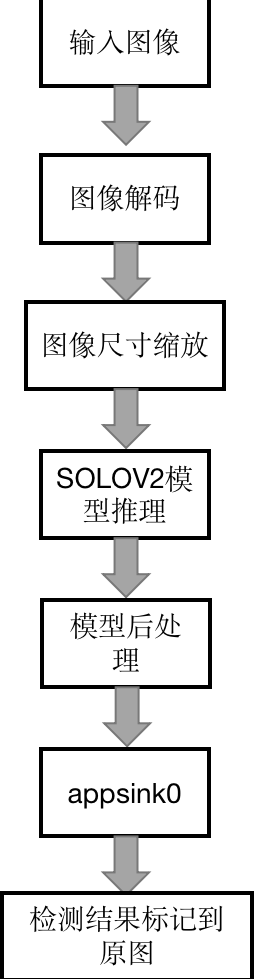

# SOLOV2实例分割
## 1. 介绍

SOLOV2实例分割后处理插件基于 MindX SDK 开发，对图片中的不同类目标进行检测，将检测得到的不同类的目标用不同色彩的轮廓图标记。输入一幅图像，可以检测得到图像中大部分类别目标的位置。本方案使用在 COCO2017 数据集上训练得到的 SOLOV2模型进行目标检测，数据集中共包含 80 个目标类，包括行人、自行车、公共汽车、手机、沙发、猫、狗等，可以对不同类别、不同角度、不同密集程度的目标进行检测并分割。

### 1.1 支持的产品

本项目以昇腾Atlas310卡为主要的硬件平台。


### 1.2 支持的版本

支持的SDK版本为 2.0.4, CANN 版本为 5.0.4。


### 1.3 软件方案介绍 

本项目设计两种流程，一种为用python代码实现对图像的预处理过程，然后将处理好的图片通过 appsrc 插件输入到业务流程中；另一种是直接将原图片通过 appsrc 输入到业务流程中。

#### 1.3.1 业务流程加图像预处理方案

整体业务流程为：待检测图片通过 appsrc 插件输入，然后使用图像解码插件 mxpi_imagedecoder 对图片进行解码，再通过图像缩放插件 mxpi_imageresize 将图像缩放至满足检测模型要求的输入图像大小要求，缩放后的图像输入模型推理插件 mxpi_tensorinfer 得到推理结果，推理结果输入 mxpi_objectpostprocessor 插件进行后处理，得到输入图片中所有的目标mask和对应的置信度。最后通过输出插件 appsink 获取检测结果，并在外部进行可视化，将检测结果标记到原图上，本系统的各模块及功能描述如表1所示：

表1 系统方案各模块功能描述：

| 序号 | 子系统         | 功能描述                                                     |
| ---- | -------------- | ------------------------------------------------------------ |
| 1    | 图片输入       | 获取 jpg 格式输入图片                                        |
| 2    | 图片解码       | 解码图片                                                     |
| 3    | 图片缩放       | 将输入图片放缩到模型指定输入的尺寸大小                       |
| 4    | 模型推理       | 对输入张量进行推理                                           |
| 5    | 目标检测后处理 | 从模型推理结果得到实力目标的mask和置信度，并保留置信度大于指定阈值的实例目标检测结果 |
| 6    | 结果输出       | 获取检测结果                                                 |
| 7    | 结果可视化     | 将检测结果标注在输入图片上                                   |


#### 

### 1.4 代码目录结构与说明

本工程名称为 SOLOV2，工程目录如下所示：
```
.
├── images
│   ├── eval_result.png
│   └── pipeline.png
├── postprocess
│   ├── CMakeLists.txt
│   ├── Solov2PostProcess.cpp
│   ├── Solov2PostProcess.h
│   └── build.sh
└── python
    ├── Main
    │   ├── main_eval.py
    │   └── main_visualize.py
    ├── models
    │   ├── aipp_config
    │   │   └── aipp_opencv.cfg
    │   └── solov2.cfg
    └── pipeline
        └── solov2.pipeline

```

注：coco.names文件源于[链接](https://gitee.com/ascend/ModelZoo-PyTorch/tree/master/ACL_PyTorch/built-in/cv/Yolov3_for_Pytorch)。

### 1.5 技术实现流程图

SOLOV2 的后处理插件接收模型推理插件输出的特征图。




### 1.6 适用场景

经过测试，该项目适用于各类图像。

## 2 环境依赖

推荐系统为ubuntu 18.04，环境依赖软件和版本如下表：

| 软件名称 | 版本  |
| -------- | ----- |
| cmake    | 3.5+  |
| mxVision | 2.0.4 |
| python   | 3.9.2 |

确保环境中正确安装mxVision SDK。

在编译运行项目前，需要设置环境变量：

MindX SDK 环境变量:

```
. ${SDK-path}/set_env.sh
```

CANN 环境变量：

```
. ${ascend-toolkit-path}/set_env.sh
```

- 环境变量介绍

```
SDK-path: SDK mxVision 安装路径
ascend-toolkit-path: CANN 安装路径
```

需要安装的mmdet库与mmcv库：

```
// mmcv 安装方式 
git clone https://github.com/open-mmlab/mmcv -b v0.2.16
cd mmcv
python setup.py build_ext
python setup.py develop
cd ..
```

```
// mmdet安装方式（需要先从github上下载源代码库）
cd SOLO //源代码仓(https://github.com/WXinlong/SOLO)
patch -p1 < ../MMDET.diff
patch -p1 < ../SOLOV2.diff
pip install -r requirements/build.txt # 可以不用执行这句话
pip install -v -e .
cd ..
```


## 3. 模型转换

本项目中采用的模型是SOLOV2 模型，参考实现代码：https://github.com/WXinlong/SOLO ，模型下载链接：https://www.hiascend.com/zh/software/modelzoo/models/detail/1/f32ed480a95b4686a070fff964b4fceb 。下载地址中包含onnx文件，同时也有对应的om文件，可以直接使用。也可以用ATC模型转换工具将onnx转换为om文件。模型转换工具相关介绍参考链接：https://support.huaweicloud.com/tg-cannApplicationDev330/atlasatc_16_0005.html 。


### 3.1 业务流程加图像预处理的模型转换方法


1. 从上述项目链接中下载 onnx 模型 solov2_sim.onnx 至 ``python/models`` 文件夹下。


2. 将该模型转换为om模型，具体操作为： ``python/models`` 文件夹下,执行atc指令：

```
atc --framework=5 --model=SOLOv2_sim.onnx --output=solov2_opencv --input_format=NCHW --input_shape="input:1,3,800,1216" --insert_op_conf=aipp_opencv.cfg --log=error --soc_version=Ascend310
```

若终端输出：
```
ATC start working now, please wait for a moment.
ATC run success, welcome to the next use.
```

表示命令执行成功。

## 4. 编译与运行

### 4.1 业务流程加图像预处理

**步骤1** 在项目后处理目录执行命令：

```
bash build.sh  
```

**步骤2** 放入待测图片。将一张图片放在路径``python/Main``下，命名为 test.jpg。

**步骤3** 图片检测。在项目路径``python/Main``下运行命令：

```
python3 main_visualize.py
```

命令执行成功后在目录``python/Main``下生成检测结果文件 result.jpg，查看结果文件验证检测结果。

**步骤4** 精度测试。

1. 下载COCO VAL 2017[验证数据集](http://images.cocodataset.org/zips/val2017.zip )和[标注文件](http://images.cocodataset.org/annotations/stuff_annotations_trainval2017.zip)，并保存在项目目录``python/``下，此文件夹下的组织形式应如下图所示：

```                                    
.                                                               
├── annotations                            
│   └── instances_val2017.json                                                                               
└── val2017                          
                                       
```
其中：val2017文件夹下应存放有5000张待测图片。

确定配置文件路径，在之前下载好的SOLOV2源代码路径下：/SOLO/configs/solov2/solov2_r50_fpn_8gpu_1x.py

2. 修改``python/models``下的文件 solov2.cfg 的参数 SCORE_THRESH=0.0

3. 进入``python/Main``路径，运行 命令：
```
python3 main_eval.py --dataset_path = [COCO数据集位置] --anno_path = [COCO标注文件位置] --model_config = [配置文件位置]
```


​                                                                                                   


### 4.3 目标精度
目标精度为：0.339  