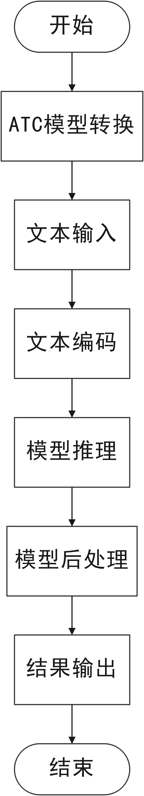

# 情感极性分类

## 1. 介绍

本项目是一个面向酒店服务领域的句子级情感极性分类系统。分类插件基于 MindXSDK 开发，在晟腾芯片上进行句子情感极性分类，将分类结果保存。输入一段句子，可以判断该句子属于哪个情感极性。
该模型支持3个类别：消极，积极，中性。

### 1.1 支持的产品

本项目以昇腾Atlas310卡为主要的硬件平台。

### 1.2 支持的版本

支持的SDK版本为2.0.4。
支持的CANN版本为5.0.4。

### 1.3 软件方案介绍

基于MindX SDK的句子情感分类分类业务流程为：待分类文本通过预处理，将文本根据字典vocab.txt进行编码，组成numpy形式的向量，将向量通过 appsrc 插件输入，然后由模型推理插件mxpi_tensorinfer得到每种类别的得分，再通过后处理插件mxpi_classpostprocessor将模型输出的结果处理，最后得到该文本的类别。本系统的各模块及功能描述如表1所示：


表1.1 系统方案各子系统功能描述：

| 序号 | 子系统 | 功能描述     |
| ---- | ------ | ------------ |
| 1    | 文本输入    | 读取输入文本 |
| 2    | 文本编码    | 根据字典对输入文本编码 |
| 3    | 模型推理    | 对文本编码后的张量进行推理 |
| 5    | 后处理      | 从模型推理结果中寻找对应的分类标签 |
| 7    | 保存结果    | 将分类结果保存文件|

### 1.4 代码目录结构与说明

本工程名称为句子情感分类，工程目录如下图所示（tokenizer.py引用于https://gitee.com/ascend/samples/blob/master/python/level2_simple_inference/5_nlp/bert_text_classification/src/tokenizer.py）：

```
.
│  build.sh
│  README.md
│  tree.txt
│  
├─mxBase
│  │  build.sh
│  │  CMakeLists.txt
│  │  main.cpp
│  │  
│  ├─SentimentAnalysis
│  │      SentimentAnalysis.cpp
│  │      SentimentAnalysis.h
│  │      
│  ├─data
│  │      vocab.txt
│  │      
│  ├─model
│  │      sentiment_analysis_label.names
│  │ 
│  ├─out
│  │      prediction_label.txt
│  │      
│  └─test
│          Test.cpp
│          Test.h
│          
└─sdk
    │  build.sh
    │  flowChart.jpg
    │  main.py
    │  run.sh
    │  tokenizer.py
    │  
    ├─config
    │      sentiment_analysis_aipp_tf.cfg
    │      sentiment_analysis_label.names
    │      
    ├─data
    │      vocab.txt
    |
    ├─model
    │      model_conversion.sh
    │      
    ├─out
    │      prediction_label.txt
    │      
    ├─pipeline
    │      sentiment_analysis.pipeline
    │      
    └─test
            test.py
            test.sh
            test_input.py
```
### 1.5 技术实现流程图



## 2 环境依赖

推荐系统为ubantu 18.04，环境依赖软件和版本如下表：

| 软件名称 | 版本   |
| -------- | ------ |
| cmake    | 3.10.2   |
| mxVision | 2.0.4  |
| python   | 3.9.2  |

确保环境中正确安装mxVision SDK。

在编译运行项目前，需要设置环境变量：

```
export MX_SDK_HOME=${SDK安装路径}/mxVision
export LD_LIBRARY_PATH=${MX_SDK_HOME}/lib:${MX_SDK_HOME}/opensource/lib:${MX_SDK_HOME}/opensource/lib64:/usr/local/Ascend/ascend-toolkit/latest/acllib/lib64:/usr/local/Ascend/driver/lib64:${LD_LIBRARY_PATH}
export PYTHONPATH=${MX_SDK_HOME}/python:${PYTHONPATH}

export install_path=/usr/local/Ascend/ascend-toolkit/latest
export PATH=/usr/local/python3.9.2/bin:${install_path}/atc/ccec_compiler/bin:${install_path}/atc/bin:$PATH
export LD_LIBRARY_PATH=${install_path}/atc/lib64:$LD_LIBRARY_PATH
export ASCEND_OPP_PATH=${install_path}/opp
```

- 环境变量介绍

```
MX_SDK_HOME：MindX SDK mxVision的根安装路径，用于包含MindX SDK提供的所有库和头文件。  
LD_LIBRARY_PATH：提供了MindX SDK已开发的插件和相关的库信息。  
install_path：ascend-toolkit的安装路径。  
PATH：添加python的执行路径和atc转换工具的执行路径。  
LD_LIBRARY_PATH：添加ascend-toolkit和MindX SDK提供的库目录路径。  
ASCEND_OPP_PATH：atc转换工具需要的目录。 
```

## 3 模型获取及转换

**步骤1**  请参考https://github.com/percent4/keras_bert_text_classification 提供的源码，按照其README.md准备好自己的分类的数据完成模型的训练，数据参考https://gitee.com/ascend/samples/tree/master/python/contrib/SentimentAnalysis/data/coarse-big-corpus/coarse ，需转成csv格式，也可以直接使用https://mindx.sdk.obs.cn-north-4.myhuaweicloud.com/mindxsdk-referenceapps%20/contrib/SentimentAnalysis/data.zip 解压后data目录下的train.csv,训练完成后的到h5模型。h5模型的获取还可以通过https://mindx.sdk.obs.cn-north-4.myhuaweicloud.com/mindxsdk-referenceapps%20/contrib/SentimentAnalysis/model.zip ，解压获得

**步骤2** 请参考https://github.com/amir-abdi/keras_to_tensorflow 提供的源码，将h5模型转成pb模型。pb模型也可以通过https://mindx.sdk.obs.cn-north-4.myhuaweicloud.com/mindxsdk-referenceapps%20/contrib/SentimentAnalysis/model.zip 获得。

**步骤3** 将得到的pb文件，存放到开发环境普通用户下的任意目录，例如：$HOME/models/sentiment_analysis。

执行模型转换命令

**步骤2** 执行以下命令使用atc命令进行模型转换：

cd $HOME/models/sentiment_analysis

```
atc --model=./sentiment_analysis.pb --framework=3 --input_format=ND --output=./sentiment_analysis --input_shape="Input-Token:1,500;Input-Segment:1,500" --out_nodes="dense_1/Softmax:0" --soc_version=Ascend310 --op_select_implmode="high_precision"
```

执行成功后终端输出为：

```
ATC start working now, please wait for a moment.
ATC run success, welcome to the next use.
```

**步骤4** 执行以下命令将转换好的模型复制到项目中model文件夹中：
cp ./sentiment_analysis.om $HOME/sdk/model/
cp ./sentiment_analysis.om $HOME/mxbase/model/

## 4 编译与运行

**步骤1** 从https://mindx.sdk.obs.cn-north-4.myhuaweicloud.com/mindxsdk-referenceapps%20/contrib/SentimentAnalysis/data.zip 下载测试数据并解压，解压后的sample.txt和test.csv文件放在项目的data目录下。

**步骤2** 按照第 2 小节 环境依赖 中的步骤设置环境变量。

**步骤3** 按照第 3 小节 模型获取及转换 中的步骤获得 om 模型文件。

**步骤4** 将本项目代码的文件路径中出现的 ${SDK目录} 替换成自己SDK的存放目录，下面是需要替换的代码。

```
mxBase目录下的CMakeList.txt中的第13行代码 set(MX_SDK_HOME ${SDK目录})
sdk/pipeline目录下sentiment_analysis.pipeline文件中的第26行 "postProcessLibPath": "${SDK目录}/lib/modelpostprocessors/libresnet50postprocess.so"
```

**步骤5** pipeline项目运行在sdk目录下执行命令：

```
python3 main.py
```

命令执行成功后在out目录下生成分类结果文件 prediction_label.txt，查看结果文件验证分类结果。

**步骤6** mxBase项目在mxBase目录中，执行以下代码进行编译。

```
mkdir build
cd build
cmake ..
make
```

编译完成后，将可执行文件 mxBase_sentiment_analysis 移动到mxBase目录下，执行下面代码运行

```
./mxBase_sentiment_analysis ./data/sample.txt
```

执行成功后在服务器的mxBase/out目录下生成分类结果文件 prediction_label.txt，查看结果文件验证分类结果。

## 5 精度测试

**步骤1** 按照第 4 小节 编译与运行 的步骤将样例运行成功。

**步骤2** 从网址https://mindx.sdk.obs.myhuaweicloud.com/mindxsdk-referenceapps%20/contrib/BertTextClassification/data.zip下载后解压，将解压后的test.csv文件分别放在sdk/data目录和mxBase/data目录。

**步骤3** pipeline项目中的精度测试文件为sdk/test目录下的test.py，将test.py移到sdk目录下，执行下面代码，得到pipeline的精度测试结果。

```
python3 test.py
```

**步骤4** mxBase项目中，将mxBase目录下main.cpp中main方法的代码注释，添加下面代码，然后在Clion中执行，得到mxBase的精度测试结果。

```
Test::test_accuracy();
```

## 5 其他问题
1.本项目的设计限制输入样例为文本文件，其他文件如图片、音频不能进行推理。
2.本项目的模型对中性数据进行分类时预测结果较差，可能有以下几个方面，一是对中性数据的分类本身有一定的难度；二是在训练模型时提供数据集中的中性数据较少，模型对于中性数据的分类效果并不好；三是在模型转换的过程中可能会存在精度的缺失。

