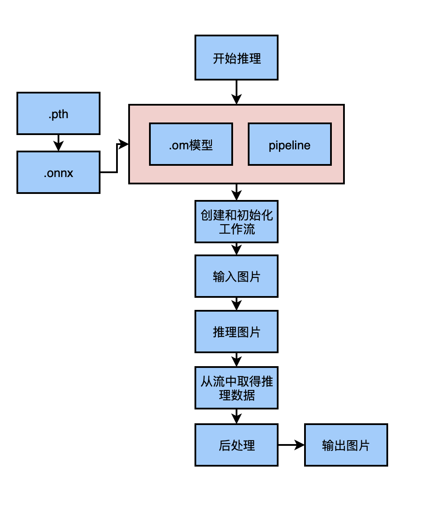

# Mind SDK 风格转换参考设计（从航拍图到卫星图的转换）

## 介绍

本文中风格转换中的航拍图到卫星图转换。它通过一种无监督的少样本的学习方式，能够实现风格转换。

论文原文：https://github.com/junyanz/pytorch-CycleGAN-and-pix2pix

测试集下载地址：https://people.eecs.berkeley.edu/~taesung_park/CycleGAN/datasets/maps.zip

初始模型、推理模型及转换脚本下载：https://www.hiascend.com/zh/software/modelzoo/detail/1/3ba3b04fd4964d9b81974381b73f491d

### 项目实现流程及适用场景




项目的主要流程：
（1）输入类型是图片数据（jpg图片序列）
（2）通过调用MindX SDK提供的图像解码接口mxpi_imagedecoder，解码后获取图像数据。
（3）然后进行图像尺寸大小变换，调用MindX SDK提供的图像尺寸大小变换接口mxpi_imageresize插件，输入图像大小要求高256，宽256。
（4）模型后处理，调用MindX SDK提供的模型推理插件mxpi_modelinfer。然后调用MindX SDK提供的appsink将结果取出。
（5）模型输出经过后处理后，得到图片数组并写入图片。
场景限制：
输入的图像应为卫星航拍图，在清晰度较好的情况下，能取得较好的推理效果。

### 支持的产品以及环境依赖

支持 Atlas 200dk开发者套件、Ascend 310推理芯片。

```
|   软件名称    |    版本     |
| :-----------: | :---------: |
|    ubuntu     |  18.04.5 LTS |
|   MindX SDK   |    5.0.RC3    |
|    Python     |    3.9.2    |
|     CANN      |    7.0.RC1    |
|     numpy     |   1.22.3    |
| opencv-python |    4.5.5    |
```

版本号查询方法，在Atlas产品环境下，运行命令：

```
npu-smi info

```
运行后会在终端输出：
```
+------------------------------------------------------------------------------+
| npu-smi 21.0.3.1                     Version: 21.0.3.1                       |
+-------------------+-----------------+----------------------------------------+
| NPU     Name      | Health          | Power(W)          Temp(C)              |
| Chip    Device    | Bus-Id          | AICore(%)         Memory-Usage(MB)     |
+===================+=================+========================================+
| 0       310       | OK              | 12.8              58                   |
| 0       0         | NA              | 0                 5324 / 8192          |
+===================+=================+========================================+
```

### 软件方案介绍

```
| 序号 | 子系统  | 功能描述 |
| 1   | 图像输入 | 调用MindX SDK的appsrc输入图片|
| 2   | 图像解码 | 调用MindX SDK的mxpi_imagedecoder对图像解码|
| 3   | 图像放缩 | 调用MindX SDK的mxpi_imageresize，放缩到256*256大小 |
| 4   | 图像推理 | 调用MindX SDK的mxpi_tensorinfer推理图像|
| 5   | 结果输出 | 输出图片信息|
```

### 代码目录结构与说明

本参考设计工程名称为StyleTransfer，工程目录如下图所示： 

```
StyleTransfer
.
├── README.md
├── README_img      
│   └── pic.png  //README流程图
├── models       
│   └── aipp_CycleGAN_pth.config  //aipp配置文件  
├── pipeline
│   └── styletransfer.pipeline
└── src
    └── main.py
```

### python第三方库

```
numpy == 1.16.6

Pillow == 8.2.0

opencv-python == 4.5.2

sympy == 1.4

decorator == 4.4.2

requests == 2.22.0

tqdm == 4.61.0

PyYAML == 5.4.1
```

### 开发准备

> 模型转换

**步骤1** 将pth模型转换为onnx模型

首先在ModelZoo下载CycleGAN模型。

下载地址：https://www.hiascend.com/zh/software/modelzoo/detail/1/3ba3b04fd4964d9b81974381b73f491d

模型获取解压后，将CycleGAN文件夹下的所有文件及文件夹全部都放在StyleTransfer/models文件夹中

**步骤2** 设置环境变量

运行MindXSDK与ascend-toolkit下的set_env.sh设置环境变量
MindXSDK：${MX_SDK_HOME}/set_env.sh

ascend-toolkit：/usr/local/Ascend/ascend-toolkit/set_env.sh
```
bash set_env.sh 

```

**步骤3** 将原始pth模型转化为onnx模型

进入/models目录

```
python3  CycleGAN_onnx_export.py  --model_ga_path=latest_net_G_A.pth  --model_gb_path=latest_net_G_B.pth  --onnx_path=./onnxmodel/  --model_ga_onnx_name=model_Ga.onnx  --model_gb_onnx_name=model_Gb.onnx
```
生成的onnx模型在./onnxmodel/文件夹下

**步骤4** 配置AIPP

```
aipp_op{
    aipp_mode:static
    input_format : YUV420SP_U8
    csc_switch : true
    rbuv_swap_switch : true
    src_image_size_w : 256
    src_image_size_h : 256
    min_chn_0 : 127.5
    min_chn_1 : 127.5
    min_chn_2 : 127.5
    var_reci_chn_0: 0.007843137254901
    var_reci_chn_1: 0.007843137254901
    var_reci_chn_2: 0.007843137254901
    matrix_r0c0: 256
    matrix_r0c1: 0
    matrix_r0c2: 359
    matrix_r1c0: 256
    matrix_r1c1: -88
    matrix_r1c2: -183
    matrix_r2c0: 256
    matrix_r2c1: 454
    matrix_r2c2: 0
    input_bias_0: 0
    input_bias_1: 128
    input_bias_2: 128
}
```
保存在/models下的aipp_CycleGAN_pth.config文件中。

**步骤5** 将onnx模型转换为om模型

仍然在/models目录中操作
```
atc --framework=5   --model=./onnxmodel/model_Ga.onnx  --output=sat2map   --input_format=NCHW   --input_shape="img_sat_maps:1,3,256,256" --out_nodes="maps"  --log=debug --soc_version=Ascend310 --insert_op_conf=aipp_CycleGAN_pth.config
```

转换完成后存放在/models中。

**步骤6** 下载测试集

在文章介绍中下载maps测试集，然后将测试集中testA文件夹复制到/StyleTransfer目录下

更改测试图片可以通过更改main.py脚本的IMG_PATH变量。默认的测试图片是/StyleTransfer/testA/sat.jpg

**步骤7** 运行程序

```
python3 main.py
```

###  运行结果

生成的地图存放在result目录中。

如果没有需要在StyleTransfer文件夹中手动创建

```
mkdir result
```
查看生成图片
```
ls ../result/map.jpg 
```