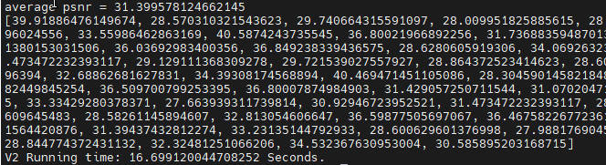
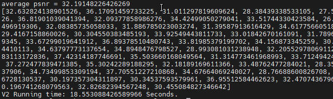
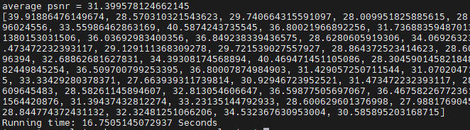
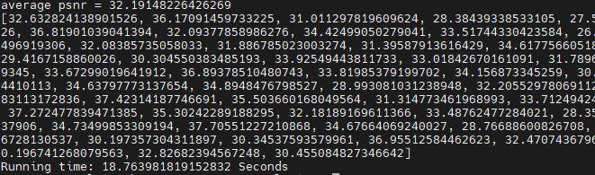

# 基于python V2接口的VDSR图像超分辨率

## 1 介绍

基于MindX SDK mxVision 3.0RC3 开发图像超分辨率程序。本程序采用python开发，使用MxBase V2接口。通过预处理操作对输入的图片数据解码为YUV格式图片，并将解码后的图片缩放到模型推理要求的尺寸。然后利用图像超分辨率模型VDSR获取得到图片超分辨率重建结果。最后，利用python的第三方图像处理库PIL将低分辨率的输入图像和超分辨率重建的结果一同可视化。其次，针对两个图片集91-images和General-100进行PSNR（峰值信噪比）验证。

程序输入：任意jpg图片
程序输出：输出得到低分辨率图片（256 x 256px）和超分辨率重建图片（768 x 768px）组合的可视化大图

### 1.1 模型介绍

Jiwon Kim 等基于残差学习和梯度裁剪，利用 20 层的卷积网络实现针对不同放大尺度的图像超分辨模型，命名为 VDSR（Very Deep convolutional networks for Super-Resolution）。VDSR使用比 SRCNN 大 104 倍的学习率，使用跳跃连接将输入与学习到的残差融合生成高分辨率图像，每个卷积层卷积核尺寸为 3 × 3，输入与输出尺寸一致。VDSR 越深效果越好，随着深度的增加，PSNR 更早地达到稳定值；使用残差网络，仅迭代几轮，网络就能达到很好的效果

V1版本地址：

https://gitee.com/ascend/mindxsdk-referenceapps/tree/master/contrib/SuperResolution

论文地址：

https://arxiv.org/abs/1511.04587

模型概述：

https://blog.csdn.net/u010327061/article/details/80094724

### 1.2 支持的产品

昇腾310(推理)

### 1.3 支持的版本

本样例配套的CANN版本为 [5.1.RC1](https://www.hiascend.com/software/cann/commercial) ，MindX SDK版本为 [3.0RC3](https://www.hiascend.com/software/Mindx-sdk) 。

MindX SDK安装前准备可参考《用户指南》，[安装教程](https://gitee.com/ascend/mindxsdk-referenceapps/blob/master/docs/quickStart/1-1安装SDK开发套件.md)

### 1.4 目录结构

```
.
|-------- font
|           |---- SourceHanSansCN-Normal-2.otf      // otf字体
|-------- image
|           |---- test.jpg                          // 测试图片(需自行准备)
|           |---- 91-images-V1.jpg                  // evaluate.py V1接口在91-images数据集上的运行结果
|           |---- 91-images-V2.jpg                  // evaluate_v2.py V2接口在91-images数据集上的运行结果
|           |---- General-i00-V1.jpg                // evaluate.py V1接口在General-100数据集上的运行结果
|           |---- General-i00-V2.jpg                // evaluate_v2.py V2接口在General-100数据集上的运行结果
|-------- V2result                                  // V2测试图片程序输出存放处
|-------- model
|           |---- YUV420SP_U8_GRAY.cfg              // 模型转换配置文件(灰度图)
|           |---- VDSR_768_768.om                   // 转换后OM模型存放在此处(需自行上传)
|-------- testSet
|           |---- 91-images                         // 91-images验证集(含bmp图片)
|           |---- 91-images-jpg                     // 91-images验证集转换后集(含jpg图片)
|           |---- bmp2jpg.py                        // bmp转jpg脚本
|-------- evaluate_v2.py                            // 模型精度验证V2
|-------- README.md                                 // ReadMe
|-------- main_v2.py                                // 图像超分辨率主程序V2
|-------- util.py                                   // 工具方法

```

## 2 环境依赖 

### 2.1 软件版本

| 软件                | 版本         | 说明                          | 获取方式                                                     |
| ------------------- | ------------ | ----------------------------- | ------------------------------------------------------------ |
| mxVision            | 3.0RC3       | mxVision软件包                | [链接](https://www.hiascend.com/software/Mindx-sdk) |
| Ascend-CANN-toolkit | 5.1.RC1      | Ascend-cann-toolkit开发套件包 | [链接](https://www.hiascend.com/software/cann/commercial)    |
| 操作系统            | Ubuntu 18.04 | 操作系统                      | Ubuntu官网获取                                               |

### 2.2 准备工作

> 模型转换

**步骤1** 获取原始模型网络及权重, [权重下载 和 网络下载地址](https://mindx.sdk.obs.cn-north-4.myhuaweicloud.com/mindxsdk-referenceapps%20/contrib/SuperResolution/model.zip)

**步骤2** AIPP配置文件-YUV420SP_U8_GRAY.cfg

```cfg
aipp_op {
    aipp_mode: static
    input_format : YUV420SP_U8
    csc_switch : true
    rbuv_swap_switch : false
    matrix_r0c0 : 256
    matrix_r0c1 : 0
    matrix_r0c2 : 0
    matrix_r1c0 : 0
    matrix_r1c1 : 0
    matrix_r1c2 : 0
    matrix_r2c0 : 0
    matrix_r2c1 : 0
    matrix_r2c2 : 0
    input_bias_0 : 0
    input_bias_1 : 0
    input_bias_2 : 0
}
```

色域转换，用于将输入的图片格式，转换为模型需要的图片格式，这里将YUV420SP_U8转GRAY，详细色域转换配置说明请参考 [这里](https://support.huawei.com/enterprise/zh/doc/EDOC1100191944/3e66a3c#ZH-CN_TOPIC_0000001095142890)

**步骤3** 将下载得到模型网络及权重(`VDSR.prototxt`、`VDSR.caffemodel`)、AIPP配置文件(`YUV420SP_U8_GRAY.cfg`)放在 `model` 目录下

**步骤4** 配置环境变量

```bash
#在CANN以及MindX SDK的安装目录找到set_env.sh,并运行脚本：
bash ${SDK安装路径}/set_env.sh
bash ${CANN安装路径}/set_env.sh

#查看环境变量：
env
```

**步骤5** 使用ATC模型转换工具进行模型转换

在 `model` 目录下执行以下命令

```
# 执行，转换VDSR模型成om格式
# Execute, transform VDSR model.

atc --model=./VDSR.prototxt --weight=./VDSR.caffemodel --framework=0 --input_format=NCHW --input_shape="data: 1, 1, 768, 768" --output=./VDSR_768_768 --soc_version=Ascend310 --output_type=FP32 --insert_op_conf=YUV420SP_U8_GRAY.cfg
```

执行完后，会在model目录下生成相应的VDSR_768_768.om模型文件。

模型转换使用了ATC工具，如需更多信息请参考 [这里](https://gitee.com/ascend/docs-openmind/blob/master/guide/mindx/sdk/tutorials/%E5%8F%82%E8%80%83%E8%B5%84%E6%96%99.md)

## 3 V2接口运行

1) 准备一张测试图片，置于 image 文件夹中（仅支持jpg格式
2) 进入工程目录。
3) 键入执行指令，发起推理性能测试：
```python
python3 main_v2.py ${测试图片路径}
例如: python3 main_v2.py image/head.jpg
    
# 或者在main_v2.py中配置 input_image_path 
input_image_path = 'image/${测试图片文件名}'   # 仅支持jpg格式
```
执行完毕后，sample会将程序输出的可视化结果，保存在工程目录下`V2result`中 (可视化结果名和输入图片一致)

## 4 V2精度+性能验证

PSNR（峰值信噪比）经常用作图像压缩等领域中信号重建质量的测量方法。

1）准备测试集：下载91-images和General-100验证图片集，[91-images下载地址](https://www.kaggle.com/ll01dm/t91-image-dataset)，[General-100下载地址](https://paperswithcode.com/dataset/general-100)，从zip文件中取出两个图片集91-images和General-100放置到testSet目录下，其中91-images包含91张t\*.bmp图片，General-100包含100张im_\*.bmp图片
2）图片格式转换：参考`testSet/bmp2jpg.py`脚本，将两个图片集中bmp图片转换为jpg图片
进入`testSet`目录，键入执行指令，图片格式转换：

```python
python3 bmp2jpg.py ${测试图片集路径}
例如: python3 bmp2jpg.py 91-images
    
# 或者在evaluate_v2.py中配置 test_image_set_path 
test_image_set_path = './${测试图片集路径}'
```

然后会在`testSet`目录下，生成转换后的包含jpg格式图片的文件夹，文件夹名称为`${测试图片集路径}-jpg`
3）利用`evaluate_v2.py `脚本，计算得到两个图片集的平均PSNR和推理时间（峰值信噪比）
键入执行指令，对91-images数据集发起精度及性能验证测试：

```python
python3 evaluate_v2.py ${验证图片集路径}
例如: python3 evaluate_v2.py testSet/91-images-jpg
    
# 或者在evaluate_v2.py中配置 test_image_set_path 
test_image_set_path = './${验证图片集路径}'
```

执行完毕后，会在控制台输出该验证图片集的平均峰值信噪比和推理时间（推理时间在一定范围内浮动）



键入执行指令，对General-100数据集发起精度及性能验证测试：

```python
python3 evaluate_v2.py ${验证图片集路径}
例如: python3 evaluate_v2.py testSet/General-100-jpg
    
# 或者在evaluate_v2.py中配置 test_image_set_path 
test_image_set_path = './${验证图片集路径}'
```

执行完毕后，会在控制台输出该验证图片集的平均峰值信噪比和推理时间（推理时间在一定范围内浮动）



4）与SuperResolution V1接口的结果进行对比
下载V1接口中的`evaluate.py`脚本到当前运行路径，脚本所在位置如下：[链接](https://gitee.com/ascend/mindxsdk-referenceapps/tree/master/contrib/SuperResolution) 
在evaluate.py的推理主函数中，加入性能测试代码
键入执行指令，对91-images数据集发起精度及性能验证测试：

```python
python3 evaluate.py ${验证图片集路径}
例如: python3 evaluate.py testSet/91-images-jpg
    
# 或者在evaluate.py中配置 test_image_set_path 
test_image_set_path = './${验证图片集路径}'
```

执行完毕后，会在控制台输出该验证图片集的平均峰值信噪比和推理时间（推理时间在一定范围内浮动）



键入执行指令，对General-100数据集发起精度及性能验证测试：

```python
python3 evaluate.py ${验证图片集路径}
例如: python3 evaluate.py testSet/General-100-jpg
    
# 或者在evaluate.py中配置 test_image_set_path 
test_image_set_path = './${验证图片集路径}'
```

执行完毕后，会在控制台输出该验证图片集的平均峰值信噪比和推理时间（推理时间在一定范围内浮动）



5）得出精度及性能验证结论

精度：V1及V2接口运行相同数据集时，平均PSNR相同，精度达标。

性能：为统计性能，对两个数据集分别运行V1接口和V2接口，各跑十次，统计平均接口运行时间：
91-images：
V1 平均时间为：16.42974079
V2 平均时间为：16.34681652
General-100：
V1 平均时间为：18.52285776
V2 平均时间为：18.37193444

结论：在保证精度相同的同时，V2接口的性能相对于V1来说有所提高，性能达标。