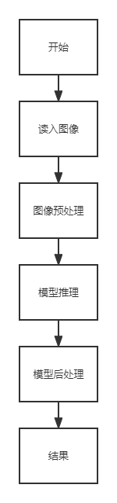

# 基于深度学习的图像配准

## 1 介绍

基于深度学习的图像配准基于 MindXSDK 开发，在晟腾芯片上进行图像配准。输入两幅图片，可以匹配两幅图像中的特征点。

### 1.1 支持的产品

本项目以昇腾Atlas310B卡为主要的硬件平台。

### 1.2 支持的版本

| 软件名称 | 版本   |
| -------- | ------ |
| python    | 3.9.2     | 
| MindX SDK     |    5.0RC1    |
| CANN | 310使用6.3.RC1<br>310B使用6.2.RC1 |

### 1.3 软件方案介绍

基于MindX SDK的基于深度学习的图像配准的业务流程为：将输入的两幅图片进行归一化等预处理操作后，输入到模型中进行推理，对输出的关键点，进行极大值抑制去除相近的关键点，再进一步去除靠近边界的关键点，最后利用knn聚类算法得到可能性最大的关键点。本系统的各模块及功能描述如表1.1所示：

表1.1 系统方案各子系统功能描述：

| 序号 | 子系统   | 功能描述                   |
| ---- | -------- | -------------------------- |
| 1    | 图像输入 | 读取图像                   |
| 2    | 预处理   | 对图像进行预处理           |
| 3    | 模型推理 | 对输入进行推理并输出结果   |
| 5    | 后处理   | 从模型推理结果中解出关键点 |

### 1.4 代码目录结构与说明

本工程名称为基于深度学习的图像配准，工程目录如下图所示：

```txt
.
│  README.mdn
│  pth2onnx.py
│  onnx2om.sh
│
└─python
    │  main.py
    │  requirements.txt
    │  predictor.py
    │
    ├─config
    │      test.yaml
```


### 1.5 技术实现流程图

<center>
    
    <br>
</center>


### 1.6 适用场景

适用于需要配准视网膜图像。

## 2 环境依赖

环境依赖软件和版本如下表：

| 软件    | 版本      | 
| --------| ----------|
|Pytorch  | 1.7.0|
| OpenCV | 4.6.0   |

在编译运行项目前，需要设置环境变量：

在进行模型转换和编译运行前，需设置如下的环境变量：

```bash
. /usr/local/Ascend/ascend-toolkit/set_env.sh #toolkit默认安装路径，根据实际安装路径修改
. ${SDK_INSTALL_PATH}/mxVision/set_env.sh
```

###  3. 模型转换

模型转换使用的是ATC工具，具体使用教程可参考[《ATC工具使用指南》](https://gitee.com/ascend/docs-openmind/blob/master/guide/mindx/sdk/tutorials/%E5%8F%82%E8%80%83%E8%B5%84%E6%96%99.md)。

###  3.1 基于深度学习的图像配准模型的转换

**步骤1** **模型获取** 将[基于深度学习的图像配准模型](https://drive.google.com/drive/folders/1h-MH3wEiN7BoLyMRjF1OAwABKqq6gVFL?usp=sharing)下载到**本地**。克隆原图像配准工程到**本地**，执行如下命令：

```bash
git clone https://github.com/ruc-aimc-lab/superretina
```


**步骤2** **pth转onnx** 将**pth2onnx.py**脚本放至原图像配准工程**本地**目录下，执行如下命令：

```bash
python pth2onnx.py
```

按照实际情况修改路径：

```python
if __name__ == '__main__':
    checkpoint = './SuperRetina.pth'
    onnx_path = './SuperRetina.onnx'
    input = torch.randn(2, 1, 768, 768)
    pth_to_onnx(input, checkpoint, onnx_path)
```

**步骤3** **onnx转om** 将步骤2中转换获得的onnx模型存放至**服务器端**的SuperRetina/目录下，执行如下命令：

```bash
bash onnx2om.sh ./SuperRetina.onnx ./SuperRetina
```

## 编译与运行

**步骤1**  在./python目录下创建./samples文件夹，下载需要配准的图像上传到文件夹中。

**步骤2**  按照第 2 小节 环境依赖 中的步骤设置环境变量。

**步骤3**  按照第 3 小节 模型转换 中的步骤获得 om 模型文件,在./python目录下创建./model文件夹,将om文件移动到model文件夹中。

**步骤4**  在./python目录下运行predictor.py，首先按需求修改路径：

```bash
    f1 = './data/samples/query.jpg'   # image path
    f2 = './data/samples/refer.jpg'   # image path
    merged = align_image_pair(f1, f2, model, show=True)
```

执行如下命令：

```bash
python predictor.py
```

输出两幅图像，分别命名为match_result.jpg和result.jpg

## 精度测试

**步骤1**  在./python目录下创建./data文件夹，下载[FIRE数据集]( https://projects.ics.forth.gr/cvrl/fire/FIRE.7z)，解压后将./FIRE文件夹，放到./data文件夹。

**步骤2**  按照第 2 小节 环境依赖 中的步骤设置环境变量。

**步骤3**  按照第 3 小节 模型转换 中的步骤获得 om 模型文件,在./python目录下创建./model文件夹,将om文件移动到model文件夹中。

**步骤4**  在./python目录下运行main.py函数，执行如下命令：

```bash
python main.py 
```

结果输出到终端，结果如下所示：

```bash
100%|██████████| 133/133 [1:37:18<00:00, 43.90s/it]
----------------------------------------
Failed:0.00%, Inaccurate:3.01%, Acceptable:96.99%
----------------------------------------
S: 0.949, P: 0.544, A: 0.780, mAUC: 0.758
```

论文中精度，同时也是目标精度为mAUC=0.762，结果mAUC=0.758与目标精度误差在0.5%以内，因此精度达标。

## 其他

备份链接：https://mindx.sdk.obs.cn-north-4.myhuaweicloud.com/mindxsdk-referenceapps%20/contrib/SuperRetina/models.zip
