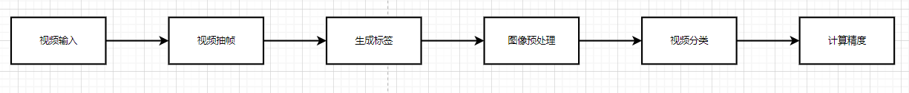
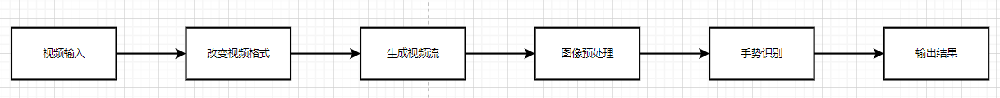

# TSM视频分类参考设计

## 1 介绍
使用TSM模型，基于Kinetics-400数据集，在MindX SDK环境下实现视频分类功能。将测试视频传入脚本进行前处理，模型推理，后处理等功能，最终得到模型推理的精度和性能。

### 1.1 支持的产品

以昇腾Atlas310卡为主要的硬件平台

### 1.2 支持的版本

CANN:5.1RC2

SDK:3.0RC2(可通过cat SDK目录下的version.info查看)

### 1.3 软件方案介绍

项目主要由离线精度测试文件，在线功能测试文件，离线单视频推理性能测试文件，模型文件，测试数据集预处理文件组成。

### 1.4 代码目录结构与说明

```text
├── TSM
    ├── README.md                        // 所有模型相关说明
    ├── model
        ├── pth2onnx.py                  // 转onnx模型脚本
        ├── onnx2om.sh                   // 转om模型脚本
        ├── pth2onnx1.py                 // 在线模型转onnx模型脚本
        ├── onnx2om1.sh                  // 在线模型转om模型脚本
    ├── label
        ├── kinetics_val.csv             // label文件
    ├── download_data
        ├── k400_extractor.sh            // 解压数据集脚本
    ├── online_infer.py                  // 在线推理精度脚本
    ├── offline_infer.py                 // 离线推理精度脚本
    ├── speed.py                         // 离线单视频推理NPU性能脚本
    ├── speed_gpu.py                     // 离线单视频推理GPU性能脚本
```

### 1.5技术实现流程

离线推理流程：



在线推理流程：



### 1.6特性及适用场景

离线模型：

本案例中的 TSM 模型适用于Kinetics数据集中的400类视频分类，并可以返回测试集视频的精度值及单视频识别的种类、性能。

在以下两种情况视频分类情况不太好：1. 视频长度过短（小于3s）。 2. 视频帧率过低。

在线模型：

本案例中的在线模型适用于26中手势识别，并可以返回识别手势的名称。

## 2 环境依赖

推荐系统为ubuntu 18.04，环境依赖软件和版本如下表

| 软件名称     | 版本     |
|----------|--------|
| cmake    | 3.5+   |
| mxVision | 5.1RC2 |
| Python   | 3.9    |
| torch    | 1.10.0 |
| ffmpeg   | 3.4.8  |

- 环境变量搭建

在运行项目前，需要设置环境变量：

MindSDK 环境变量：

```Shell
. ${SDK-path}/set_env.sh
```

CANN 环境变量：

```Shell
. ${ascend-toolkit-path}/set_env.sh
```

环境变量介绍

SDK-path: mxVision SDK 安装路径

ascend-toolkit-path: CANN 安装路径。

## 3  离线推理

**步骤1** Kinetics-400数据集下载

参考[Kinetics-400 数据准备](https://github.com/PaddlePaddle/PaddleVideo/blob/develop/docs/zh-CN/dataset/k400.md#%E4%B8%8B%E8%BD%BDvideo%E6%95%B0%E6%8D%AE)中的脚本下载操作，在代码根目录的"download_data"目录下准备"download.sh"数据集下载脚本和"val_link.list"验证集链接列表文件。

```text
├── TSM
    ├── download_data
        ├── download.sh                  // 下载数据集脚本
        ├── k400_extractor.sh            // 解压数据集脚本
        ├── val_link.list    
```

进入代码根目录的"download_data"目录下，执行以下命令下载数据集压缩包val_part1.tar、val_part2.tar、val_part3.tar：

```Shell
bash download.sh val_link.list
```

然后执行以下命令解压数据集到代码根目录下：

```Shell
bash k400_extractor.sh
```

数据集结构如下：

```text
├── TSM
    ├── data
        ├── abseiling
        ├── air_drumming
        ├── ...
        ├── zumba
```

**步骤2** 数据集预处理

1、视频抽帧

在代码根目录执行以下命令创建所需目录：

```Shell
mkdir tools
mkdir ops
```

下载[“temporal-shift-module-master.zip”](https://github.com/mit-han-lab/temporal-shift-module/tree/master)代码包并上传服务器解压，将代码包中"tools"目录下的"vid2img_kinetics.py"、"gen_label_kinetics.py"、"kinetics_label_map.txt"三个文件拷贝至参考设计代码根目录的“tools”目录下。

```text
├── TSM
    ├── tools 
        ├── gen_label_kinetics.py        // label生成脚本
        ├── vid2img_kinetics.py          // 视频抽帧脚本
        ├── kinetics_label_map.txt
```

将代码包中"ops"目录下的"basic_ops.py"、"dataset.py"、"dataset_config.py"、"models.py"、"temporal_shift.py"、"transforms.py"六个文件拷贝至参考设计代码根目录的“ops”目录下。

```text
    ├── ops
        ├── basic_ops.py
        ├── dataset.py                   // 数据集构建脚本
        ├── dataset_config.py            // 数据集配置脚本
        ├── models.py                    // 模型搭建脚本 
        ├── temporal_shift.py
        ├── transforms.py
```

在参考设计代码根目录下，执行以下命令对数据集视频进行抽帧并生成图片：

```shell
mkdir dataset
cd ./tools
python3 vid2img_kinetics.py [video_path] [image_path]
e.g.
python3 vid2img_kinetics.py ../data ../dataset/
```

在“tools”目录下，执行以下命令生成标签文件：

```shell
python3 gen_label_kinetics.py
```

修改gen_label_kinetics.py 内容。

```text

# 11行 dataset_path = '../dataset'           # 放视频抽帧后的图片路径
# 12行 label_path = '../label'               # 存放label路径
# 25行 files_input = ['kinetics_val.csv']
# 26行 files_output = ['val_videofolder.txt']
# 57行 output.append('%s %d %d'%(os.path.join('../dataset/',os.path.join(categories_list[i], curFolder)), len(dir_files), curIDX))

``` 

**步骤3** 模型转换

下载[离线模型](https://mindx.sdk.obs.cn-north-4.myhuaweicloud.com/mindxsdk-referenceapps%20/contrib/TSM/offline_models.zip),将下载好的模型放在“/TSM/model”目录下。

将模型转换为onnx模型，在参考设计代码根目录下，执行以下命令将pth模型转换为onnx模型

```shell
cd ./model
python3 pth2onnx.py  kinetics  RGB
```

将模型转换为om模型，在“model”目录下，执行以下命令生成om模型

```shell
bash onnx2om.sh
```

**步骤4** 精度测试

修改/TSM/ops/dataset_config.py 脚本中参数ROOT_DATASET、filename_imglist_train和filename_imglist_val，若仅进行离线精度测试则可忽略filename_imglist_train设置。

```shell
import os

ROOT_DATASET = './labels/'

...

def return_kinetics(modality):
    filename_categories = 400
    if modality == 'RGB':
        root_data = ROOT_DATASET
        filename_imglist_train = 'train_videofolder.txt'
        filename_imglist_val = 'val_videofolder.txt'
        prefix = 'img_{:05d}.jpg'
    else:
        raise NotImplementedError('no such modality:' + modality)
    return filename_categories, filename_imglist_train, filename_imglist_val, root_data, prefix
```

在参考设计代码根目录下，运行精度测试脚本

```shell
python3 offline_infer.py kinetics
```

得到精度为：71.01%

**步骤5** 性能测试

将用来测试的单视频放在参考设计代码根目录下，如视频“test.mp4”，运行性能测试脚本

修改参数，'./test.mp4'为测试视频，测试视频类别需在Kinetics-400数据集的400个种类内且视频长度至少为3s。

```python
def main():
    cmd = 'ffmpeg  -i \"{}\" -threads 1 -vf scale=-1:331 -q:v 0 \"{}/img_%05d.jpg\"'.format('./test.mp4', './image')
    subprocess.call(cmd, shell=True,
                    stdout=subprocess.DEVNULL, stderr=subprocess.DEVNULL)
    files = os.listdir(r"./image/")
```

GPU性能(Tesla_V100S_PCIE_32GB)

在参考设计代码根目录下，运行GPU性能测试脚本

```shell
python3 speed_gpu.py kinetics --test_segments=8 --test_crops=1 --batch_size=1
```

得到单视频推理性能为0.08sec/video

SDK性能

在参考设计代码根目录下，运行SDK性能测试脚本

```shell
python3 speed.py
```

得到单视频推理性能为0.189sec/video

## 4 在线推理

**步骤1** 安装[视频流工具](https://gitee.com/ascend/docs-openmind/blob/master/guide/mindx/sdk/tutorials/reference_material/Live555%E7%A6%BB%E7%BA%BF%E8%A7%86%E9%A2%91%E8%BD%ACRTSP%E8%AF%B4%E6%98%8E%E6%96%87%E6%A1%A3.md)

**步骤2** 生成视频流

使用ffmpeg工具将mp4格式视频生成264格式视频

```shell
ffmpeg -i test.mp4 -vcodec h264 -bf 0 -g 25 -r 10 -s 1280*720 -an -f h264 test.264

//-bf B帧数目控制，-g 关键帧间隔控制，-s 分辨率控制 -an关闭音频， -r 指定帧率
```

使用live555生成视频流。

**步骤3** 模型转换

将代码包中"online_demo"目录下mobilenet_v2_tsm.py 放在参考设计代码根目录的“model” 目录下。

```text
├── TSM
    ├── model
        ├── pth2onnx.py                  // 转onnx模型脚本
        ├── onnx2om.sh                   // 转om模型脚本
        ├── mobilenet_v2_tsm.py          // 在线模型脚本
        ├── pth2onnx1.py                 // 在线模型转onnx模型脚本
        ├── onnx2om1.sh                  // 在线模型转om模型脚本
```

下载[在线模型](https://mindx.sdk.obs.cn-north-4.myhuaweicloud.com/mindxsdk-referenceapps%20/contrib/TSM/online_models.zip)

将下载好的模型放在参考设计代码根目录的“model”目录下。

将模型转换为onnx模型，在参考设计代码根目录下，运行脚本将pth模型转成onnx模型

```shell
cd ./model
python3 pth2onnx1.py
```

将模型转换为om模型，在“model”目录下，运行脚本生成om模型

```shell
bash onnx2om1.sh
```

**步骤4** 程序测试

```shell
python3 online_infer.py
```

修改参数，'ip:port/jester.264'为测试视频流

```python
def video2img():
    cmd = 'ffmpeg  -i \"{}\" -threads 1 -vf scale=-1:331 -q:v 0 \"{}/img_%05d.jpg\"'.format('ip:port/jester.264', './image')
    subprocess.call(cmd, shell=True,
                    stdout=subprocess.DEVNULL, stderr=subprocess.DEVNULL)
```

## 5 软件依赖说明

如果涉及第三方软件依赖，请详细列出。

| 依赖软件   | 版本     | 说明    |
|--------|--------|-------|
| ffmpeg | 3.4.8  | 视频抽帧  |
| torch  | 1.10.0 | 数据集构建 |

[ffmpeg下载](https://ffmpeg.org/download.html#build-linux)

```Shell
xz -d ffmpeg-git-amd64-static.tar.xz
tar -xvf ffmpeg-git-amd64-static.tar
cd ./ffmpeg-git-20190424-amd64-static
./ffmpeg
```