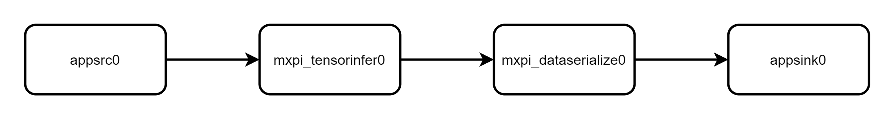
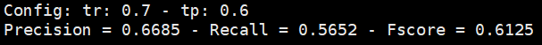
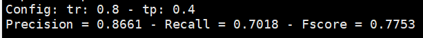

# TextSnake 弯曲形状文字检测 

## 1 介绍
TextSnake 弯曲形状文字检测基于 MindX SDK 开发，对图片中的任意弯曲形状文字进行检测，将检测得到的不同类的目标用曲线框标记。本方案使用在人工合成数据集SynthText上训练一个epoch，然后在其他数据集上finetune得到的TextSnake_bs1模型检测，数据集中共包含各种各样的弯曲形状文字，可以对各种角度，各种环境下的弯曲形状文字进行检测。

### 1.1 支持的产品

本项目以昇腾Atlas 500 A2为主要的硬件平台。

### 1.2 支持的版本

推荐系统为ubuntu 18.04。

| 软件名称 | 版本   |
| -------- | ------ |
| python    | 3.9.2     | 
| MindX SDK     |    5.0RC1    |
| CANN | 310使用6.3.RC1<br>310B使用6.2.RC1 |

### 1.3 软件方案介绍

本项目流程为用python代码实现对图像的预处理过程，然后将处理好的图片通过 appsrc 插件输入到业务流程中。整体业务流程为：待检测图片通过 appsrc 插件输入，然后使用图像解码插件 mxpi_imagedecoder 对图片进行解码，解码后的图像输入模型推理插件 mxpi_tensorinfer 得到推理结果。最后通过输出插件 appsink 获取检测结果，并在外部进行后处理和可视化，将检测结果标记到原图上，本系统的各模块及功能描述如表1所示：

表1.1 系统方案各子系统功能描述：

| 序号 | 子系统 | 功能描述     |
| ---- | ------ | ------------ |
| 1    | 图片输入    | 	获取 jpg 格式输入图片 |
| 2    | 	检测前处理    | 更改输入图片尺寸并进行归一化 |
| 3    | 		模型推理    | 对输入张量进行推理 |
| 4    | 	结果输出    | 获取检测结果 |
| 5    | 	检测后处理    | 根据检测结果计算检测框位置和形状 |
| 6    | 		结果可视化    | 	将检测结果标注在输入图片上 |


### 1.4 代码目录结构与说明

本工程名称为TextSnake，工程目录如下图所示：

```
├── main.py  //运行工程项目的主函数
├── evaluate.py   //精度计算
├── t.pipeline      //pipeline
├── sdk.png      //流程图
├── pipeline.png      //pipeline流程图
└──README.md          
```


### 1.5 技术实现流程图

实现流程图如下图所示：


pipeline流程如下图所示：




### 1.6 特性及适用场景

本案例中的TextSnake模型适用于图像中弯曲形状文字的检测。

本模型在以下几种情况下检测弯曲形状文字的效果良好：含有目标数量少、目标面积占比图像较大、各目标边界清晰。

在以下情况检测弯曲形状文字效果不太好：图片中的弯曲形状文字数目较多且大小较小，此时会出现缺漏的情况。


## 2 环境依赖

| 软件名称 | 版本   |
| -------- | ------ |
| cv2   | 4.1.2  |
| numpy   | 1.15.1 |
| onnx   | 1.8.0 |
| torch   | 1.5.0 |
| torchvision   | 0.6.0 |
| scikit_image   | 0.16.2 |
| scipy   | 1.5.4 |
| easydict   | 1.8 |
| tdqm   | 4.62.3 |

在编译运行项目前，需要设置环境变量：

具体执行命令

```
. ${MX_SDK_HOME}/set_env.sh
	
. ${ascend-toolkit-path}/set_env.sh
```


## 模型转换

本项目使用的模型是TextSnake模型。
    
选用的模型为 pytorch 模型，可从 Ascend modelzoo 获取模型压缩包，在运行项目之前需要将 pytorch 模型转为 onnx 模型，再由 onnx 模型转为 om 模型。

pth 权重文件和 onnx 文件的下载链接
https://mindx.sdk.obs.cn-north-4.myhuaweicloud.com/mindxsdk-referenceapps%20/contrib/TextSnake/ATC%20TextSnake%28FP16%29%20from%20Pytorch%20-%20Ascend310.zip

    
具体步骤如下

1. 下载上述模型压缩包，获取 TextSnake.onnx 模型文件放置 TextSnake/model 目录下。

2. 进入TextSnake/model文件夹下执行命令

```
atc --model=TextSnake.onnx --framework=5 --output=TextSnake_bs1 --input_format=NCHW --input_shape="image:1,3,512,512" --log=info --soc_version=Ascend310B1
 ```

3. 执行该命令会在当前目录下生成项目需要的模型文件TextSnake_bs1.om。执行后终端输出为

 ```
ATC start working now, please wait for a moment.
ATC run success, welcome to the next use.
```

   表示命令执行成功。


## 编译与运行

**步骤 1**  将任意一张jpg格式的图片存到当前目录下（./TextSnake），命名为test.jpg。如果 pipeline 文件（或测试图片）不在当前目录下（./TestSnake），需要修改 main.py 的pipeline（或测试图片）路径指向到所在目录。此外，需要从
https://github.com/princewang1994/TextSnake.pytorch/tree/b4ee996d5a4d214ed825350d6b307dd1c31faa07
下载util文件夹至当前目录（./TextSnake），并修改其中的detection.py,修改方式如下（以下行数均为原代码行数）：

（1）将12行改为：
 ```
def __init__(self, tr_thresh=0.4, tcl_thresh=0.6):
 ```

并删除该构造函数中与model相关的语句。

（2）将38行：
 ```
in_poly = cv2.pointPolygonTest(cont, (xmean, i), False)
 ```
改为
 ```
in_poly = cv2.pointPolygonTest(cont, (int(xmean), int(i)), False)
 ```
56行改为
 ```
if cv2.pointPolygonTest(cont, (int(test_pt[0]), int(test_pt[1])), False) > 0
 ```
67行改为
 ```
return cv2.pointPolygonTest(cont, (int(x), int(y)), False) > 0
 ```

（3）在315行前后分别添加：
 ```
conts = list(conts)
```
```
conts = tuple(conts)
```

**步骤 2**   按照模型转换获取om模型，放置在 TextSnake/model 路径下。若未从 pytorch 模型自行转换模型，使用的是上述链接提供的 onnx 模型，则无需修改相关文件，否则修改 main.py 中pipeline的相关配置，将 mxpi_tensorinfer0 插件 modelPath 属性值中的 om 模型名改成实际使用的 om 模型名。

**步骤 3**  在命令行输入 如下命令运行整个工程

```
python3 main.py
```

**步骤 4** 图片检测。运行结束输出result.jpg。


## 5  测试精度

**步骤 1** 安装数据集用以测试精度。数据集 TotalText 需要自行下载。
数据集图片部分：
https://drive.google.com/file/d/1bC68CzsSVTusZVvOkk7imSZSbgD1MqK2/view?usp=sharing totaltext.zip

数据集ground truth部分：
https://drive.google.com/file/d/19quCaJGePvTc3yPZ7MAGNijjKfy77-ke/view?usp=sharing groundtruth_text.zip

将下载好的数据集调整成以下路径的形式
```
├── main.py  //运行工程项目的主函数
├── evaluate.py   //精度计算
├── t.pipeline      //pipeline
├── model   //存放模型文件
├── test.jpg          //测试图像
├── result.jpg          //输出结果
├── sdk.png          //流程图
├── pipeline.png          //pipeline流程图
├── data
    ├── total-text
        ├── gt
            ├── Test
                ├── poly_gt_img1.mat //测试集groundtruth
                ...
        ├── img1.jpg     //测试集图片
        ...              
└──README.md           
```

**步骤 2** 除先前下载的util文件夹之外，还需要从以下网址中下载Deteval.py与polygon_wrapper.py文件，放入util文件夹中
https://github.com/princewang1994/TextSnake.pytorch/tree/b4ee996d5a4d214ed825350d6b307dd1c31faa07/dataset/total_text/Evaluation_Protocol/Python_scripts

**步骤 3**  在命令行输入 如下命令运行精度测试
```
python3 evaluate.py
```
得到精度测试的结果：





与pytorch实现版本的精度结果相对比，其精度相差在1%以下，精度达标。