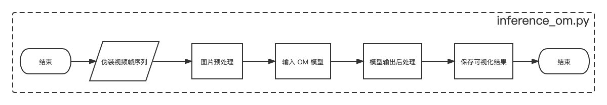

# 视频伪装物体检测

## 1 介绍

基于 MindX SDK 实现 SLT-Net 模型的推理，在 MoCA-Mask 数据集上 Sm 达到大于 0.6。输入连续几帧伪装物体的视频序列，输出伪装物体掩膜 Mask 图。


### 1.1 支持的产品

本项目以昇腾Atlas 500 A2为主要的硬件平台。


### 1.2 支持的版本

| 软件名称 | 版本   |
| -------- | ------ |
| python    | 3.9.2     | 
| MindX SDK     |    5.0RC1    |
| CANN | 310使用6.3.RC1<br>310B使用6.2.RC1 |


### 1.3 软件方案介绍


本方案中，先通过 `torch2onnx.py` 脚本将 PyTorch 版本的伪装视频物体检测模型 SLT-Net 转换为 onnx 模型；然后通过 `inference.py` 脚本调用晟腾om模型，将输入视频帧进行图像处理，最终生成视频伪装物体的掩膜 Mask 图。


### 1.4 代码目录结构与说明

本sample工程名称为 VCOD_SLTNet，工程目录如下图所示：

```
──VCOD_SLTNet
    ├── flowchart.jpeg
    ├── inference.py   # 推理文件
    ├── torch2onnx.py  # 模型转换脚本
    └── README.md
```


### 1.5 技术实现流程图



图1 视频伪装物体检测流程图


### 1.6 特性及适用场景

对于伪装视频数据的分割任务均适用，输入视频需要转换为图片序列输入到模型中，具体可以参考 MoCA 数据格式与目录结构（如下所示），详见 [SLT-Net](https://xueliancheng.github.io/SLT-Net-project/) 与 [MoCA 数据集主页](https://www.robots.ox.ac.uk/~vgg/data/MoCA/)。


```
--data
    └── TestDataset_per_sq           # 测试数据集
        ├── flower_crab_spider_1     # 不同场景
            ├── GT                   # Ground Truth
                ├── 00000.png
                ├── .....
            └── Imgs                 # 输入图片序列
                ├── 00000.jpg
                ├── .....
        ......

```


## 2 环境依赖

环境依赖软件和版本如下表：

| 软件名称 | 版本   |
| -------- | ------ |
| PyTorch | 1.12.1 |
| numpy | 1.21.5 |
| imageio | 2.22.3| 
| Pillow | 9.3.0 | 
| cv2 | 4.5.5 |
| timm | 0.4.12 |
| tqdm | 4.64.1 |

> 配置环境变量

```
. /usr/local/Ascend/ascend-toolkit/set_env.sh #toolkit默认安装路径，根据实际安装路径修改
. ${SDK_INSTALL_PATH}/mxVision/set_env.sh
```

## 3. 数据准备

### 3.1 准备相关文件

1、SLT-Net代码包准备

点击访问 [SLT-Net](https://github.com/XuelianCheng/SLT-Net) 并下载 SLT-Net-master.zip 代码压缩包，上传服务器并解压得到“SLT-Net-master”目录及文件；

2、SLT-Net模型文件准备

方法一：通过访问 [SLT-Net 模型官方链接](https://drive.google.com/file/d/1_u4dEdxM4AKuuh6EcWHAlo8EtR7e8q5v/view) 下载模型压缩包 (注意，需要访问 Google Drive )，解压后将 `Net_epoch_MoCA_short_term_pseudo.pth` 模型拷贝至 `SLT-Net-master` 目录下；

方法二：下载 [models.zip 备份模型压缩包](https://mindx.sdk.obs.cn-north-4.myhuaweicloud.com/mindxsdk-referenceapps%20/contrib/sltnet/models.zip) 并解压获得 `sltnet.pth`、`sltnet.onnx`、`sltnet.om` 三个模型文件，将 `sltnet.pth` 模型拷贝至 `SLT-Net-master` 目录下


3、数据集准备

通过访问[MoCA官方链接](https://xueliancheng.github.io/SLT-Net-project/)下载 `MoCA_Video` 数据集，或者通过[数据集备份链接](https://mindx.sdk.obs.cn-north-4.myhuaweicloud.com/mindxsdk-referenceapps%20/contrib/sltnet/MoCA_Video.zip)来下载 `MoCA_Video.zip` 数据集压缩包并解压；


### 3.2 模型转换

1、SLT-Net代码预处理

进入 `SLT-Net-master/lib` 目录下，对 `__init__.py`、`short_term_model.py`、`pvtv2_afterTEM.py`三个文件做以下修改：

1）`__init__.py`文件注释如下：

```
from .short_term_model import VideoModel as VideoModel_pvtv2
# from .long_term_model import VideoModel as VideoModel_long_term
```

注：因为长期模型依赖 CUDA，并且需要在 CUDA 平台进行编译，而本项目基于 MindX SDK 实现，因此使用短期模型。并且，短期模型的评价指标满足预期。


2）修改 `short_term_model.py` 文件中，如下代码行：

修改

```
def forward(self, x):
    image1, image2, image3 = x[:, :3], x[:, 3:6], x[:, 6:]  # 替换之前的 image1, image2, image3 = x[0],x[1],x[2]
    fmap1=self.backbone.feat_net(image1)
    fmap2=self.backbone.feat_net(image2)
    fmap3=self.backbone.feat_net(image3)
```

修改

```
    def __init__(self, args):
        super(ImageModel, self).__init__()
        self.args = args
        # self.backbone = Network(pvtv2_pretrained=self.args.pvtv2_pretrained, imgsize=self.args.trainsize)
        self.backbone = Network(pvtv2_pretrained=self.args.pvtv2_pretrained, imgsize=352)   # 指定图片大小

    ....

        # self.backbone = Network(pvtv2_pretrained=False, imgsize=self.args.trainsize)
        self.backbone = Network(pvtv2_pretrained=False, imgsize=352)   # 指定图片大小
        if self.args.pretrained_cod10k is not None:
            self.load_backbone(self.args.pretrained_cod10k )
```


删除

```
if self.args.pretrained_cod10k is not None:
    self.load_backbone(self.args.pretrained_cod10k )
```


3）`pvtv2_afterTEM.py` 文件注释如下：

```
from timm.models import create_model
#from mmseg.models import build_segmentor
#from mmcv import ConfigDict
import pdb
```


修改“SLT-Net-master/mypath.py”文件如下：

```
elif dataset == 'MoCA':
    return './dataset/MoCA-Mask/' # 将此处路径修改指定为“MoCA_Video”目录的相对路径
```


可参考已经完成修改的 [SLT_Net_MindXsdk_torch](https://github.com/shuowang-ai/SLT_Net_MindXsdk_torch)，也可直接使用该项目进行下面的 onnx 模型转换操作，替代以上步骤。


2、模型转换

步骤一、pth模型转onnx模型

将 `VCOD_SLTNet` 代码包中的 `torch2onnx.py` 脚本拷贝至 `SLT-Net-master` 目录下，并在 `SLT-Net-master` 目录下执行以下命令将 pth 模型转换成 onnx 模型：

```
python torch2onnx.py --pth_path ${pth模型文件路径} --onnx_path ./sltnet.onnx
```

参数说明：

pth_path：pth模型文件名称及所在路径

onnx_path：生成输出的onnx模型文件


注意，timm 的版本为 `0.4.12`，其他版本可能有兼容性问题。


步骤二、简化onnx文件（可选操作）

```
python -m onnxsim --input-shape="1,9,352,352" --dynamic-input-shape sltnet.onnx sltnet_sim.onnx
```

步骤三、onnx模型转om模型

```
atc --framework=5 --model=sltnet.onnx --output=sltnet --input_shape="image:1,9,352,352" --soc_version=Ascend310B1 --log=error
```

注意：

1. 若想使用转换好的onnx模型或om模型，可通过下载 [models.zip备份模型压缩包](https://mindx.sdk.obs.cn-north-4.myhuaweicloud.com/mindxsdk-referenceapps%20/contrib/sltnet/models.zip) 解压获得转换好的 onnx 模型或 om 模型。

2. pth模型转onnx模型，onnx模型转om模型，均可能花费约1小时左右，视不同运行环境而定。如无报错，请耐心等待。


## 4. 运行推理


使用如下命令，运行 `inference.py` 脚本：

```
python inference.py --datapath ${MoCA_Video数据集路径} --save_root ./results/ --om_path ./sltnet.om --testsize 352 --device_id 0
```

参数说明：

datapath：下载数据以后，目录中 `TestDataset_per_sq` 的上一级目录，

save_root：结果保存路径

om_path：om 模型路径

testsize：图片 resize 的大小，当前固定为 352

device_id：设备编号


注意，该脚本无需放入修改的 SLT-Net 目录，在任意位置均可执行，只需设置好上述参数即可。


运行输出如下：

```
  0%|                                                                                                       | 0/713 [00:00<?, ?it/s]>  ./results/arctic_fox/Pred/00000.png
  0%|▏                                                                                              | 1/713 [00:00<10:31,  1.13it/s]>  ./results/arctic_fox/Pred/00005.png
  0%|▎                                                                                              | 2/713 [00:01<09:01,  1.31it/s]>  ./results/arctic_fox/Pred/00010.png
  0%|▍                                                                                              | 3/713 [00:02<08:30,  1.39it/s]>  ./results/arctic_fox/Pred/00015.png
  1%|▌                                                                                              | 4/713 [00:02<08:13,  1.44it/s]>  ./results/arctic_fox/Pred/00020.png
```

将展示剩余运行时间以及生成图片的路径。


## 5. 精度评估

点击访问 [SLT_Net_MindXsdk_torch](https://github.com/shuowang-ai/SLT_Net_MindXsdk_torch) 并下载 `SLT_Net_MindXsdk_torch-master.zip` 代码压缩包，上传服务器并解压获得 `SLT_Net_MindXsdk_torch-master` 目录及相关文件；

进入 `SLT_Net_MindXsdk_torch-master` 目录，修改 `eval_python/run_eval.py` 脚本中的 `gt_dir` 为本地的 `MoCA_Video/TestDataset_per_sq/` 目录的绝对路径，`pred_dir` 为预测结果目录的绝对路径，并执行以下命令进行精度评估：

```
python eval_python/run_eval.py
```

完成评估后的结果如下：

{'Smeasure': 0.6539, 'wFmeasure': 0.3245, 'MAE': 0.0161, 'adpEm': 0.6329, 'meanEm': 0.7229, 'maxEm': 0.7554, 'adpFm': 0.3025, 'meanFm': 0.3577, 'maxFm': 0.3738}

评测结果高于交付所要求的 Smeasure 0.6 的指标。

注：评估还可参考基于 基于 [MATLAB](https://github.com/XuelianCheng/SLT-Net/tree/master/eval) 的 SLT-Net 的评测代码或参考基于 Python 的 [PySODEvalToolkit](https://github.com/lartpang/PySODEvalToolkit) 的评测代码。
