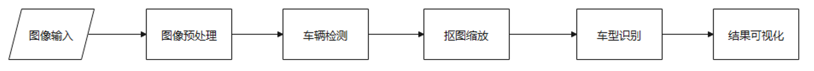

# 车型识别

## 1 介绍
在本系统中，目的是基于MindX SDK，在昇腾平台上，开发端到端车型识别的参考设计，实现对图像中的车辆进行车型识别的功能，并把可视化结果保存到本地，达到功能要求。

样例输入：带有头部的jpg图片。

样例输出：框出并标有车辆车型与置信度的jpg图片。

### 1.1 支持的产品

支持昇腾310芯片

### 1.2 支持的版本

支持21.0.4版本

版本号查询方法，在Atlas产品环境下，运行命令：

```bash
npu-smi info
```
可以查询支持SDK的版本号


### 1.3 软件方案介绍

本方案中，采用yolov3预训练模型对输入图片进行车辆识别，车辆识别后对识别出的车辆图像进行抠图，然后使用GoogLeNet_cars模型进行头部姿态识别，最终根据GoogLeNet_cars模型识别得到的车型信息和置信度生成框出并标有车辆车型与置信度的jpg图片。

注：由于GoogLeNet_cars模型限制，仅支持识别在`./models/vehicle/car.names`文件中的 **431** 种车辆。

### 1.4 代码目录结构与说明

本工程名称为VehicleIdentification，工程目录如下图所示：
```
├── models
│   ├── vehicle
│   │   ├── car.names
│   │   ├── deploy.prototxt
│   │   ├── googlenet.om
│   │   ├── insert_op.cfg
│   │   └── vehiclepostprocess.cfg
│   ├── yolo
│   │   ├── aipp_yolov3_416_416.aippconfig
│   │   ├── coco.names
│   │   ├── yolov3_tf_bs1_fp16.cfg
│   │   └── yolov3_tf_bs1_fp16.om
├── pipeline
│   └── identification.pipeline        # pipeline文件
├── vehiclePostProcess
│   ├── CMakeLists.txt
│   ├── VehiclePostProcess.cpp
│   └── VehiclePostProcess.h
├── main.py
├── build.sh # 编译头部姿态后处理插件脚本
└── test.jpg
```

### 1.5 技术实现流程图

<center>
    
    <br>
    <div style="color:orange; border-bottom: 1px solid #d9d9d9;
    display: inline-block;
    color: #999;
    padding: 2px;">
      图1 车型识别流程图
  	</div>
</center>


<center>
    
    <br>
    <div style="color:orange; border-bottom: 1px solid #d9d9d9;
    display: inline-block;
    color: #999;
    padding: 2px;">
      图2 头部姿态识别pipeline示意图
  	</div>
</center>


## 2 环境依赖

| 软件名称 | 版本   |
| :--------: | :------: |
|ubantu|18.04.1 LTS   |
|MindX SDK|2.0.4|
|Python|3.9.2|
|CANN|5.0.4|

在编译运行项目前，需要设置环境变量：

- 环境变量介绍

```bash
# 执行如下命令，打开.bashrc文件
vi .bashrc
# 在.bashrc文件中添加以下环境变量
MX_SDK_HOME=${SDK安装路径}

LD_LIBRARY_PATH=${MX_SDK_HOME}/lib:${MX_SDK_HOME}/opensource/lib:${MX_SDK_HOME}/opensource/lib64:/usr/local/Ascend/ascend-toolkit/latest/acllib/lib64:/usr/local/Ascend/driver/lib64/

GST_PLUGIN_SCANNER=${MX_SDK_HOME}/opensource/libexec/gstreamer-1.0/gst-plugin-scanner

GST_PLUGIN_PATH=${MX_SDK_HOME}/opensource/lib/gstreamer-1.0:${MX_SDK_HOME}/lib/plugins

PYTHONPATH=${MX_SDK_HOME}/python:$PYTHONPATH

# 保存退出.bashrc文件
# 执行如下命令使环境变量生效
source ~/.bashrc

#查看环境变量
env
```

## 3 模型获取

### 3.1 yolo模型转换

**步骤1** 在ModelZoo上下载YOLOv3模型。[下载地址](https://www.hiascend.com/zh/software/modelzoo/detail/1/ba2a4c054a094ef595da288ecbc7d7b4)

**步骤2** 将获取到的YOLOv3模型pb文件存放至`./models/yolo/`。

**步骤3** 模型转换

在`./models/yolo`目录下执行一下命令

```bash
# 设置环境变量（请确认install_path路径是否正确）
# Set environment PATH (Please confirm that the install_path is correct).

export install_path=/usr/local/Ascend/ascend-toolkit/latest
export PATH=/usr/local/python3.9.2/bin:${install_path}/atc/ccec_compiler/bin:${install_path}/atc/bin:$PATH
export PYTHONPATH=${install_path}/atc/python/site-packages:${install_path}/atc/python/site-packages/auto_tune.egg/auto_tune:${install_path}/atc/python/site-packages/schedule_search.egg
export LD_LIBRARY_PATH=${install_path}/atc/lib64:$LD_LIBRARY_PATH
export ASCEND_OPP_PATH=${install_path}/opp

# 执行，转换YOLOv3模型
# Execute, transform YOLOv3 model.

atc --model=./yolov3_tf.pb --framework=3 --output=./yolov3_tf_bs1_fp16 --soc_version=Ascend310 --insert_op_conf=./aipp_yolov3_416_416.aippconfig --input_shape="input/input_data:1,416,416,3" --out_nodes="yolov3/yolov3_head/Conv_6/BiasAdd:0;yolov3/yolov3_head/Conv_14/BiasAdd:0;yolov3/yolov3_head/Conv_22/BiasAdd:0"
# 说明：out_nodes制定了输出节点的顺序，需要与模型后处理适配。
```

执行完模型转换脚本后，会生成相应的.om模型文件。 

### 3.2 googlenet模型转换

**步骤1** 下载googlenet模型权重文件。[下载地址](http://mmlab.ie.cuhk.edu.hk/datasets/comp_cars/googlenet_finetune_web_car_iter_10000.caffemodel)

**步骤2** 更新caffemodel文件：

由于此模型为老版本模型，atc不支持转换，需要将模型权重文件与结构文件更新，项目提供更新后的模型结构文件deploy.prototxt，位于`./models/googlenet/deploy.prototxt`。

将权重文件放置于`./models/googlenet/`目录下，执行目录下的updatemodel.py（需要安装caffe环境），得到新版caffe权重文件`googlenet.caffemodel`。

**步骤3** 模型转换：

在`./models/googlenet`目录下执行一下命令

```bash
# 环境变量配置如3.1

atc --framework=0 --model=./deploy.prototxt --weight=./googlenet.caffemodel --input_shape="data:1,3,224,224" --input_format=NCHW --insert_op_conf=./insert_op.cfg --output=./googlenet --output_type=FP32 --soc_version=Ascend310
```

执行完模型转换脚本后，会生成相应的.om模型文件。 


模型转换使用了ATC工具，如需更多信息请参考:

 https://support.huaweicloud.com/tg-cannApplicationDev330/atlasatc_16_0005.html


### 3.3 可用模型获取

此处提供转换好的YOLOV3模型，车型识别模型（googlenet）的om文件以及一份测试集：[下载地址]()

注：**下载后请将两个模型请放置于models的对应目录下（`models/yolo`和`models/googlenet`）**


## 4 编译与运行

示例步骤如下：

**步骤1** 

后处理插件库编译：在项目目录下执行
```bash
bash build.sh
```
**步骤2** 

修改so文件权限：

```bash
chmod 640 ./lib/libvehiclepostprocess.so
```

**步骤3** 

修改`pipeline/identification.pipeline`文件中: **mxpi_objectpostprocessor0**插件的`postProcessLibPath`属性，修改为
```
{本机SDK安装路径}/lib/modelpostprocessors/libyolov3postprocess.so
```
**步骤4** 

在测试集中选择一张jpg文件，放入项目根目录中，再执行
```bash
python3 main.py
```

