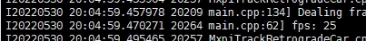

# VehicleRetrogradeRecognition交通逆行识别

## 1 介绍

VehicleRetrogradeRecognition交通逆行识别后处理插件基于MindXSDK开发，在晟腾芯片上进行目标检测和跟踪，可以对逆行车辆进行画框和编号，将检测结果可视化并保存。项目主要流程为：通过live555服务器进行拉流输入视频，然后进行视频解码将264格式的视频解码为YUV格式的图片，图片缩放后经过模型推理进行逆行车辆识别，识别结果经过VehicleRetrogradeRecognition后处理后得到识别框，对识别框进行跟踪和车辆行驶方向判断，用编号覆盖原有的类别信息，再将逆行车辆的识别框和类别信息分别转绘到图片上，最后将图片编码成视频进行输出。 

### 1.1 支持的产品

昇腾310(推理)

### 1.2 支持的版本

本样例配套的CANN版本为[5.0.4](https://www.hiascend.com/software/cann/commercial)。支持的SDK版本为[2.0.4](https://www.hiascend.com/software/Mindx-sdk)。

MindX SDK安装前准备可参考《用户指南》，[安装教程](https://gitee.com/ascend/mindxsdk-referenceapps/blob/master/docs/quickStart/1-1安装SDK开发套件.md)

### 1.3 软件方案介绍

基于MindX SDK的VehicleRetrogradeRecognition车辆逆行识别业务流程为：待检测视频存放在live555服务器上经mxpi_rtspsrc拉流插件输入，然后使用视频解码插件mxpi_videodecoder将视频解码成图片，再通过图像缩放插件mxpi_imageresize将图像缩放至满足检测模型要求的输入图像大小要求，缩放后的图像输入模型推理插件mxpi_tensorinfer得到检测结果，检测结果通过后处理插件objectpostprocessor处理，再通过mxpi_distributor插件筛选出汽车和卡车的检测结果，再接入跟踪插件mxpi_motsimplesortV2中识别框进行目标跟踪，得到目标的跟踪编号，本项目开发的MxpiTrackRetrogradeCar后处理插件识别出逆行的车辆目标，得到识别框，使用mxpi_object2osdinstances和mxpi_opencvosd分别将识别框和类名（存储跟踪编号）绘制到原图片，再通过mxpi_videoencoder将图片合成视频。

表1.1 系统方案各子系统功能描述：

| 序号 | 子系统               | 功能描述                                                     |
| ---- | -------------------- | :----------------------------------------------------------- |
| 1    | 视频输入             | 接收外部调用接口的输入视频路径，对视频进行拉流，并将拉取的裸流存储到缓冲区（buffer）中，并发送到下游插件。 |
| 2    | 视频解码             | 用于视频解码，当前只支持H264/H265格式。                      |
| 3    | 数据分发             | 对单个输入数据分发多次。                                     |
| 4    | 数据缓存             | 输出时为后续处理过程另创建一个线程，用于将输入数据与输出数据解耦，并创建缓存队列，存储尚未输出到下流插件的数据。 |
| 5    | 图像处理             | 对解码后的YUV格式的图像进行指定宽高的缩放，暂时只支持YUV格式 的图像。 |
| 6    | 模型推理插件         | 目标分类或检测，目前只支持单tensor输入（图像数据）的推理模型。 |
| 7    | 模型后处理插件       | 实现对模型推理输出的tensor解析，获取目标检测框以及对应的识别标签，传输到筛选模块。 |
| 8    | 筛选插件             | 筛选出识别的车辆。                 |
| 9    | 跟踪插件             | 实现多目标（包括机非人、目标）路径记录功能。                 |
| 10   | 交通逆行识别插件      | 识别出道路中逆行的车辆，再将数据传入数据流中。 |
| 11   | 目标框转绘插件       | 将流中传进的MxpiObjectList数据类型转换可用于OSD插件绘图所使用的的 MxpiOsdInstancesList数据类型。 |
| 12   | OSD可视化插件        | 主要实现对每帧图像标注跟踪结果。                             |
| 13   | 视频编码插件         | 用于将OSD可视化插件输出的图片进行视频编码，输出视频。        |

### 1.4 代码目录结构与说明

本工程名称为VehicleRetrogradeRecognition，工程目录如下图所示：

```
├── models
│   ├── aipp_yolov4_576_576.config            # 模型转换aipp配置文件
│   ├── coco.names
│   ├── fusion_result.json
│   └── yolov4_bs.om               # om模型
├── pipeline
│   └── VehicleRetrogradeRecognition.pipeline        # pipeline文件
├── plugins
│   └── MxpiTrackRetrogradeCar     # MxpiTrackRetrogradeCar后处理插件
│       ├── CMakeLists.txt        
│       ├── MxpiTrackRetrogradeCar.cpp  
│       ├── MxpiTrackRetrogradeCar.h
│       └── build.sh
├── CMakeLists.txt
├── build.sh
├── main.cpp
└── run.sh
```


### 1.5 技术实现流程图


## 2 环境依赖

推荐系统为ubantu 18.04，环境依赖软件和版本如下表：

| 软件名称            | 版本        | 说明                          | 获取方式                                                     |
| ------------------- | ----------- | ----------------------------- | ------------------------------------------------------------ |
| MindX SDK           | 2.0.4       | mxVision软件包                | [链接](https://www.hiascend.com/software/Mindx-sdk) |
| ubuntu              | 18.04.1 LTS | 操作系统                      | Ubuntu官网获取                                               |
| Ascend-CANN-toolkit | 5.0.4       | Ascend-cann-toolkit开发套件包 | [链接](https://www.hiascend.com/software/cann/commercial)    |

在编译运行项目前，需要设置环境变量：

```
export MX_SDK_HOME=${SDK安装路径}/mxVision
export install_path=/usr/local/Ascend/ascend-toolkit/latest
export PATH=/usr/local/python3.9.2/bin:${install_path}/atc/ccec_compiler/bin:${install_path}/atc/bin:$PATH
export ASCEND_OPP_PATH=${install_path}/opp
export ASCEND_AICPU_PATH=${install_path}
export LD_LIBRARY_PATH=${install_path}/atc/lib64:${MX_SDK_HOME}/lib:${MX_SDK_HOME}/opensource/lib:$LD_LIBRARY_PATH
export GST_PLUGIN_SCANNER=${MX_SDK_HOME}/opensource/libexec/gstreamer-1.0/gst-plugin-scanner
export GST_PLUGIN_PATH=${MX_SDK_HOME}/opensource/lib/gstreamer-1.0:${MX_SDK_HOME}/lib/plugins
```

注：其中SDK安装路径${MX_SDK_HOME}替换为用户的SDK安装路径;install_path替换为开发套件包所在路径。LD_LIBRARY_PATH用以加载开发套件包中lib库。


## 3 软件依赖

推理中涉及到第三方软件依赖如下表所示。

| 依赖软件 | 版本       | 说明                           | 使用教程                                                     |
| -------- | ---------- | ------------------------------ | ------------------------------------------------------------ |
| live555  | 1.09       | 实现视频转rstp进行推流         | [链接](https://gitee.com/ascend/docs-openmind/blob/master/guide/mindx/sdk/one_stop_navigation.md) |
| ffmpeg   | 2021-07-21 | 实现mp4格式视频转为264格式视频 | [链接](https://gitee.com/ascend/docs-openmind/blob/master/guide/mindx/sdk/one_stop_navigation.md) |


## 4 模型转换

**步骤1** 模型获取
在ModelZoo上下载[YOLOv4模型](https://www.hiascend.com/zh/software/modelzoo/detail/1/abb7e641964c459398173248aa5353bc)

**步骤2** 模型存放
将获取到的YOLOv4模型onnx文件存放至："样例项目所在目录/models/"。

**步骤3** 模型转换
在onnx文件所在目录下执行一下命令

```
# 设置环境变量（请确认install_path路径是否正确）
# Set environment PATH (Please confirm that the install_path is correct).

export install_path=/usr/local/Ascend/ascend-toolkit/latest
export PATH=/usr/local/python3.9.2/bin:${install_path}/atc/ccec_compiler/bin:${install_path}/atc/bin:$PATH
export PYTHONPATH=${install_path}/atc/python/site-packages:${install_path}/atc/python/site-packages/auto_tune.egg/auto_tune:${install_path}/atc/python/site-packages/schedule_search.egg
export LD_LIBRARY_PATH=${install_path}/atc/lib64:$LD_LIBRARY_PATH
export ASCEND_OPP_PATH=${install_path}/opp

# 执行，转换YOLOv4模型
# Execute, transform YOLOv4 model.

YOLOv4:
atc --model=./yolov4_dynamic_bs.onnx --framework=5 --output=yolov4_bs --input_format=NCHW --soc_version=Ascend310 --insert_op_conf=./aipp_yolov4_576_576.config --input_shape="input:1,3,576,576" --out_nodes="Conv_434:0;Conv_418:0;Conv_402:0"
```

执行完模型转换脚本后，会生成相应的.om模型文件。我们也提供了原模型以及已经转换好的YOLOv4 om模型：[链接](https://mindx.sdk.obs.cn-north-4.myhuaweicloud.com/mindxsdk-referenceapps%20/contrib/VehicleRetrogradeRecognition/models.zip)

模型转换使用了ATC工具，如需更多信息请参考:

 https://support.huaweicloud.com/tg-cannApplicationDev330/atlasatc_16_0005.html


## 5 准备

**步骤1** 通过pc端ffmpeg软件将输入视频格式转换为.264格式，如下所示为MP4转换为h.264命令：
```
ffmpeg -i test.mp4 -vcodec h264 -bf 0 -g 25 -s 1280*720 -an -f h264 test.264

//-bf B帧数目控制，-g 关键帧间隔控制，-s 分辨率控制 -an关闭音频， -r 指定帧率
```

**步骤2** 按照第3小结**软件依赖**安装live555和ffmpeg，按照步骤1或者 [Live555离线视频转RTSP说明文档](https://gitee.com/ascend/docs-openmind/blob/master/guide/mindx/sdk/one_stop_navigation.md)将mp4视频转换为h264格式。并将生成的264格式的视频上传到`live/mediaServer`目录下，然后修改`VehicleRetrogradeRecognition/pipeline`目录下的VehicleRetrogradeRecognition.pipeline文件中mxpi_rtspsrc0的内容。

```
        "mxpi_rtspsrc0": {
            "factory": "mxpi_rtspsrc",
            "props": {
                "rtspUrl":"rtsp://xxx.xxx.xxx.xxx:xxxx/xxx.264",      // 修改为自己所使用的的服务器和文件名
                "channelId": "0"
            },
            "next": "mxpi_videodecoder0"
        },
```

**步骤3** 根据视频划分道路的分界线，取分界线两端点的坐标，写在mxpi_trackretrogradecar插件中，其中isVertical为0时代表道路是竖直或倾斜的，isVertical为1时则代表道路是基本水平的。

```
        "mxpi_trackretrogradecar0": {
                    "props": {
                            "dataSource": "mxpi_distributor0_0",
                            "motSource": "mxpi_motsimplesortV20",
                            "x1": "550",
                            "y1": "0",
                            "x2": "0",
                            "y2": "423",
                            "isVertical": "0"
                    },
                    "factory": "mxpi_trackretrogradecar",
                    "next": "queue4"
                },
```


## 使用场景概括

### 适用条件

适用于较为笔直的公路，且只有两个方向的来车。

### 限制条件

尺寸条件：单个车辆的宽高像素不得超过500

光照条件：光线较为良好，如果光线不足，必须有车辆的完整轮廓

视频条件：视频拍摄需固定，不能发生抖动或者移动的情况

## 参数调节

| 参数名称 |参数介绍| 修改方法   | 默认值   |
| -------------- | --------------------------------------------- | --------------------------------------------------------------------- | -------- |
|trackThreshold      |路径记录对象属于同一目标概率阈值，大于该阈值认为是同一对象|在pipeline文件中，修改mxpi_motsimplesortV2插件中的trackThreshold的大小即可| 0.5 |
|lostThreshold|路径记录目标丢失帧数阈值，帧数大于该阈值认为行程目标已丢失 |在pipeline文件中，修改mxpi_motsimplesortV2插件中的lostThreshold的大小即可|3|
|IOU_THRESH       |两个框的IOU阈值，超过阈值即认为同一个框,用于nms算法|在models/yolov4.cfg文件中，修改IOU_THRESH的大小即可|0.6|
|SCORE_THRESH     |是否为框的阈值，大于阈值即认为是框|在models/yolov4.cfg文件中，修改SCORE_THRESH的大小即可|0.6|
|OBJECTNESS_THRESH     |是否为目标的阈值，大于阈值即认为是目标|在models/yolov4.cfg文件中，修改OBJECTNESS_THRESH的大小即可|0.7|


## 6 编译与运行

**步骤1** 按照第2小节 **环境依赖** 中的步骤设置环境变量。

**步骤2** 按照第4小节 **模型转换** 中的步骤获得 om 模型文件，放置在 `VehicleRetrogradeRecognition/models` 目录下。

**步骤3** 修改`VehicleRetrogradeRecognition/plugins/MxpiTrackRetrogradeCar`文件夹下的CMakeLists.txt文件。将其中的"$ENV{MX_SDK_HOME}"修改成自己的SDK目录。

**步骤4** 编译。进入 `VehicleRetrogradeRecognition` 目录，在 `VehicleRetrogradeRecognition` 目录下执行命令：

```
bash build.sh
```

命令执行成功后会在`VehicleRetrogradeRecognition/plugins/MxpiTrackRetrogradeCar`目录下生成build文件夹。将`VehicleRetrogradeRecognition/plugins/MxpiTrackRetrogradeCar/build`目录下生成的的libmxpi_trackretrogradecar.so下载后上传到`${SDK安装路径}/mxVision/lib/plugins`目录下，然后将权限设置为0640。

**步骤5** 运行。回到VehicleRetrogradeRecognition目录下，在VehicleRetrogradeRecognition目录下执行命令：

```
bash run.sh
```

命令执行成功后会在当前目录下生成检测结果视频文件out.h264,然后执行命令：

```
ffmpeg -f h264 -i out.h264 -vcodec copy out.mp4
```

命令执行成功后会得到检测结果视频文件的mp4格式。

## 7 性能测试

**测试帧率：**

使用`VehicleRetrogradeRecognition/test`目录下的main.cpp替换`VehicleRetrogradeRecognition`目录下的main.cpp，然后按照第6小结编译与运行中的步骤进行编译运行，服务器会输出运行到该帧的平均帧率。



本样例统计出每秒处理的帧数，输入为25帧率的视频，单路推理，理应每秒处理25 * 1 = 25帧，如统计每秒的帧率达到25则性能达标。经测试，本样例满足1920*1080分辨率下25帧率的推理。

## 8 常见问题

8.1 视频编码参数配置错误

**问题描述：**

`VehicleRetrogradeRecognition/pipeline/VehicleRetrogradeRecognition.pipeline`中视频编码分辨率需手动指定imageHeight 和 imageWidth 属性，需要和视频输入分配率相同，否则会包如下类型的错：


**解决方案：**

确保`VehicleRetrogradeRecognition/pipeline/VehicleRetrogradeRecognition.pipeline`中 mxpi_videoencoder0 插件的 imageHeight 和 imageWidth 属性值是输入264视频的高和宽。
