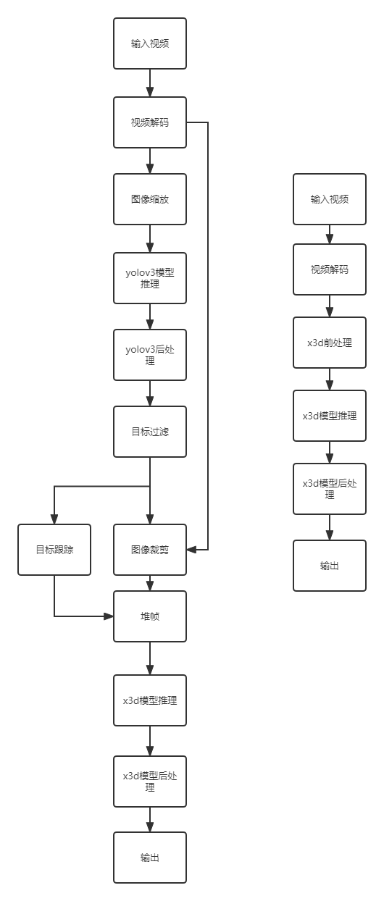

# X3D动作检测

## 1 介绍

X3D动作检测插件基于MindX SDK开发，可以对视频中不同目标的动作进行检测，并输出置信度最高的检测结果。本方案用到两个模型：yolov3模型与x3d模型。yolov3模型主要负责目标检测，对视频中对象划定候选框并确定抠图位置。x3d模型会根据目标图像序列识别其正在进行的动作，并输出置信度。

### 1.1 支持的产品

本项目以昇腾Atlas310卡为主要的硬件平台。

### 1.2 支持的版本

支持的SDK版本为 2.0.4, CANN 版本为 5.0.4。

### 1.3 软件方案介绍

本项目设计有两种流程：业务流程与测试流程。业务流程中，其会以RTSP生成的视频流为输入，并实时输出动作检测结果。在测试流程中，其通过测试Knetics400数据集中所有视频的动作识别结果来确定动作识别检测精度。

#### 1.3.1 业务流程预处理方案

整体业务流程为：将视频通过rtsp拉流输入到整个处理流程中，然后通过mxpi_videodecoder对视频进行解码。解码后的视频帧首先通过mxpi_imageresize0裁剪到指定大小后通过mxpi_tensorinfer0交予yolov3模型进行目标检测，确定目标位置与类型，并用mxpi_objectfilter0插件过滤过小目标防止影响mxpi_imagecrop功能。此外，我们会用mxpi_motsimplesort0进行目标跟踪。在确定目标位置后，利用mxpi_imagecrop0，我们将目标与其周围图像裁下并缩放到固定大小，然后将这些图像输入到mxpi_stackframe0插件中用于组装时序图像为tensor并进行跳帧。待tensor组装完成后，我们通过mxpi_tensorinfer1来运行x3d模型，并通过mxpi_classpostprocessor0插件获取模型预测的置信度最高的动作类别。最终，我们利用mxpi_dataserialize0与appsink0获取动作检测结果。

表1 业务流程系统方案各模块功能描述：

| 序号 | 子系统         | 功能描述                                                     |
| ---- | -------------- | ------------------------------------------------------------ |
| 1    | 视频输入       | 从rtsp视频流中获取视频输入                                   |
| 2    | 视频解码       | 将视频流解码为yuv格式图片                                    |
| 3    | 图片缩放       | 将图片放缩到模型指定输入的尺寸大小                           |
| 4    | yolov3模型推理 | 对输入图片进行推理，获取目标对象在图片内的位置               |
| 5    | yolov3后处理   | 模型推理结果得到实例目标的位置和置信度，并保留置信度大于指定阈值的实例目标检测结果 |
| 6    | 目标跟踪       | 对检测到的目标实现跟踪与路径记录                             |
| 7    | 图片裁剪       | 根据获取的对象位置裁剪其周围图像并缩放到固定大小             |
| 8    | 堆帧           | 按时间顺组组装获取的图像为帧序列，同时进行跳帧               |
| 9    | x3d模型推理    | 根据输入的帧序列进行推理，输出目标动作预测置信度             |
| 10   | x3d模型后处理  | 根据模型推理结果选出置信度最高的动作作为目标检测结果         |
| 11   | 结果输出       | 输出检测结果                                                 |
#### 1.3.2 测试流程预处理方案

整体业务流程为：首先，通过rtsp拉流获取视频流输入并通过mxpi_videodecoder0解码为图像。得到图像数据后，我们通过mxpi_x3dpreprocess0对获取的图片数据进行预处理并组装成时序序列，并送入mxpi_tensorinfer0利用x3d模型推理。在推理完成后，我们通过mxpi_classpostprocessor0完成数据的后处理并通过mxpi_dataserialize0与appsink0获得模型的输出。

表2 测试流程系统方案各模块功能描述：

| 序号 | 子系统        | 功能描述                                             |
| ---- | ------------- | ---------------------------------------------------- |
| 1    | 视频输入      | 从rtsp视频流中获取视频输入                           |
| 2    | 视频解码      | 将视频流解码为yuv格式图片                            |
| 3    | x3d前处理     | 将图片裁剪缩放到x3d模型所需大小并进行堆帧            |
| 4    | x3d模型推理   | 根据输入的帧序列进行推理，输出目标动作预测置信度     |
| 5    | x3d模型后处理 | 根据模型推理结果选出置信度最高的动作作为目标检测结果 |
| 6    | 结果输出      | 输出检测结果                                         |

### 1.4 代码目录结构与说明

本sample工程名称为X3D，工程目录如下图所示：

```
├── build.sh 
├── images
│   └── pipeline.png
├── main.py
├── models
│   ├── x3d
│   │   ├── kinetics400.names //kinetics400标签文件
│   │   ├── x3d_aipp.cfg //业务流程中导出om模型所需aipp文件
│   │   ├── x3d_aipp_test.cfg //测试流程中导出om模型所需aipp文件
│   │   ├── x3d_post.cfg //业务流程中后处理配置文件
│   │   ├── x3d_post_test.cfg //测试流程中后处理配置文件
│   │   └── x3d_pth_to_onnx.py //x3d onnx导出脚本
│   │   └── x3d_s1.onnx //x3d onnx文件
│   │   └── x3d_s1_test.om //x3d 测试流程om文件，接收RGB格式输入
│   │   └── x3d_s1.om //x3d 业务流程om文件，接收YUV格式输入
│   └── yolov3
│       ├── coco.names //coco标签文件
│       └── yolov3_tf_bs1_fp16.cfg //yolov3后处理文件
│       └── yolov3_tf_bs1_fp16.om //所用的yolov3推理om文件
├── pipelines
│   └── actionrecognition.pipeline //业务流程pipeline
├── plugins
│   ├── MxpiObjectFilter
│   │   ├── build.sh
│   │   ├── CMakeLists.txt
│   │   ├── MxpiObjectFilter.cpp
│   │   └── MxpiObjectFilter.h
│   ├── MxpiStackFrame
│   │   ├── BlockingMap.cpp
│   │   ├── BlockingMap.h
│   │   ├── build.sh
│   │   ├── CMakeLists.txt
│   │   ├── MxpiStackFrame.cpp
│   │   └── MxpiStackFrame.h
│   ├── MxpiX3DPreProcess
│   │   ├── build.sh
│   │   ├── CMakeLists.txt
│   │   ├── MxpiX3DPreProcess.cpp
│   │   └── MxpiX3DPreProcess.h
│   └── X3DPostProcess
│       ├── build.sh
│       ├── CMakeLists.txt
│       ├── X3DPostProcess.cpp
│       └── X3DPostProcess.h
├── run.sh //业务流程执行脚本
├── test
│   ├── calculate_precision.py //测试流程精度最终精度计算脚本
│   ├── cvt_video2h264.py //数据集视频格式转换脚本
│   ├── get_video_length.py //获取所有视频帧长度脚本
│   ├── K400_label.txt //kinetics400标签文件(带下划线版)
│   ├── requirements.txt
│   ├── test_precision_main.py //测试精度流程启动脚本
│   └── test_precision_sub.py
│   └── test_fps.py //性能测试启动脚本
│   └── calculate_fps.py //性能测试计算结果脚本
└── README.md

```

备注：

- coco.names 文件可从https://github.com/pjreddie/darknet/blob/master/data/coco.names获取
- kinetics400.names 文件可从https://github.com/kenshohara/video-classification-3d-cnn/blob/master/class_names_list获取。请将class_names_list重命名为kinetics400.names。

- yolov3_tf_bs1_fp16.om，x3d_s1.onnx，x3d_s1_test.om，x3d_s1.om可从[此](https://mindx.sdk.obs.cn-north-4.myhuaweicloud.com/mindxsdk-referenceapps%20/contrib/X3D/models.zip)获取，或遵照第三节流程转换。

### 1.5 技术实现流程图

左图为业务流程，右图为测试流程




### 1.6 特性及适用场景

经过测试，该项目可应用于大部分视频输入场景，但由于技术限制，仍存在以下缺陷：由于mxpi_imagecrop分辨率限制，本项目无法应用在分辨率过小或过于巨大的视频识别中；由于x3d模型需要积累特定目标一段时间的视频帧才能做出识别，本项目不适合用在目标快速变换的视频场景中；由于数据集限制，x3d模型在识别某些动作时可能会输出若干语义上相互接近的结果（比如在跳舞场景中，x3d可能会识别目标正在跳舞，也可能会输出目标正在做有氧运动）。


## 2 环境依赖

推荐系统为ubuntu 18.04，环境依赖软件和版本如下表：

| 软件名称      | 版本     |
| ------------- | -------- |
| cmake         | 3.5+     |
| mxVision      | 2.0.4    |
| python        | 3.9.2    |
| opencv-python | 4.5.5.64 |
| ffmpeg        | 3.4.11   |

确保环境中正确安装mxVision SDK。

在编译运行项目前，需要设置环境变量：

MindX SDK 环境变量:

```
. ${SDK-path}/set_env.sh
```

CANN 环境变量：

```
. ${ascend-toolkit-path}/set_env.sh
```

- 环境变量介绍

```
SDK-path: SDK mxVision 安装路径
ascend-toolkit-path: CANN 安装路径
```

## 3 模型转换

本项目采用yolov3与x3d_s模型，模型转换指导如下：

### 3.1 yolov3模型转换

yolov3模型下载参考华为昇腾社区[ModelZoo](https://gitee.com/link?target=https%3A%2F%2Fwww.hiascend.com%2Fzh%2Fsoftware%2Fmodelzoo%2Fdetail%2F1%2Fba2a4c054a094ef595da288ecbc7d7b4)

请将下载的ATC YOLOv3(FP16) from TensorFlow - Ascend310.zip文件置于 X3D/models/yolov3/ 文件夹下并输入如下指令即可完成模型转换。

```
unzip "ATC YOLOv3(FP16) from TensorFlow - Ascend310.zip"
cd YOLOv3_for_ACL
atc --model=./yolov3_tf.pb --framework=3 --output=./yolov3_tf_bs1_fp16 --soc_version=Ascend310 --insert_op_conf=./yolov3_tf_aipp.cfg --input_shape="input:1,416,416,3" --out_nodes="yolov3/yolov3_head/Conv_6/BiasAdd:0;yolov3/yolov3_head/Conv_14/BiasAdd:0;yolov3/yolov3_head/Conv_22/BiasAdd:0"
mv yolov3_tf_bs1_fp16.om ../yolov3_tf_bs1_fp16.om
```

转换完毕的om模型会放置在X3D/models/yolov3/目录下。

### 3.2 x3d模型转换

x3d模型下载参考华为昇腾社区[ModelZoo](https://www.hiascend.com/zh/software/modelzoo/models/detail/1/1f626937bdac487087bd2debb16c6d7d)

请将下载的ATC X3D (FP16) from Pytorch - Ascend310.zip文件放置于X3D/models/x3d/ 文件夹下并进行如下操作

```
unzip "ATC X3D (FP16) from Pytorch - Ascend310.zip"
cd X3D
pip3.7 install -r requirements.txt
git clone https://github.com/facebookresearch/detectron2 detectron2_repo
pip3.7 install -e detectron2_repo
git clone https://github.com/facebookresearch/SlowFast -b main
cd SlowFast
git reset 9839d1318c0ae17bd82c6a121e5640aebc67f126 --hard
mv ../x3d.patch ./
patch -p1 < x3d.patch
pip3.7 install -e . -i
cd ..
mv ../x3d_pth_to_onnx.py x3d_pth_to_onnx.py
```


在导出onnx模型前，由于版本限制，请进入当前python环境中的site-packages文件夹，将

```
site-packages/torchvision/models/quantization/mobilenetv2.py
site-packages/torchvision/models/quantization/mobilenetv3.py
```

文件中的torch.ao替换为torch.quantization以保证onnx正常导出。


回到X3D/models/x3d/X3D路径，执行以下命令导出onnx文件：

```
python3.7 x3d_pth_to_onnx.py --cfg SlowFast/configs/Kinetics/X3D_S.yaml     X3D_PTH2ONNX.ENABLE True TEST.BATCH_SIZE 1 TEST.CHECKPOINT_FILE_PATH  "x3d_s.pyth" X3D_PTH2ONNX.ONNX_OUTPUT_PATH "x3d_s.onnx"
```

因为测试流程与业务流程所接收的数据格式不同，请分别执行以下两条指令导出业务流程与测试流程所需om文件：

```
atc --framework=5 --model=x3d_s.onnx --output=x3d_s1 --input_format=NCHW --input_shape="image:13,3,182,182" --log=error --soc_version=Ascend310 --precision_mode allow_mix_precision --insert_op_conf=../x3d_aipp.cfg
mv x3d_s1.om ../x3d_s1.om

atc --framework=5 --model=x3d_s.onnx --output=x3d_s1_test --input_format=NCHW --input_shape="image:13,3,182,182" --log=error --soc_version=Ascend310 --precision_mode allow_mix_precision --insert_op_conf=../x3d_aipp_test.cfg
mv x3d_s1_test.om ../x3d_s1_test.om
```

转换完毕的om模型会放置在X3D/models/x3d/ 目录下。


## 4 编译与运行

本章将介绍如何运行业务流程。注意：执行下列指令前请正确配置环境变量。

**步骤1** 在项目顶级目录 X3D/ 下执行命令

```
bash build.sh
```

**步骤2** 修改X3D/pipelines/actionrecognition.pipeline文件，在

```
"mxpi_rtspsrc0": {
    "props": {
        "rtspUrl": "rtsp_Url"
    },
    "factory": "mxpi_rtspsrc",
    "next": "mxpi_videodecoder0"
},
```

中请用待测试的rtsp视频流地址替换rtsp_Url字段。其中rtsp_Url格式为 rtsp:://host:port/Data，具体操作可以参考[live555链接](https://gitee.com/link?target=https%3A%2F%2Fbbs.huaweicloud.com%2Fforum%2Fthread-68720-1-1.html)。视频仅支持h.264格式。

**步骤3** 执行推理

```
bash run.sh
```

### 4.1 插件介绍

- MxpiStackFrame

| 参数名称     | 参数解释             |
| ------------ | -------------------- |
| visionSource | 抠图插件名称         |
| trackSource  | 跟踪插件名称         |
| frameNum     | 跳帧间隔（为1不跳）  |
| timeOut      | 某个目标堆帧超时时间 |
| sleepTime    | 检查线程休眠时间     |

- MxpiX3DPreprocess

| 参数名称     | 参数解释             |
| ------------ | -------------------- |
| dataSource   | 数据源名称           |
| skipFrameNum | 跳帧间隔             |
| windowStride | 相邻检测窗口滑动距离 |

## 5 精度测试

本章介绍了如何测试推理精度。x3d模型是通过Knetics400数据集获得的。其会对每一个视频片段进行多次测量并将测量结果合并，以此决定该视频片段的动作是何种类型。以下是具体操作：

### 5.1 获取数据集

请参考[官网](https://github.com/activitynet/ActivityNet/tree/master/Crawler/Kinetics)中Knetics400数据集的下载方法，或选用已下载好的数据（数据下载链接在X3D/Knetics-400/download_link.txt,请下载这个文件夹内的所有文件，然后将其放置在同一目录，解压缩任意一个文件即可解压全部文件）。请将数据集文件夹Knetics-400放置于项目顶层目录 X3D/ 目录下，文件分布如下所示

```
.                                                               
├── Knetics-400                            
│   └── test.csv         
│   └── test.json       
│   └── val
│      └──abseiling
│      └──air_drumming
│      └──...(其余类型)
```

数据集大小为12G，请预留至少25G磁盘空间。

备注:

- 由于服务器限制，在服务器上运行视频转换是十分缓慢的，故上文给出的数据集压缩包内**Knetics-400/val264**路径下已经包含了转换好的h.264视频，且在**Knetics-400/test_file**路径下存在精度测试需要用的video2framenum.txt，video2label.txt文件。如果你选用这个压缩包，你只需将Knetics-400/val264下的所有视频放在rtsp服务器文件夹中，并将video2framenum.txt，video2label.txt文件放在X3D/test文件夹下，然后可以跳过5.2的所有步骤。

### 5.2 数据转换并生成辅助信息

备注:

- 如果选用5.1给出的数据压缩包作为数据来源，本节可以跳过。

因为本项目仅支持h.264视频格式，我们需要将Knetics400中所有视频转换为h.264格式，并获取所有视频的对应动作类别与桢数以便测试。注意：请提前安装ffmpeg。

```
cd test
pip3.7 install requirements.txt
```

转换视频格式

```
python3.7 cvt_video2h264.py --source_path=../Knetics-400/val/ --target_path=../Knetics-400/val264/ --label_path=K400_label.txt --save_path=video2label.txt
```

参数

- **source_path** 原始数据集路径
- **target_path** 转换后的视频存放路径
- **label_path** Knetics400数据集标签列表位置
- **save_path** 生成的视频列别清单存放路径，用于后续精度测试

获取视频长度

```
python3.7 get_video_length.py --video_path=../Knetics-400/val/ --save_path=video2framenum.txt
```

参数

- **video_path** 原始数据集路径
- **save_path ** 生成的视频长度清单存放路径，用于后续精度测试

在将所有视频转换完毕后，**请将路径X3D/Knetics-400/val264/下的所有h.264视频放到rtsp服务器文件夹中**，以便后续拉流使用。

### 5.3 运行精度测试

为了提高精度测试效率，我们采用了多进程。test_precision_main.py文件会生成多个子进程并行测试精度，而test_precision_sub.py主要负责具体的精度推理流程的执行。具体操作如下：

```
cd test
python3.7 test_precision_main.py --RESULT_SAVE_PATH="test_precision_result" --LOG_SAVE_PATH="test_precision_log" --FRAME_LENGTH_PATH="video2framenum.txt" --PROCESS_NUM=8 --DEVICE_NUM=4 --RTSP_URL="rtsp://192.168.88.107:8554"
```

参数

- **RESULT_SAVE_PATH** 精度中间结果保存目录
- **LOG_SAVE_PATH** 精度测试日志目录，用于检查推理过程
- **FRAME_LENGTH_PATH** 之前生成的视频长度清单存放路径
- **PROCESS_NUM** 并行进程数
- **DEVICE_NUM** 设备可用卡数
- **RTSP_URL** RTSP服务器地址，形如"rtsp://IP:端口"

最终，该程序会在RESULT_SAVE_PATH路径生成精度验证的中间结果。

### 5.4 生成精度结果

执行下列命令：

```
python3.7 calculate_precision.py --RESULT_PATH="test_precision_result" --LABEL_PATH="video2label.txt"
```

参数

- **RESULT_PATH** 精度中间结果保存目录
- **LABEL_PATH** cvt_video2h264.py生成的视频列别清单存放路径，或数据包内包含的video2label.txt文件路径

执行该指令后，其会生成模型的top1与top5精度。

目标精度：[Top1：73.1%](https://gitee.com/ascend/ModelZoo-PyTorch/tree/master/ACL_PyTorch/contrib/cv/classfication/X3D)

实际精度：Top1：73.2%，Top5：91.0%


## 6 性能测试

本章将介绍如何测试业务流程性能。请选取若干分辨率为1920*1080，帧率为25的视频作为性能测试数据，视频长度请不小于10s。由于视频内目标增多时，X3D检测开销线性增加，为了保证性能测试准确性，请确保视频内只有一个人物。可从[此处](https://mindx.sdk.obs.cn-north-4.myhuaweicloud.com/mindxsdk-referenceapps%20/contrib/X3D/performance_test_video.zip)获取样例视频。

测试性能前请参考[MindSDK性能测试工具使用指南](https://support.huawei.com/enterprise/zh/doc/EDOC1100234263/3d688c94)，在sdk.conf文件中设置enable_ps=true，ps_interval_time=1。在开启性能测试前，请删除${SDK-path}/logs内的所有文件，以免对性能测试结果产生干扰。

请在X3D/test文件夹下创建test_fps_video.txt文件，请将要测试的所有视频rtsp链接放入此文件中，不同链接以换行符分隔。

执行

```
cd test
python3.7 test_fps.py --VIDEO_LIST_PATH="test_fps_video.txt" --MAX_COUNT_IDX=50
```

参数

- **VIDEO_LIST_PATH** 视频rtsp url清单文件
- **MAX_COUNT_IDX** 性能采样次数


当程序执行完毕后，所有视频的性能分析日志均会保存在${SDK-path}/logs中，执行如下命令即可输出推理性能

```
python3.7 calculate_fps.py --LOG_SAVE_PATH=../../../logs/ --MUL_FACTOR=6
```

参数

- **LOG_SAVE_PATH** ${SDK-path}/logs文件路径
- **MUL_FACTOR** 性能校正倍数

备注：

在性能测试时，stackframe插件的跳帧系数frameNum被设置为1。根据堆帧逻辑，当数据积累够X3D所需的13帧后会将整个数据包发送出去，然后删去前一半数据(6帧)，剩下的数据仍被保存以供后续使用。这在输入稳定后等效于每6帧输出1个检测结果，故需要在计算性能时用6作为性能校正倍数。

值得注意的是，一段视频在刚开始测量或结束测量时，由于插件初始化/销毁开销与堆桢插件数据积累影响，性能测量值可能偏低。在计算性能时，我们只选取性能稳定后的数据。选取更长的视频片段会减少该影响。

最终性能结果为 fps：25.0


## 7 常见问题

### 7.1 出现FileExistsError: [Errno 17] File exists xxxx

**解决方案**

请删除旧的已存在文件再执行指令

### 7.2 程序输出为空，同时有Node list(mxpi_classpostprocessor0)does not exist警告

**解决方案**

这说明视频内不存在人类目标，导致后续插件无法获取数据，为正常现象。