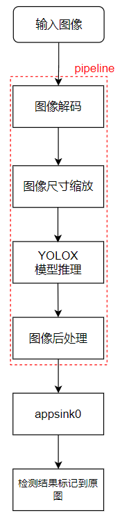
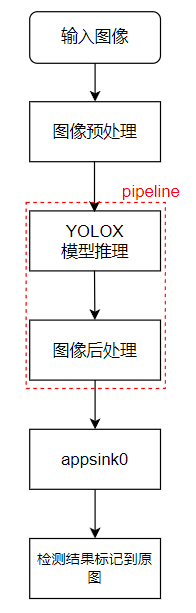
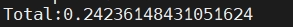
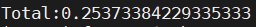
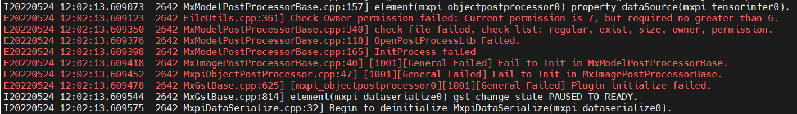
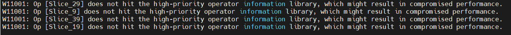

# YOLOX 目标检测
## 1. 介绍

YOLOX 目标检测后处理插件基于 MindX SDK 开发，对图片中的不同类目标进行检测，将检测得到的不同类的目标用不同颜色的矩形框标记。输入一幅图像，可以检测得到图像中大部分类别目标的位置。本方案使用在 COCO2017 数据集上训练得到的 YOLOX-Nano 模型进行目标检测，数据集中共包含 80 个目标类，包括行人、自行车、公共汽车、手机、沙发、猫、狗等，可以对不同类别、不同角度、不同密集程度的目标进行检测。

### 1.1 支持的产品

本项目以昇腾Atlas310卡为主要的硬件平台。


### 1.2 支持的版本

支持的SDK版本为 2.0.4, CANN 版本为 5.0.4。


### 1.3 软件方案介绍 

本项目设计两种流程，一种为用python代码实现对图像的预处理过程，然后将处理好的图片通过 appsrc 插件输入到业务流程中；另一种是直接将原图片通过 appsrc 输入到业务流程中。

#### 1.3.1 业务流程加图像预处理方案

整体业务流程为：待检测图片通过 appsrc 插件输入，然后使用图像解码插件 mxpi_imagedecoder 对图片进行解码，再通过图像缩放插件 mxpi_imageresize 将图像缩放至满足检测模型要求的输入图像大小要求，缩放后的图像输入模型推理插件 mxpi_tensorinfer 得到推理结果，推理结果输入 mxpi_objectpostprocessor 插件进行后处理，得到输入图片中所有的目标框位置和对应的置信度。最后通过输出插件 appsink 获取检测结果，并在外部进行可视化，将检测结果标记到原图上，本系统的各模块及功能描述如表1所示：

表1 系统方案各模块功能描述：

| 序号 | 子系统 | 功能描述     |
| ---- | ------ | ------------ |
| 1    | 图片输入    | 获取 jpg 格式输入图片 |
| 2    | 图片解码    | 解码图片 |
| 3    | 图片缩放    | 将输入图片放缩到模型指定输入的尺寸大小 |
| 4    | 模型推理    | 对输入张量进行推理 |
| 5    | 目标检测后处理    | 从模型推理结果计算检测框的位置和置信度，并保留置信度大于指定阈值的检测框作为检测结果 |
| 6    | 结果输出    | 获取检测结果|
| 7    | 结果可视化    | 将检测结果标注在输入图片上|


#### 1.3.2 业务流程不加图像预处理方案

整体业务流程为：待检测图片信息经预处理后通过 appsrc 插件输入，然后使用模型推理插件 mxpi_tensorinfer 得到推理结果，推理结果输入 mxpi_objectpostprocessor 插件进行后处理，得到输入图片中所有的目标框位置和对应的置信度。最后通过输出插件 appsink 获取检测结果，并在外部进行可视化，将检测结果标记到原图上，本系统的各模块及功能描述如表2所示：

表2 系统方案各模块功能描述：

| 序号  | 子系统 | 功能描述                                       |
|-----| ------ |--------------------------------------------|
| 1   | 图片输入    | 获取预处理之后的图像信息                               |
| 2   | 模型推理    | 对输入张量进行推理                                  |
| 3   | 目标检测后处理    | 从模型推理结果计算检测框的位置和置信度，并保留置信度大于指定阈值的检测框作为检测结果 |
| 4   | 结果输出    | 获取检测结果                                     |
| 5   | 结果可视化    | 将检测结果标注在输入图片上                              |
### 1.4 代码目录结构与说明

本工程名称为 YOLOX，工程目录如下所示：
```
.
├── build.sh
├── images
│   ├── DetectionPipeline.png
│   ├── EvaluateInfo.png
│   ├── EvaluateInfoPrevious.png
│   ├── warning.png
│   └── VersionError.png
├── postprocess
│   ├── build.sh
│   ├── CMakeLists.txt
│   ├── YoloxPostProcess.cpp
│   └── YoloxPostProcess.h
├── python
│   ├── Main
│   │   ├── eval_nopre_post.py
│   │   ├── eval_pre_post.py
│   │   ├── nopre_post.py
│   │   ├── pre_post.py
│   │   ├── visualize.py
│   │   └── preprocess.py
│   ├── models
│   │   ├── aipp-configs
│   │   │   └── yolox_bgr.cfg
│   │   ├── conversion-scripts              # 下载的onnx模型存放在该文件夹下
│   │   ├── yolox_eval.cfg
│   │   └── coco.names                      #需要下载，下载链接在下方 
│   ├── test    
│   │   ├── data # 下载的数据集存放在此文件下
│   │   ├── map_calculate.py
│   │   └── parse_coco.py                   #需要下载，下载链接在下方
│   ├── test_img
│   │   └── test.jpg                        # 需要用户自行添加测试数据
│   └── pipeline
│       ├── nopre_post.pipeline
│       └── pre_post.pipeline
└── README.md

```

注：coco.names文件与parse_coco.py文件分别源于[链接](../Collision/model/coco.names)的coco2014.names文件和[项目](https://gitee.com/ascend/mindxsdk-referenceapps/tree/master/contrib/FireDetection)中test文件夹下的parse_COCO.py文件,将这两个文件下载之后，分别放到python/models目录下和python/test目录下。

### 1.5 技术实现流程图

YOLOX 的后处理插件接收模型推理插件输出的特征图，该特征图为三张不同分辨率的特征图拼接而成，形状大小为1 x n x 85,其中 n 为三张网络模型输出特征图的像素点数总和，85 为 80 （数据集分类数）+ 4 （目标框回归坐标点）+ 1 （正类置信度）。本项目方案根据业务流程含不含预处理阶段技术流程图可分为如下两种。

<center>
    
    
    <br>
</center>

### 1.6 适用场景

经过测试，该项目适用于一般的自然图像，对含单个清晰目标的图像、灰度图像、模糊图像以及高分辨率的图像均有较好的检测效果，而用于含大量小目标的图像、光照不佳的图像和存在大量遮挡的图像时，有轻微的漏检现象。

## 2 环境依赖

推荐系统为ubuntu 18.04，环境依赖软件和版本如下表：

| 软件名称 | 版本   |
| -------- | ------ |
| cmake    | 3.5+   |
| mxVision | 2.0.4  |
| python   | 3.9.2  |

确保环境中正确安装mxVision SDK。

在编译运行项目前，需要设置环境变量：

MindSDK 环境变量:

```
. ${SDK-path}/set_env.sh
```

CANN 环境变量：

```
. ${ascend-toolkit-path}/set_env.sh
```

- 环境变量介绍

```
SDK-path: mxVision SDK 安装路径
ascend-toolkit-path: CANN 安装路径。
```  

## 3. 模型转换

本项目中采用的模型是 YOLOX 模型，参考实现代码：https://github.com/Megvii-BaseDetection/YOLOX ， 选用的模型是该 pytorch 项目中提供的模型 yolox-Nano.onnx，模型下载链接：https://mindx.sdk.obs.cn-north-4.myhuaweicloud.com/mindxsdk-referenceapps%20/contrib/YOLOX/yolox_nano.onnx 。 本项目使用模型转换工具 ATC 将 onnx 模型转换为 om 模型，模型转换工具相关介绍参考链接：https://gitee.com/ascend/docs-openmind/blob/master/guide/mindx/sdk/tutorials/%E5%8F%82%E8%80%83%E8%B5%84%E6%96%99.md 。


### 3.1 业务流程加图像预处理的模型转换方法


1. 从上述项目链接中下载 onnx 模型 yolox_nano.onnx 至 ``python/models/conversion-scripts`` 文件夹下。


2. 将该模型转换为om模型，具体操作为： ``python/models/conversion-scripts`` 文件夹下,执行atc指令：

```
atc --model=yolox_nano.onnx --framework=5 --output=./yolox_pre_post --output_type=FP32 --soc_version=Ascend310  --input_shape="images:1, 3, 416, 416" --insert_op_conf=../aipp-configs/yolox_bgr.cfg
```

若终端输出：
```
ATC start working now, please wait for a moment.
ATC run success, welcome to the next use.
W11001: Op [Slice_29] does not hit the high-priority operator information library, which might result in compromised performance.
W11001: Op [Slice_9] does not hit the high-priority operator information library, which might result in compromised performance.
W11001: Op [Slice_39] does not hit the high-priority operator information library, which might result in compromised performance.
W11001: Op [Slice_19] does not hit the high-priority operator information library, which might result in compromised performance.

```

表示命令执行成功。

### 3.2 业务流程不加图像预处理的模型转换方法


1. 从上述项目链接中下载 onnx 模型 yolox_nano.onnx 至 ``python/models/conversion-scripts`` 文件夹下。


2. 将该模型转换为om模型，具体操作为： ``python/models/conversion-scripts`` 文件夹下,执行atc指令：
                                                           

```
atc --model=yolox_nano.onnx --framework=5 --output=./yolox_nopre_nopost --output_type=FP32 --soc_version=Ascend310  --input_shape="images:1, 3, 416, 416"
```   

        
若终端输出：

```
ATC start working now, please wait for a moment.
ATC run success, welcome to the next use.
W11001: Op [Slice_29] does not hit the high-priority operator information library, which might result in compromised performance.
W11001: Op [Slice_9] does not hit the high-priority operator information library, which might result in compromised performance.
W11001: Op [Slice_39] does not hit the high-priority operator information library, which might result in compromised performance.
W11001: Op [Slice_19] does not hit the high-priority operator information library, which might result in compromised performance.

```

表示命令执行成功。

## 4. 编译与运行

### 4.1 业务流程加图像预处理

**步骤1** 在项目根目录执行命令：
 
```
bash build.sh  
chmod 640 postprocess/build/libYoloxPostProcess.so
cp postprocess/build/libYoloxPostProcess.so ${MX_SDK_HOME}/lib/modelpostprocessors/
```   

**步骤2** 放入待测图片。将一张图片放在路径``python/test_img``下，命名为 test.jpg。

**步骤3** 图片检测。在项目路径``python/Main``下运行命令：

```
python3 pre_post.py
```     

命令执行成功后在目录``python/test_img``下生成检测结果文件 pre_post_bgr.jpg，查看结果文件验证检测结果。

**步骤4** 精度测试。

1. 下载COCO VAL 2017[验证数据集](http://images.cocodataset.org/zips/val2017.zip )和[标注文件](http://images.cocodataset.org/annotations/stuff_annotations_trainval2017.zip)，并保存在项目目录``python/test/data``下，此文件夹下的组织形式应如下图所示：

```                                    
.                                                               
├── annotations                            
│   └── instances_val2017.json                                                                               
└── val2017                          
                                       
```                                    
其中：val2017文件夹下应存放有5000张待测图片。

2. 修改``python/models``下的文件 yolox_eval.cfg 的参数 OBJECTNESS_THRESH=0.01 IOU_THRESH=0.65

3. 使用以下指令运行路径``python/test``下的文件 parse_coco.py：
```
python3 parse_coco.py --json_file=data/annotations/instances_val2017.json --img_path=data/val2017
```
若运行成功，会在该目录下生成文件夹ground_truth，其中包含每张图像上提取的目标框真实位置与类别的txt文件。

接下来将每张图的预测结果转为txt文件，并保存在同一文件夹下，其步骤如下：

4. 进入``python/Main``路径，运行 命令：
```
python3 eval_pre_post.py
```
若运行成功，会在``python/test`` 路径下生成 test_pre_post 文件夹，该目录下包含有每张图像上的检测结果的 txt 文件。

5. 在``python/test``路径下，运行命令:
```
python3 map_calculate.py  --npu_txt_path="./test_pre_post"
```
若运行成功则得到最终检测精度，结果如下：

<center>
    
    <br>
</center>

### 4.2 业务流程不加图像预处理

**步骤1** 在项目根目录执行命令：                                                                                                                                                             
                                                                                                                                                                                
```                                                                                                                                                                             
bash build.sh                                                                                                                                                                   
chmod 640 postprocess/build/libYoloxPostProcess.so                                                                                                                              
cp postprocess/build/libYoloxPostProcess.so ${MX_SDK_HOME}/lib/modelpostprocessors/                                                                                             
```                                                                                                                                                                             
                                                                                                                                                                                
**步骤2** 放入待测图片。将一张图片放在路径``python/test_img``下，命名为 test.jpg。                                                                                                                      
                                                                                                                                                                                
**步骤3** 图片检测。在项目路径``python/Main``下运行命令：                                                                                                                                         
                                                                                                                                                                                
```                                                                                                                                                                             
python3 nopre_post.py                                                                                                                                                             
```                                                                                                                                                                             
                                                                                                                                                                                
命令执行成功后在目录``python/test_img``下生成检测结果文件 nopre_post.jpg，查看结果文件验证检测结果。                                                                                                           
                                                                                                                                                                                
**步骤4** 精度测试。                                                                                                                                                                   
                                                                                                                                                                                
1. 下载COCO VAL 2017[验证数据集](http://images.cocodataset.org/zips/val2017.zip )和[标注文件](http://images.cocodataset.org/annotations/stuff_annotations_trainval2017.zip)，并保存在项目目录``python/test/data``下，此文件夹下的组织形式应如下图所示：                                                                                                    
                                                                                                                                                                                
```                                                                                                                                                                             
.                                                                                                                                                                               
├── annotations                                                                                                                                                                 
│   └── instances_val2017.json                                                                                                                                                  
└── val2017                                                                                                                                                                     
                                                                                                                                                                                
```                                                                                                                                                                             
其中：val2017文件夹下应存放有5000张待测图片。                                                                                                                                                    
                                                                                                                                                                                
2. 修改``python/models``下的文件 yolox_eval.cfg 的参数 OBJECTNESS_THRESH=0.01 IOU_THRESH=0.65                                                                                            
                                                                                                                                                                                
3. 使用以下指令运行路径``python/test``下的文件 parse_coco.py：                                                                                                                                 
```                                                                                                                                                                             
python3 parse_coco.py --json_file=data/annotations/instances_val2017.json --img_path=data/val2017                                                                                
```                                                                                                                                                                             
若运行成功，会在该目录下生成文件夹ground_truth，其中包含每张图像上提取的目标框真实位置与类别的txt文件。                                                                                                                     
                                                                                                                                                                                
接下来将每张图的预测结果转为txt文件，并保存在同一文件夹下，其步骤如下：                                                                                                                                           

4. 进入``python/Main``路径，运行命令：                                                                                                                                                   
```                                                                                                                                                                             
python3 eval_nopre_post.py                                                                                                                                                        
```                                                                                                                                                                             
若运行成功，会在``python/test`` 路径下生成 test_nopre_post 文件夹，该目录下包含有每张图像上的检测结果的 txt 文件。                                                                                                       

5. 在``python/test``路径下，运行命令:                                                                                                                                                    
```                                                        
python3 map_calculate.py  --npu_txt_path="./test_nopre_post" 
```                                                        

若运行成功则得到最终检测精度，结果如下：

<center>
    
    <br>
</center>

注：在pipeline中加图像预处理与不加预处理的验证结果不同的原因为：YOLOX的图像预处理中，Resize方式为按长边缩放，而Mindx SDK默认使用dvpp的图像解码方式，没有按长边缩放的方法，因此本项目将"resizeType"属性设置为 "Resizer_KeepAspectRatio_Fit"，这样会导致精度下降。

## 5 常见问题

### 5.1 源项目的测试精度为24.3，达不到本项目的精度25.3
源项目的后处理默认使用类间 nms, 而本项目的 nms 调用 MxBase::NmsSort 方法，该方法为类内 nms，若要对齐源项目精度，只需将 源项目代码中的方法 multiclass_nms 的参数 class_agnostic 改为 False 即可。

### 5.2 未修改 pipeline 文件中的 ${MX_SDK_HOME} 值为具体值
运行demo前需要正确导入环境变量，否则会报错，如下图所示：
<center>
    
    <br>
</center>

**解决方案：**

检查Mindx SDK安装包的位置，并使用第二章介绍的指令正确导入环境变量。
### 5.3 后处理插件权限问题

运行检测 demo 和评测时都需要将生成的YOLOX后处理动态链接库的权限修改，否则将会报权限错误，如下图所示：
<center>
    
    <br>
</center>

**解决方案：**

在YOLOX后处理的动态链接库的路径下运行命令：

```
chmod 640 libYoloxPostProcess.so
```

### 5.4 模型转换时会警告缺slice算子

YOLOX在图像输入到模型前会进行slice操作，而ATC工具缺少这样的算子，因此会报出如图所示的警告：

<center>
    
    <br>
</center>

**解决方案：**

常规的做法是修改slice算子，具体操作可参考[安全帽检测](https://gitee.com/booyan/mindxsdk-referenceapps/tree/master/contrib/HelmetIdentification)的开源项目。

由于在本项目下是否修改算子并不影响检测结果，因此默认不做处理。