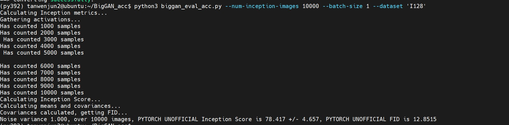
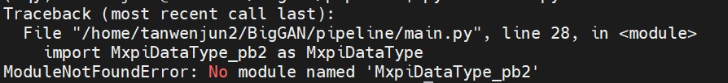

# BigGAN图像生成参考设计

## 1 介绍

   使用BigGAN模型，在MindxSDK环境下实现图像生成功能。

   BigGAN模型的输入数据是由噪声数据和标签数据组成，其中噪声数据是由均值为0，方差为1的正态分布中采样，标签数据是由0至类别总数中随机采样一个整数。针对不同的batch size需要生成不同的输入数据。   

   将随机生成的label标签和noise噪声数据，通过pipeline传入模型中进行推理，最终输出可视化图片。


### 1.1 支持的产品

本项目以昇腾Atlas310卡为主要的硬件平台

### 1.2 支持的版本

 CANN：5.0.4（通过cat /usr/local/Ascend/ascend-toolkit/latest/acllib/version.info，获取版本信息）

 SDK：2.0.4（可通过cat SDK目录下的version.info查看信息）

### 1.3 软件方案介绍

 项目主要由主函数（main.py），数据集（prep_label_bs1, prep_noise_bs1），模型（biggan_sim_bs1.om），业务流（biggan.pipeline）组成。

主函数中构建业务流steam，先读取相应路径下的bin文件转换成pipeline可处理的tensor数据，再传入pipeline在sdk环境下先后实现模型推理的功能，最后从流中取出相应的输出数据转换数据类型保存结果。

 表1.1 系统方案中各模块功能：

| 序号 | 模块        | 功能描述                                     |
| ---- | ----------- | -------------------------------------------- |
| 1    | appsrc      | 向Stream中发送数据，appsrc将数据发给下游元件 |
| 2    | tensorinfer | 对输入的张量进行推理                         |
| 3    | appsink     | 从stream中获取数据                           |
| 4    | saveImg     | 将数据保存成图像                             |


### 1.4 代码目录结构与说明

 本工程名称为biggan，工程目录如下图所示：     

```
├── python  
|   ├── biggan.pipeline      //业务流
|   ├── main.py             // 主函数，用以在拥有数据集后生成图像
├── Readme.md    
├── SDK.jpg                 
└── RESULT.jpg
```

### 1.5 适用场景

 工程适用于通用场景下，batchsize为1的jpg图片生成。

## 2 环境依赖

 推荐系统为ubuntu 18.04，环境依赖软件和版本如下表：

| 软件名称            | 版本        | 说明                          | 获取方式                                                     |
| ------------------- | ----------- | ----------------------------- | ------------------------------------------------------------ |
| MindX SDK           | 2.0.4       | mxVision软件包                | [链接](https://gitee.com/link?target=https%3A%2F%2Fwww.hiascend.com%2Fsoftware%2FMindx-sdk) |
| ubuntu              | 18.04.1 LTS | 操作系统                      | Ubuntu官网获取                                               |
| Ascend-CANN-toolkit | 5.0.4       | Ascend-cann-toolkit开发套件包 | [链接](https://gitee.com/link?target=https%3A%2F%2Fwww.hiascend.com%2Fsoftware%2Fcann%2Fcommercial) |
| python              | 3.9.2       |                               |                                                              |
| numpy               | 1.22.4      | 维度数组运算依赖库            | 服务器中使用pip或conda安装                                   |
| opencv-python       | 4.6.0       | 图像处理依赖库                | 服务器中使用pip或conda安装                                   |


     在编译运行项目前，需要设置环境变量：
    
     . ${sdk_path}/set_env.sh
    
     . ${ascend_toolkit_path}/set_env.sh

## 3.前期数据和模型准备

 项目使用的模型为BigGAN。

##### 注意事项：

1. 数据获取

   1.1 文件依赖问题：

   ​         标签和噪声文件的生成共依赖五个文件：

   ​         “biggan_preprocess.py”，“G_ema.pth”——来源ModelZoo的ATC BigGAN仓库，在第二部分模型获取的ModelZoo文件下载路径可以一起获取。

   ​         “BigGAN.py”， “layers.py”， “inception_utils.py” ——来源github仓库。

   ​	注：如果需要精度测试，这一步需要添加另外四个文件：

   ​		 “biggan_eval_acc.py”,  "biggan_postprocess.py"，"inception_v3_google.pth" , "I128_inception_moments.npz" ——来源Modelzoo的ATC BigGAN仓库，在第二部分模型获取的ModelZoo文件下载路径可以一起获取。

   ​          github文件下载路径：https://github.com/ajbrock/BigGAN-PyTorch.git 

   1.2 命名问题：

   ​        样例中以bs为1，数据数量为10000为例。因此，在模型获取，数据集生成时均需要统一为bs=1。

   1.3 路径问题：

   ​        “biggan_preprocess.py”，“G_ema.pth” ， “BigGAN.py”， “layers.py”， “inception_utils.py” 需要全部放在/biggan目录下。
   ​        生成的“prep_label_bs1”和“prep_noise_bs1”文件夹需要全部放在/biggan目录下，否则运行“main.py”时会出错。

   ​		生成的“gen_y_bs1.npz”文件也需要放在/biggan目录下，否则精度测试时会报错。

2. 模型获取

   用户需要在biggan目录下新建一个model目录，在biggan/model路径下上传已经训练并转好的om模型（biggan_sim_bs1.om）。

   ModelZoo文件下载路径：https://www.hiascend.com/zh/software/modelzoo/models/detail/1/c77dfa7e891f4388b62eeef7e8cbbc2d  

## 4.编译与运行

**步骤1** 进入biggan文件夹下：

```
cd biggan
```

**步骤2**  设置环境变量，如第2小节**环境依赖**所述。

**步骤3**  在准备好需要的文件后（如第3小节**前期数据和模型准备**所述），运行命令，生成数据集。

```
python3 biggan_preprocess.py --batch-size 1 --num-inputs 10000
```

**步骤4**   获取om模型，如第3小节**前期数据和模型准备**所述。若未从 pytorch 模型自行转换模型，使用的是上述链接提供的  om 模型，则无需修改相关文件，否则修改 python目录下pipeline的相关配置，将 mxpi_tensorinfer0 插件 modelPath 属性值中的 om 模型名改成实际使用的 om 模型名。

**步骤5**  进入python目录下：

```
cd python
```

**步骤6**  main.py中默认为num为10000。也可根据用户需要在main.py脚本文件中自行设置数值，其中num需要等于**步骤3**中的num-inputs值。

**步骤7**  在命令行输入：

```
python3 main.py
```

**步骤8**   结果无误时会在biggan目录下生成result与result_bin文件夹，文件夹中分别保存了count_result.jpg与count_result.bin格式的生成图像（以num=10000为例，count为0000-9999），bin文件用以精度测试。jpg生成图像如下图所示：


注： 具体实现图片依赖于label标签和noise噪声文件，文件随机生成，最终生成图片因人而异。

## 5.精度测试

成功生成result_bin文件夹后，返回上级目录。

```
cd ..
```

可以发现result_bin文件夹，需要的依赖文件（“biggan_eval_acc.py”,  "biggan_postprocess.py"，"inception_v3_google.pth" , "I128_inception_moments.npz"，“gen_y_bs1.npz”）此时都在/biggan目录下，先运行“biggan_postprocess.py”文件，会在当前目录下生成“gen_img_bs1.npz”文件

```
python3 biggan_postprocess.py --result-path "./result_bin" --save-path "./postprocess_img" --batch-size 1 --save-npz
```

接着运行“biggan_eval_acc.py”文件

```
python3 biggan_eval_acc.py --num-inception-images 10000 --batch-size 1 --dataset 'I128' 
```

这里的输出数量和生成时的数量相对应，默认为10000



出现上图结果即为精度测试成功

## 6.常见问题

**问题描述：**

提示 No module named 'MxpiDataType_pb2'



**解决方案：**

未配置SDK环境变量，可以输入命令查看环境变量设置是否正确。

```
env list
```

