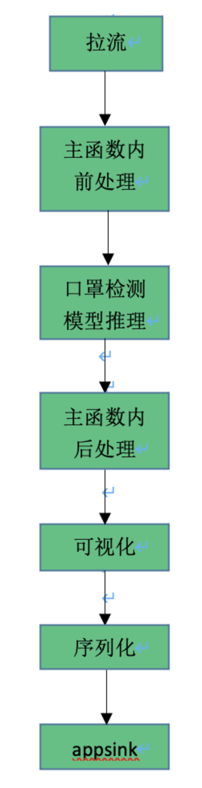

# 口罩识别参考设计

## 1 介绍
识别图片中的人是否佩戴口罩。图片数据经过 抽帧、解码后，送给口罩检测模型推理。

### 1.1 支持的产品

本项目以昇腾Atlas310卡为主要的硬件平台。

### 1.2 支持的版本

支持的SDK版本为2.0.2。

CANN版本为1.77.22.6.220。

### 1.3 代码目录结构与说明

本sample工程名称为口罩识别参考设计，工程目录如下图所示：

```
.
├── README.md                     # 模型转换配置文件
├── anchor_decode.py              # 计算bbox
├── anchor_generator.py           # 生成先验框
├── image.py											# 图片识别主程序
├── main.pipeline									# 口罩识别推理流程pipline
├── models												# 推理模型文件夹
│   └── face_mask.aippconfig			# 转模型前处理配置文件
├── nms.py												# nms计算程序
├── test_image.py									# 精度测试程序
├── map_calculate.py							# mAP计算程序
└── xmltotxt.py										# 数据机标定xml转txt程序
```


### 1.5 技术实现流程图





## 2 环境依赖

环境依赖软件和版本如下表：

| 软件                | 版本         | 说明                          | 获取方式                                                     |
| ------------------- | ------------ | ----------------------------- | ------------------------------------------------------------ |
| mxVision            | 2.0.2        | mxVision软件包                | [链接](https://www.hiascend.com/software/mindx-sdk/mxvision) |
| Ascend-CANN-toolkit | 20.2.rc1     | Ascend-cann-toolkit开发套件包 | [链接](https://www.hiascend.com/software/cann/commercial)    |
| 操作系统            | Ubuntu 18.04 | 操作系统                      | Ubuntu官网获取                                               |
| opencv-python       | 4.5.2.54     | 用于识别结果画框              | python3 -m pip install opencv-python                       |


在编译运行项目前，需要设置环境变量：

- 环境变量介绍

```
export MX_SDK_HOME=${MX_SDK_HOME}
export install_path=/usr/local/Ascend/ascend-toolkit/latest
export PATH=/usr/local/python3.9.2/bin:${install_path}/arm64-linux/atc/ccec_compiler/bin:${install_path}/arm64-linux/atc/bin:${install_path}/atc/bin:$PATH
export PYTHONPATH=/usr/local/python3.9.2/bin:${MX_SDK_HOME}/python
export ${MX_SDK_HOME}/lib:${MX_SDK_HOME}/opensource/lib:${MX_SDK_HOME}/opensource/lib64:${install_path}/acllib/lib64:/usr/local/Ascend/driver/lib64:${MX_SDK_HOME}/include:${MX_SDK_HOME}/python

export GST_PLUGIN_SCANNER=${MX_SDK_HOME}/opensource/libexec/gstreamer-1.0/gst-plugin-scanner
export GST_PLUGIN_PATH=${MX_SDK_HOME}/opensource/lib/gstreamer-1.0:${MX_SDK_HOME}/lib/plugins
export ASCEND_OPP_PATH=${install_path}/opp
export GST_DEBUG=3
```


## 依赖下载

所用模型与软件依赖如下表所示。

| 软件名称               | 版本  | 获取方式                                                     |      |      |      |
| ---------------------- | ----- | ------------------------------------------------------------ | ---- | ---- | ---- |
| face_mask_detection.pb | SSD   | [GitHub](https://github.com/AIZOOTech/FaceMaskDetection/blob/master/models/face_mask_detection.pb) |      |      |      |
| benchmark工具          | 1.0.0 | [软件获取](https://www.huaweicloud.com/ascend/cann-download) |      |      |      |
| 后处理开源部分 | python   | [GitHub](https://github.com/AIZOOTech/FaceMaskDetection/tree/master/utils) |      |      |      |

- 开源代码部分的部署
>下载开源代码中utils文件夹内的3个py文件(anchor_decode.py,anchor_generator.py,nms.py)并放置于项目根目录即可，最终的目录结构参见 [1.3 代码目录结构与说明]

##  推理

#### 步骤1 模型转换

pb文件转换为om文件

1. 设置环境变量：

```
export install_path=/usr/local/Ascend/ascend-toolkit/latest

export PATH=/usr/local/python3.9.2/bin:${install_path}/atc/ccec_compiler/bin:${install_path}/atc/bin:$PATH

export PYTHONPATH=${install_path}/atc/python/site-packages:${install_path}/atc/python/site-packages/auto_tune.egg/auto_tune:${install_path}/atc/python/site-packages/schedule_search.egg

export LD_LIBRARY_PATH=${install_path}/atc/lib64:$LD_LIBRARY_PATH

export ASCEND_OPP_PATH=${install_path}/opp
```

2. 运行atc工具将pb模型文件转为om模型，运行命令如下：

```
atc --model=./face_mask_detection.pb --framework=3 --output=./aipp --output_type=FP32 --soc_version=Ascend310 --input_shape="data_1:1,260,260,3" --input_format=NHWC --insert_op_conf=./face_mask.aippconfig
```

提示 **ATC run success** 说明转换成功

其参数如下表所示

| 参数名           | 参数描述                                                     |
| ---------------- | ------------------------------------------------------------ |
| --model          | 原始模型文件路径与文件名                                     |
| -- framework     | 原始框架类型。当取值为3时，即为tensorflow网络模型            |
| --output         | 转换后的离线模型的路径以及文件名。                           |
| --soc_version    | 模型转换时指定芯片版本。昇腾AI处理器的版本，可从ATC工具安装路径的“/usr/local/Ascend/ascend-toolkit/latest/arm64-linux/atc/data/platform_config”目录下 查看。 ".ini"文件的文件名即为对应的${soc_version} |
| --input_shape    | 模型输入的shape信息，例如: "input_name1:n1,c1,h1,w1.input_name必须是转换前的网络模型中的节点名称。 |
| --input_format   | 当原始框架是TensorFlow时，支持NCHW、NHWC、ND、NCDHW、NDHWC五种输入格式，默认为NHWC。 |
| --insert_op_conf | 插入算子的配置文件路径与文件名，例如aipp预处理算子。         |

其中--insert_op_conf参数为aipp预处理算子配置文件路径。该配置文件face_mask.aippconfig在输入图像进入模型前进行预处理。该配置文件保存在源码models目录下。

####  步骤2 模型推理

##### pipline编写

pipline根据1.5节中技术实现流程图编写，该文件**main.pipeline**放在源码根目录。

##### 运行推理

编写完pipline文件后即可运行推理流程进行识别，该程序**image.py**放在源码根目录。

可在image.py中134行修改进行推理的原图地址。

在根目录下，运行命令：

```
python3.9.2 image.py
```

即可得到输出结果，输出结果对原图像的人脸以及口罩进行识别画框并将结果保存至根目录下**my_result.jpg**
