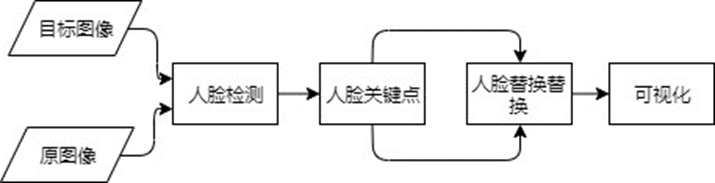

## 基于MindX SDK的faceswap应用开发

## 1 介绍
faceswap应用基于MindX SDK开发，在昇腾芯片上进行人脸检测，脸部关键点推理以及人脸替换，将替换结果可视化并保存。  

样例输入：两张脸部特征清晰，轮廓完整的正面人像jpg，face1.jpg,face2.jpg，且每张人像图片中仅包含一张人脸，我们定义face1.jpg为源脸（底图），face2.jpg为目标脸（覆盖图）。<br/>
样例输出：一张脸部特征更换后的人像jpg，得到结果为face1图片中人脸显示face2的人脸特征。<br/>  
```
由于模型精度限制，关于输入输出的其他说明见本文 8. 常见问题
```
### 1.1 支持的产品

本项目以昇腾Atlas310卡为主要的硬件平台。

### 1.2 支持的版本

本样例配套的CANN版本为[5.0.4](https://www.hiascend.com/software/cann/commercial)  
支持的SDK版本为[2.0.4](https://www.hiascend.com/software/Mindx-sdk)  
MindX SDK安装前准备可参考《用户指南》，[安装教程](https://gitee.com/ascend/mindxsdk-referenceapps/blob/master/docs/quickStart/1-1安装SDK开发套件.md)
### 1.3  技术实现流程图<br/>
本项目的主要工作流程为，初始输入目标图像和原图像，第一阶段采用yolov4模型进行人脸检测，接着利用后处理插件、抠图插件对检测结果进行处理，得到人脸区域部分；
第二阶段采用脸部特征点检测模型对得到的人脸区域进行检测，得到脸部106个特征点的坐标，并在后处理阶段进行脸部替换，最后人脸替换可视化结果。  
技术实现流程如下图所示：  



## 2  代码目录结构<br/>
本Sample工程名称为faceswap,工程目录如下图所示：
```angular2html
|-------- data                                 // 输入存放文件夹（需用户新建，见5.4）
|-------- models
|           |---- yolov4.cfg                   // yolov4后处理配置文件（用于人脸检测）
|           |---- coco.names                   // yolov4模型所有可识别类
|           |---- yolov4_detection.om          // yolov4离线推理模型，见4.1
|           |---- V3ONNX.cfg                   // 脸部特征点检测模型转换配置文件（用于检测脸部特征点）
|           |---- V3ONNXX.om                   // 脸部特征点检测离线模型，见4.2
|-------- pipline
|           |---- faceswap.pipeline            // 人脸替换流水线配置文件
|-------- result                               // 存放结果文件（需用户新建，见5.5）
|-------- faceswap_main.py                              
|-------- faceswap_post.py                     // 后处理模块
|-------- README.md   
|-------- run.sh                               // 样例运行脚本
```  
## 3 环境依赖

| 软件名称 | 版本   | 
| :--------: | :------: |
|操作系统|18.04.1   |
|MindX SDK|2.0.4|
|Python| 3.9.2|
|numpy | 1.21.0 |
|opencv-python|4.5.2|

请注意MindX SDK使用python版本为3.9.2，如出现无法找到python对应lib库请在root下安装python3.9开发库  
`apt-get install libpython3.9`

## 4 模型获取及转换
### 4.1 人脸检测模型转换
人脸检测采用提供的离线模型yolov4_detection.om进行推理。由于文件上传限制，提供下载的[链接](https://mindx.sdk.obs.myhuaweicloud.com/mindxsdk-referenceapps%20/contrib/faceswap/yolov4_detection.om) 点击`链接`，下载yolov4_detection.om,并将模型存放在工程/model目录下。
### 4.2 脸部特征点检测模型
**步骤1**  
在[Github_pfld_106_face_landmarks](https://github.com/Hsintao/pfld_106_face_landmarks) 上选择v3.onnx，下载特征点检测对应的onnx模型：[v3.onnx](https://github.com/Hsintao/pfld_106_face_landmarks/blob/master/output/v3.onnx) ；  
**步骤2**
将获取到的v3.onnx模型存放至”项目所在目录/model“文件夹下；   
**步骤3**
在model目录下执行以下命令：  
```
# 设置环境变量（请确认install_path路径是否正确）
# Set environment PATH (Please confirm that the install_path is correct).

export install_path=/usr/local/Ascend/ascend-toolkit/latest
export PATH=/usr/local/python3.9.2/bin:${install_path}/atc/ccec_compiler/bin:${install_path}/atc/bin:$PATH
export PYTHONPATH=${install_path}/atc/python/site-packages:${install_path}/atc/python/site-packages/auto_tune.egg/auto_tune:${install_path}/atc/python/site-packages/schedule_search.egg
export LD_LIBRARY_PATH=${install_path}/atc/lib64:$LD_LIBRARY_PATH
export ASCEND_OPP_PATH=${install_path}/opp

# 执行，转换v3.onnx模型
# Execute, transform v3.onnx model.
atc --model=v3.onnx --framework=5 --output=V3ONNXX --soc_version=Ascend310 --insert_op_conf=V3ONNX.cfg --out_nodes="Gemm_169:0"
```

其中--insert_op_conf参数为aipp预处理算子配置文件路径。该配置文件V3ONNX.cfg在输入图像进入模型前对其进行预处理。该配置文件保存在项目/model目录下。  
执行完模型转换脚本后，若提示如下信息说明模型转换成功，会在output参数指定的路径下生成V3ONNXX.om模型文件。  
```
ATC run success, welcome to the next use. 
```
注：1. aipp配置文件[教程](https://support.huaweicloud.com/tg-cannApplicationDev330/atlasatc_16_0015.html)  
&ensp;&ensp;&ensp;&ensp;2. 模型转换使用了ATC工具，如需更多信息请参考[ATC](https://support.huaweicloud.com/tg-cannApplicationDev330/atlasatc_16_0005.html)

## 5 测试  
1. 获取om模型   
```
见4： 模型转换
```
2. 配置[环境准备和依赖安装]（https://gitee.com/ascend/samples/tree/master/python/environment） 
```   
#执行如下命令，打开.bashrc文件
cd $home
vi .bashrc
#在.bashrc文件中添加以下环境变量:

export MX_SDK_HOME=${SDK安装路径}/mxVision

export LD_LIBRARY_PATH=${MX_SDK_HOME}/lib:${MX_SDK_HOME}/opensource/lib:${MX_SDK_HOME}/opensource/lib64:${MX_SDK_HOME}/opensource/lib64:/usr/local/Ascend/ascend-toolkit/latest/acllib/lib64:/usr/local/Ascend/driver/lib64/

export PYTHONPATH=${MX_SDK_HOME}/python

export GST_PLUGIN_SCANNER=${MX_SDK_HOME}/opensource/libexec/gstreamer-1.0/gst-plugin-scanner

export GST_PLUGIN_PATH=${MX_SDK_HOME}/opensource/lib/gstreamer-1.0:${MX_SDK_HOME}/lib/plugins

#保存退出.bashrc
wq
#执行如下命令使环境变量生效
source ~/.bashrc


```
3. 配置pipeline  
根据所需场景，配置pipeline文件，调整路径参数等。
>yolov4_detection模型推理及后处理配置
```
  # 配置mxpi_objectpostprocss0插件的配置文件路径（postProcessConfigPath）、标签路径（labelPath）、后处理路径（postProcessLibPath）
  "mxpi_objectpostprocessor0": {
           "props": {
                    "dataSource": "mxpi_tensorinfer0",
                    "postProcessConfigPath": "model/yolov4.cfg",
                    "labelPath": "model/coco.names",
                    "postProcessLibPath": "${SDK安装路径}/mxVision/lib/modelpostprocessors/libyolov3postprocess.so"
                },
              "factory": "mxpi_objectpostprocessor",
              "next": "mxpi_imagecrop0"
        },
```
4. 获取测试需要的测试图片  
```
# 执行以下命令，进入工程并在工程目录下新建data文件夹，用于存放测试图片
cd $home
cd faceswap
mkdir data
# 准备要替换的两张正面人像jpg图片，存放在工程/data目录下，并分别命名为face1.jpg, face2.jpg。
```
5. 在工程目录下执行如下命令，新建result文件夹，用于存放推理结果
```
cd home/faceswap
mkdir result
```
6. 运行可执行文件
```
切换至工程主目录，执行以下命令运行样例。命令行格式为 [python3 faceswap_main.py 源人脸图片路径 目标人脸图片路径]  

例：python3 faceswap_main.py data/face1.jpg data/face2.jpg
```

7. 查看结果  
执行`faceswap_main.py`完毕后，可在工程目录`result`中查看人脸替换结果`face_swap_result.jpg`。  
8. 常见问题  
① 在人脸检测阶段，由于yolov4_detection.om模型的coco.names标签集中同时存在people，face两类标签。当对输入图片的检测结果为people时，无法进行后续的换脸操作，故输入图片应尽可能体现脸部特征，建议输入图片为类似于证件照的半身人像。否则，当输入为全身人像时候，图片标签为people，无法进行后续换脸操作；  
② 在特征点检测阶段，由于特征点检测模型限制，输入人脸应尽可能采用脸部清晰，轮廓完整的正面图像，即应尽可能输入2D人脸图像，且脸部应尽可能避免眼镜等一类装饰物。若图片中存在3D特征，如输入侧脸时，可能会由于脸部特征点检测存在偏差导致换脸效果不佳；  
③ 针对MindX SDK固有插件的输入限制，输入人脸图片的宽高均应限制在[32, 8192]区间内，否则会导致图片入流失败。当输入图片尺寸不符合要求时，系统会提示相应的错误信息。


