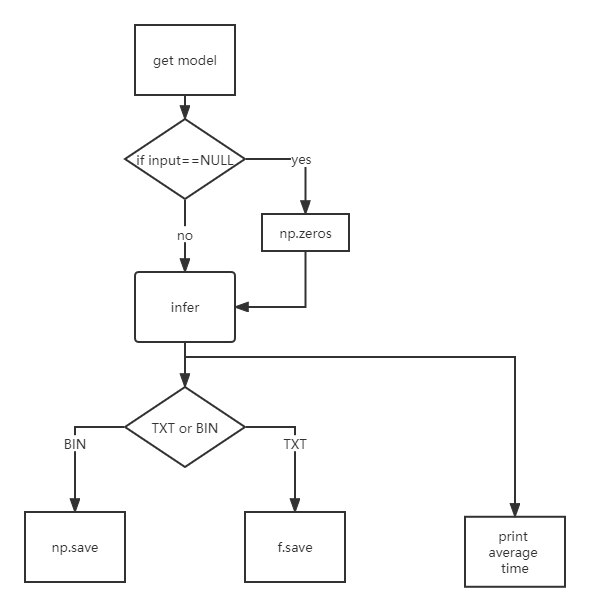

# 模型性能工具

## 1 介绍
基于MindX SDK实现开发模型性能工具，用于测试om模型性能。

### 1.1 支持的产品

MindX SDK mxVision:2.0.4   
mxVision version:2.0.4.b096   
Plat: linux aarch64   

### 1.2 支持的版本

Ascend 21.0.4


### 1.3 代码目录结构与说明

```
.
├── img
│   ├── error1.jpg                            // msame推理结果
│   │── error2.jpg                            // 本例推理结果
│   │── process.jpg                           // 流程图
├── msame.py                                  // 模型推理工具代码
├── README.md                                 // ReadMe
```


### 1.4 技术实现流程图




## 2 环境依赖

推荐系统为ubuntu 18.04，环境依赖软件和版本如下表：

| 软件名称 | 版本   |
| -------- | ------ |
| Python   | 3.9.0  |
| mxVision | 2.0.4  |
| numpy    | 1.21.2 |

在编译运行项目前，需要设置环境变量：

```
source set_env.sh
```

## 3 依赖安装

```
pip install numpy == 1.21.2
```


##  4 编译与运行
示例步骤如下：   
**步骤1** 设置环境变量

**步骤2**  运行

```
python3.9 msame.py --input xxx --output xxx --model xxx --loop xxx --outfmt xxx
```
在输出路径下成功输出预期的“.txt”或“.bin”则运行成功，否则报错。   
参数说明：
```
--input：模型的输入路径（bin文件或npy文件的路径）
--output：模型的输出路径（输出的bin文件或txt文件的路径）
--model：om模型的路径
--outfmt：模型的输出格式，“TXT”为输出txt格式，“BIN”为输出bin格式
--loop：执行推理的次数，默认为1
```


## 5 软件依赖说明


| 依赖软件 | 版本   | 说明                   |
| -------- | ------ | ---------------------- |
| numpy    | 1.21.2 | 将数据保存为二进制文件 |

## 6 常见问题
 存储为txt格式时可能会出现第六位开始的误差，可以忽略此问题。  
 执行msame输出结果：   

 执行本例输出结果：   

