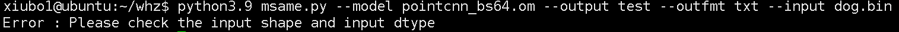

# 模型性能工具

## 1 介绍
基于MindX SDK实现开发模型性能工具

### 1.1 支持的产品

MindX SDK mxVision:2.0.4
mxVision version:2.0.4.b096
Plat: linux aarch64

### 1.2 支持的版本

Ascend 21.0.4

### 1.3 软件方案介绍

表1.1 系统方案各子系统功能描述：

| 序号 | 子系统 | 功能描述     |
| ---- | ------ | ------------ |
| 1    | infer  | 用于模型推理 |
| 2    | time   | 用于耗时统计 |

### 1.4 代码目录结构与说明

本工程名称”模型性能工具“。


### 1.5 技术实现流程图


## 2 环境依赖

推荐系统为ubantu 18.04，环境依赖软件和版本如下表：

| 软件名称 | 版本   |
| -------- | ------ |
| Python   | 3.9.0  |
| mxVision | 2.0.4  |
| numpy    | 1.21.2 |

在编译运行项目前，需要设置环境变量：

```
source set_env.sh
```

## 依赖安装

```
pip install numpy == 1.21.2
```


## 编译与运行
示例步骤如下：
**步骤1** 设置环境变量

**步骤2**  运行

```
python3.9 msame.py --input xxx --output xxx --model xxx --loop xxx --outfmt xxx
```


## 5 软件依赖说明

如果涉及第三方软件依赖，请详细列出。

| 依赖软件 | 版本   | 说明                   |
| -------- | ------ | ---------------------- |
| numpy    | 1.21.2 | 将数据保存为二进制文件 |
|          |        |                        |


## 6 常见问题

### 6.1 精度问题

**问题描述：**

msame—c++纯推理数据


msame—sdk纯推理数据



误差整理：

