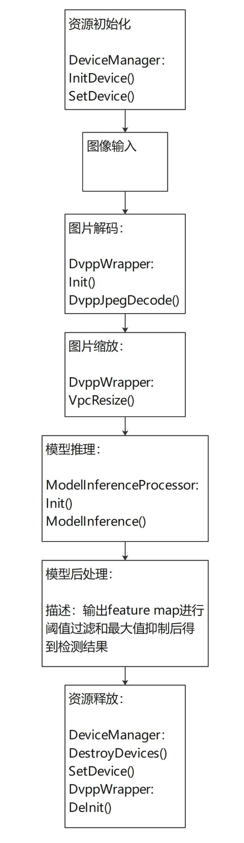

# C++ 基于MxBase 的yolov5小麦检测

## 1 介绍
本开发样例是基于mxBase开发的端到端推理的小麦检测程序，实现对图像中的小麦进行识别检测的功能，并把可视化结果保存到本地。其中包含yolov5的后处理模块开发。
该Sample的主要处理流程为：
Init > ReadImage >Resize > Inference >PostProcess >DeInit

### 1.1 支持的产品

支持昇腾310芯片

### 1.2 软件方案介绍

请先总体介绍项目的方案架构。如果项目设计方案中涉及子系统，请详细描述各子系统功能。如果设计了不同的功能模块，则请详细描述各模块功能。

表1.1 系统方案中各模块功能：

| 序号 | 子系统            | 功能描述                                                     |
| ---- | ----------------- | ------------------------------------------------------------ |
| 1    | 资源初始化        | 调用mxBase::DeviceManager接口完成推理卡设备的初始化。        |
| 2    | 图像输入          | C++文件IO读取图像文件                                        |
| 3    | 图像解码/图像缩放 | 调用mxBase::DvppWrappe.DvppJpegDecode()函数完成图像解码，VpcResize()完成缩放。 |
| 4    | 模型推理          | 调用mxBase:: ModelInferenceProcessor 接口完成模型推理        |
| 5    | 后处理            | 获取模型推理输出张量BaseTensor，进行后处理。                 |
| 6    | 保存结果          | 输出图像当中小麦的bbox坐标以及置信度，保存标记出小麦的结果图像。           |
| 7    | 资源释放      | 调用mxBase::DeviceManager接口完成推理卡设备的去初始化。      |


### 1.3 代码目录结构与说明

本sample工程名称为**mxBase_wheatDetection**，工程目录如下图所示：
```
|-------- model
|           |---- onnx_best_v3.om       // 小麦检测om模型
|           |---- aipp.aippconfig       // 模型转换aipp配置文件
|           |---- coco.names       		// 标签文件
|-------- yolov5Detection				// 小麦检测模型推理文件
|           |---- Yolov5Detection.cpp       
|           |---- Yolov5Detection.h         
|-------- yolov5PostProcess  			// 小麦检测后处理文件
|           |---- Yolov5Detection.cpp       
|           |---- Yolov5Detection.cpp       
|-------- build.sh                            // 编译文件
|-------- main.cpp                            // 主程序  
|-------- CMakeLists.txt                      // 编译配置文件   
|-------- README.md   
```


### 1.4 技术实现流程图




## 2 环境依赖

推荐系统为ubantu 18.04，环境依赖软件和版本如下表：

| 软件名称 | 版本   |
| :--------: | :------: |
|Ubantu|18.04|
|MindX SDK|2.0.2|
|Python|3.7.9|

## 模型转换

**步骤1** 模型获取

在Kaggle上下载YOLOv5模型 。[下载地址](https://www.kaggle.com/yunyung/yolov5-wheat)

在Github上下载YOLOv5的各个文件。[下载地址](https://github.com/ultralytics/yolov5)

这里提供了已经转好的416*416尺寸的onnx和om模型。（提取码为rlyv）[下载地址](https://pan.baidu.com/s/1ePh-VOlem_Pmx6rQbUW0Kw)

将下载的YOLOv5模型pt文件通过YOLOv5自带的export模型转换函数转换为onnx格式的文件（onnx模型已提供）
```
python export.py --weights best_v3.pt --img 416 --batch 1 --simplify
```

**步骤2** 模型存放

将获取到的YOLOv5模型onnx文件放至上一级的model文件夹中

**步骤3** 执行模型转换命令

(1) 配置环境变量
#### 设置环境变量（请确认install_path路径是否正确）
#### Set environment PATH (Please confirm that the install_path is correct).
```c
export install_path=/usr/local/Ascend/ascend-toolkit/latest
export PATH=/usr/local/python3.7.5/bin:${install_path}/atc/ccec_compiler/bin:${install_path}/atc/bin:$PATH
export PYTHONPATH=${install_path}/atc/python/site-packages:${install_path}/atc/python/site-packages/auto_tune.egg/auto_tune:${install_path}/atc/python/site-packages/schedule_search.egg:$PYTHONPATH
export LD_LIBRARY_PATH=${install_path}/atc/lib64:$LD_LIBRARY_PATH
export ASCEND_OPP_PATH=${install_path}/opp

```
(2) 转换模型
```
atc --model=./best_v3_t.onnx --framework=5 --output=./onnx_best_v3 --soc_version=Ascend310 --insert_op_conf=./aipp.aippconfig --input_shape="images:1,3,416,416" --output_type="Conv_1228:0:FP32;Conv_1276:0:FP32;Conv_1324:0:FP32" --out_nodes="Conv_1228:0;Conv_1276:0;Conv_1324:0"
```

## 编译与运行

示例步骤如下：

**步骤1** 

修改CMakeLists.txt文件 
```
将set(MX_SDK_HOME ${SDK安装路径}) 中的${SDK安装路径}替换为实际的SDK安装路径
```

**步骤2** 

ASCEND_HOME Ascend安装的路径，一般为/usr/local/Ascend
LD_LIBRARY_PATH 指定程序运行时依赖的动态库查找路径，包括ACL，开源软件库，libmxbase.so以及libyolov3postprocess.so的路径
```
export ASCEND_HOME=/usr/local/Ascend
export ASCEND_VERSION=nnrt/latest
export ARCH_PATTERN=.
export LD_LIBRARY_PATH=${MX_SDK_HOME}/lib/modelpostprocessors:${MX_SDK_HOME}/lib:${MX_SDK_HOME}/opensource/lib:${MX_SDK_HOME}/opensource/lib64:/usr/local/Ascend/driver/lib64:/usr/local/Ascend/ascend-toolkit/latest/acllib/lib64:${LD_LIBRARY_PATH}
```

**步骤3** 

cd到mxBase_wheatDetection目录下，执行如下编译命令：

```
bash build.sh
```

**步骤4** 

制定jpg图片进行推理，将需要进行推理的图片放入mxBase_wheatDetection目录下的新文件夹中，例如mxBase_wheatDetection/test。 eg:推理图片为xxx.jpg
cd 到mxBase_wheatDetection目录下
```
./mxBase_wheatDetection ./test/
```