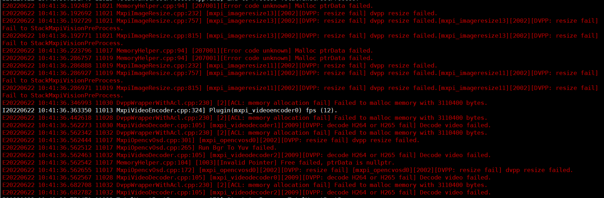
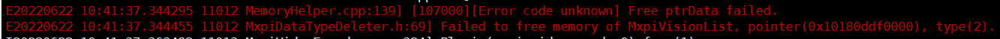

## yunet实时人脸检测
## 1介绍

yunet基于MindXSDK开发，在昇腾芯片上进行人脸检测，并实现可视化呈现。输入一段视频，最后可以检测得到视频中所有人的人脸框架和关键点信息。

### 1.1 支持的产品

本产品以昇腾310（推理）卡为硬件平台。

### 1.2 支持的版本

该项目支持的SDK版本为2.0.4，CANN版本为5.0.4。

### 1.3 软件方案介绍

表1.1 系统方案各子系统功能描述：

| 序号 | 子系统         | 功能描述                                                     |
| ---- | -------------- | ------------------------------------------------------------ |
| 1    | 视频输入流     | 接收外部调用接口的输入视频路径，对视频进行拉流，并将拉去的裸流存储到缓冲区（buffer）中，并发送到下游插件。 |
| 2    | 视频解码       | 用于视频解码，当前只支持H264格式。                           |
| 3    | 数据分发       | 对单个输入数据进行2次分发。                                  |
| 4    | 数据缓存       | 输出时为后续处理过程创建一个线程，用于将输入数据与输出数据解耦，并创建缓存队列，存储尚未输入到下流插件的数据。 |
| 5    | 图像处理       | 对解码后的YUV格式的图像进行放缩。                            |
| 6    | 模型推理插件   | 目标分类或检测。                                             |
| 7    | 模型后处理插件 | 对模型输出的张量进行后处理。                                 |
| 8    | 图片合并插件   | 对多张图片进行合并                                           |
| 9    | OSD合并插件    | 对多个OSD实例进行合并                                        |
| 10   | 目标框转绘插件 | 物体类型转化为OSD实例                                        |
| 11   | OSD可视化插件  | 实现对视频流的每一帧图像进行绘制。                           |
| 12   | 视频编码插件   | 用于将OSD可视化插件输出的图片进行视频编码，输出视频。        |


### 1.4 代码目录结构与说明

本项目名为yunet实时人脸检测，项目目录如下所示：

````
├── build.sh
├── config
│   ├── face_yunet.cfg      #yunet配置文件
│   └── Yunet.aippconfig    # 模型转换aipp配置文件
├── kpmain.py
├── main.py
├── models
│   └── Yunet.onnx 
├── pipeline
│   ├── KPYunet.pipeline
│   └── Yunet.pipeline    #pipeline文件
├── plugin
│   ├── build.sh
│   ├── CMakeLists.txt
│   ├── YunetPostProcess.cpp
│   └── YunetPostProcess.h
├── plugin2
│   ├── build.sh
│   ├── CMakeLists.txt
│   ├── KPYunetPostProcess.cpp
│   ├── KPYunetPostProcess.h
├── plugin3
│   ├── build.sh
│   ├── CMakeLists.txt
│   ├── TotalYunetPostProcess.cpp
│   └── TotalYunetPostProcess.h
├── README.md
└── run.sh
````


### 1.5 技术实现流程图


### 1.6 特性及适用场景

本项目适用于单人及多人正脸视频。对于人脸侧面视频，可以将人脸位置正确标出，但关键点信息标注准确率较低。本项目可以适用于仰卧人脸，但不适用于侧卧人脸。

特别地，在无人脸的情况下，我们在视频左上角设置了红色提示点。当左上角像素出现红色时，说明此场景没有检测出人脸。（下面给出该特殊点检测框的数据信息）

````
"MxpiObject":[{"classVec":[{"classId":3,"className":"","confidence":0,"headerVec":[]}],"x0":0,"x1":0,"y0":0,"y1":0}]
````
另外，本项目要求输入视频为1920*1080 25fps视频，不支持25帧率以上视频


## 2 环境依赖

推荐系统为ubuntu  18.04,环境软件和版本如下：

| 软件名称            | 版本  | 说明                          | 获取方式                                                  |
| ------------------- | ----- | ----------------------------- | :-------------------------------------------------------- |
| MindX SDK           | 2.0.4 | mxVision软件包                | [链接](https://www.hiascend.com/software/Mindx-sdk)       |
| ubuntu              | 18.04 | 操作系统                      | 请上ubuntu官网获取                                        |
| Ascend-CANN-toolkit | 5.0.4 | Ascend-cann-toolkit开发套件包 | [链接](https://www.hiascend.com/software/cann/commercial) |


在编译运行项目前，需要设置环境变量：

MindSDK 环境变量:

```
. ${SDK-path}/set_env.sh
```

CANN 环境变量：

```
. ${ascend-toolkit-path}/set_env.sh
```

- 环境变量介绍

```
SDK-path: mxVision SDK 安装路径
ascend-toolkit-path: CANN 安装路径。
```  
 


## 3 软件依赖说明


| 软件名称 | 版本       | 说明                           | 使用教程                                                     |
| -------- | ---------- | ------------------------------ | ------------------------------------------------------------ |
| live555  | 1.09       | 实现视频转rstp进行推流         | [链接](https://gitee.com/ascend/mindxsdk-referenceapps/blob/master/docs/%E5%8F%82%E8%80%83%E8%B5%84%E6%96%99/Live555%E7%A6%BB%E7%BA%BF%E8%A7%86%E9%A2%91%E8%BD%ACRTSP%E8%AF%B4%E6%98%8E%E6%96%87%E6%A1%A3.md) |
| ffmpeg   | 4.2.1 | 实现mp4格式视频转为264格式视频 | [链接](https://gitee.com/ascend/mindxsdk-referenceapps/blob/master/docs/%E5%8F%82%E8%80%83%E8%B5%84%E6%96%99/pc%E7%AB%AFffmpeg%E5%AE%89%E8%A3%85%E6%95%99%E7%A8%8B.md#https://ffmpeg.org/download.html) |


设置视频源，此处用rtsp拉流，将视频源转化为.264格式。

````
ffmpeg -i xxx.mp4 -vcodec h264 -bf 0 -g 25 -r 25 -s 1920*1080 -an -f h264 xxx.264
````

将转化后的.264视频用live555产生rtsp拉流。

由于本项目是支持端对端3路推理，故设置3个视频源，请使用者自行将pipeline中的对应位置修改为自己所使用的的服务器和文件名。


## 4 模型转化

本项目中使用的模型是yunet模型，onnx模型可以直接[下载](https://mindx.sdk.obs.cn-north-4.myhuaweicloud.com/mindxsdk-referenceapps%20/contrib/yunet/yunet.onnx)。下载后使用模型转换工具ATC将onnx模型转换为om模型，模型转换工具相关介绍参考[链接](https://support.huaweicloud.com/tg-cannApplicationDev330/atlasatc_16_0005.html)

模型转换步骤如下：

按照2环境依赖设置环境变量

cd到models文件夹，运行

````
atc --framework=5 --model=yunet.onnx --output=yunet --input_format=NCHW --input_shape="input:1,3,120,160" --log=debug --soc_version=Ascend310 --insert_op_conf=../config/Yunet.aippconfig
````

执行该命令后会在指定输出.om模型路径生成项目指定模型文件`yunet.om`。若模型转换成功则输出：

```
ATC start working now, please wait for a moment.
ATC run success, welcome to the next use.
```

aipp文件配置如下：

```
aipp_op {
    related_input_rank : 0
    src_image_size_w : 160
    src_image_size_h : 120
    crop : false
    aipp_mode: static
    input_format : YUV420SP_U8
    csc_switch : true
    rbuv_swap_switch : false
    matrix_r0c0 : 256
    matrix_r0c1 : 454
    matrix_r0c2 : 0
    matrix_r1c0 : 256
    matrix_r1c1 : -88
    matrix_r1c2 : -183
    matrix_r2c0 : 256
    matrix_r2c1 : 0
    matrix_r2c2 : 359
    input_bias_0 : 0
    input_bias_1 : 128
    input_bias_2 : 128
    mean_chn_0 : 0
    mean_chn_1 : 0
    mean_chn_2 : 0
    min_chn_0 : 0.0
    min_chn_1 : 0.0
    min_chn_2 : 0.0
    var_reci_chn_0 : 1.0
    var_reci_chn_1 : 1.0
    var_reci_chn_2 : 1.0
}
```


## 5 编译运行

main.py 用来生成端对端三路推理的可视化视频
kpmain：用来生成单路关键点后处理的数据结果（用来确保关键点类型后处理的实现成功，关键点效果看main.py的可视化结果）

1.编译后处理插件

cd到plugin目录，mkdir新建文件夹build

cd到build，运行

````
cmake ..
make -j
make install
````

如果权限问题，cd到MindSDK安装路径的lib/modelpostprocessors目录，运行

````
chmod 640 libyunetpostprocess.so
````

对于plugin2、plugin3目录也同样处理。

2.config/face_yunet.cfg 确认权限640

````
chmod 640 face_yunet.cfg
````

3.运行main.py程序

cd到根目录

运行

````
bash run.sh
````

最后会得到`result.264`即为输出结果


## 6 性能检测


性能检测结果如上。本项目采用视频拼接的方式实现3路视频输出，1个视频输出3路推理结果，故10秒平均帧率24.8，基本满足端对端3路25fps的性能要求。


## 7 常见问题

若视频解码器负荷过高则会出现以下问题：



导致此问题的可能原因为：视频帧率过高、视频尺寸过大或解码器正在同时解码过多其他视频
解决方案：确保三路视频都为1920*1080 25fps并且减少其它任务的运行
