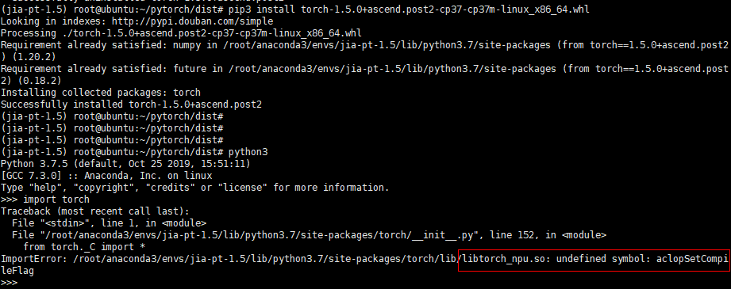
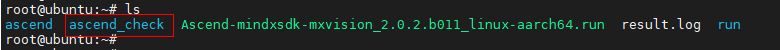
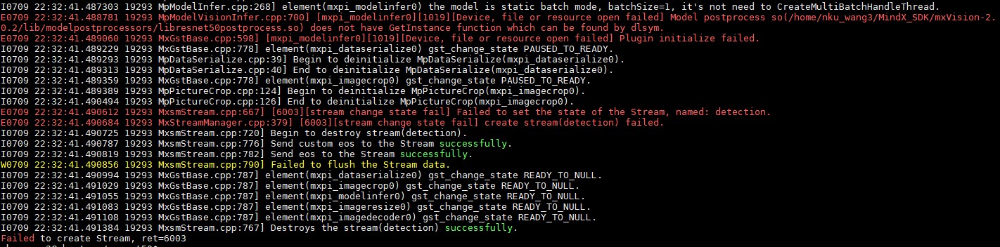

-   [FAQ](#faq)
    - [1 模型训练时报libtorch_npu.so: undefined symbol: aclopSetCompileFlag错误](#1-模型训练时报libtorch_npuso-undefined-symbol-aclopsetcompileflag错误)
    - [2 driver安装crl报错](#2-driver安装crl报错)
    - [3 导入mindspore包时提示libgraph.so文件找不到](#3-导入mindspore包时提示libgraph.so文件找不到)
    - [4 项目运行时"does not have GetInstance function which can be found by dlsym"报错](#4-项目运行时"does not have GetInstance function which can be found by dlsym"报错)


## 1 模型训练时报libtorch_npu.so: undefined symbol: aclopSetCompileFlag错误。

### 现象描述



### 可能原因

环境中的pytorch版本与toolkit版本不匹配，或存在多个tookit版本，环境变量未正确指定。
### 处理方法

    1）重新安装版本匹配的torch或者toolkit。
    2）重新设置环境变量，指定正确的toolkit路径。

## 2 driver安装crl报错

### 现象描述


### 可能原因


   
老版本的安装信息 /root/ascend_check 存在，driver安装前校验无法通过

### 处理方法
   
删除这个文件

## 3 导入mindspore包时提示libgraph.so文件找不到

### 现象描述


### 可能原因

缺失环境变量

### 处理办法

添加mindspore的环境变量

```
export GLOG_v=2
LOCAL_ASCEND=/usr/local/Ascend # the root directory of run package
export LD_LIBRARY_PATH=${LOCAL_ASCEND}/ascend-toolkit/latest/fwkacllib/lib64:${LOCAL_ASCEND}/driver/lib64:${LOCAL_ASCEND}/ascend-toolkit/latest/opp/op_impl/built-in/ai_core/tbe/op_tiling:${LD_LIBRARY_PATH}

export TBE_IMPL_PATH=${LOCAL_ASCEND}/ascend-toolkit/latest/opp/op_impl/built-in/ai_core/tbe           
export ASCEND_OPP_PATH=${LOCAL_ASCEND}/ascend-toolkit/latest/opp                                   
export PATH=${LOCAL_ASCEND}/ascend-toolkit/latest/fwkacllib/ccec_compiler/bin/:${PATH}          
export PYTHONPATH=${TBE_IMPL_PATH}:${PYTHONPATH}   
```
将上述代码拷贝至 env_ms.sh，执行source env_ms.sh

## 4 项目运行时"does not have GetInstance function which can be found by dlsym"报错

### 现象描述



### 可能原因

后处理插件与推理插件不匹配

### 处理办法

例如 与图中的resnet后处理插件配套的推理插件为tensorinfer插件，pipeline中需使用mxpi_tensorinfer0
